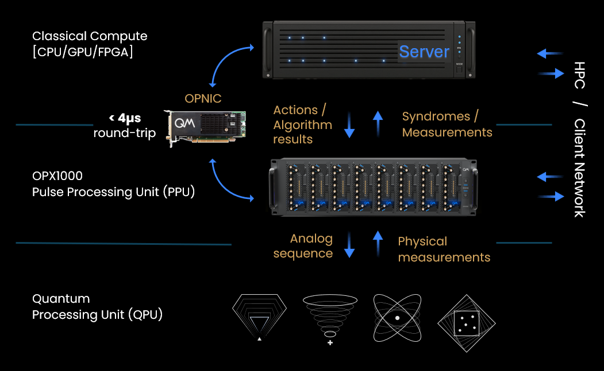
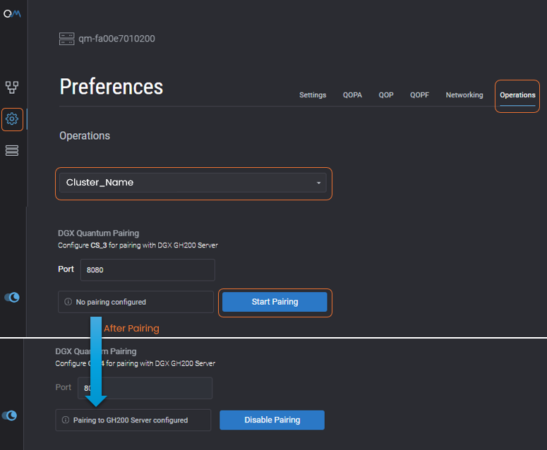
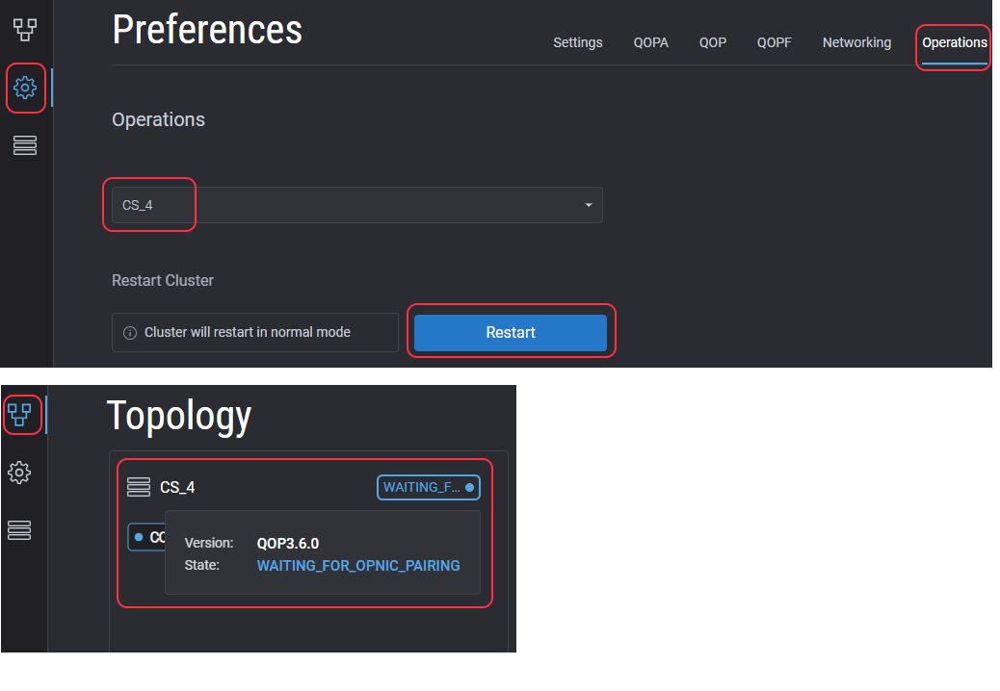

# OPNIC Hybrid Link Guide

## Overview

The **OPNIC** (OP-Network Interface Card) connects QM's low-latency data network to classical compute resources based on an industry-standard PCIe interface.

Low latency RDMA communication enables the materialization of state-of-the-art algorithms running on powerful accelerators (CPU/GPU/FPGA) for controlling and reading scalable quantum operations.

**OPNIC** Hybrid Link is part of the **QM Open Acceleration Stack** and supports a comprehensive range of classical‑computing capabilities, spanning high‑level frameworks to low‑level software‑stack tools. It enables the integration of custom classical algorithms and machine‑learning implementations in languages such as C++, CUDA, or Python.

The quantum-classical interconnect architecture is **NVQLink compatible** and integrates **CUDA-Q** as a device-level SDK, enabling hybrid execution and orchestration across QPUs, GPUs, and CPUs.

## Components

- **Server**: Server hosting the OPNIC, supported GPU and CPU
- **OPX1000**: Ultra low latency Quantum control and readout controller
- **OPNIC**: OP Network Interface Card, installed in the server




## Supported Architectures

OPNIC supports a wide range of server architectures and can be deployed on modern X86‑based systems as well as NVIDIA ARM‑based servers.

*Contact QM for a recommended supported server that would fit your needs.*

The **DGX Quantum** platform introduced an OPX1000 controller interface with NVIDIA’s Grace Hopper 200 super-chip through the OPNIC card as the initial POC system. Many more server platforms are also supported.


## Setup and Installation
Pre-requisites:

1. All installation steps completed - [See guide](../Hardware/OPNIC_Installation.md)

2. The OPX1000 and the OPNIC host server are paired, see below.

### Pairing the OPX1000 with the OPNIC Host Server
The server hosting the OPNIC must be paired with an OPX1000 cluster.

??? "One time - Pair/Unpair Sequence"

    **Action required on initial connection or disconnection**

    1. Click on operations
    2. Select Cluster connected to the server
    3. Verify server status is 'Paired to OPX1000' or click on 'Pair'
    4. The cluster will *Automatically* restart
    5. To complete initial pairing, follow the steps in the next section: OPX1000 to OPNIC host server synchronization steps.

    

## Communication Initialization

!!! Note - Sync is required on every cluster or server boot
    To initialize the flow and start-up the cluster - OPX1000 and the OPNIC host server need to be synced.

??? "OPX1000 to OPNIC host server synchronization steps"

    1. From the OPX1000 side - QOPA:

        - Make sure the OPX1000 is paired with the Server in the Admin Panel, as explained [here](#pairing-the-opx1000-with-the-opnic-host-server).

        - Restart the OPX1000 Cluster and wait for 'Waiting for OPNIC Pairing' status:

        

    2. From the Server side:

        - Run the sync command by executing the following command in the terminal:
        ```
        opnic sync <ip_address_of_qop OR host_name> <port>
        ```

        - default port is 8080

        - example and expected output:
            ``` bash
            > opnic sync 10.0.0.10 8080
            [=======================] ✔ Connected to QOP
            [=======================] ✔ QOP is synced
            [=======================] ✔ Sync Started
            ```

    3. OPX1000 boot sequence will continue after synchronization

## Basic Syntax and Examples
The system enables running algorithms using GPU, CPU and supported combinations coded in C++ and/or CUDA.

The examples below provide the basic building blocks for connecting the GPU or CPU to QUA.

### OPNIC Streams and Packets
In the context of OPNIC communication, we define a stream as a logical channel of asynchronous flow between OPX1000 and the server.
Each stream has:

- A unique identifier (int, between 1 and 1023 (stream 0 is reserved))
- A direction (OPX1000-to-SERVER, or SERVER-to-OPX1000)
- A constant packet structure
    - Packet structure must contain vectors of data (even if there's only 1 variable)
    - Supported data types: int, bool, fixed point (real)

For both sides (OPX1000 and SERVER) we are required to:

1. Declare a packet structure
2. Followed by a stream declaration which uses that packet structure.

!!! Note

    There can be more than one stream using the same packet structure.

### Packet declaration example
Use {{f("qm.qua.qua_struct")}} to define the packet schema carried by the OPNIC stream.
Each field must be declared as a `QuaArray[type, size]`, even when the packet contains only one value.
Inside the QUA program, create packet variables with {{f("qm.qua.declare_struct")}}.
These packet variables are the objects passed to {{f("qm.qua.send_to_stream")}} and to the `target_variable`
argument of {{f("qm.qua.receive_from_stream")}}.

- QUA Struct:
    ```python
    @qua_struct
    class MyPacket:
        data_int: QuaArray[int, 1]
        data_fixed: QuaArray[fixed, 2]
        data_bool: QuaArray[bool, 2]

    with program() as prog:
        incoming_pkt = declare_struct(MyPacket)
    ```

- C++ Struct:
    ```cpp
    struct MyPacket {
        qm::Value<int, 1> int_data;
        qm::Value<double, 2> fixed_data;
        qm::Value<bool, 2> bool_data;
        QM_DECLARE_PACKET(MyPacket, int_data, fixed_data, bool_data);
    };
    ```

### Stream declaration example
The preferred QUA API uses {{f("qm.qua.declare_input_stream")}} and {{f("qm.qua.declare_output_stream")}} with the `"opnic"` endpoint.
The older `declare_external_stream()`, `send_to_external_stream()`, and `receive_from_external_stream()` functions are deprecated aliases.

- QUA Struct:
    ```python
    incoming_stream = declare_input_stream("opnic", stream_id_incoming, MyPacket)
    outgoing_stream = declare_output_stream("opnic", stream_id_outgoing, MyPacket)
    ```
- C++ Struct:
    ```cpp
    using incoming_stream = qm::IncomingStream<MyPacket, BUFFER_SIZE, qm::StreamType::CPU>;
    using outgoing_stream = qm::OutgoingStream<MyPacket, BUFFER_SIZE, qm::StreamType::CPU>;
    ```

### Stream Initialization example

- QUA Struct:
    ```python
    incoming_stream = declare_input_stream("opnic", stream_id_incoming, MyPacket)
    outgoing_stream = declare_output_stream("opnic", stream_id_outgoing, MyPacket)
    ```

- C++ Struct:
    ```cpp
    int main(){
        const auto my_incoming_stream = qm::initialize_stream<incoming_stream>(INCOMING_STREAM_ID);
        const auto my_outgoing_stream = qm::initialize_stream<outgoing_stream>(OUTGOING_STREAM_ID);
    ```

### OPX1000 ⟷ OPNIC Handshake
At the beginning of each program, a handshake between the OPX1000 and the server is required.
Every QUA program with an OPNIC stream will implicitly cause the OPX1000 to send the handshake prompt to the server at the beginning, and wait
until it receives the handshake back from the server.

```cpp
qm::sync(); // blocking call, will wait for the OPX1000 to initialize the streams and send the handshake
```

### Send and Receive packets
- QUA
    ```python
    send_to_stream(outgoing_stream, outgoing_pkt)
    # Receiving a packet will block the PPU core until it is received.
    receive_from_stream(incoming_stream, target_variable=incoming_pkt)
    ```
- C++
    ```cpp
    // Wait for one packet to arrive (can wait for more). This is a blocking call
    my_incoming_stream->wait_for_packets(1);

    // Once the packet is available, we can read it. The packet is copied to the local variable.
    // In case of more than one packet, the first argument specifies which packet (index) to read (here we read the first packet, so we use 0)
    my_incoming_stream->get(0, incoming_pkt);
    printf("Got a packet with data=%d\n", incoming_pkt.data[0]);

    // Send a packet
    my_outgoing_stream->send(outgoing_pkt);
    ```
- CUDA
    ```cpp
    // Pass the stream objects to the kernel
    my_kernel<<<NUM_OF_BLOCKS, NUM_OF_THREADS>>>(in_stream.get(), out_stream.get());
    ...
    auto block = cooperative_groups::this_thread_block();
    int tid = threadIdx.x + blockIdx.x * blockDim.x;

    // Wait for [N-threads] packets to arrive. This is a blocking call.
    // Thread #0 will poll the memory while the other threads in the block will wait
    // inside this function in block.sync()
    in_stream->wait_for_packets(block, NUM_OF_THREADS, 0);

    // Instantiate a packet object
    MyPacket incoming_pkt;

    // Each thread can get its designated packet
    in_stream->get(tid, incoming_pkt);

    // Typically (but not mandatory), for a given stream, send the packet only from one thread
    if (block.thread_rank() == 0) {
        // Send the packet to the outgoing stream
        out_stream->send(outgoing_pkt);
    }
    ```

### Hello OPNIC Interface Quantum
In this example, we will show how to declare a packet, initialize a stream,
send a variable from OPX1000 to the server, do something with it, and send it back.

#### QUA Code Example
??? "QUA Code Example"

    **The QUA code below applies for both the CPU and GPU examples which appear below**

    Define streams and the QUA struct:
    ```python
    from qm import DictQuaConfig, QuantumMachinesManager
    from qm.qua import *

    stream_id_outgoing = 1
    stream_id_incoming = 2

    # Define a qua_struct with the packet structure. In this example each packet has one qua-int
    # Note that each field of the struct is a qua-array, even if it has only one element
    @qua_struct
    class TestPacket:
        data: QuaArray[int, 1]
    ```

    Program example:
    ```python
    with program() as prog:
        # Define two types of packets (with the same structure)
        inc_struct = declare_struct(TestPacket)
        out_struct = declare_struct(TestPacket)

        # Define the incoming and outgoing streams, which use the above packet structure
        inc_stream = declare_input_stream("opnic", stream_id_incoming, TestPacket)
        out_stream = declare_output_stream("opnic", stream_id_outgoing, TestPacket)

        # Assign a value to the packet
        assign(out_struct.data[0], 554)

        # Send the packet to the server
        send_to_stream(out_stream, out_struct)

        # Wait for the result. This is a blocking call
        receive_from_stream(inc_stream, target_variable=inc_struct)

        # Save both values - the one that was sent and the one that was received
        save(inc_struct.data[0], "inc_data")
        save(out_struct.data[0], "out_data")
    ```

#### CPU/GPU Code
??? "CPU Code Example"
    ```cpp
    #include <opnic/opnic.hpp>

    // Define the stream IDs. Each stream needs a unique ID, between 1 and 1023 (stream 0 is reserved)
    #define OUTGOING_STREAM_ID 1
    #define INCOMING_STREAM_ID 2

    // Define the buffer size for the incoming stream. The OPX1000 side may send packets asynchronously, and the buffer is cyclic
    #define BUFFER_SIZE 100 // In units of packets

    // Define a packet struct. In this example we use the same packet structure for both streams, so we define it once
    struct MyPacket {
        // We define one field, an integer array of size '1' (every field is an array, even if it's only one item).
        // Available types are int, bool, double (cast from qua-fixed) and qm::fixed (does not cast from qua-fixed type)
        qm::Value<int, 1> data;

        // Mandatory macro to declare the packet (needed by the SDK for serialization/deserialization).
        // If we have more than one struct field, append them as additional arguments
        QM_DECLARE_PACKET(MyPacket, data);
    };

    // Declare the streams. In this example we declare two streams, one for incoming packets and one for outgoing packets.
    // Each stream runs on the CPU
    using incoming_stream = qm::IncomingStream<MyPacket, BUFFER_SIZE, qm::StreamType::CPU>;
    using outgoing_stream = qm::OutgoingStream<MyPacket, BUFFER_SIZE, qm::StreamType::CPU>;


    int main(){
        // Initialize the streams. This part configures the server hardware and prepares it for execution
        const auto my_incoming_stream = qm::initialize_stream<incoming_stream>(INCOMING_STREAM_ID);
        const auto my_outgoing_stream = qm::initialize_stream<outgoing_stream>(OUTGOING_STREAM_ID);

        // Mandatory sync bewteen OPX1000 and server. This is a handshake that
        // 1. Makes sure both sides configured the same streams/packets.
        // 2. Makes sure both sides start at the same time (no packets are sent before HW is initialized)
        //
        // It has to be called after stream initialization and before any packet is sent or received.
        // In case of errors, this function will throw an exception. Users are require to stop the QUA side as well and start both sides again
        // Without this line, the program on the OPX1000 will wait forever for the handshake
        printf("Streams initialized, waiting for OPX1000\n");
        qm::sync();

        // Instantiate an incoming packet object
        MyPacket incoming_pkt;

        // Wait for one packet to arrive. This is a blocking call
        my_incoming_stream->wait_for_packets(1);

        // Ince the packet is available, we can read it. The packet is copied to the local variable.
        // In case of more than one packet, the first argument specifies which packet (index) to read (here we read the first packet, so we use 0)
        my_incoming_stream->get(0, incoming_pkt);

        // Print the data that we received. Note - every field in the packet is an array, even if it's only one item
        printf("Got a packet with data=%d\n", incoming_pkt.data[0]);

        // Instantiate an outgoing packet object
        MyPacket outgoing_pkt;

        // Populate the outgoing packet (add '1' to the incoming data)
        outgoing_pkt.data[0] = incoming_pkt.data[0] + 1;

        // Send it to OPX1000 side
        my_outgoing_stream->send(outgoing_pkt);
        printf("Sent a packet with data=%d, check the qop side\n", outgoing_pkt.data[0]);
    }
    // Once the application has exited, the stream objects are automatically destroyed, and HW is configured accordingly
    ```

??? "GPU Code Example"
    ```cpp
    #include <opnic/opnic.hpp>

    // Define the stream IDs. Each stream needs a unique ID, between 1 and 1023 (stream 0 is reserved)
    #define OUTGOING_STREAM_ID 1
    #define INCOMING_STREAM_ID 2

    // Define the buffer size for the incoming stream. The OPX1000 side may send packets asynchronously, and the buffer is cyclic.
    #define BUFFER_SIZE 100 // In units of packets

    // Define a packet struct. In this example we use the same packet structure for both streams, so we define it once
    struct MyPacket {
        // We define one field, an integer array of size '1' (every field is an array, even if it's only one item).
        // Available types are int, bool, double (cast from qua-fixed) and qm::fixed (does not cast from qua-fixed type)
        qm::Value<int, 1> data;

        // Mandatory macro to declare the packet (needed by the SDK for serialization/deserialization).
        // If we have more than one struct field, append them as additional arguments
        QM_DECLARE_PACKET(MyPacket, data);
    };

    // Declare the streams. In this example we declare two streams, one for incoming packets and one for outgoing packets.
    // Each stream runs on the GPU
    using InStream = qm::IncomingStream<MyPacket, BUFFER_SIZE, qm::StreamType::GPU>;
    using OutStream = qm::OutgoingStream<MyPacket, BUFFER_SIZE, qm::StreamType::GPU>;

    // In this example we show a parallel reduction of the incoming packets.
    // We will sum the values of the incoming packets and send the result to the outgoing stream.
    // The number of GPU threads is defined here. The GPU kernel will send a packet with the sum of the values of the incoming packets from all threads within their block
    #define NUM_OF_THREADS 10


    // Instantiate an array of results to be used on the GPU.
    __device__ int result = {0};

    // This is the kernel function that will be executed on the GPU.
    __global__ void sum_kernel(InStream* in_stream, OutStream* out_stream) {

        // Get the block handle and the thread-id
        auto block = cooperative_groups::this_thread_block();
        int global_tid = threadIdx.x + blockIdx.x * blockDim.x;

        // Wait for packets to arrive. This is a blocking call.
        // Thread #0 will poll while the other threads in the block will wait inside this function in block.sync()
        in_stream->wait_for_packets(block, NUM_OF_THREADS, 0);

        // Instantiate a packet object
        MyPacket incoming_pkt;

        // Each thread gets its designated packet
        auto ret = in_stream->get(global_tid, incoming_pkt);
        printf("Thread %d got packet with value: %d\n", global_tid, incoming_pkt.data[0]);

        // Sum the data from all threads in the block and store it in the block's result
        atomicAdd(&result, incoming_pkt.data[0]);

        // Synchronize within the block to ensure all add operations are complete
        block.sync();

        // First thread of the block sends the result
        if (block.thread_rank() == 0) {
            printf("Thread %d sending result: %d\n", global_tid, result);

            // Instantiate a packet object to send the result
            MyPacket outgoing_pkt;
            outgoing_pkt.data[0] = result;

            // Send the packet to the outgoing stream
            out_stream->send(outgoing_pkt);
        }
    }

    // Main routine, running on the CPU and invoking the GPU kernel
    int main() {

        // Due to CUDA restrictions, accessing the OPNIC from GPUs requires root privileges.
        if (!geteuid() == 0) {
            printf("Please run as root. Aborting\n");
            return -1;
        }

        // Initialize the streams. This part configures the server hardware and makes it ready for execution
        auto in_stream = qm::initialize_stream<InStream>(INCOMING_STREAM_ID);
        auto out_stream = qm::initialize_stream<OutStream>(OUTGOING_STREAM_ID);

        // Mandatory sync between the OPX1000 and the server. This is a handshake that
        // 1. Makes sure both sides configured the same streams/packets.
        // 2. Makes sure both sides start at the same time (no packets are sent before HW is initialized)
        //
        // It has to be called after stream initialization and before any packet is sent or received.
        // In case of errors, this function will throw an exception. Users are require to stop the QUA side as well and start both sides again
        // Without this line, the program on the OPX1000 will wait forever for the handshake
        printf("Streams initialized, waiting for OPX1000\n");
        qm::sync();

        // Start the kernel function on the GPU
        sum_kernel<<<1, NUM_OF_THREADS>>>(in_stream.get(), out_stream.get());

        // Wait for the kernel to finish
        cudaDeviceSynchronize();

        // Check for errors
        cudaError_t err = cudaGetLastError();
        if (err != cudaSuccess) {
            std::cerr << "CUDA error: " << cudaGetErrorString(err) << std::endl;
            return 1;
        }

        return 0;
    }
    ```

#### CMake File

??? "CPU CMake Example"

    ```bash
    # OPNIC SDK requires C++20
    set(CMAKE_CXX_STANDARD 20)
    set(CMAKE_CXX_STANDARD_REQUIRED ON)

    # Find opnic library and its OpenSSL dependency
    find_package(opnic CONFIG REQUIRED)
    find_package(OpenSSL REQUIRED)

    # Add the executable
    add_executable(hello_cpu ${CMAKE_SOURCE_DIR}/hello_cpu.cpp)

    # Link the application to the opnic SDK.
    # If the library was built for a server without a GPU, link to qm::opnic instead
    target_link_libraries(hello_cpu PRIVATE qm::opnic-cuda)
    ```

??? "GPU CMake Example"

    In addition to the CPU CMake, the GPU requires this additional part:

    ```bash
    # OPNIC applications on the gpu require this CUDA compiler flag
    target_compile_options(hello_gpu PRIVATE $<$<COMPILE_LANGUAGE:CUDA>:--expt-relaxed-constexpr>)

    # Indicate to CUDA to use the GPU architecture located on this machine ('native')
    set_target_properties(hello_gpu PROPERTIES
        CUDA_ARCHITECTURES "native"
    )

    # Link the application to the OPNIC SDK and CUDA runtime
    target_link_libraries(hello_gpu PRIVATE
        qm::opnic-cuda
        CUDA::cudart
    )
    ```
