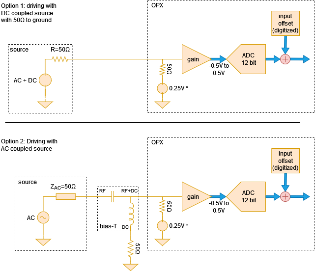

# Analog Input Stage

The signals acquired by the OPX using the analog input channels are first passed through an analog
input stage and then digitized. Here we discuss the voltage limits, gain and offset calibrations
that can be applied to the signal to be digitized.

## Acquiring analog signals with the OPX



The signal chain can be seen in Fig. 1. The signal source can be either AC or DC coupled.

!!! Note
    The OPX input has a common-mode voltage of 0.25 V when measured with 50 ohm.

- DC coupled signal source

    If the signal source is DC coupled and has 50 ohm DC resistance to ground,
    it can be directly connected to the analog input. This can be seen in Option 1
    of Fig. 1

- AC coupled signal source

    If the signal source is AC coupled and does not have a 50 ohm resistance to
    ground, a bias T is needed in order to bias the input amplifier. The
    required setup can be seen in option 2 of Fig. 1. In this case, the source
    will still need to have a 50 ohm AC impedance throughout its bandwidth for
    proper operation.

## Properties of the analog input stage

The analog input has the following properties:

- Input impedance: 50 ohms
- ADC resolution: 12 bits
- Input bandwidth: 400 MHz
- Full voltage range: 1.0 Vpp into 50 ohm or 4 dBm (nominal)
- Variable gain: -12 dB to 20 dB in steps of 1 dB

## Setting the voltage gain

The voltage gain can be set by adding a `"gain_db"` field to the `"analog_inputs"` field
of the controller in the config. Here we show an example with the relevant fields:

```python
config = {
    'version': 1,
    'controllers': {
        'con1': {
            'analog_inputs': {
                1: {'offset': 0.0, 'gain_db': -1},
                2: {'offset': 0.0, 'gain_db': 1},
            }
        }
    },
}
```

!!! Note
    When changing the gain, the input DC offset needs to be recalibrated.
