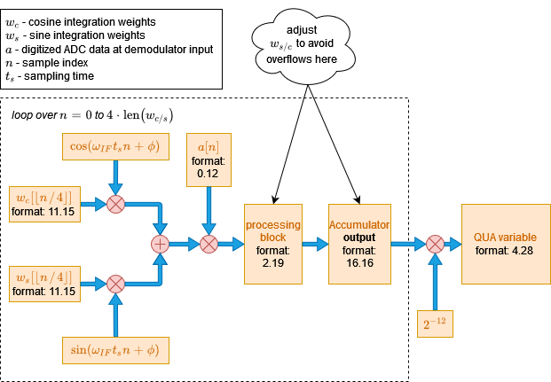

# Demodulation and Measurement

The demodulation operation, used in the {{f("qm.qua._dsl.measure")}} QUA statement, is central to dispersive readout techniques such as cQED
and other quantum platforms such as spin qubits, Majorana based qubits and others. In this section we describe it in general, from the
perspective of applying it for state estimation using the OPX. We then show how it is performed in practice on the OPX, focusing on timing and fixed point implementation
features.


## Overview of the demodulation operation

"Modulation" is the process of encoding a slowly varying waveform $s(t)$
on a fast-oscillating carrier $\cos(\omega_{LO}t+\phi)$.
The simplest type of Modulation is *amplitude modulation*, which mathematically is simply multiplying
the carrier with the waveform we want to encode,

$$
a(t) = s(t)\cos(\omega_{LO}t+\phi).
$$

"Demodulation" is the inverse process, whereby we extract the waveform information $s(t)$ by doing
an operation on the modulated waveform $a(t)$.

How is $s(t)$ extracted from $a(t)$ in practice? One relatively simple way, that works when $s(t)$
varies much more slowly than $1/\omega_{LO}$, is the following. We calculate the integrals

\begin{eqnarray}
I = \frac{2}{T}\int_{t}^{t + T}a(\tau)\cos(\omega_{LO}\tau)d\tau, \\
Q = -\frac{2}{T}\int_{t}^{t + T}a(\tau)\sin(\omega_{LO}\tau)d\tau, \label{eq:i_and_q}
\end{eqnarray}

where $T$ is an *integer number of periods* which is short relative to the variation rate of $s(t)$ (we deal with
the effect of non-integer $T$ in the next section). Substituting $a(t)$, we get:

\begin{eqnarray}
I \simeq s(t)\cos(\phi) \\
Q \simeq s(t)\sin(\phi)
\end{eqnarray}

This result shows that we can think about the demodulation process as a projection from the waveform space onto a 2D plane with
coordinates $I$ and $Q$. We can easily extract $s(t)=\sqrt{I^2 + Q^2}$. If however we know the value of $\phi$, we can get it without
doing numerically-heavy operations like square root by calculating:

$$
s(t) \simeq I\cos(\phi) + Q\sin(\phi),
$$

or, in a single integration:

$$
s(t) \simeq \frac{2}{T}\int_{t}^{t+T}a(\tau)[\cos(\phi)\cos(\omega_{LO}\tau) - \sin(\phi)\sin(\omega_{LO}\tau)]d\tau. \label{eq_analog}
$$

The OPX essentially allows us to do this operation, as we show in the next section.

A similar analysis shows that we can also extract a slowly varying phase $\delta \phi(t)$ from the modulated
waveform

$$
a(t) = A\cos(\omega_{IF}t + \phi_0 + \delta\phi(t)),
$$

and this is typically how state information is extracted from a demodulated readout resonator signal.

in what follows we show how this operation can be achieved in real time and with very low latency in the OPX.

### Effect of non-integer demodulation periods

In the previous section we assumed that $T$ is such that we integrate over an integer number of periods.
This greatly simplifies the analysis reduces errors in the demod operation. However, it is not always possible to arrange
matters in this way. What happens when it is not an integer? Let's look at eq. $\eqref{eq:i_and_q}$ in this case.
To simplify we calculate $M=I+iQ$:

\begin{eqnarray}
M = \frac{2}{T}\int_{t}^{t + T}a(\tau)e^{-i\omega \tau}d\tau \\
  \simeq s(t)e^{-i\phi} - s(t)\frac{i e^{-2i(\omega t+\phi)}}{2\omega T}\left(1-e^{-2i\omega T}\right)
\end{eqnarray}

Here we see a very important characteristic of non-integer demodulation periods:

!!! Note
    When the demodulation length is not a half-integer number of periods, an error which scales
    as $\frac{1}{\omega T}$ is present. If, in addition, the demodulation is performed
    at different starting times (without resetting the phase), this error will oscillate in a
    pseudo-random manner and will appear as repeatable noise when performing multiple demodulations in the
    same QUA program.

    If you wish to make this error constant, use the {{f("qm.qua._dsl.reset_if_phase")}} QUA statement before measurement!

### Application of demod for dispersive readout

In the case of cQED, the carrier is generated by us in the OPX, and after up-conversion to a readout
resonator frequency, is modulated *by the response of the resonator*, which contains information about the state
of the qubit. The goal of the demodulation operation is to extract the state of the qubit.

## Demodulation in the OPX

### Mathematical Definition

Here we explain the mechanism for the basic demodulation operation, `demod.full()`
(see [measure statement reference](../Guides/features.md#demodulation) for more advanced options).

We first discuss the hardware implementation of the demodulation operation, and then discuss
the timing of the different operations.

For a given digitized waveform $a[n]$, the mathematically precise definition of the demodulation operation performed in the OPX
is

$$
d = 2^{-12} \sum_{n=0}^{N}a[n] \left(w_c[\lfloor n / 4 \rfloor]\cos(\omega_{IF}t_s n + \phi) + w_s[\lfloor n / 4 \rfloor]\sin(\omega_{IF}t_s n + \phi)\right). \label{eq_digital}
$$

here $w_{s}[n]$ and $w_{c}[n]$ are sine and cosine integration weights of length
$N = \text{len}(w_{c,s})$, $n$ is the sample index relative to the start of the demodulation operation (see Fig. 2),
$\phi$ is an intrinsic delay related to the hardware,
and the meaning of the various other symbols is defined in the legend in Fig. 1.
The $2^{-12}$ is a factor used to scale the result for the OPX fixed point accuracy

!!! Note
    If we assume constant weights $w_{c}[n] = 1$, $w_{s}[n] = 0$, and a constant signal
    $a[n] = a \cos(\omega_{IF}t_s n)$, then the result of the demod operation will be:
    $d = a N \frac{\cos(\phi)}{2} 2^{-12}$

If we define $a[n] \simeq A\cos(\omega_{IF}t_s n + \phi_0 + \delta\phi(t))$,
the similarity with eq. $\eqref{eq_analog}$ is clear.

It is possible to calculate with the OPX the demodulation integral with extremely low latency and high precision. However, because the OPX is designed primarily
for lowest-latency operation, the calculation uses fixed point arithmetic, and so care is needed when choosing the integration weights so that overflow will not
occur during the demodulation. We discuss this next.

### Fixed Point Format


<figure markdown>
  
  <figcaption>Fig. 1: Block diagram of demodulation operation in OPX. Numerical range corresponding to each fixed point format is given in the table below.</figcaption>
</figure>


!!! warning
    It is very important to make sure this section is well understood when using the demodulation operation, otherwise overflow may occur that will lead to corrupt results.

    To avoid overflow, follow these guidelines:
    : 1. The integration weights are such that when multiply the raw ADC data, scaled to between
        -0.5 and 0.5, the result is between -2 and 2.
    1. The sum of the multiplication above is smaller than $2^{16} = 65536$

In Fig. 1 we see a breakdown of the demodulation operation in the equation above into steps, where the fixed point format in each step is shown.
The translation from fixed point format to number ranges is given in the table below the figure. At each step, the input must be as shown to avoid overflow.

Note that the fixed point format of the integration weights is optimized to be compatible with the dynamic range of the ADC (12 bits), and the precision allows for
very long demodulation sequences at the price of losing accuracy.

The notation used here for the fixed point is as follows: m.f - 'm' is the number of integer bits, including one for sign. 'f' is the number of fractional bits.

| Number format | Range of allowed values                                                        |
| ------------- | ------------------------------------------------------------------------------ |
| 11.15         | $[-1024:1024-\epsilon:\epsilon], \epsilon = 2^{-15} \simeq 3\cdot 10^{-5}$     |
| 0.12          | $[-0.5:0.5-\epsilon:\epsilon], \epsilon = 2^{-12} \simeq 2.5\cdot 10^{-4}$     |
| 2.19          | $[-2:2-\epsilon:\epsilon], \epsilon = 2^{-19} \simeq 2\cdot 10^{-6}$           |
| 16.16         | $[-32768:32768-\epsilon:\epsilon], \epsilon = 2^{-16} \simeq 1.5\cdot 10^{-5}$ |
| 4.28          | $[-8:8-\epsilon:\epsilon], \epsilon = 2^{-28} \simeq 4\cdot 10^{-9}$           |

### Timing of the measurement operation

<figure markdown>
  
  <figcaption>Fig. 2: Block diagram from the ADC input to the processing unit. Note that the raw adc saved into a stream goes through a different route.</figcaption>
</figure>

<figure markdown>
  
  <figcaption>Fig. 3: Timing diagram for the measurement operation</figcaption>
</figure>

!!! warning
    The phase of the readout pulse IF carrier is not necessarily equal to the phase of the IF tone used in the demodulation, and may also change between
    versions. Therefore, the demodulation results may slightly change between versions.

So far we've discussed the demodulation operation in an isolated way. However, it occurs as a part of a measurement command that involves sending a pulse
to the readout resonator, waiting some time, and then demodulating with the integration weights and possibly recording the raw ADC data. The parameters
related to these timing operations are defined in the config, using the parameters:

- `time_of_flight`
- `smearing`
- length of the readout pulse
- length of integration weights
- high values of the digital recording pulse

In the figure above we see how these parameters determine the timing of the measurement operation. Each waveform
is represented schematically by a trapezoid. The red signals correspond to internal OPX signals, and the blue to actual
analog waveforms. The relative timing of the operations is not to scale.

The green background in (d) corresponds to the window at which ADC data is taken and multiplied with
the integration weights (see eq. $\eqref{eq_digital}$), and defines the $n=0$ in that equation.

The yellow background in (g) corresponds to the additional window for ADC recording provided by the `smearing` parameter in the config.

We can see from the figure that the `time_of_flight` parameter has two uses: First, it determines the time from the beginning of the readout pulse and until the beginning
of the integration operation (d) and secondly, it sets the start of the ADC recording window, up to `smearing`, in (g).
It is also important to note that the demod window length is set solely by the length of the integration weights vector.
The length of the raw ADC data recording window is set by the length of the readout pulse as well as the smearing parameter.

!!! Note
    The minimal `time_of_flight` is 24 ns. When using [time tagging](../Guides/features.md#time-tagging), the minimal time is 36 ns.
    The maximal `smearing` is `time_of_flight - 8 ns`.  

### Dual Demodulation

In addition to supporting demodulation of a single input signal, the OPX also supports demodulation of the two adc signals simultaneously.
Using this feature, we can demodulate a complex signal given as an IQ pair, using a single demodulation operation.
The syntax of a dual demodulation operation is as follows:

```python
measure('meas_pulse', 'qe', adc_stream,
        dual_demod.full('integ_w1', 'integ_w2', demod_res))
```

!!! Note
    The above syntax is valid in {{ requirement("QUA", "1.2.0") }}. 
    The first integration weights are applied to the signal coming to analog input 1 and the second integration weights are applied to the signal analog input 2.
    This is equivalent to:

    ```python
    measure('meas_pulse', 'qe', adc_stream,
            dual_demod.full('integ_w1', 'out1', 'integ_w2', 'out2', demod_res))
    ```

    Note that 'integ_w1' and 'integ_w2' each contain two sets of weights, 'cosine' and 'sine'.

The mathematical definition of the dual demodulation is

\begin{eqnarray}
\mathrm{variable} &= \sum_i s_{1i} \left[ w_{c1}^i \cos(\omega_{IF} t_i + \phi_F) + w_{s1}^i\sin(\omega_{IF} t_i + \phi_F)\right] \nonumber \\
              &+ s_{2i} \left[ w_{c2}^i \cos(\omega_{IF} t_i + \phi_F) + w_{s2}^i\sin(\omega_{IF} t_i + \phi_F)\right]
\end{eqnarray}

where $s_1$ and $s_2$ are the ADC streams of 'out1' and 'out2', accordingly, and $w_{c1}, w_{s1}, w_{c2}$ and $w_{s2}$
are the integration weights.

!!! Note
    Only full dual demodulation is currently supported. Running any vector demodulation, e.g., sliced, will result in an error.

To motivate the use of this feature, we will now demonstrate IQ demodulation via dual demodulation.
First, recall that an IQ signal passes through the following linear system to convert it to an intermediate frequency $\omega_{IF}$

$$
\begin{pmatrix} \tilde{I_i} \\ \tilde{Q_i} \end{pmatrix} = \begin{pmatrix} \cos(\omega_{IF}t+\phi_F) & -\sin(\omega_{IF}t+\phi_F)\\ \sin(\omega_{IF}t+\phi_F) & \cos(\omega_{IF}t+\phi_F) \end{pmatrix} \begin{pmatrix} I_i \\ Q_i \end{pmatrix}
$$

After the up-conversion to $\omega_{IF}$, the complex signal enters an IQ mixer which outputs the fully
modulated signal

$$
\text{signal} = \tilde{I}\cos(\omega_{LO}t) + \tilde{Q}\sin(\omega_{LO}t)
$$

This signal can also be realized as the real part of a complex signal

$$
\text{signal} = \Re\{(I+iQ)e^{i\omega_{IF}}e^{i\omega_{LO}}\} = \Re\{(I+iQ)e^{i\omega_{RF}}\}
$$

where $\omega_{RF}=\omega_{LO}+\omega_{IF}$ is the total signal frequency.

Now, we wish to find the values of $I$ and $Q$, assuming for the sake of simplicity that the channel
between the system output and system input is a simple loopback which does not change the signal, except for some arbitrary phase $\phi_D$.

The incoming signal now passes through a down-conversion mixer which outputs two signals that enter the two ADCs

\begin{eqnarray}
ADC1 &=& (\tilde{I}\cos(\omega_{LO}t+\phi_D) + \tilde{Q}\sin(\omega_{LO}t+\phi_D))\cos(\omega_{LO}t) \\
      &=& \frac{1}{2}(\tilde{I}\cos(\phi_D) + \tilde{I}\cos(2\omega_{LO}t+\phi_D) + \tilde{Q}\sin(2\omega_{LO}t + \phi_D) - \tilde{Q}\sin(\phi_D)) \\ 
ADC2 &=& (\tilde{I}\cos(\omega_{LO}t+\phi_D) + \tilde{Q}\sin(\omega_{LO}t+\phi_D))\sin(\omega_{LO}t) \\ 
&=& \frac{1}{2}(\tilde{Q}\cos(\phi_D) - \tilde{Q}\cos(2\omega_{LO}t+\phi_D) + \tilde{I}\sin(2\omega_{LO}t + \phi_D) + \tilde{Q}\sin(\phi_D)) \\
\end{eqnarray}

!!! Note
    The IQ mixers used for up and down conversions may emit signals with a $-\frac{\pi}{2}$ phase difference instead of a $\frac{\pi}{2}$ difference.
    i.e., an up conversion mixer will emit $\text{signal}=\tilde{I}\cos(\omega_{LO}t)-\tilde{Q}\sin(\omega_{LO}t)$.

Next, recall that the ADCs are fit with a low-pass filter (LPF) that nullifies any frequencies above 500 MHz, ensuring
no aliasing occurs in the sampling process. Specifically, the LPF cancels out all the high-frequency components of the mixers'
output, leaving us with

\begin{eqnarray}
ADC1 &= \frac{1}{2}(\tilde{I}\cos(\phi_D) - \tilde{Q}\sin(\phi_D)) \\ ADC2 &= \frac{1}{2}(\tilde{Q}\cos(\phi_D) + \tilde{I}\sin(\phi_D))  \\
\end{eqnarray}

Consequently, performing demodulation and estimating $I$ and $Q$ is done by passing the ADC output, given in IQ form (through two ports),
through the inverse system in which we modulated our original complex signal

\begin{pmatrix}
\cos(\omega_{IF}t+\phi_F) & \sin(\omega_{IF}t+\phi_F)\\
-\sin(\omega_{IF}t+\phi_F) & \cos(\omega_{IF}t+\phi_F)
\end{pmatrix}

\begin{pmatrix}
\frac{1}{2}(\tilde{I_i}\cos(\phi_D) - \tilde{Q_i}\sin(\phi_D))
\\
\frac{1}{2}(\tilde{Q_i}\cos(\phi_D) + \tilde{I_i}\sin(\phi_D))
\end{pmatrix}

To rid ourselves of the dependency in the unknown input phase $\phi_D$, we perform a weighted sum, much like summing over multiple periods in single input demodulation.
This operation can be done (separately for I and Q) in one dual demodulation operation by choosing the integration
weights according to the inverse system. For example, if we wish to estimate the `I` component we simply choose $w_{c1} = 1, w_{s1} = 0, w_{c2} = 0, w_{s2} = 1$.
If we wish to estimate the 'Q' component, we will choose $w_{c1} = 0, w_{s1} = -1, w_{c2} = 1, w_{s2} = 0$. Note that the sign of the sine weights, $w_{s1}, w_{s2}$
may vary due to mixer configuration, time of flight, etc.
Moreover, the integration weights may be better tuned according to the application and include matched filtering for non-constant pulses, mixer correction, etc.

To further illustrate, we supply here a short QUA code with relevant configuration to perform IQ measurement using 2 dual demodulation statements -

```python
w_plus = [(1.0, pulse_len)]
w_minus = [(-1.0, pulse_len)]
w_zero = [(0.0, pulse_len)]
config['integration_weights']['cos']['cosine'] = w_plus
config['integration_weights']['cos']['sine'] = w_zero
config['integration_weights']['sin']['cosine'] = w_zero
config['integration_weights']['sin']['sine'] = w_plus
config['integration_weights']['minus_sin']['cosine'] = w_zero
config['integration_weights']['minus_sin']['sine'] = w_minus

with program() as prog:
    I = declare(fixed)
    Q = declare(fixed)
    measure('readout', 'resonator', None,
            dual_demod.full('cos', 'out1', 'sin', 'out2', I),
            dual_demod.full('minus_sin', 'out1', 'cos', 'out2', Q))
    save(I, 'I')
    save(Q, 'Q')
```

### Rotating the IQ plane

There are cases in which we would want to rotate the IQ plane. For example, let us say that we have these IQ blobs of a
qubit in the ground and excited state:


We can see that in its current form, the information about the state is encoded partly in I and partly in Q. The center
of the blobs is at an angle `a`.
If we rotate the IQ plane by an angle of $b = \frac{\pi}{2} - a$ then all of the information will be encoded in the I
quadrature, as can be seen here:


In order to perform the rotation, we would need to multiply the integration weights by a rotation matrix. This is
illustrated in the example below:

```python
w_plus_cos = [(np.cos(b), pulse_len)]
w_minus_cos = [(-np.cos(b), pulse_len)]
w_plus_sin = [(np.sin(b), pulse_len)]
w_minus_sin = [(-np.sin(b), pulse_len)]
config['integration_weights']['cos']['cosine'] = w_plus_cos
config['integration_weights']['cos']['sine'] = w_minus_sin
config['integration_weights']['sin']['cosine'] = w_plus_sin
config['integration_weights']['sin']['sine'] = w_plus_cos
config['integration_weights']['minus_sin']['cosine'] = w_minus_sin
config['integration_weights']['minus_sin']['sine'] = w_minus_cos

with program() as prog:
    I = declare(fixed)
    Q = declare(fixed)
    measure('readout', 'resonator', None,
            dual_demod.full('cos', 'out1', 'sin', 'out2', I),
            dual_demod.full('minus_sin', 'out1', 'cos', 'out2', Q))
    save(I, 'I')
    save(Q, 'Q')
```
