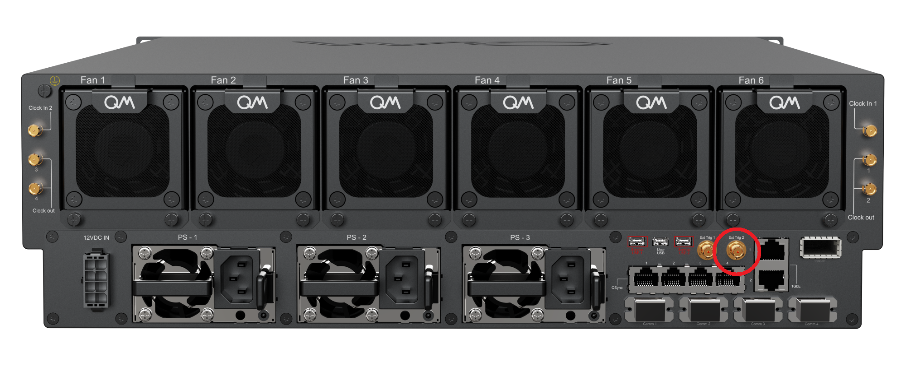
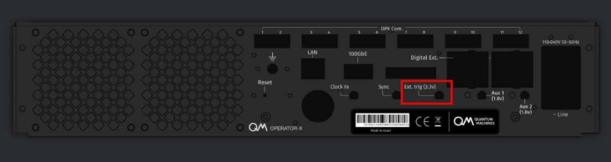
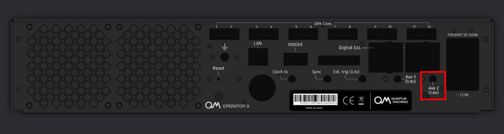
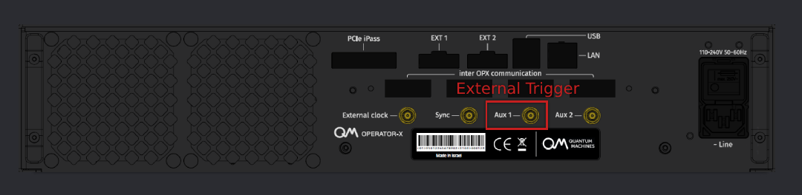
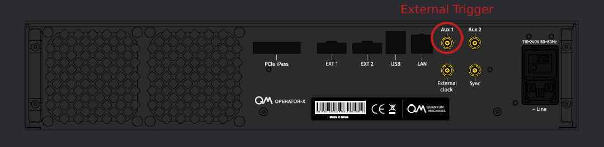

# External Triggering

Operations in QUA can be triggered by an external trigger in the form of a rising voltage received in the OPX trigger port on the back panel.
The trigger can be used to control the timing of events in the program from an external source.

## Basic Usage

The usage in QUA is via the {{f("qm.qua._dsl.wait_for_trigger")}} function. Basic usage of this feature is performed as follows:

```python
wait_for_trigger(element)
```

For example, if we want to play a pulse on `qe1` after a trigger input, we can write:

```python
wait_for_trigger('qe1')
play('qe1_pulse','qe1')
```

We can also specify a constant pulse to be played while the element is waiting for trigger.

```python
wait_for_trigger('qe1', 'wait_pulse')
```

The pulse 'wait_pulse' will be played continuously until the arrival of the trigger signal.

!!! Note
    The external trigger port is sampled at a frequency of 250 MHz. Therefore, the temporal resolution is 4 ns.

## Triggering Multiple Elements

When we want to trigger multiple elements in the same controller, (i.e., same trigger signal), we can simply write multiple
{{f("qm.qua._dsl.wait_for_trigger")}} commands. For example:

```python
wait_for_trigger('qe1', 'wait_pulse')
wait_for_trigger('qe2', 'wait_pulse')
```

Alternatively, and in case we don't want to play a wait pulse, we can use the {{f("qm.qua._dsl.align")}} command. For example:

```python
wait_for_trigger('qe1')
align('qe1', 'qe2', 'qe3')
play('qe1_pulse','qe1')
play('qe2_pulse','qe2')
play('qe3_pulse','qe3')
```

In the example above, the three play commends will be executed together after the trigger.
Note that any of the three elements can be placed in the `wait_for_trigger` command.

If we want to pause the entire program until the trigger arrives, we can place an empty align.

```python
wait_for_trigger('qe1')
align()
```

The program will be paused at this point until the trigger signal arrives.

## Trigger in Multiple OPX's

In a system with $N$ OPX's, there are essentially $N$ trigger ports that can accommodate $N$ separate trigger signals.
However, each trigger signal can only trigger elements that are configured in the same OPX, i.e., where the elements has it's inputs.
If we want a trigger signal to trigger elements in multiple controllers we can either use the align method.
Alternatively, a digital output of one OPX can be used to trigger another OPX by directly connecting it to the other's trigger port.

## Connectivity in the OPX

=== "OPX1000"

    {{ requirement("QOP", "3.0") }}

    The trigger in the OPX1000 should be connected to the port labeled Ext. Trig 2 (the right trigger port), as seen in the figure below.

    The threshold for trigger detection is 2 V. It is 10 KOhm terminated, and max allowed voltage is 5.5 V.


    

=== "OPX+"

    {{ requirement("QOP", "2.0") }}
    Depending on the server version, the external trigger is connected as follows:

    === "Version QOP200 and higher"

        The trigger in the OPX+ (Version > QOP200) is connected as follows and can accept up to **3.3 V** LVTTL.
        
        
    
    === "Initial version"

        

        In OPX+ version 2.20 (initial), the external trigger is connected to the right-most AUX2 port. (labeled AUX3, in old back panels)
        In this version, the maximum allowed voltage is **1.8 V** and the threshold voltage level is **1.15 V**

=== "OPX"

    {{ requirement("QOP", "1.0") }}  The trigger in the OPX is connected as follows:

    === "OPX with inter-controller connectivity"

        
        
    === "OPX without inter-controller connectivity"

        Some OPX back panels are slightly different, the connectivity is as follows:
            
        
        
    !!! important
        The maximum allowed voltage is **1.8 V**.
        The threshold voltage level is **1.15 V**