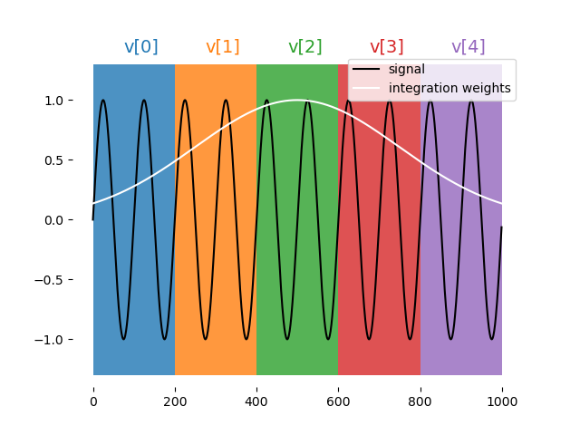

# QUA Language Features

This document describes QUA language features that go beyond the simple use-case described in the QUA overview section.

For easier navigation we recommend using the table of contents to the left.


## Measure statement features

The {{f("qm.qua._dsl.measure")}} command is a central command in QUA. It allows for the acquisition of ADC data corresponding to a readout pulse, its storage and processing.
The raw ADC data can be processed in several ways, as explained below.

### Demodulation

$$
\text{demod}(b,e)=2^{-12}\sum_{i=b}^{e}\left(W_{c}^{i}\cos\left(2\pi f_{IF}t_{i}\right)+W_{s}^{i}\sin\left(2\pi f_{IF}t_{i}\right)\right)S_{i}
$$

where $W^{4k+p}_{s,c}=\tilde{W}^{k}_{s,c} \forall p\in\{0,1,2,3\}$

!!! Note
    The $2^{-12}$ is a factor used to scale the result for the OPX fixed point accuracy

Types of demodulations:

#### Full demodulation

This is regular demodulation.

$$
d_{full}=\text{demod}(0,n-1)
$$

where $n$ is the number of the total adc samples. The result is a fixed point value.

Syntax:

```python
measure([pulse], [element], [stream],
                demod.full([integration_weights],[output_variable],[analog_output]),...)
```

Examples:

```python
measure("readout", "RR", None, demod.full("cos", I, "out1"))
measure("readout", "RR", None, demod.full("cos", I, "out1"), demod.full("sin", Q, "out1"))
```

#### Sliced demodulation

The demodulation is sliced into chunks according to the formula below. Save the result in an array.

$$
d_{sliced}\left[i\right]=\text{demod}(i\cdot 4\cdot C,(i+1)\cdot 4\cdot C)
$$

where $C$ is the chunk size in units of 4 ns.

Illustration:



Syntax:

```python
measure([pulse], [element], [stream],
        demod.sliced([integration_weights],[output_array],[chunk_size],[analog_output]),...)
```

Examples:

```python
A = declare(fixed, size=10)
B = declare(fixed, size=4)
C = declare(fixed, size=4)
measure("readout", "RR", None,
    demod.sliced("cos", A, 6, "out1"))
# The integration weights are, constant, of length 10*4*6 = 240

measure("readout", "RR", None,
    demod.sliced("arb_integW", B, 11, "out1"),
    demod.sliced("sin", C, 11, "out1"))
# Integration weights are length 4*4*11 = 176
```

!!! Note

    1. The chunk size is in units of 4 ns.
    2. For arbitrary integration weights, chunk size must be bigger than or equal to 7
    3. Duration of integration weights must be 4 * `chunk_size` * `array_size`

#### Accumulated demodulation

$$
d_{accumulated}\left[i\right]=\sum_{j=0}^{i}\text{demod}(j\cdot 4\cdot C,(j+1)\cdot 4\cdot C)
$$

where $C$ is the chunk size in units of 4 ns.

Illustration:


Syntax:

```python
measure([pulse], [element], [stream],
        demod.accumulated([integration_weights],[output_array],[chunk_size],[analog_output]),...)
```

Examples:

```python
A = declare(fixed, size=10)
B = declare(fixed, size=4)
C = declare(fixed, size=4)
measure("readout", "RR", None, demod.accumulated("integW1", A, 7, "out1"))
measure("readout", "RR", None,
    demod.accumulated("arb_integW", A, 11, "out1"),
    demod.accumulated("sin", A, 11, "out1"))
```

!!! Note

    1. The chunk size is in units of 4 ns.
    2. For arbitrary integration weights, chunk size must be bigger than or equal to 7
    3. Duration of integration weights must be 4 * chunk_size * array_size

#### Moving window demodulation

$$
d_{movingWindow}\left[i\right]=\sum_{j=max(i-W+1,0)}^{i}\text{demod}(j\cdot 4\cdot C,(j+1)\cdot 4\cdot C)
$$

where $C$ is the chunk size in units of 4 ns and $W$ is the chunks_per_window.

Illustration:


Syntax:

```python
measure([pulse], [element], [stream], 
        demod.moving_window([integration_weights],
                            [output_array],
                            [chunk_size],
                            [chunks_per_window],
                            [analog_output]),...)
```

Examples:

```python
A = declare(fixed, size=10)
B = declare(fixed, size=4)
C = declare(fixed, size=4)
measure("readout", "RR", None, demod.moving_window("cos", A, 5, 3, "out1"))
measure("readout", "RR", None,
        demod.moving_window("arb_integW", B, 7, 2, "out1"),
        demod.moving_window("sin", C, 7, 2, "out1"))
```

!!! Note

    1. The chunk size is in units of 4 ns.
    2. For arbitrary integration weights, chunk size must be bigger than or equal to 7
    3. Duration of integration weights must be 4 * chunk_size * array_size
    4. Chunk size must be less or equal to array_size

### Integration

The same as demodulation but at zero frequency, namely:

$$
\text{Integ}(b,e)=2^{-12}\sum_{i=b}^{e}W_{c}^{i}S_{i}
$$

where $W^{4k+p}_{c}=\tilde{W}^{k}_{c} \forall p\in\{0,1,2,3\}$

!!! Note
    The $2^{-12}$ is a factor used to scale the result for the OPX fixed point accuracy

Types of integrations:


#### Full

syntax:

```python
measure([pulse], [element], [stream],
                integration.full([integration_weights],[output_variable],[analog_output]),...)
```

#### Sliced

Syntax:

```python
measure([pulse], [element], [stream],
                integration.sliced([integration_weights],[output_array],[chunk_size],[analog_output]),...)
```

#### Accumulated

Syntax:

```python
measure([pulse], [element], [stream],
                integration.accumulated([integration_weights],[output_array],[chunk_size],[analog_output]),...)
```

#### Moving window

Syntax:

```python
measure([pulse], [element], [stream],
                integration.moving_window([integration_weights],[output_array],[chunk_size],[chunks_per_window],[analog_output]),...)
```

### Time Tagging

The time-tagging feature populates a vector of time stamps that are associated with voltage edges typically generated by a single photon counting module (SPCM).

#### Time-tagging parameters

A time-tag is generated when the voltage in the OPX analog input meets two **independent** conditions, one for the signal and one for the signal's derivative.
The time tagger logic is as follows:

- A tag will be registered in the ADC sample where both conditions are met simultaneously.
- As long as both conditions are true, no new tags are registered.
- Once one of the conditions turns false, the tagger is "armed" again and a new tag can be registered.
- The next tag will be registered in the next ADC sample, where both conditions are true again.

The time tagging parameters are set in a measuring element configuration.

There are two conditions on the signal. One for the value and one for the derivative which are defined by the parameters
`signalThreshold` and `signalPolarity`, and follow the following equation:

For `signalPolarity` set to `'Above'`:

$$
V(t) > signalThreshold
$$

For `signalPolarity` set to `'Below'`:

$$
V(t) < signalThreshold
$$

Where $V(t)$ is the measured voltage at time $t$. Similarly, the condition on the signal derivative follows the same logic:

For `derivativePolarity` set to `'Above'`:

$$
\dot{V(t)} > derivativeThreshold
$$

For `derivativePolarity` set to `'Below'`:

$$
\dot{V(t)} < derivativeThreshold
$$

For example, in the configuration block below, the time tagging is set to detect a voltage edge. The element `spcm` has the time tagging parameters defined in the `outputPulseParameters` block.

```python
'spcm': {
    "singleInput": {
        "port": ('con1', 1)
    },
    'operations': {
        'measure': 'measure_pulse'
    },
    "outputs": {
        'out1': ('con1', 1)
    },
    'time_of_flight': 180,
    'smearing': 0,
    'outputPulseParameters': {   # Time tagging parameters
        'signalThreshold': -500,
        'signalPolarity': 'Below',
        'derivativeThreshold': -10000,
        'derivativePolarity': 'Above'
    }
},
```

Note that the condition on the derivative is chosen such that it will always be **True**. In that way,
a time tag will be registered upon crossing the signal's threshold.

The example above showcases a common usage of the time tagger as a voltage edge detector which would detect a falling
edge through $~122 mV$, since the units are in ADC samples (12 bits) and $-500/-4096=-0.122$. The minus sine is added to account for the internal inversion of the OPX's ADC.

For a gaussian input as shown below, the parameters above would detect the falling edge at $t=210 ns$.
If the `signalPolarity` would be changed to `Above`, the rising edge would be detected at $t=270 ns$.

<figure markdown>
  
  <figcaption>timetagging edge detector example</figcaption>
</figure>
!!! tip "Recommended settings"
    For most use-cases, we recommend setting the the `derivativeThreshold` and `derivativePolarity` as in the example above.

??? info "Backwards compatibility"
    Due to backwards compatibility, the parameter's values can also be `Ascending` for `Above` and  `Descending` for `Below`

??? info "Default Time Tagging Values"
    If the `'outputPulseParameters'` dictionary is left empty, the default values are used.
    The user must supply **all** values, or none. The default values are as follows:

    ```python
    'outputPulseParameters': {
        'signalThreshold': 800,
        'signalPolarity': 'Below',
        'derivativeThreshold': 300,
        'derivativePolarity': 'Below'
    }
    ```

#### Time-tagging modes & usage

##### Basic time-tagging

Basic time tagging has a resolution of 1 ns with a dead time of 2 ns.
Time-tagging is done in a measure statement, with the following syntax:

```python
counts = declare(int)
times = declare(int, size=10)
measure([pulse], [element], [stream], time_tagging.analog(times, max_time, counts)
```

- `times` is a vector of integers into which the times of the detected pulses are saved (in ns).
- `max_time` gives the maximum time window, in ns, during which the statement waits for tag arrival.
- `counts` is a variable that is populated with the number of tags which arrived during the measurement.

##### High resolution time-tagging

{{ requirement("QOP", "2.0") }} {{ requirement("QUA", "0.3.7") }}
High resolution time tagging has a resolution <50 ps with a dead time of 84 ns.
The high resolution time-tagging is done in a measure statement, with the following syntax:

```python
counts = declare(int)
times = declare(int, size=10)
measure([pulse], [element], [stream],
        time_tagging.high_res(times, max_time, counts))
```

- `times` is a vector of integers into which the times of the detected pulses are saved (in ps).
- `max_time` gives the maximum time window, in ns, during which the statement waits for tag arrival.
- `counts` is a variable that is populated with the number of tags which arrived during the measurement.

## Flow control

### Branching

#### If, Elif & Else

The simplest way to use branching is using the {{f("qm.qua._dsl.if_")}} statement. Usage of the {{f("qm.qua._dsl.if_")}},
{{f("qm.qua._dsl.elif_")}} & {{f("qm.qua._dsl.else_")}} conditional is demonstrated in thecode block below. 
Here, `op1` is played if `a` is larger than 1, `op2` is played if it's between -1 and 1, and `op3` is played if it is below -1.
`a` is a `fixed` QUA variable in this case, which can be the result of a measurement or a classical computation.

```python
with if_(a>1):
    play('op1', 'qe')
with elif_(a>=-1):
    play('op2', 'qe')
with else_():
    play('op3', 'qe')
```

#### Switch Case

It is also possible to use a {{f("qm.qua._dsl.switch_")}}-{{f("qm.qua._dsl.case_")}}, as shown in the example below. 
Here, `op1` will be played if `a=1`, `op2` will be played if `a=2`, and `default_op` will be played otherwise.
`a` is an `int` QUA variable in this case, which can be the result of a measurement or a classical computation.

```python
with switch_(a):
    with case_(1):
        play('op1','qe')
    with case_(2):
        play('op2','qe')
    with default_():
        play('default_op','qe')
```

!!! tip
    If you want to choose between two options, using the switch-case is **not** recommended. Instead, use [if - else](#if-elif-else) for general purposes
    or the [ternary operator](#ternary-operator) for assignments.

In the example below, the switch case is inside a QUA `for_` loop, which means that at each iteration of the loop, a
different operation will be played.

```python
with for_(j, 0, j < 16, j + 1):
    ...
    with switch_(j):
        with case_(1):
            play('op1', 'qe')
        with case_(2):
            play('op2', 'qe')
        with case_(3):
            play('op3', 'qe')
        ...
    ...
```

Writing this structure can be further simplified by wrapping the code with a Python `for` loop:

```python
with for_(j, 0, j < 16, j + 1):
    ...
    with switch_(j):
        for i in range(16):
            with case_(i):
                play(f'op{i}', 'qe')
    ...
```

The switch case operation has an optional flag, `unsafe` that can be used to decrease the gaps that might be created when using switch-case
inside a loop, such as in the example above. However, this flag cannot be used with `with default_():`, and in
addition, if a value in the `switch` does not match any of the values in the `case`, unexpected behavior can occur.

The usage can be seen in the following example:

```python
with for_(j, 0, j < 16, j + 1):
    ...
    with switch_(j, unsafe=True):
        for i in range(16):
            with case_(i):
                play(f'op{i}', 'qe')
    ...
```

#### Conditional Play

It is also possible to add a condition directly in the {{f("qm.qua._dsl.play")}} command. The pulse would only be played if the condition
is evaluated to `True`. This would result in a quicker evaluation of the condition, compared to using an `if_`, and
can be used when feedback latency is critical.

```python
play('op', 'qe', condition=a > 0)
```

!!! important
    In versions up to {{ requirement("QOP", "2.2.0") }}, any digital pulse associated with the operation will always play, regardless of the condition.

#### Port Condition

{{ requirement("QOP", "3.2") }}{{ requirement("QUA", "1.2") }}

The MW-FEM allows for a faster conditional play mechanism. to utilize it, use the port condition context. For example:

```python
with port_condition(I>0):
    play('pi', 'qubit')
```

#### Ternary Operator

The ternary operation is available via the [Util API](../API_references/qua/util.md), and can be used to quickly evaluate 
a condition to decide between two parameters, this would result in a quicker evaluation of the condition, compared to using an `if_`.
In the example below, the duration of the pulse will be `c` if `a > 0` otherwise it would be `d`. `c` and `d` can be either QUA variables,
or constants.

```python
assign(b, Util.cond(a > 0, c, d))
play('op', 'qe', duration=Util.cond(a > 0, c, d))
```

### Loops

#### For

The QUA {{f("qm.qua._dsl.for_")}} loop is similar to a python loop, having a `(var, start, end_cond, step)` structure.
The following block of code plays a pulse five times, running over a QUA variable `t`, and uses it for the pulse
duration.

```python
t = declare(int)
with for_(t, 10, t < 15, t+1):
    play('pulse', 'qe', duration=t)
```

#### For_Each

The QUA {{f("qm.qua._dsl.for_each_")}} loop scans the variable through a predefined vector. This is a bit less efficient compared to the
`for_` loop above, but can scan arbitrary points.

```python
t_vec = [10, 15, 30]
t = declare(int)
with for_each_(t, t_vec):
    play('pulse', 'qe', duration=t)
```

It is possible to loop over a tuple of variables, similar to the `zip` style iteration in python:

```python
t_vec = [10, 15, 30]
a_vec = [0.25, 1.0, 0.5]
t = declare(int)
a = declare(fixed)
with for_each_((t, a), (t_vec, a_vec)):
    play('pulse' * amp(a), 'qe', duration=t)
```

In both cases, `t_vec` and `a_vec` can also be QUA arrays

!!! Note
    `for_each_` loops are more resource intensive and unlike `for_` loops, have a maximum size.

#### While

The {{f("qm.qua._dsl.while_")}} loop is executed for as long as the condition is `True`. The following block of code plays a pulse 5 times.

```python
N = declare(int,value=0)
with while_(N < 5):
    play('pulse','qe')
    assign(N, N + 1)
```

## Pause, Resume and IO variables

QUA programs can be paused by using the {{f("qm.qua._dsl.pause")}} QUA command. When a `pause` command is reached, the OPX completely halts
the execution of the program until a {{f("qm.jobs.running_qm_job.RunningQmJob.resume")}} command is sent using the `Job` API.
This could be used to control an external device, such as an LO source. When the program is paused, data
can be sent between the client PC and the real-time program using 2 available IO variables (Input/Output variables).

The following examples shows basic communications between the client and QUA program using this `pause` and `resume`
technique.

### Setting an IO variable

In this QUA program, a {{f("qm.qua._dsl.pause")}} precedes the {{f("qm.qua._dsl.play")}} command, which plays a pulse with an amplitude dynamically set by an IO variable.

```python
with program() as prog:
    N = declare(int)
    a = declare(fixed)
    with for_(N, 0, N < 100, N + 1):
        pause()
        assign(a, IO1)
        play('pulse'*amp(a), 'qe')
```

When the `pause` command is encountered, the execution waits for a {{f("qm.jobs.running_qm_job.RunningQmJob.resume")}} command, with usage as shown below:

```python
job = qm.execute(prog)
current_vals = np.linspace(1e-3, 5e-3, 100)
for val in current_vals:
    while not job.is_paused():
        time.sleep(0.001)
    qm.set_io1(val)
    job.resume()
```

### Reading an IO variable

IO values can also be used to extract information of a running program. For example, update the LO frequency to some value calculated in real-time, in the OPX.
The following example demonstrate such use case with an IO variable:

```python
with program() as prog:
    rt_lo = declare(fixed)
    ... # 1st part of the program including calculation for rt_lo
    assign(IO2, rt_lo)
    pause()
    ... # 2nd part of the program
```

In Python we can have a code block that iteratively checks the IO value and act upon that, for example:

```python
job = qm.execute(prog)
while not job.is_paused():
    time.sleep(0.001)
LO = get_io2_value()
# do something with new LO
job.resume()
```


## Input streams

{{ requirement("QOP", "2") }} {{ requirement("QUA", "0.3.7") }} Input streams allows passing data from the client computer to a running job in the OPX+ with
minimal latency. To use one, you must first declare it in the QUA program using the
{{f("qm.qua._dsl.declare_input_stream")}} command. The declaration is similar to the declaration of a normal QUA
variable. You need to define its type (int, fixed, bool), it's name, and optionality, its size or values.
Once declared, you can use it as you would use any other QUA variable, with the exception that you have two new
available commands:

1. Outside the QUA program, in Python, you can use {{f("qm.jobs.base_job.QmBaseJob.push_to_input_stream")}} from the job API to pass
   data into the QUA program. Note that you can pass multiple values and later access them one by one in QUA.
2. Inside the QUA program, you can use {{f("qm.qua._dsl.advance_input_stream")}} function to access the next available
   data. If there is no available data, this command will pause the OPX and wait until data is available.

!!! Note
    The data inserted using {{f("qm.jobs.base_job.QmBaseJob.push_to_input_stream")}} must match the size of the input stream.

For example:

```python
with program() as example_input_stream:
    truth_table = declare_input_stream(bool, name='truth_table_input_stream', size=10)
    tau = declare_input_stream(int, name='tau_input_stream')
    ...
    with while_(some_qua_cond):
        advance_input_stream(tau)
        advance_input_stream(truth_table)
        play('operation', 'element0', duration=tau, condition=truth_table[0])
        play('operation', 'element1', duration=tau, condition=truth_table[1])
        play('operation', 'element2', duration=tau, condition=truth_table[2])
        ...
    ...

...
job = qm.execute(example_input_stream)
...
while some_cond:
    qubit_states = read_from_external_device()
    calc_tau = calculate_tau()
    job.push_to_input_stream('truth_table_input_stream', qubit_states)
    job.push_to_input_stream('tau_input_stream', calc_tau)
```

## Timestamp Stream
{{ requirement("QOP", "2.2") }}, {{ requirement("QUA", "1.1.2") }}
It is possible to retrieve the precise timestamp of any {{f("qm.qua._dsl.play")}} and {{f("qm.qua._dsl.measure")}} 
commands from the beginning of an executed program, 
and use it for circuit analysis and verification. 
This capability covers real-time logic with non-deterministic outcomes (measurements) and compiler scheduling due to optimizations unknown to the user. 
To retrieve the timestamp stream you must provide the `play()` or `measure()` command with a user-defined string, using the keyword argument `timestamp_stream`.
The timestamp stream is returned using the `results_handle` as an array where each element shows the timestamp 
at which the play/measure command associated with this stream was executed. The time is given in clock cycles (4 ns per cycle) 
The following block of code demonstrates how to use the timestamp stream:

```python
with program() as prog:
    # define timestamp streams 
    play('pulse', 'qe', timestamp_stream='play_timestamps')
    measure('readout', 'readout_element', timestamp_stream='measure_timestamps')
    
# retrieve the timestamp stream
job = qm.execute(prog)
play_timestamps = job.result_handles.get('play_timestamps').fetch_all()
measure_timestamps = job.result_handles.get('measure_timestamps').fetch_all()
```

Alternatively, timestamp streams can be retrieved using a stream variable rather than a string, 
and this variable can be used for further processing. For example let's look at the difference between play and measure commands:
    
```python
with program() as prog:
    # define timestamp streams
    s_play = declare_stream()
    s_measure = declare_stream()
    play('pulse', 'qe', timestamp_stream=s_play)
    measure('readout', 'readout_element', timestamp_stream=s_measure)
    
    with stream_processing():
        (s_measure-s_play).save_all('diff_timestamps')

    
# retrieve the timestamp stream
job = qm.execute(prog)
diff_timestamps = job.result_handles.get('diff_timestamps').fetch_all()
```
## Sticky Element
When an element is defined as *sticky*, the last analog value played at the end of a pulse will be held until the next pulse begins. 
This is useful, for example, for semiconductor qubits where one wants to avoid the noise associated with the switching of the bias voltage. 

Starting from {{ requirement("QUA","1.1.3") }} an element can be defined as *sticky* by adding the `'sticky': {'analog': True }` dict to its configuration.
The previous API, used up until {{ requirement("QUA","1.1.1") }} using `'hold_offset': 50` is still supported, and a deprecation warning will be issued. 
Importantly, when an element is sticky, the values of the currently playing pulse will be **added** to the previously held value.
A sticky element always ramps back to its DC offset value when the element has reached its final instruction of the program.
The duration of the ramp in ns can be set by configuring `'sticky': {'analog': True, 'duration': 50 }`. 
This ramp can also be explicitly initiated by the {{f("qm.qua._dsl.ramp_to_zero")}} function.

!!! Note
    With the previous API the ramp time was defined in clock cycles using `hold_offset` using the new API with {{ requirement("QUA","1.1.3") }}
    the ramp time is defined in ns, consistently with any time duration in the configuration. Note that this is not a breaking change since the old API, 
    i.e. using `hold_offset` to define the ramp duration in clock cycles is still supported.

Starting from {{ requirement("QOP","2.2") }}, it possible to set the digital marker, associated with the sticky element, to be sticky as well
by configuring `sticky: {analog: True, digital: True }`. Doing so will hold the last value of the digital
marker until the next pulse begins. Playing the next digital marker will override the held value and once again the last
value will be held. Once a ramp to zero has been initiated at the end of the sequence or upon command, 
the digital marker will stop at the beginning of the ramp. This can be seen in the figure shown below (lower panel) when the digital pulse sets down at about 2600 ns.
!!! warning
    The amplitude of sticky pulses is accumulated with a resolution of 16 bit.
    Therefore, *N* changes to the sticky pulse amplitude can result in an amplitude inaccuracy of about $N \cdot 2^{-16}$.
    To null out this accumulated error, it is recommended to use {{f("qm.qua._dsl.ramp_to_zero")}} from time to time.

    Alternatively, defining the amplitude of pulses of sticky elements to be in 16-bit resolution will prevent accumulated errors.
    When using `*amp()`, the last waveform sample multiplied by the scale factor should be in 16-bit resolution.

    An easy way to round in QUA would be to use [bit-shifting](../Guides/qua_ref.md/#bitwise-operations)

    ```python
    a = declare(fixed)
    assign(a, (a >> 12) << 12)  # after this line, a will be rounded to 16-bit
    ```

The sticky element behavior is simply shown in the following example.
We first define the quantum element as follows:

```python
"qe1": {
    "singleInput": {
        "port": ("con1", 1)
    },
    "digitalInputs": {...},
    'intermediate_frequency':0,
    'sticky':{
        'analog': True, 
        'digital': True, 
        'duration': 200
    },
    'operations': {
        'pulse': "pulse",
    },
},
"qe2": {
    "singleInput": {
        "port": ("con1", 1)
    },
    "digitalInputs": {...},
    'intermediate_frequency':0,
    'operations': {
        'pulse': "pulse",
    },
}
```

Note the `{'duration': 200}` which sets the ramp to zero duration, in clock cycles.
We also define a second quantum element `qe2` which is not sticky.

We can then run a simple program playing the same constant pulse twice, for the two different quantum elements:

```python
with program() as prog:
    play('pulse','qe1')
    wait(100,'qe1')
    play('pulse','qe1')
    wait(100,'qe2')
    play('pulse','qe2')
    wait(100,'qe2')
    play('pulse','qe2')
```

The resulting pulse sequence is shown below, where the sticky element is in blue and the non-sticky element is in orange.


The duration of each pulse is 1000 samples, with the sticky element in blue maintaining its final value between its first
and second play commands. Furthermore, the second pulse on the sticky element is added to the last pulse sample.
At the end of the program, the blue trace is ramped to zero within 200 clock cycles, as defined in the configuration.
The lower panel shows the non-sticky (blue) and the sticky (orange) digital markers associated with each element, 
with the sticky pulse also held between pulses.

!!! Note
    The example above is for an element without an intermediate frequency. In case of an element with an intermediate
    frequency, the output will be a sine wave with the last amplitude.

### Voltage Easing

A ramp to zero can be initiated on a sticky pulse at any point by calling the `ramp_to_zero(qe,duration)` function.
The duration parameter is optional and can be used to override the configuration value.
The waveform below was generated by running this program:

```python
with program() as prog:
    play('pulse','qe1')
    ramp_to_zero('qe1',100)
    play('pulse','qe1')
```


Note the first pulse eases to zero at a double rate compared to the second one.

## Ramp Pulse

It's possible to generate a voltage ramp by using the {{f("qm.qua._dsl.ramp")}} command.
The `slope` argument is specified in units of `V/ns`. Usage of this feature is as follows:

```python
play(ramp(0.0001),'qe1',duration=1000)
```

!!! Note
    The pulse duration must be specified if the ramp feature is used.

The `slope` can either be a literal (as shown above) or a QUA variable or expression. For example, consider the following snippet.

```python
d=1000
max_v=0.35
n=1000
with program() as myFirstProgram:
    a = declare(fixed)
    with for_(a, max_v/d/10, a <= max_v/d, a +max_v/d/n):
        play(ramp(a/2), 'qe1', duration=d)
        play(ramp(-a/2), 'qe1', duration=d)
```

The quantum element `qe1` is defined as a sticky pulse and the resulting waveform is therefore triangular in each loop step as is shown in the image below.

!!

## Frequency Chirp

This feature allows to perform a linear sweep of the element's intermediate frequency in time. Chirp parameters can be updated in run-time, inside a QUA program.

Basic usage of this feature is performed as follows:

```
play('pulse', 'qe', chirp=(rate, units))
```

Because the supported chirp rate spans many orders of magnitude, from mHz/sec to GHz/sec, it is defined by both a `rate`
numeric variable and a `units` string. Supported units are (exactly) one of the following: `'Hz/nsec'`, `'mHz/nsec'`, `'uHz/nsec'`,
`'pHz/nsec'` or their equivalent rates per-second: `'GHz/sec'`, `'MHz/sec'`, `'KHz/sec'`, `'Hz/sec'`, `'mHz/sec'`. The rate itself is an integer,
which can either be a QUA variable or a python literal.

A spectrogram of a positive chirp rate followed by a negative rate is shown below. The chirp duration is defined by the duration of the used pulse.

```
with program() as prog:
    chirp_rate = declare(int, value=25000)
    play("pulse", "qe", chirp=(chirp_rate , 'Hz/nsec'))
    play("pulse", "qe", chirp=(-25000, 'Hz/nsec'))
```


It is possible to directly define a piecewise linear chirp by providing a list of rates as shown below. This is a convenient method to approximate non-linear chirp rates.
In this case each chirp section will have the same duration, equal to the total pulse duration divided by the number of sections.

```
with program() as prog:
    a = declare(int, value=[25000, 0, 50000, -30000, 80000])
    play("pulse", "qe", chirp=(a, 'Hz/nsec'))
# equivalent program:
with program() as prog:
    play("pulse", "qe", chirp=([25000, 0, 50000, -30000, 80000], 'Hz/nsec'))
```


### Non-uniform Chirp Sections

A list of linear chirp rates can be specified at uniform intervals in time as shown above. You can also have non-uniform sections by passing a second list, giving the clock cycle number
where the next chirp rate is set to start. This is shown in the example below:

```python
rates = [199, 550, -997, 1396]
times =[0, 15196, 25397, 56925]
with program() as prog:
    play('pulse', 'qe', chirp=(rates,times, 'Hz/nsec'))
```


### Mathematical Formulation of the Chirp

The frequency in every piecewise linear section is given by:

$$
f(t) = f_0 + \alpha t
$$

Where $\alpha$ is the chirp rate, $t$ is the time and $f_0$ is the initial frequency.

The accumulated phase is given by:

$$
\phi(t) = 2\pi\sum_{i=0}^{t}(f_0 + \alpha i) = 2\pi(f_0 (t+1) + \frac{1}{2}\alpha(t+1)t)
$$


!!! Note
    Note that this discrete implementation of the chirp differs from the continuous frequency chirp which yields

    $$
    \phi(t) = 2\pi (f_0t + \frac{t^2}{2}\alpha)
    $$

### Continuous Chirp

!!! Note
    {{ requirement("QOP","2") }}  The continuous chirp feature only exists in the OPX+

It is possible to have the frequency chirp continue even after the pulse has stopped playing.
This will cause the frequency to continue increasing in the background and continue during the next play commands.
To use, add to the `play` command the kwargs `continue_chirp=True`, such as in the following example:

```python
with program() as prog:
    play("pulse", "qe", chirp=(-25000, 'Hz/nsec'), continue_chirp=True)
    wait(100, "qe")  # Chirping continues in the background
    play("pulse2", "qe")  # Chirping continues, but stops after this pulse ends

    play("pulse", "qe", chirp=(-25000, 'Hz/nsec'), continue_chirp=True)
    play("pulse2", "qe", continue_chirp=True)  # Chirping continues
    play("pulse3", "qe", chirp=(25000, 'Hz/nsec'))  # Chirping changes to the value given and will stop after this pulse ends
```

This could be useful when combined with sticky elements, in which case the pulse will continue playing.

## Crosstalk Correction Matrix

!!! Note
    {{ requirement("QOP","2") }}
    {{ requirement("QOP","3") }} {{ requirement("LF") }}

It is possible to add crosstalk terms between any ports in the same controller of the OPX+ or in the LF-FEM.
Adding a crosstalk term will cause everything coming out from one port also come out from another port, with the given amplitude factor. 
The crosstalk is being applied **before** the [Filters](output_filter.md) and DC offsets, which means that any filters applied on a port will only affect that specific port. 
See [OPX+ Pulse Process Schematic](../Hardware/OPX_hardware.md#opx-block-diagram) or [OPX1000 Pulse Process Schematic](../Hardware/OPX1000_hardware.md#pulse-processor-block-diagram).
This could be useful to correct for electronic crosstalk that exists between different control lines.
It is also possible to add a "self-crosstalk term", this will cause an amplitude scaling to that port, which defaults to "1" if not given.

!!! warning
    Adding a crosstalk term to any port will delay **all** analog pulses coming out from all ports. The delay will be 8 cycles (32 ns).
    Starting from {{ requirement("QOP","2.1") }}, it is possible to add the [compilation flag](features.md#compilation-options) `disable-crosstalk-matrix-ports-alignment` to only delay the ports which participate in the Crosstalk Correction Matrix.

### Usage Examples

The crosstalk terms can be configured at the OPX configuration file, with a different terms applied to each analog output in each controller.
To configure, add a `crosstalk` term in the `analog_outputs` field:

```python
'controllers': {
        'con1': {
            'analog_outputs': {
                1: {'offset': 0.0},
                2: {'offset': 0.0, 'crosstalk': {1: 0.2}},
                3: {'offset': 0.0, 'crosstalk': {1: -0.1}},
            },
        }
}
```

In the example above, any pulse played to output number 1 would also come out from ports 2 & 3 with an amplitude factor of 0.2 and -0.1 respectively, as seen in the following example:

!!

## Pulse Memory Compression

In order to optimize memory allocation the QUA compiler takes into account the frequency content of each pulse.
Each waveform's FFT is used to calculate the cutoff frequency f_cut under which 99.9% of the waveform's energy lies.
Each waveform then receives a score based on its cutoff frequency `f_cut` and the waveform's length.
The memory is then allocated to each waveform based on this score.
The compiler also calculates the error between the original and interpolated waveforms and
issues an error if it is larger than 1e-4:

The user can add to the waveform the parameter `max_allowed_error`:

```python
# Setting the 'max_allowed_error' parameter to 1e-2 instead of the default
'waveforms': {
    'wf1': {
        'type': 'arbitrary',
        'samples': [0.49, 0.47, 0.44, ...],
        'max_allowed_error': 1e-2
    },
},
```

That will override the default value (1e-4) allowing the user to tweak memory allocation.
Alternatively, the user can simply control the sampling ratio of the pulse:

```python
# Setting the 'max_allowed_error' parameter to 1e-2 instead of the default 1e-3
'waveforms': {
    'wf1': {
        'type': 'arbitrary',
        'samples': [0.49, 0.47, 0.44, ...],
        'sampling_rate': 0.5e9
    },
},
```

The `sampling_rate` parameter specifies the sampling rate in units of Samples/sec.

Any time a pulse is compressed, the compiler will output a warning and the compression factor:

```python
WARNING - Waveform wf_long was compressed with rate 0.6548853220189729 and error of 1.6128764990241962E-13
```

## Dynamic Pulse Duration

The duration of the pulse can be stretched (but, in the case of an arbitrary waveform, not compressed)
using the 'duration' parameter:

```python
# Stretching the pulse length
play(pulse, element, duration = 100)
# One can also use a variable or an expression
play(pulse, element, duration = 2*t+100)
```

- `duration` is given in clock cycles units.
- The stretched pulse is calculated from the original pulse using a 3rd order Lagrange interpolator on a 4 points running window.

The 'duration' parameter can accept a general mathematical expression composed of operators (+, -, \*, /),
numbers, QUA variables and QUA functions (such as cos and sin).

!!! warning
    When playing an arbitrary waveform, if the value of the duration parameter is set to below the original pulse
    length, corrupted output may occur.

## Truncate Pulses

Part of a pulse can be played by using the `truncate` parameter:

```python
# Truncating the pulse length
play(pulse, element, truncate = 10)
# One can also use a variable or an expression
play(pulse, element, truncate = 2*t+10)
# It is possible to both stretch the pulse and truncate it
play(pulse, element, duration = 40, truncate = 10)
```

- `truncate` is given in clock cycles units, with the minimum being 4 cycles.
- `truncate=n` will cause the first n cycles of the pulse to be played, this could be useful, for example, for exploring the dynamics of a qubit while a pulse is being played.
- If a pulse is given a dynamic duration, it will first be stretched to the given duration and then truncated.

The 'truncate' parameter can accept a general mathematical expression composed of operators (+, -, \*, /),
numbers, QUA variables and QUA functions (such as cos and sin).

!!! warning
    If the 'truncate' parameter is longer than the pulse duration, it'll cause unexpected results.

## Dynamic Port Allocation

It is possible to define an element with multiple inputs. At runtime, you can select to which port you want to play.

To define such an element in the config, use the `singleInputCollection` dictionary item:

```python
'aom_selector': {  # An example element that can play to either port 1 or 2
    "singleInputCollection": {
        "inputs": {
            "row": ('con1', 1),
            "column": ('con1', 2),
        }
    },
    'intermediate_frequency': 100e6,
    'hold_offset': {'duration': 200},
    'operations': {
        'pulse': "pulse",
    },
},
```

At run time, use the `target` parameter of the {{f("qm.qua._dsl.play")}} command:

```python
play('pulse', 'aom_selector', target='row')
```

## Multiple Inputs

When playing a pulse, it is possible to output it from multiple ports simultaneously.
This is done using the `multipleInputs` dictionary item:

```python
'qubit': {
    'multipleInputs': {  # An example element that will play from ports 1 and 2 simultaneously
        'inputs': {
            'input1': ('con1', 1),
            'input2': ('con1', 2)
        }
    },
    'operations': {
        'const': 'const_pulse',
    },
},
```

Using the `play` command:

```python
with program() as prog:
    play('const', 'qubit')
```

The pulse will then play to both port 1 and port 2 simultaneously, as seen in the figure below:


## Analog Delay

{{ requirement("QOP","2") }}

We can add a delay to the analog ports of up to 16 microseconds, in units of ns.

To do so, simply specify the desired delay in the [port's configuration](../Introduction/config.md#controllers). For example

```python
'analog_outputs': {
    1: {'offset': 0.0, 'delay': 110},
    2: {'offset': 0.0, 'delay': 21},
}
```

Here we specify a 110 ns delay for all signals coming out of port 1 and a 21 delay on all signals coming out of port 2.

## Inverted Digital Marker

{{ requirement("QOP","2.2") }}

The digital marker can be configured to be inverted, for example to suit both 'normally on' and 'normally off' switch types. 
The HIGH state will be the default state when configuring
`'inverted': True` for a digital output, and the marker will switch to the LOW state when a digital pulse is played.

To do so we configure this property in the [port's configuration](../Introduction/config.md#controllers). For example

```python
'digital_outputs': {
    1: {'inverted': True},
    2: {},
}
```
Note that the default value of `inverted` is `False`. When inverted, The output of the digital marker will change to HIGH
immediately when the QM is opened and will resort back to the default behavior (LOW) when the QM is closed. 


## Threads

The maximum number of quantum elements that can be used simultaneously is limited by the number of processing threads in the hardware.
A single-input quantum element requires one thread and a mixed input (IQ) element uses two *threads*, one for each channel.
The OPX has $N_{threads}=10$ *threads* and the OPX+ has $N_{threads}=18$.
By default, *threads* are not shared between different quantum elements. However, two (or more) quantum elements which
are never played together can share a *thread*, as explained below. Sharing threads allow the user to define more quantum elements and write more complex programs.

### Automatic Thread Allocation

It is possible to add a flag when executing a QUA program that will enable the *Automatic Thread Allocation*. In order to enable it, use:

```python
qm.execute(..., flags=['auto-element-thread'])
```

When the flag is set, the QUA compiler will automatically try to figure out which elements are never played together and these elements will share a *thread*.
Since the code can be complicated and not deterministic, the compiler uses the `align` statement to know which quantum elements are playing in parallel and which are not.
For example:

```python
with program() as prog1:
    a = declare(fixed)
    play("marker", "qeDig")
    play("pulse", "qe2")
    align("qe2", "qeDig")
    play("marker", "qeDig")
    with for_(a, 0.2, a < 0.9, a + 0.1):
        play("pulse" * amp(a), "qe1")
```

It seems that "qeDig" plays in parallel with both "qe1" and "qe2", but "qe1" and "qe2" never play in parallel.
This means that "qe2" and "qe1" can share the same *thread*.

Because the `align` statement is being used for the Automatic Thread Allocation, it is important to use it whenever possible.

### Manual Thread Allocation

It is also possible to manually assign the *threads* to the quantum elements, when defining them, in the following manner:

```python
config = {
    ...
    'elements': {
        'qe1': {
            "thread": "a",
            ...
        },
        'qe2': {
            "thread": "a",
            ...
        },
        'qe3': {
            "thread": "b",
            ...
        },
        'qe4': {
            ...
        },
    }
    ...
}
```

In the example above, "qe2" and "qe1" are assigned to *thread* "a" and can never run at the same time. "qe3" is being assigned to *thread* "b".
Any quantum element which does not have a *thread* directly specified will have its own *thread*.

!!! Note
    If "qe1" has two inputs (i.e. an IQ pair) it will actually be assigned two *threads*.
    If "qe2" has a single input, it will use one of the *threads* which is used by "qe1".

If "qe2" and "qe1" will be given a play command, they will be played one after the other and not at the same time. For example:

```python
with program() as prog:
    play("pulse1", "qe1")
    play("pulse2", "qe2")
    play("pulse3", "qe3")
```

In the example above, "qe1" will be played first and only when it is done "qe2" will be played.
Because "qe3" is on another *thread*, it will start immediately with "qe1". See examples [here](timing_in_qua.md#examples-for-timing-scenarios-in-qua)

## Oscillators

In addition to limited threads, there is also a limited number of internal oscillators. The OPX has $N_{osc}=10$
and the OPX+ has $N_{osc}=18$. This limits the number of quantum elements **with an intermediate frequency**.
However, it is possible to share oscillators between different elements.
For information on how to define shared oscillators, see the [configuration](../Introduction/config.md#oscillators) page.

Sharing oscillators between elements shares their frequency, their frame and their mixer correction matrix.
This means that any operation that affects these on any of the elements, would affect them all.
In the following example, `qe1`, `qe2` and `qe3` share an oscillator:

```python
with program() as prog:
    update_frequency("qe1", 50e6)
    play('const', 'qe2')  # Plays a 50 MHz pulse
    update_frequency("qe1", 100e6)
    play('const', 'qe2')  # Plays a 100 MHz pulse
    frame_rotation_2pi("qe3", 0.5)
    play('const', 'qe2')  # Plays a 100 MHz pulse, but with the frame rotated by pi
```

## Precompile Jobs

It is possible to separate the compilation and the execution parts of running a job, which is useful when a job is
repeated many times and the compilation run time is not negligible.
To precompile a job, use the `compile` function:

```python
program_id = qm.compile(program)
```

This will return a `program_id`, which can later be directly added to the `JobQueue`:

```python
qm.queue.add_compiled(program_id)
```

This can be done many times with a program which has been compiled once.

In addition, it is possible to change an analog waveform between runs using the `overrides` argument of the
`add_compiled` function:

```python
qm.queue.add_compiled(program_id, overrides={
    'waveforms': {
        'my_arbitrary_waveform': [0.02] * 1000,
        'my_constant_waveform': 0.2
    }
})
```

An arbitrary waveform has to be declared as overridable in advance in the configuration file. For the example above:

```python
'my_arbitrary_waveform': {
    'type': 'arbitrary',
    'is_overridable': True,
    'samples': [0.05] * 1000
}
```

!!! Note
    The number of samples in the new waveform has to be the same as in the old waveform.
    It is currently not possible to change the bandwidth of an overridable arbitrary waveform. Therefore, the
    `samplingRate` and `max_allowed_error` properties are not supported when "`is_overridable`: True".

## Compilation Options


There are a few optional features and modification in the compilation process from QUA to the OPX low-level code.
These options can be activated by passing a list of flags to the execution, compile or simulation.

The following is a short list of optional flags and their description:

- 'auto-element-thread' - Used when thread sharing is required. The compiler will automatically determine which elements can share a thread and allocate the resources accordingly. See further information [here](#threads).
- 'disable-filtered-ports-alignment' - Starting from version {{ requirement("QOP","2") }} on OPX+, this flag will disable the temporal alignment between analog ports that are filtered with a digital output filter and those that are not. This will reduce latency for unfiltered ports when using the filters. In addition, this flag will disable the automatic adjustment of the time-of-flight and digital delays parameters in the configuration. Read more about the latency in the [output filter guide](output_filter.md).
- 'disable-crosstalk-matrix-ports-alignment' - Starting from version {{ requirement("QOP","2.1") }} on OPX+, this flag will disable the temporal alignment between analog ports that participate in the Crosstalk Correction Matrix and those that are not. This will reduce latency for these ports when using the Crosstalk Correction Matrix. In addition, this flag will disable the automatic adjustment of the time-of-flight and digital delays parameters in the configuration. Read more about the latency in the [crosstalk correction matrix guide](#crosstalk-correction-matrix).
- 'skip-loop-unrolling' -  Disables an optimization over loop iterations. This gives faster compilation time at the cost of more program memory use and possibly more gaps.
- 'skip-loop-rolling' - Disables another optimization over loop iterations. This gives faster compilation time at the cost of more program memory use.
- 'skip-add-implicit-align' - Removes the automatically added [implicit align](timing_in_qua.md#the-implicit-align) from all control flows.
- 'not-strict-timing' - {{ requirement("QOP","2") }} Gaps within a {{f("qm.qua._dsl.strict_timing_")}} block will not block execution by raising warnings instead of errors. Read more about the strict timing feature [here](timing_in_qua.md#strict-timing).

The way to use these compilation options depends on the `qm-qua` Python package version. Choose your version below to see how:

=== "`qm-qua`>=1.1.2"

    ```python
    from qm import CompilerOptionArguments

    my_compiler_options = CompilerOptionArguments(flags=['flag1', 'flag2'])

    qm.execute(prog, compiler_options=my_compiler_options) # execution
    qm.compile(prog, compiler_options=my_compiler_options)  # compilation
    qmm.simulate(config, prog, SimulationConfig(duration), compiler_options=my_compiler_options) # simulation
    ```
    
    For example, in the following code, we execute a program with the automatic thread allocation compilation option:
    
    ```python
    my_compiler_options = CompilerOptionArguments(flags=['auto-element-thread'])
    qm.execute(prog, compiler_options=my_compiler_options)  # execution
    ```

=== "`qm-qua`<1.1.1"

    ```python
    qm.execute(prog, flags=['flag1', 'flag2'])  # execution
    qm.compile(prog, flags=['flag1', 'flag2'])  # compilation
    qmm.simulate(config, prog, SimulationConfig(duration), flags=['flag1', 'flag2']) # simulation
    ```
    
    For example, in the following code, we execute a program with the automatic thread allocation compilation option:
    
    ```python
    qm.execute(prog, flags=['auto-element-thread'])  # execution
    ```


