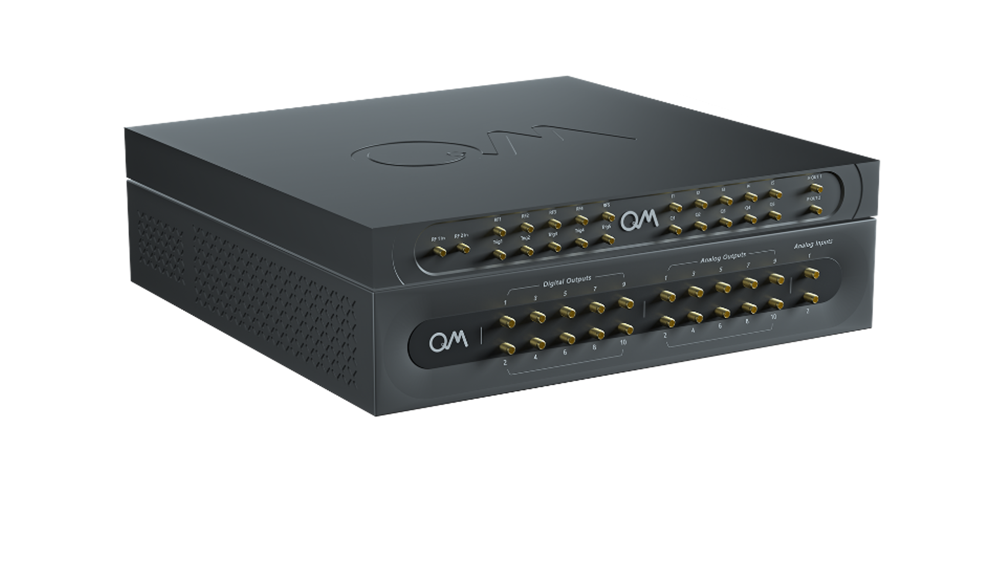

# Octave 

## Introduction

The octave is a complementary solution for enhancing the OPX capabilities by up- and down-converting its analog outputs,
creating a seamless RF front-end OPX. With the octave, one can have up to five RF outputs and two combined RF inputs operating in a frequency band of 2GHz to 18GHz. The following page serves as a user manual for the octave. For port specifications and block diagram, see the [octave hardware section](../Hardware/octave.md#octave).




## Initiate Communication with an Octave

To work with an octave, one needs to initiate communication through the {{f("qm.quantum_machines_manager.QuantumMachinesManager")}}.
This is done using the following steps: 

=== "{{ requirement("OPX+", "2.4") }} & {{ requirement("QUA", "1.1.7") }} and above"
    
    1. After creating the cluster with the Octaves, The Octaves will be named in ascending order: `oct1`, `oct2`...
       The name of the Octaves is shown under the `cluster` page in the admin panel.
    2. Create a file for Calibration parameters by using the {{f("qm.octave.octave_config.QmOctaveConfig.set_calibration_db")}} command

    ```python
    from qm.octave import QmOctaveConfig
    
    octave_config = QmOctaveConfig()
    octave_config.set_calibration_db(path)

    ```
    a file `calibraion_db.json` is created at the given path. 
    This file will be used for saving the calibration parameters. 
    See [the calibration section](../Guides/octave.md#automatic-calibration) for more information. 

    ??? Tip
        - One can save `calibraion_db.json` file at the current working directory by setting `path=os.getcwd()`
        - Different users of the same octave can have different calibration databases.
        - Multiple users can share the same calibration database file by either using the same path for it or simply sharing it with each other after calibration.
    3. Pass the Octave Config to the Quantum Machine Manager.
       
        
        ```python
        qmm = QuantumMachinesManager(host=opx_ip, port=opx_port, octave=octave_config)
        ```


=== "{{ requirement("OPX+", "2.2.2") }} and below"

    1. Initiate Octave Config - Create a new instance of `QmOctaveConfig` and specify the following details: 
    
    
        ```python
        from qm.octave import QmOctaveConfig
    
        octave_config = QmOctaveConfig()
        octave_config.add_device_info(octave_name, octave_ip, octave_port)
        ```
    
        - If you are using {{ requirement("OPX+", "2.4") }} and above `octave_name` is the name given to the octave during cluster creation.
          If you are using {{ requirement("OPX+", "2.2.2") }} and below `octave_name` is the name of the specific Octave device defined by the user. For example octave_name = "octave1"'.
        - `octave_ip` - The IP of the octave.
        - `octave_port` - The port to communicate with the octave.
    
        !!! Info
            When using more than one octave in the cluster, one needs to use {{f("qm.octave.octave_config.QmOctaveConfig.add_device_info")}} for each octave. 
    2. Create a file for Calibration parameters by using the {{f("qm.octave.octave_config.QmOctaveConfig.set_calibration_db")}} command

    ```python
    octave_config.set_calibration_db(path)

    ```
    a file `calibraion_db.json` is created at the given path. 
    This file will be used for saving the calibration parameters. 
    See [the calibration section](../Guides/octave.md#automatic-calibration) for more information. 

    ??? Tip
        - One can save `calibraion_db.json` file at the current working directory by setting `path=os.getcwd()`
        - Different users of the same octave can have different calibration databases.
        - Multiple users can share the same calibration database file by either using the same path for it or simply sharing it with each other after calibration.
    3. Pass the Octave Config to the Quantum Machine Manager.
       
        
        ```python
        qmm = QuantumMachinesManager(host=opx_ip, port=opx_port, octave=octave_config)
        ```

!!! Note
    See more details in the [network guide](../Hardware/network_and_router.md#network-overview-and-configuration) on 
    how to open a qmm depending on your network configuration.
!!! Note
    Install the latest `QUA` package by typing `pip install -U qm-qua`.

## Configuring the Octave

!!! Info
    Please note the differences between {{ requirement("QUA", "1.1.5") }} and {{ requirement("QUA", "1.1.4") }}.

    === "{{ requirement("QUA", "1.1.5") }} and above"

        * Configuring the Octave is done through the configuration as described below. 
        * It is possible to configure the octave using the [API commands](../Guides/octave.md#api-commands-for-octave-configuration) as well.
        * In order to use the automatic calibration, 
            * if you are using {{ requirement("OPX+", "2.2.2") }} and above, take a look [here](../Guides/octave.md#__tabbed_3_1).
            * If you are using {{ requirement("OPX+", "2.2.1") }} and below, take a look [here](../Guides/octave.md#__tabbed_3_2).
        * For an end-to-end example, take a look [here](../Guides/octave.md#__tabbed_5_1).
        
        ??? info "OPX1 users"
            For users with OPX1 & Octave who wish to use the new calibration, please contact QM for your octave update.         

    === "{{ requirement("QUA", "1.1.4") }} and below"

        * Configuring the Octave is done only through the [API commands](../Guides/octave.md#api-commands-for-octave-configuration). 
        * In order to set the OPX-Octave connectivity, take a look [here](../Guides/octave.md#__tabbed_2_2).
        * In order to use the Octave automatic calibration, take a look 
        [here](../Guides/octave.md#__tabbed_3_2).
        * For an end to end example, take a look [here](../Guides/octave.md#__tabbed_5_2)


{{ requirement("QUA", "1.1.5") }}
Configuring the Octave is done using a `"octaves"` key in the [configuration dictionary](../Introduction/config.md#the-configuration), as can be seen below. In this key, you can configure the connectivity between the OPX and the Octave, as well as its up and down converter modules. 

!!! success "Update parameters using API commands"
    It is also possible to change some Octave parameters after opening a quantum machine using the relevant API commands as can be seen [here](../Guides/octave.md#api-commands-for-octave-configuration).

The `"octaves"` key in the configuration is written as follows:

```py hl_lines="5 6 7 8 9 10 11 12 13 14 15 16 17 18 19 20"
config = {
    "version": 1,
    "controllers": {...},
    "elements": {...},
    "octaves": {
        octave_name: {
            "connectivity": "con1", #(1)
            "RF_outputs": { #(2)
                1: {...},
                2: {...},
                3: {...},
                4: {...},
                5: {...},
            },
            "RF_inputs": { #(3)
                1: {...},
                1: {...},
            },
            "loopbacks": [...],#(4)
        }
    },
    "pulses": {...},
    ...
}
```

1. Specify the OPX that this Octave is connected to according to the default connectivity (see below).
2. Configures the Octaves' up converter modules.
3. Configures the Octaves' down converter modules.
4. Configures a loopback in the Octave. 

??? note
    If you are using {{ requirement("OPX+", "2.4") }} and above `octave_name` is the name given to the octave during cluster creation.
    If you are using {{ requirement("OPX+", "2.2.2") }} and below `octave_name` is the name of the specific Octave device defined by the user. For example octave_name = "octave1"'.

Each `octave_name` dictionary holds information about its Octave configuration. This information is elaborated in the following sections:

### OPX-Octave Connectivity
One needs to define the connectivity between the OPX's analog outputs and the Octave's I&Q ports, as well as the OPX's analog inputs and the Octave's IF outputs. (See [octave front panel](../Hardware/octave.md#octave-front-panel) for more information)

The default connectivity is: 


=== "{{ requirement("QUA", "1.1.5") }} and above"

    Setting the default connectivity is done by adding the following key to the configuration:

    ```py hl_lines="3 4"
        "octaves": {
            octave_name: {
                "connectivity": "con1"  # for OPX+
                "connectivity": ("con1",1)  # for OPX1000 LF-FEM at slot 1
                ...
            }
        },
    ```


    ??? "Using a different connectivity"
        It is possible to use a different connectivity. In order to do so, instead of using the `"connectivity"` key there is a need to specify two things in the configuration:


        1. The connectivity between OPX's analog outputs and Octave's I/Q pairs. 
        
            For example, if one wants to connect

            - Analog Output 1 -> I3
            - Analog Output 2 -> Q3

            
            ```py hl_lines="7 8"
                "octaves": {
                    octave_name: {
                        "RF_outputs": {
                            ...
                            3: {
                                ...
                                "I_connection": ("con1", 1), #(1)
                                "Q_connection": ("con1", 2), 
                            },
                            ...
                        },
                        ...
                    }
                },
            ```

            1. ("con1", 1) is the controller's name and the OPX's analog output number. 

        2. The connectivity between OPX's analog inputs and Octave's IFOUT1 / IFOUT2. This is configured as follows:

        ```py hl_lines="4 5 6"
        "octaves": {
                octave_name: {
                    ...
                    "IF_outputs": {
                        "IF_out1": {"port":("con1", 1), "name":"out1"}, #(1)
                        "IF_out2": {"port":("con1", 2), "name":"out2"},
                    },
                }
            },
        ```

        3. ("con1", 1) is the controller's name and the OPX's analog input number. `"out1"` is the name of the analog input channel to be used in the
        `measure()` command.

=== "{{ requirement("QUA", "1.1.4") }} and below"

    Setting the deafult connectivity is done by using the {{f("qm.octave.octave_config.QmOctaveConfig.set_opx_octave_mapping")}} command 
    ```python
    octave_config.set_opx_octave_mapping([(controller_name, octave_name)])
    ```

    - `octave_name` is the name of the specific octave device as defined by the user. For example octave_name = 'my_octave'.
    - `controller_name` is the name of the OPX device that is connected to this specific octave. For example controller_name = 'con1'

    ??? "Using a different connectivity"
        It is possible to use a different connectivity. In order to do so, there is a need to specify the port mapping and use the {{f("qm.octave.octave_config.QmOctaveConfig.add_opx_octave_port_mapping")}} command
        ```python
        octave_config.set_opx_octave_mapping(portmap)
        ```

        For example, if one wants to connect

        - Analog Output 1 -> I2
        - Analog Output 2 -> Q2
        - Analog Output 3 -> I4
        - Analog Output 4 -> Q4

        it can be done by: 
        ```python
        portmap = {
            ('con1',  1) : ('octave1', 'I2'),
            ('con1',  2) : ('octave1', 'Q2'),
            ('con1',  3) : ('octave1', 'I4'),
            ('con1',  4) : ('octave1', 'Q4'),
        }
        octave_config.set_opx_octave_mapping(portmap)
        ```

### Up Conversion Chain

There are five up converter modules in the octave. Each one of them is associated with an I,Q pair. For example, `I1` `Q1` pair is associated with up converter number 1 and the RF signal will be outputted from `RF1` port. (See [octave front panel](../Hardware/octave.md#octave-front-panel))

Moreover, there are four internal synthesizers inside the octave. Three of them are used for up converting and down converting the signal (as can be seen in the [octave block diagram](../Hardware/octave.md#octave-block-diagram)), while the fourth one is used for calibration purposes.

Furthermore, it is possible to use an external LO instead of the internal one. This can be used, for example, if one wants to have five different LO frequencies simultaneously.

In order to set the up-conversion chain, one needs to add the following dictionary to the configuration: 

```py hl_lines="3 4 5 6 7 8 9 10 11 12 13 14 15"
    "octaves": {
        octave_name: {
            "RF_outputs": {
                1: {
                    "LO_frequency": LO_frequency, #(1)
                    "LO_source": "internal", #(2)
                    "gain": 0, #(3)
                    "output_mode": "always_on", #(4)
                    "input_attenuators": #(5)
                },
                2: {},
                3: {},
                4: {},
                5: {},
            },
            ...
        }
    },
```

1. Should be between 2 and 18 GHz.
2. Can be "internal" / "external". The default is internal. 
3. Sets the Octave's gain. Should be in the range [-20 : 0.5 : 20] dB.
4. Sets the fast switch's mode of the up converter module. Can be "always_on" / "always_off" / "triggered" / "triggered_reversed". The default is "always_off".
    * "always_on" - Output is always on
    * "always_off" - Output is always off
    * "triggered" - The output will play when rising edge is detected in the octave's digital port.
    * "triggered_reversed" - The output will play when falling edge is detected in the octave's digital port.
    !!! Note
        It's important to calibrate the digital pulse parameters. For more information click [here](../Guides/octave.md#calibrating-the-digital-pulse).
5. Can be "ON" / "OFF". The default is "OFF". "ON" means that the I and Q signals have a 10 dB attenuation before entering the octave's internal mixer. 
   

### Down Conversion Chain

There are two down converters inside the Octave.

In order to set the down-conversion chain, one needs to add the following dictionary to the configuration: 

```py hl_lines="4 5 6 7 8 9 10 11 12 13"
    "octaves": {
        octave_name: {
            ...
            "RF_inputs": {
                1: {
                    "RF_source": "RF_in",
                    "LO_frequency": LO_frequency, #(1)
                    "LO_source": "internal", #(2)
                    "IF_mode_I": "direct",  #(3)
                    "IF_mode_Q": "direct", 
                }
                2: {}
            }
            ...
        },
    },
```

1. Should be between 2 and 18 GHz.
2. Can be "internal" / "external". For down converter 1 "internal" is the default, for down converter 2 "external" is the default. 
3. Sets the mode of the IF Down Converter module as can be seen in the [octave block diagram](../Hardware/octave.md#octave-block-diagram). Can be "direct" / "envelope" / "mixer" / "off". The default is "direct". 
    * "direct" - The signal bypasses the IF module.
    * "envelope" - The signal passes through an envelope detector.
    * "mixer" - The signal passes through a low-frequency mixer.
    * "off" - the signal doesn't pass to the output port.

??? info
    Although there is no internal connectivity between the octaves' synthesizers and the second down converter, as can be seen in the [octave's back panel](../Hardware/octave.md#octave-back-panel), it is possible to set the second down converter's frequency in the configuration. This is done using the [`"loopbacks"` key](../Guides/octave.md#the-loopbacks-key). 

### The `"loopbacks"` Key

There are four internal synthesizers inside the octave. Three of them are used for up converting and down converting the signal. These three synthesizers are accessible through the `Synth` outputs located on the Octave's back panel, as shown [here](../Hardware/octave.md#octave-back-panel).

In certain scenarios, the user may utilize these `Synth` outputs as an external LO source for either up-conversion or down-conversion modules. 

??? note
    * To use it as an external LO source for the up-conversion module, connect the relevant `Synth` output to the corresponding `LO` input. 
    * To use it as an external LO source for the down-conversion module, connect the relevant `Synth` output to the corresponding `DmdLO` input. 

Furthermore, in these situations, it is also possible to configure the LO frequency for respective up-conversion or down-conversion module, and the relevant `Synth` to output this LO frequency. This can be accomplished using the `"loopbacks"` key.

For instance, let's consider a scenario where one intends to perform signal down-conversion with the second down-conversion module while utilizing the second synthesizer as the LO source. Since there isn't an internal connection between the second synthesizer and the second down-converter module, as indicated in the [octave block diagram](../Hardware/octave.md#octave-block-diagram), it becomes necessary to establish a physical connection from `Synth2` to `Dmd2LO` on the Octave's back panel.

Subsequently, to configure the LO frequency for the second down-converter, one must actually adjust the LO frequency of the second synthesizer. This adjustment is achieved through the use of the `"loopbacks"` key.

In summary, to utilize the second down-converter module with the second synthesizer as the LO source, the following steps are required:

1. Connect `Synth2` to `Dmd2LO` on the Octave's back panel. 

2. Add the `"loopbacks"` key to the configuration, such that 

```py hl_lines="11 12 13"

"octaves": {
    octave_name: {
        ...
        "RF_inputs": {
            1: {},
            2: {
                "LO_frequency": LO_frequency,
                "LO_source": "external",
            }
        },
        "loopbacks": [
            ((octave_name, 'Synth2'), 'Dmd2LO') #(1)
        ],
    }
},
```


1. Using this line it is possible to change the LO frequency of the second synthesizer, to the one written in the `RF_inputs` key. 

As a result, the LO frequency of `Synth2` will be ` LO_frequency`.

## Setting the Octave's Clock

=== "{{ requirement("QOP", "2.2.2") }} and below"

    After setting the configuration and opening a quantum machine (`qm`), it is necessary to set the Octave's clock. 
    
    
    The user can work with octave's internal clock or input an external clock at the [octave's back panel](../Hardware/octave.md#octave-back-panel).
    
    
    Setting the clock is done by the {{f("qm.octave.qm_octave.QmOctaveBase.set_clock")}} command. 
    
    ### Internal Clock
    
    If one wants to work with internal clock, use the command
    
    ```python
    from qm.octave.octave_manager import ClockMode
    
    qm.octave.set_clock(octave_name, clock_mode=ClockMode.Internal)
    
    ```
    
    ??? note
        `octave_name` is the name of the specific octave device defined by the user. For example octave_name = "octave"'. 
    
    
    ### External Clock
    
    When working with an external clock, the user needs to specify the clock frequency, which can be either 10MHz, 100MHz, or 1000MHz. 
    
    For example, in order to define a 10MHz external clock use the command
    
    ```python
    from qm.octave.octave_manager import ClockMode
    
    qm.octave.set_clock(octave_name, clock_mode=ClockMode.External_10MHz)
    
    ```
    ??? note
        `octave_name` is the name of the specific octave device defined by the user. For example octave_name = "octave1".

=== "{{ requirement("QOP", "2.4") }} and above"

    Please refer to [QOP clock guide](qop_clock.md) for more information about how QOP clocking is done from QOP 2.4.0.

!!! important
    The output clock of the octave is always 1GHz.

## API Commands for Octave Configuration

In {{ requirement("QUA", "1.1.5") }} and above, the user configures the octave through the configuration dictionary. If one wants to change the octave parameters after opening a quantum machine, this can be done using the relevant API commands, as can be seen below. Moreover, for {{ requirement("QUA", "1.1.4") }} and below, this is the only way to configure the octave.

### Up Conversion Chain

#### LO Signal

It is possible to change the LO source and LO frequency by the {{f("qm.octave.qm_octave.QmOctaveBase.set_lo_source")}} and {{f("qm.octave.qm_octave.QmOctaveBase.set_lo_frequency")}} commands accordingly.

??? "Internal LO" 

    When using the API command for internal LO source, one can use

    ```python
    qm.octave.set_lo_source(element, OctaveLOSource.Internal) 
    qm.octave.set_lo_frequency(element, LO_frequency) 
    ```

??? "External LO"

    When using the API command for external LO source, the user needs to specify the specific LO port on the [octave's back panel](../Hardware/octave.md#octave-back-panel).

    For example, if one wants to input an external LO to the first up converting module, use the command:

    ```python
    qm.octave.set_lo_source(element, OctaveLOSource.LO1)

    ```

    !!! warning
        LO source number must correspond to the up converter module number.
    
    !!! Note
        Due to the internal connectivity between the modules, the following requirements should be considered when using external LO:

        - If both up-converters 2 and 3 are being utilized, with one using an internal LO and the other using an external LO, the configuration must be set up as follows: up-converter 2 will utilize the external LO, and up-converter 3 will use the internal LO.
    
        - If both up-converters 4 and 5 are being utilized, with one using an internal LO and the other using an external LO, the configuration must be set up as follows: up-converter 4 will utilize the external LO, and up-converter 5 will use the internal LO.


#### Output Gain 
    
There is a variable attenuator and amplifier inside each up converter module. That means that one can change the gain of the outputted signal.

Changing the gain can also be done by the {{f("qm.octave.qm_octave.QmOctaveBase.set_rf_output_gain")}} command 

??? note
    gain_dB should be in the range $[-20:0.5:20] dB$.

??? info
    For versions {{ requirement("QUA", "1.1.4") }} and below - When changing the LO frequency using the API command, either the external LO or the internal one, there is a need to run this command again in order get the desired gain.

    i.e. for internal LO, 
    
    ```python
    qm.octave.set_lo_source(element, OctaveLOSource.Internal) 
    qm.octave.set_lo_frequency(element, LO) 
    qm.octave.set_rf_output_gain(element, gain_dB) 

    ```

    and for external LO 

    ```python
    qm.octave.set_lo_source(element, OctaveLOSource.LO1)
    qm.octave.set_rf_output_gain(element, gain_dB) 

    ```

#### Output Mode

At the output of each up converter module, a fast switch sets the output mode. 

It is also possible to change the output mode using the command {{f("qm.octave.qm_octave.QmOctaveBase.set_rf_output_mode")}}.

??? note

    When using the API command, one can choose one of the following:

    - `on` - Output is always on
    - `off` - Output is always off
    - `trig_normal` - The output will play when rising edge is detected in the octave's digital port.
    - `trig_inverse` - The output will play when falling edge is detected in the octave's digital port.

    For example, if one wants to output a signal only when a rising edge is detected in the octave's digital port, use the following command 

    ```python
    qm.octave.set_rf_output_mode(element, RFOutputMode.trig_normal)

    ```

!!! warning
    Don't forget to connect the OPX's digital output to the relevant Trig port (as can be seen in the [octave front panel](../Hardware/octave.md#octave-front-panel)). Moreover, it's important to calibrate the digital output's `delay` and `buffer` parameters. 

##### Calibrating the Digital Pulse

There is an intrinsic delay between the time that the digital pulse arrives at the octave and the time that the RF pulse outputs from the octave. This time depends on the path of the digital signal inside the octave, computation time, and the time it takes for the digital switch to open. Hence, it's important to calibrate the `delay` and `buffer` parameters. 

!!! tip

    === "{{ requirement("OPX+", "2.2.2") }} and above"
        
        The suggested parameters are: `delay` = 57 ns, `buffer`  = 18 ns.

    === "{{ requirement("OPX+", "2.2.1") }} and below"

        The suggested parameters are: `delay` = 87 ns, `buffer`  = 15 ns.

    
!!! warning
    These parameters may vary between different ports due to small intrinsic cable differences inside the octave and different external cables between the octave and the OPX. 


### Down Conversion Chain

#### LO Signal

It is possible to set the down converters through the {{f("qm.octave.qm_octave.QmOctaveBase.set_downconversion")}} command.

??? note
    When working with External LO and using the API command, the user needs to specify the specific down converter LO port on the [octave's back panel](../Hardware/octave.md#octave-back-panel).

#### IF Module

After the down converter module, the signal passes through the IF module. This module's mode can be changed using the command {{f("qm.octave.qm_octave.QmOctaveBase.set_downconversion")}} with four possible modes:

- `direct` - The signal bypasses the IF module (default).

- `envelope` - The signal passes through an envelope detector.

- `mixer` - The signal passes through a low-frequency mixer.

- `off` - The signal doesn't pass to the output port.

!!! Info
    After the down converter modules, `I1` and `I2` are combined, pass through a bias Tee and outputted from `IFOUT1`. While `Q1` and `Q2` are combined, pass through a bias Tee and outputted from `IFOUT2`. The lower IF frequency cutoff after downconversion is around 10 MHz.

!!! Warning
    In order to use down converter 2, one needs to input an LO signal to the Dmd2LO port on the [octave's back panel](../Hardware/octave.md#octave-back-panel). It is possible to loop back the signal from the relevant Synth on the octave's back panel. 
    
    !!! Info
        If one wants to be able to change the second down converter's frequency using the loop back from the internal synthesizer, there is a need to add the key `"loopbacks"` as described [here](../Guides/octave.md#the-loopbacks-key).


## Automatic Calibration

It is possible to run an automatic calibration in order to calibrate the IQ mixers inside each up converter module.
To do so:

* Connect the OPX's analog outputs to the octave's I,Q pairs.
* Connect the OPX's analog inputs to the `IFOUT1`, `IFOUT2` octave's ports. 

=== "{{ requirement("QUA", "1.1.5") }} and above"

    === "{{ requirement("OPX+", "2.2.2") }} and above"

        The automatic calibration is done using the {{f("qm.api.v2.qm_api.QmApi.calibrate_element")}} command from the `qm` API: 

        ```python
        qm.calibrate_element(element, {LO: (IF,)})  
        ```

        !!! success " "
            * If one doesn't specify LO and IF, i.e. 
        
                ```py
                qm.calibrate_element(element) 
                ```

            the calibration will be done for the LO, IF pair that is written in the configuration.

            * The user can provide multiple LO keys and multiple IFs per each key. i.e.,

                ```py
                qm.calibrate_element(element, {LO1: (IF1, IF2), LO2: (IF3, IF4)})  
                ```
        
        ??? info
            * When changing the LO, IF or gain there is a need to calibrate again. 
    
    === "{{ requirement("OPX+", "2.2.1") }} and below"

        The automatic calibration is done using the {{f("qm.octave.qm_octave.QmOctaveBase.calibrate_element")}} command from the `qm.octave` API: 

        ```python
        qm.octave.calibrate_element(element, [(LO, IF)])
        ```

        ??? note
            * `(LO, IF)` is the `LO` and `IF` frequency as written in the `mixer` section associated with this `element`.
            * The user can provide a list of pairs of `(LO, IF)` as long as all the `LOs` are the same for one calibration command.
            * When changing the LO or IF there is a need to calibrate again. 

        ??? info
            By default, this command closes all running quantum machines. Hence, one needs to open a quantum machine after calibration. 
    
    ??? info "OPX1 users"
        For users with OPX1 & Octave who wish to use the new calibration, please contact QM for your octave update.         

=== "{{ requirement("QUA", "1.1.4") }} and below"

    The automatic calibration is done using the {{f("qm.octave.qm_octave.QmOctaveBase.calibrate_element")}} command: 

    ```python
    qm.octave.calibrate_element(element, [(LO, IF)])
    ```

    ??? note
        * `(LO, IF)` is the `LO` and `IF` frequency as written in the `mixer` section associated with this `element`.
        * The user can provide a list of pairs of `(LO, IF)` as long as all the `LOs` are the same for one calibration command.
        * When changing the LO or IF there is a need to calibrate again. 

    ??? info
        By default, this command closes all running quantum machines. Hence, one needs to open a quantum machine after calibration. 


!!! Info
    * When running this command, the OPX sends pulses through the analog outputs to the octave. Those pulses gets up converted and are sent internally to the down converters modules. Then, the down converted signal is sent to the OPX through the `IFOUT1`, `IFOUT2` ports. The calculation is done on the OPX's FPGA and the calibrated parameters and saved in the `calibration_db.json` file. 
    * When the user opens a quantum machine, the calibrated parameters are taken automatically from the `calibraion_db.json` file. 

## Example 

In the following example you can see how to use the octave in order to up-convert and down-convert the resonator element. 

=== "{{ requirement("QUA", "1.1.5") }} and above"


    The relevant parts in the configuration are
    ```python
    config = {
        ...
        "elements": {
            "resonator": {
                "RF_inputs": {"port": ("octave1", 1)}, #(1)
                'RF_outputs': {"port": ("octave1", 1)}, #(2)
                ...
            },
        },
        "octaves": {
            "octave1": {
                "RF_outputs": { #(3)
                    1: {
                        "LO_frequency": resonator_LO,
                        "LO_source": "internal",
                        "output_mode": "always_on",
                        "gain": 0,

                    },
                },
                "RF_inputs": { #(4)
                    1: {
                        "RF_source": "RF_in",
                        "LO_frequency": resonator_LO,
                        "LO_source": "internal",

                    },
                },
                "connectivity": "con1"
            }
        },
        ...
    }
    ```

    1. "octave1"'s RF output port 1.
    2. "octave1"'s RF input port 1.
    3. Configuring the octave's up converters.
    4. Configuring the octave's down converters. 

    ??? note
        [`"mixers"`](../Introduction/config.md#mixers) key is not needed when using the octave. 

    Then the API commands are
    ```python
    from qm.octave.octave_manager import ClockMode

    octave_config = QmOctaveConfig()
    octave_config.set_calibration_db(os.getcwd())
    octave_config.add_device_info("octave1", octave_ip, octave_port)

    qmm = QuantumMachinesManager(host=opx_ip, port=opx_port, octave=octave_config)
    qm = qmm.open_qm(config)

    # clock settings #
    qm.octave.set_clock("octave1", clock_mode=ClockMode.Internal)

    # automatic calibration # 
    qm.calibrate_element("resonator")  
    ```

    !!! Note
        The octave settings in the case are:
        
        - Using an internal clock
        - Using the default port mapping
        - The up-converter is using an internal LO synthesizer, with gain 0 and output mode "always_on"
        - The down converter chain is using an internal LO synthesizer and direct IF module mode

=== "{{ requirement("QUA", "1.1.4") }} and below"

    The relevant parts in the configuration are
        
    ```python
    "resonator": {
        "mixInputs": {
            "I": ("con1", 1),
            "Q": ("con1", 2),
            "lo_frequency": resonator_LO,
            "mixer": "octave_my_octave_1",  
        },
        "outputs": {
            "out1": ("con1", 1),
            "out2": ("con1", 2),
        },
        ...
        }
    ...
    "mixers": {
        "octave_my_octave_1": [
            {
                "intermediate_frequency": resonator_IF,
                "lo_frequency": resonator_LO,
                "correction": (1, 0, 0, 1),
            }
        ],
        },
    ```
    ??? Info
        The name of the mixer that is used within an element that is associated to the octave in the configuration should be `"octave_octave_name_RFportnumber"`. 
        
        * If you are using {{ requirement("OPX+", "2.4") }} and above `octave_name` is the name given to the octave during cluster creation.
          If you are using {{ requirement("OPX+", "2.2.2") }} and below `octave_name` is the name of the specific Octave device defined by the user. For example octave_name = "octave1"'.
        * `RFportnumber` can be 1 to 5. 
        * An example for the mixer name `"octave_my_octave_1"`.


    Then the API commands are
    ```python
    from qm.octave.octave_manager import ClockMode

    octave_config = QmOctaveConfig()
    octave_config.set_calibration_db(os.getcwd())
    octave_config.add_device_info("my_octave", octave_ip, octave_port)
    octave_config.set_opx_octave_mapping([("con1", "my_octave")])

    qmm = QuantumMachinesManager(host=opx_ip, port=opx_port, octave=octave_config)
    qm = qmm.open_qm(config)

    # clock settings #
    qm.octave.set_clock("my_octave", clock_mode=ClockMode.Internal)

    # up-conversion chain #
    qm.octave.set_lo_source("resonator", OctaveLOSource.Internal)  
    qm.octave.set_lo_frequency("resonator", resonator_LO) 
    qm.octave.set_rf_output_gain("resonator", 0)  
    qm.octave.set_rf_output_mode("resonator", RFOutputMode.on)

    # down-conversion chain #
    qm.octave.set_qua_element_octave_rf_in_port("resonator", "my_octave", 1)
    qm.octave.set_downconversion("resonator", lo_source=RFInputLOSource.Internal)

    # automatic calibration # 
    qm.octave.calibrate_element("resonator", [(resonator_LO, resonator_IF)])  
    qm = qmm.open_qm(config)
    ```

    !!! Note
        The octave settings in the case are:
        
        - Using an internal clock
        - Using the default port mapping
        - The up-converter is using an internal LO synthesizer, with gain 0 and output mode "on"
        - The down converter chain is using an internal LO synthesizer and RF1in port


## Batch Octave Commands for Quick Setting

Since {{ requirement("QUA", "1.1.0") }} it is possible to send many octave configuration commands in one message for a faster octave configuration. This is done using what we call the `Batch Mode`.
To use the batch mode wrap the commands in a with context manager in the following way:

```python
with qm.octave.batch_mode():
    qm.octave.set_lo_source("resonator", OctaveLOSource.Internal)  
    qm.octave.set_lo_frequency("resonator", resonator_LO) 
    qm.octave.set_rf_output_gain("resonator", 0)  
    qm.octave.set_rf_output_mode("resonator", RFOutputMode.on)
    qm.octave.set_qua_element_octave_rf_in_port("resonator", "my_octave", 1)
    qm.octave.set_downconversion("resonator", lo_source=RFInputLOSource.Internal)
```
This code snippet sends all the commands in one message and can at some cases, especially for more than a few octaves in one cluster, be much faster than sending each command separately.


## Examples and Usage Tutorials 

Take a look at the octave tutorial in our [GitHub repository](https://github.com/qua-platform/qua-libs/tree/main/Tutorials/intro-to-octave), where you can find a template for integrating the octave within your experiments! 
