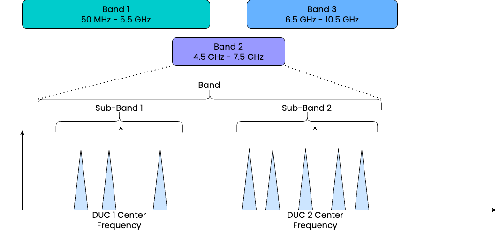

# OPX1000 Front End Modules (FEMs)

## QUA & Config changes compared to OPX+

Using the OPX1000 requires minimal changes to QUA and the config relative to the OPX+: 

* Changes in the config are needed to define the FEMs and their parameters, as described in this page
    * Example configs:
        * [LF-FEM](https://github.com/qua-platform/qua-libs/blob/main/Quantum-Control-Applications/Superconducting/Single-Flux-Tunable-Transmon/configuration_with_lf_fem.py)
        * [LF-FEM + Octaves](https://github.com/qua-platform/qua-libs/blob/main/Quantum-Control-Applications/Superconducting/Single-Flux-Tunable-Transmon/configuration_with_lf_fem_and_octave.py)
        * [LF-FEM + MW-FEM](https://github.com/qua-platform/qua-libs/blob/main/Quantum-Control-Applications/Superconducting/Single-Flux-Tunable-Transmon/configuration_with_lf_fem_and_mw_fem.py)

* No changes to the QUA programs are required relative to OPX+; besides the following for MW-FEM:
    * When streaming raw ADC data with the MW-FEM, the results are complex and of the form `I+jQ`. This requires doing either one of the following:
        * Modify the Python analysis part to treat a complex input.
          * Add `.real()` and `.image()` to the stream processing pipeline and stream the I and Q results separately, in which case the Python analysis part will remain unchanged.

## Low Frequency FEM (LF-FEM)
The LF-FEM module features 8 analog outputs at a sampling rate of 2 GSa/s, 2 analog inputs at a sampling rate of 2 GSa/s, 
and 8 digital outputs at a sampling rate of 1 GSa/s.
For more information about the panel and the connectors, see [OPX1000 Hardware](../Hardware/OPX1000_hardware.md).

### Sampling Rate
The DACs and ADCs of the LF-FEM always operate at 2 GSa/s. The Pulse Processor Unit (PPU) can be set to operate at 1 GSa/s,
or 2 GSa/s, by setting the config field `sampling_rate` of an output/input port to be either `1e9` or `2e9`:

* When the output port is set to `1e9`, which is the default value, the samples are generated at 1 GSa/s, and the PPU upsamples the output from 1 GSa/s to 2 GSa/s at which the DACs operate. This is controlled by an additional field `upsampling_mode`:
    - `mw` - In this mode, the upsampling is done by passing the 1 GSa/s samples through a 14-tap Dolph-Chebyshev filter, which is optimized to reduce spurs and produce clean MW signals. This is the recommended mode whenever the output is expected to have an intermediate frequency larger than 100 MHz.
    - `pulse` - In this mode, the upsampling is done by doubling the 1 GSa/s samples (essentially, a 0-order interpolation filter), which produces a clean step response. This is the recommended mode whenever the output is **not** expected to have an intermediate frequency.
* When the output port is set to `2e9`, the samples are generated at 2 GSa/s and the PPU passes them directly to the DACs.

This has the following implications: 

* Any element using an output port set to `1e9` will be limited to a frequency of 500 MHz, and the waveforms' sampling rate is limited to `1e9`.
* Any measurement done on an input port set to `1e9` will produce an ADC stream at `1e9`, and the demodulation will be limited to 500 MHz.
* Any element using an output port set to `2e9` will consume double the number of cores.

!!! Note
    If an element is using output ports set to `1e9`, and input ports set to `2e9`, it will also consume double the 
    number of cores.

### Output Mode
The analog outputs can operate in one of two modes, set in the config at the output port using the field `output_mode`:

* `direct` - The output range is between -0.5 V and 0.5 V.
* `amplified` - The output range is between -2.5 V and 2.5 V. This mode does not amplify your waveform values; it merely allows higher amplitudes to be set. The hardware filters are also optimized for a cleaner step response.

!!! Note
    The `direct` mode is optimized for modulated signals and is designed to achieve high SFDR, but it results in an output impedance of 35 Ω.
    Despite being 35 Ω, the specification is given for a 50 Ω matched load.
    Connecting to a 50 Ω matched line will produce the exact applied output voltage without distortion, but connecting it to a High-Z load will not yield the expected doubling of the applied voltage at 50 Ω.
    The `amplified` mode is optimized for improved step response characteristics and is 50 Ω matched. 

### Frequency Range

The usable output bandwidth depends on the output mode:

* **Direct mode** (1 Vpp): DC – 750 MHz
* **Amplified mode** (5 Vpp): DC – 330 MHz

## Microwave FEM (MW-FEM)
The MW-FEM module features 8 analog outputs at a quadrature sampling rate of 1 GSa/s, covering **50 MHz to 10.5 GHz**, which are digitally upconverted to
MW frequencies, 2 analog inputs at a sampling rate of 1 GSa/s accepting signals from **2 to 10.5 GHz**, and 8 digital outputs at a sampling rate of 1 GSa/s.
For more information about the panel and the connectors, see [OPX1000 Hardware](../Hardware/OPX1000_hardware.md).

!!! Note
    The quadrature sampling rate for the MW output ports defines the rate at which samples are sent from the PPU to the
    DACs, per quadrature. This is then being digitally upconverted to GHz frequencies.

### Reset Upconverter and Downconverter phase

The upconverter and downconverter frequencies are generated digitally; therefore, their phases can be reset from QUA.
This is useful for 2-qubit gates, which rely on the absolute lab phase of pulses, such as FSIM in this [Google paper](https://arxiv.org/pdf/2101.08870). It can also be used for debugging when viewing the pulses on the scope.
Resetting the phase is achieved using the command {{f("qm.qua.reset_global_phase")}}, which resets the phase of all upconverters, downconverters & intermediate frequencies in the program and is further explained in [this section](phase_and_frame.md#global-phase).

### Bands
Each analog port must specify the `band` at which it operates in the config; the supported bands are:

* `1`: 50 MHz - 5.5 GHz
* `2`: 4.5 GHz - 7.5 GHz
* `3`: 6.5 GHz - 10.5 GHz

The different bands partially overlap to provide greater flexibility in frequency allocation.
Since each output port is equipped with two Digital Upconverters (DUCs), it is possible to have multiple carriers within a band, creating "sub-bands" of about 800 MHz around the center frequency of each DUC. This allows simultaneous transmission of signals in two distinct sub-bands within a single band, effectively increasing the usable bandwidth per port.




!!! Note

    `band` is a port parameter, and pulses played from a certain port are limited to the chosen band.

In addition, the following pairs of analog ports are coupled:

* Out 1 & In 1
* Out 2 & Out 3
* Out 4 & Out 5
* Out 6 & Out 7
* Out 8 & In 2

Coupled ports must be in the same band, or in bands `1` and `3`.
In other words, both coupled ports must be configured to the same band (both in `1` or `2` or `3`), or one port in band `1` and the other in band `3`. Other band combinations are not supported.

!!! Note

    Band 2 is slower (delayed) by 20 ns compared to Bands 1 & 3.

### Output Impedance

The MW-FEM analog outputs are 50 Ω matched. The digital outputs are High-Z.

### Upconverters and Downconverters
Each analog output port must define either an `upconverter_frequency` field with a frequency in the port's band, or 
a `upconverters` field, with up to 2 upconverters per port:

```python
'upconverters': {
    1: {'frequency': 5e9},
    2: {'frequency': 6e9},
}
```

!!! Note
    The settable frequency range per band is:

    * Band 1: 0 – 5.5 GHz
    * Band 2: 4.5 – 7.5 GHz
    * Band 3: 6.5 – 11 GHz

    Values outside the band's specified range (see [Bands](#bands) above) will not meet the performance specification.

In the elements `MWInput` field, the user can set the `upconverter` field; the default is 1.

Each analog input port must define a `downconverter_frequency` field with a frequency in the port's band.
Starting from {{ requirement("QOP","3.7") }}, MW-FEM analog inputs also support the `lo_mode` field:

* `auto` - the default. The downconversion LO is enabled automatically before a measurement and disabled when no measurement is active, including between programs. This changes the default behavior from earlier releases, where the LO remained enabled whenever the QM was open.
* `always_on` - the downconversion LO remains enabled whenever the QM is open. This preserves the earlier default behavior.

```python
"analog_inputs": {
    1: {"band": 2, "downconverter_frequency": 5e9, "lo_mode": "auto"},
    2: {"band": 2, "downconverter_frequency": 5.1e9, "lo_mode": "always_on"},
}
```

!!! Note
    In `auto` mode, the ADC trace includes a short 5 MHz ringing transient. This is only an artifact on the ADC trace and not an output signal from the MW-FEM.

!!! Note
    The IQ demodulation math for MW-FEM — including dual demodulation and the Q-sign convention — follows the same principles as for OPX+ with IQ mixers. See [Demodulation and Measurement](demod.md) for details.

### Optimized Readout

For achieving the highest readout SNR, it is recommended to perform the readout by using the following channel combinations:

* Playing from Output 1 & Reading from Input 2
* Playing from Output 8 & Reading from Input 1

If using both inputs, ensure the downconverters' frequencies differ by at least 10 MHz.

!!! Note
    It is not possible to measure intermediate frequencies which are `<= |5| MHz`.

### Output Power

The analog output power is defined using the field `full_scale_power_dbm`.
Starting from {{ requirement("QOP","3.7") }}, it can be set between `-11` and `18` dBm with a 1 dB granularity.
In earlier QOP 3.x releases, the upper limit is `16` dBm.
Note that output power above `16` dBm is not guaranteed across the entire frequency range.
This will set the power delivered to a 50 Ω load when the waveform is set to full scale (`{-1, 1}`). 
The amplitude is linear in voltage, not power. For example, `full_scale_power_dbm = 10 dBm` and `wf_amplitude=0.1` outputs (to 50 Ohm) `100 mV`, thus keeping
the same `full_scale_power_dbm` value and setting `wf_amplitude=0.2` outputs (to 50 Ohm) `200 mV`.
Therefore, for a given waveform, its voltage-shape should be identical between the LF-FEMs and the MW-FEMs (and OPX+) up to a gain factor.

!!! Note
    For best analog performance, it is recommended to set `full_scale_power_dbm` to a value between 1 and 10 dBm.
    This will produce the best SNR and SFDR.
    Going above 10 dBm will start to degrade the SFDR, while going below 1 dBm will degrade the SNR.

!!! Tip "Optimizing output power in an experimental setup"
    When connecting the MW-FEM to an experimental setup, apply the same SNR/SFDR principle to protect the device
    from unnecessary noise exposure: **maximize the waveform amplitude while minimizing `full_scale_power_dbm`**.

    This keeps the digital-to-analog converter operating near full scale, where its signal-to-noise ratio is highest,
    and limits the analog output power to only what the experiment requires.

    If this approach drives `full_scale_power_dbm` below 1 dBm, consider adding external room-temperature
    attenuators instead of further reducing the full-scale power, so the DAC stays within its optimal operating range.

    When a single output port carries multiple frequencies — whether from multiple upconverters, multiple
    intermediate-frequency oscillators within a single upconverter, or both — the rule of thumb becomes:
    maximize the **sum** of the waveform amplitudes across all frequencies on that port while minimizing
    `full_scale_power_dbm`.

!!! Note
    To calculate the amplitude-voltage that will be seen on a scope set to 50 Ω, first convert the power to voltage:

    \begin{eqnarray}
    x_{mw} = 10^{\frac{x_{dbm}}{10}} \\
    x_v = \sqrt{\frac{2 \cdot 50 \cdot x_{mw}}{1000}}
    \end{eqnarray}

    Where $x_{dbm}$ is the value written in the config. This is then multiplied by the waveform amplitude and any
    real-time modification done in QUA.

    For example, given `full_scale_power_dbm = 10 dBm`, leads to x_{mw} = 10 and x_v = \sqrt{\frac{2 \cdot 50 \cdot 10}{1000}} = 1 (Volt)
