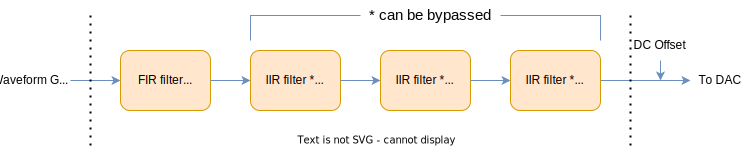
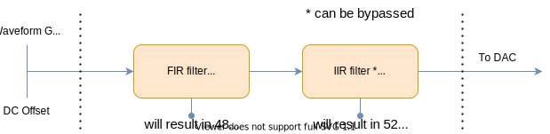

# Output Filter


!!! Note
    The output filters exist for both the OPX and the OPX+, but they behave differently.
    Some sections on this page are marked with {{ requirement("QOP", "1") }} or {{ requirement("QOP", "2") }}, please make sure to check the one corresponding to your QOP

Each analog output port of the OPX/OPX+ is outfitted with a digital filter, which is applied before the DAC.
This feature allows mitigation of the channel response between the DAC and the pulse destination.
Using the output filter, we can attend to the unwanted effects of the different electrical components of the setup, e.g.,
mixers, amplifiers, bias-tees, etc., and do so without altering our waveforms. Furthermore, multiple waveforms can be
played continuously with the filter operating on them as a single pulse.
Once the filter is calibrated, we are free to design pulses without considering the channel setup,
allowing for a more convenient workflow and seamless transfer of pulses between setups.

!!! important
    {{ requirement("QOP", "1") }} Adding a filter to any port will delay **all** analog pulses coming out from all ports. The delay will be 12 cycles (48 ns) if only FIR
    filters are used. If IIR filters are used, the delay would be 13 cycles (52 ns). See more on the
    [Delay Consequences](#delay-consequences) below.

!!! important
    {{ requirement("QOP", "2") }} Adding a filter to any port will delay **all** analog pulses coming out from all ports. The delay will be 11 cycles (44 ns) if only feed-forward
    taps are used. If feedback taps are used, the delay would be 12 cycles (48 ns) for a single tap, 15 cycles (60 ns) for two taps and 18 cycles (72 ns) for three taps.
    See [Delay Consequences](#delay-consequences) below for more details.

## Overview of the Filter Operation

A general digital filter with input $x[n]$ and output $y[n]$ implements the following equation

$$
y[n] = \sum_{m=1}^M a_m y[n-m] + \sum_{k=0}^K b_k x[n-k].
$$

Where $\{a_m\}_{m=1}^M$ is the set of feedback taps of the filter, and $\{b_k\}_{k=0}^K$ is the
set of feedforward taps. The number of feedback taps, $M$, corresponds to the number of poles of the system;
similarly, the maximum delay of the input $x[n]$, $K$, corresponds to the number of zeros of the system.

In our case, $x[n]$ and $y[n]$ are the waveform and the output of the OPX, respectively, at timestamp `n`.

!!! Note
    In the field of Digital Signal Processing (DSP), a *tap* is simply a filter coefficient.

In the frequency domain, the output/input relation is given by the filter's transfer function.

$$
H(e^{j\theta}) = \frac{Y(e^{j\theta})}{X(e^{j\theta})} = \frac{\sum_{k=0}^K b_k e^{-jk\theta}}{1 - \sum_{m=1}^M a_m e^{-jm\theta}}
$$

By meticulously choosing the filter taps, we can set the frequency response to compensate for undesirable effects
of the channel. The choice of taps is left to the user to allow maximum flexibility.

!!! Note
    A filter consisting of only feed-forward taps is called a finite impulse response (FIR) filter. If feedback taps
    are used, the filter is called an infinite impulse response (IIR) filter.

!!! Note
    The feedforward taps can be multiplied by some arbitrary gain, reducing the magnitude of $H(\theta)$, while retaining its shape.
    This allows a simple method for gain reduction, which can later be compensated using an analog amplifier.

!!! Note
    It is possible to delay the output by `x` ns by increasing the indices of the feedforward taps by `x`
    $b_k \rightarrow b_{k+x}$.

[comment]: <> (    It is also possible to use the filters to add delays much smaller than 1 ns, check the)
[comment]: <> (    [GitHub Repository]&#40;https://docs.qualang.io/libs/examples/advanced-topics/IIR-FIR/&#41; for examples.)

## Hardware Implementation

Choose your relevant hardware:

=== "OPX+"
    
    {{ requirement("QOP", "2") }}

    The OPX+ output filter consists of one FIR filter with varying length (up to 44 taps), as will be elaborated later, and 3 IIR filters, each with a single feedback tap.
    The filters are cascaded sequentially as shown in the following diagram, such that the output of one filter is the input of the next one.
    Note that the filters are applied after the [Crosstalk Correction Matrix](../Guides/features.md/#crosstalk-correction-matrix).

    

    The filter taps can be configured at the OPX configuration file, with a different configuration applied to each analog output in each controller.
    To configure, set `feedforward` and `feedback` under `filter` in the `analog_outputs` field:

    ```python
    'controllers': {
            'con1': {
                'analog_outputs': {
                    1: {'offset': 0, "filter": {'feedforward': signal.windows.hann(25) * 0.1, 'feedback':[0.5, -0.3]}},
                },
    ```

    To disable a filter, we simply omit it from the configuration or set it to an empty list in the following way:

    ```python
    'controllers': {
            'con1': {
                'analog_outputs': {
                    1: {'offset': 0, "filter": {'feedforward': [], 'feedback':[]}},
                },
    ```

    By setting the taps, the filter is automatically configured to one of the following modes:

     - Bypass mode --- disables the filter and sets its output to be its input.
     - FIR mode --- supports $M = 0$ and $K = 44$.
     - IIR mode --- supports $M = 1, K=37$, $M=2, K = 30$ and $M=3, K = 23$.

    !!! Note

        The relation between the configured feedback taps and the aforementioned coefficients is given by convolution.

    The filter's output range is limited to its input range, which is [-0.5, 0.5).
    If the output exceeds this range, it is clipped to the nearest allowed value according to its sign.

    In order to avoid this saturation, we impose the following limitations on the values of the filter taps:

     - all feedforward taps are limited to the range (-2,2)
     - all feedback taps are limited to the range (-1,1)

    Additionally, we recommended that the absolute gain of the feedforward taps, defined to be $\sum_{k=0}^K |b_k|$, be below $1$.


=== "OPX"
    
    {{ requirement("QOP", "1") }}

    The OPX output filter consists of one FIR filter with a varying length, as will be elaborated later, and one IIR filter with up to two taps.
    The signal flow is as shown in the image below:

    

    The filter taps can be configured at the OPX configuration file, with a different configuration applied to each analog output in each controller.
    To configure, set `feedforward` and `feedback` under `filter` in the `analog_outputs` field:

    ```python
    'controllers': {
            'con1': {
                'analog_outputs': {
                    1: {'offset': 0, "filter": {'feedforward': signal.windows.hann(25) * 0.1, 'feedback':[0.5, -0.3]}},
                },
    ```

    To disable a filter, we simply omit it from the configuration or set it to an empty list in the following way:

    ```python
    'controllers': {
            'con1': {
                'analog_outputs': {
                    1: {'offset': 0, "filter": {'feedforward': [], 'feedback':[]}},
                },
    ```

    By setting the taps, the filter is automatically configured to one of the following modes:

     - Bypass mode --- disables the filter and sets its output to be its input.
     - FIR mode --- supports $M = 0$ and $K = 39$.
     - IIR mode --- supports $M = 2$ and $K = 24$.

    The filter's output range is limited to its input range, which is [-0.5, 0.5).
    If the output exceeds this range, it is clipped to the nearest allowed value according to its sign.

    In order to avoid this saturation, we impose the following limitations on the values of the filter taps:

     - all feedforward taps are limited to the range [-1,1]
     - the first feedback tap is limited to the range (-2,2)
     - the second feedback tap is limited to the range (-1,1)

    Additionally, we recommended the following guidelines:

     - Set the feedback taps such that the received filter is stable. A simple method to verify this is to check that the roots
       of the polynomial $p(z) = z^M + \sum_{m=1}^M a_m z^{M-m}$ are inside the unit circle, i.e., have a magnitude of less than $1$.
     - Set the absolute gain of the feedforward taps, defined to be $\sum_{k=0}^K |b_k|$, to be below $1$.

## Delay Consequences

As emphasized above, adding a filter to **any port** will delay **all** analog pulses coming out from **all** ports and will also delay feedback operations.

For advance use-cases, it is possible to remove the filter-related latencies from analog ports that are not filtered. This will disable the temporal alignment between the filtered and the non-filtered ports.
When using the [compilation flag](features.md#compilation-options) `disable-filtered-ports-alignment`,
the ports which are filtered will be delayed relative to the non-filtered ports according to each port's filter configuration.

The delay values are:

- {{ requirement("QOP", "1") }} - 12 cycles (48 ns) if only FIR filters are used and 13 cycles (52 ns) if IIR filters are used.
- {{ requirement("QOP", "2") }} - 11 cycles (44 ns) if only FIR filters are used, 12 cycles (48 ns) if a single IIR filter is used, 15 cycles (60 ns) if two IIR filters are used and 18 cycles (72 ns) if all three IIR filters are used.

We emphasize a few important consequences:

- The delayed readout pulse results in a longer [time-of-flight](demod.md#timing-of-the-measurement-operation). By default, The delay will be **automatically and implicitly** added to the time of flight value in the configuration. This compensation will re-ensure maximal overlap between the incoming readout pulse and the ADC acquiring window. Using ['disable-filtered-ports-alignment' flag](features.md#compilation-options) will disable the automatic adjustment.
- In order to keep the digital pulses in sync with the analog pulses, the [digital delay parameter](../Introduction/qua_overview.md#configuring-a-digital-pulse) is **automatically** updated accordingly. Using ['disable-filtered-ports-alignment' flag](features.md#compilation-options) will disable the automatic adjustment.
- The delay associated with the IIR filters will be the full value stated above even when the FIR filter is not configured.
- When performing demodulation, the delayed readout pulse will change the phase of the demodulated signal. This can be compensated by rotating the integration weights by $\phi=-2\pi*f_{IF}*\Delta t$, where $f_{IF}$ is the intermediate frequency of the qubit and $\Delta t$ is the delay time. More information about rotating the IQ plane can be found [here](demod.md#rotating-the-iq-plane).

In addition, the filters will also introduce a slight group delay **to that port**. This can be compensated by
applying the appropriate filters on other ports. Scripts for finding filter taps can be found in our
[GitHub Repository](https://docs.qualang.io/libs/examples/advanced-topics/IIR-FIR/).
