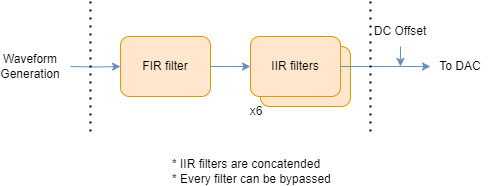
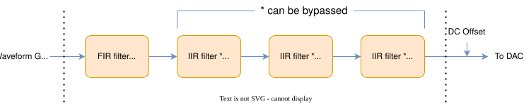
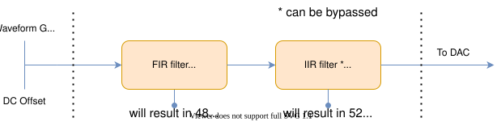

# Output Filter

Each analog output port of the OPX is outfitted with a digital filter, which is applied digitally before the analog output.
This feature allows mitigation of the channel response between the output and the pulse destination.
Using the output filter, we can attend to the unwanted effects of the different electrical components of the setup, e.g.,
mixers, amplifiers, bias-tees, etc., and do so without altering our waveforms. Furthermore, multiple waveforms can be
played continuously with the filter operating on them as a single pulse.
Once the filter is calibrated, we are free to design pulses without considering the channel setup,
allowing for a more convenient workflow and seamless transfer of pulses between setups.

!!! important
    Adding a filter to any port will delay **all** analog pulses coming out from all ports. See more on the [Delay Consequences](#delay-consequences) below.

## Overview of the Filters Operation

A general digital filter with input $x[n]$ and output $y[n]$ implements the following equation

$$
y[n] = \sum_{m=1}^M a_m y[n-m] + \sum_{k=0}^K b_k x[n-k].
$$

Where $\{a_m\}_{m=1}^M$ is the set of feedback taps of the filter, and $\{b_k\}_{k=0}^K$ is the
set of feedforward taps. The number of feedback taps, $M$, corresponds to the number of poles of the system;
similarly, the number of feedforward taps is $K+1$, which corresponds to the number of zeros of the system $K$.

In our case, $x[n]$ and $y[n]$ are the waveform and the output of the OPX, respectively, at timestamp `n`.

!!! Note
    In the field of Digital Signal Processing (DSP), a *tap* is simply a filter coefficient.

In the frequency domain, the output/input relation is given by the filter's transfer function.

$$
H(e^{j\theta}) = \frac{Y(e^{j\theta})}{X(e^{j\theta})} = \frac{\sum_{k=0}^K b_k e^{-jk\theta}}{1 - \sum_{m=1}^M a_m e^{-jm\theta}}
$$

By choosing the right filter taps, we can set the frequency response to compensate for undesirable effects
of the channel.
    
!!! Note
    A filter consisting of only feed-forward taps is called a finite impulse response (FIR) filter. If feedback taps
    are used, the filter is called an infinite impulse response (IIR) filter.

!!! Note
    The feedforward taps can be multiplied by some arbitrary gain, reducing the magnitude of $H(\theta)$, while retaining its shape.
    This allows a simple method for gain reduction, which can later be compensated using an analog amplifier.

### Common IIR Filters

The most common filters are the exponential compensation filters and high-pass compensation filters.

**Exponential Compensation Filter**:
The exponential compensation filter is used to compensate for an exponential decaying over/undershoot of the signal, which can occur due to passing the signal through the DC port of a bias-tee, or due to the signal passing through many other electronic components (Attenuators, parasitic capacitance, on-chip responses, etc.).
The distortion is given by the following step response: 

$$s(t) = 1 + Ae^{-\frac{t}{\tau}}$$

Where A is the amplitude and $\tau$ is the time constant of the filter.

**High-Pass Compensation Filter**:
The high-pass compensation filter is used to compensate for the low-frequency cutoff of the signal, which can occur due to passing the signal through the AC port of a bias-tee.
The distortion is given by the following step response:

$$s(t) = e^{-\frac{t}{\tau_\text{hp}}}$$

Where $\tau_\text{hp}$ is the time constant of the filter.

!!! Note
    The high-pass compensation filter is inherently **not** a BIBO filter (Bounded Input, Bounded Output).
    It would lead to an overflow eventually unless the signal is "net-zero" (i.e., the average of the signal is zero).

**Multiple Filters**:

Multiple exponential and a highpass response can be modeled by the following step response:

$$s(t) = e^{-\frac{t}{\tau_\text{hp}}} + A_1e^{-\frac{t}{\tau_1}} + A_2e^{-\frac{t}{\tau_2}} + ...$$

Note that ${\tau_\text{hp}}$ can be infinity, in which the first element would just be equal to 1. In this case, it is simpler to fit to

$$s(t) = 1 + A_1e^{-\frac{t}{\tau_1}} + A_2e^{-\frac{t}{\tau_2}} + ...$$

## Using The Filters

=== "OPX1000"

    {{ requirement("QOP", "3.3") }}
    
    The OPX1000 output filter consists of one FIR filter with 48 taps, and 6 IIR filters, each with a single feedback tap.
    The IIR filters are not identical and there are two flavours of IIR filters, 5 long IIR filters and 1 short IIR filter.
    The short IIR filter is optimized for time constants from $\tau_\text{min}=0 \, ns$ to $\tau_\text{max}=300 \, ns$.
    The long IIR filters are optimized for time constants from $\tau_\text{min}=50 \, ns$ to $\tau_\text{max}=\infty \, ns$.
    
    The min and max time constants are not hard limits, and simply indicate the range in which the filters are most effective.
    The short filter is taken for the lowest time constant below 300 ns.
    
    The filters are cascaded sequentially, such that the output of one filter is the input of the next one.
    Note that the filters are applied after the [Crosstalk Correction Matrix](../Guides/features.md/#crosstalk-correction-matrix) and before the DC Offset.
    
    

    !!! Note
        The cascaded implementation of the exponential filters means that the actual coefficients of the filters is convolved.
    
    The filter for every output channel can be configured at the OPX configuration file under `filter` in the `analog_outputs` field.

    * To configure the FIR filter, set the taps directly in the `feedforward` field. Feedforward taps are limited to the range (-2,2), but this can be scaled automatically by the IIR filters.
    * To configure the IIR filters, set the filter parameters in the `exponential` field.
        * The `exponential` field accepts a list of tuples of the form `[(A1, tau1), ...]`, where `A` is the amplitude and `tau` is the time constant (see above).
    
    ```python
    'controllers': {
            'con1': {
                'analog_outputs': {
                    '1': {
                        ...,
                        'filter': {
                            'feedforward': [0.8, 0.3],
                            'exponential': [(A1, tau1), (A2, tau2), ...]
                        },
                    },
                },
    ```
    
    To disable a filter, we simply omit it from the configuration or set it to an empty list/None in the following way:
    
    ```python
    'controllers': {
            'con1': {
                'analog_outputs': {
                    1: {'offset': 0, "filter": {'feedforward': [], 'exponential':[]}},
                },
    ```
    
    !!! Note
        
        It is relatively easy to design a filter which will cause the output to exceed the maximum allowed output range of the OPX1000.
        If the output is outside the allowed range, it is clipped to the nearest allowed value according to its sign.
        We recommended that the absolute gain of the feedforward taps, defined as $\sum_{k=0}^K |b_k|$, will be below $1$.

=== "OPX+"
    
    {{ requirement("QOP", "2") }}

    The OPX+ output filter consists of one FIR filter with varying length (up to 44 taps), as will be elaborated later, and 3 IIR filters, each with a single feedback tap.
    The filters are cascaded sequentially as shown in the following diagram, such that the output of one filter is the input of the next one.
    Note that the filters are applied after the [Crosstalk Correction Matrix](../Guides/features.md/#crosstalk-correction-matrix).

    

    The filter for every output channel can be configured at the OPX configuration file under `filter` in the `analog_outputs` field.
    To configure, set `feedforward` and `feedback` under `filter` in the `analog_outputs` field:

    ```python
    'controllers': {
            'con1': {
                'analog_outputs': {
                    1: {'offset': 0, "filter": {'feedforward': signal.windows.hann(25) * 0.1, 'feedback':[0.5, -0.3]}},
                },
    ```

    To disable a filter, we simply omit it from the configuration or set it to an empty list in the following way:

    ```python
    'controllers': {
            'con1': {
                'analog_outputs': {
                    1: {'offset': 0, "filter": {'feedforward': [], 'feedback':[]}},
                },
    ```

    By setting the taps, the filter is automatically configured to one of the following modes:

     - Bypass mode --- disables the filter and sets its output to be its input.
     - FIR mode --- supports $M = 0$ and $K = 44$.
     - IIR mode --- supports $M = 1, K=37$, $M=2, K = 30$ and $M=3, K = 23$.

    !!! Note
        The relation between the configured feedback taps and the aforementioned coefficients is given by convolution.

    In order to find the IIR filter taps coefficient, we recommend to use the [digital filter](https://github.com/qua-platform/py-qua-tools/tree/main/qualang_tools/digital_filters) tool.

    The filter's output range is limited to its input range, which is [-0.5, 0.5).
    If the output exceeds this range, it is clipped to the nearest allowed value according to its sign.

    In order to avoid this saturation, we impose the following limitations on the values of the filter taps:

     - all feedforward taps are limited to the range (-2,2)
     - all feedback taps are limited to the range (-1,1)

    Additionally, we recommended that the absolute gain of the feedforward taps, defined as $\sum_{k=0}^K |b_k|$, will be below $1$.


=== "OPX"
    
    {{ requirement("QOP", "1") }}

    The OPX output filter consists of one FIR filter with a varying length, as will be elaborated later, and one IIR filter with up to two taps.
    The signal flow is as shown in the image below:

    

    The filter taps can be configured at the OPX configuration file, with a different configuration applied to each analog output in each controller.
    To configure, set `feedforward` and `feedback` under `filter` in the `analog_outputs` field:

    ```python
    'controllers': {
            'con1': {
                'analog_outputs': {
                    1: {'offset': 0, "filter": {'feedforward': signal.windows.hann(25) * 0.1, 'feedback':[0.5, -0.3]}},
                },
    ```

    To disable a filter, we simply omit it from the configuration or set it to an empty list in the following way:

    ```python
    'controllers': {
            'con1': {
                'analog_outputs': {
                    1: {'offset': 0, "filter": {'feedforward': [], 'feedback':[]}},
                },
    ```

    By setting the taps, the filter is automatically configured to one of the following modes:

     - Bypass mode --- disables the filter and sets its output to be its input.
     - FIR mode --- supports $M = 0$ and $K = 39$.
     - IIR mode --- supports $M = 2$ and $K = 24$.

    In order to find the IIR filter taps coefficient, we recommend to use the [digital filter](https://github.com/qua-platform/py-qua-tools/tree/main/qualang_tools/digital_filters) tool.

    The filter's output range is limited to its input range, which is [-0.5, 0.5).
    If the output exceeds this range, it is clipped to the nearest allowed value according to its sign.

    In order to avoid this saturation, we impose the following limitations on the values of the filter taps:

     - all feedforward taps are limited to the range [-1,1]
     - the first feedback tap is limited to the range (-2,2)
     - the second feedback tap is limited to the range (-1,1)

    Additionally, we recommended the following guidelines:

     - Set the feedback taps such that the received filter is stable. A simple method to verify this is to check that the roots
       of the polynomial $p(z) = z^M + \sum_{m=1}^M a_m z^{M-m}$ are inside the unit circle, i.e., have a magnitude of less than $1$.
     - Set the absolute gain of the feedforward taps, defined to be $\sum_{k=0}^K |b_k|$, to be below $1$.

## Delay Consequences

As emphasized above, adding a filter to **any port** will delay **all** analog pulses coming out from **all** ports and will also delay feedback operations.

For advance use-cases, it is possible to remove the filter-related latencies from analog ports that are not filtered.
This will disable the temporal alignment between the filtered and the non-filtered ports.
When using the [compilation flag](features.md#compilation-options) `disable-filtered-ports-alignment`, the ports which are filtered will be delayed relative to the non-filtered ports according to each port's filter configuration.

=== "OPX1000"

    - FIR Filter: The delay is 8 cycles (32 ns).
    - IIR + FIR Filters: Using any number of IIR filters will add 21 cycles (84 ns) to the delay. Note that this includes the FIR filters, as it is not possible to use the IIR without using the FIR.
                         In addition, there will be an additional delay according to the number of IIR filters used:
        - The latency of the short filter is 9 cycles (36 ns) - It is used if the shortest $\tau$ is below 300 ns.
        - The latency of the long filters is 10, 20, 30, 35, 40 cycles (40, 80, 120, 140, 160 ns) when using 1, 2, 3, 4, 5 filters respectively.
    
    e.g. Using all filters (FIR + 6 IIR) will add a total of 70 cycles (280 ns) to the delay. 

=== "OPX+"
    
    The delay is 11 cycles (44 ns) if only FIR filters are used, 12 cycles (48 ns) if a single IIR filter is used, 15 cycles (60 ns) if two IIR filters are used and 18 cycles (72 ns) if all three IIR filters are used.

=== "OPX"

    The delay is 12 cycles (48 ns) if only FIR filters are used and 13 cycles (52 ns) if IIR filters are used.

!!! Note
    In addition, FIR filters also add a group delay that depends on the specific filter configuration. This delay is not included in the numbers above.

We emphasize a few important consequences:

- The delayed readout pulse results in a longer [time-of-flight](demod.md#timing-of-the-measurement-operation). By default, The delay will be **automatically and implicitly** added to the time of flight value in the configuration. This compensation will re-ensure maximal overlap between the incoming readout pulse and the ADC acquiring window. Using ['disable-filtered-ports-alignment' flag](features.md#compilation-options) will disable the automatic adjustment.
- In order to keep the digital pulses in sync with the analog pulses, the [digital delay parameter](../Introduction/qua_overview.md#configuring-a-digital-pulse) is **automatically** updated accordingly. Using ['disable-filtered-ports-alignment' flag](features.md#compilation-options) will disable the automatic adjustment.
- The delay associated with the IIR filters will be the full value stated above even when the FIR filter is not configured.
- When performing demodulation, the delayed readout pulse will change the phase of the demodulated signal. This can be compensated by rotating the integration weights by $\phi=-2\pi*f_{IF}*\Delta t$, where $f_{IF}$ is the intermediate frequency of the qubit and $\Delta t$ is the delay time. More information about rotating the IQ plane can be found [here](demod.md#rotating-the-iq-plane).
