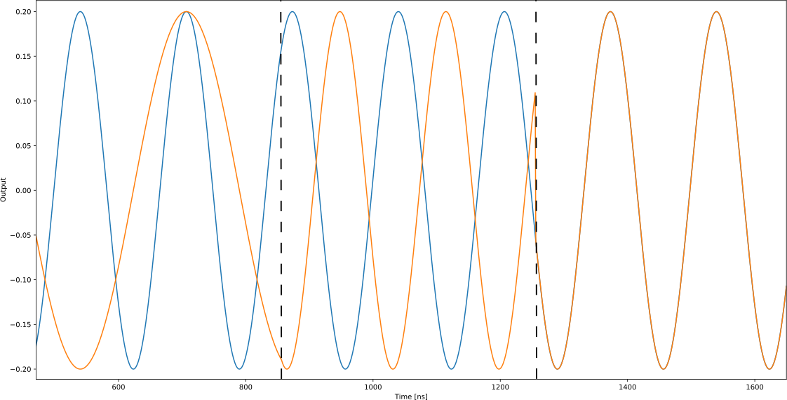
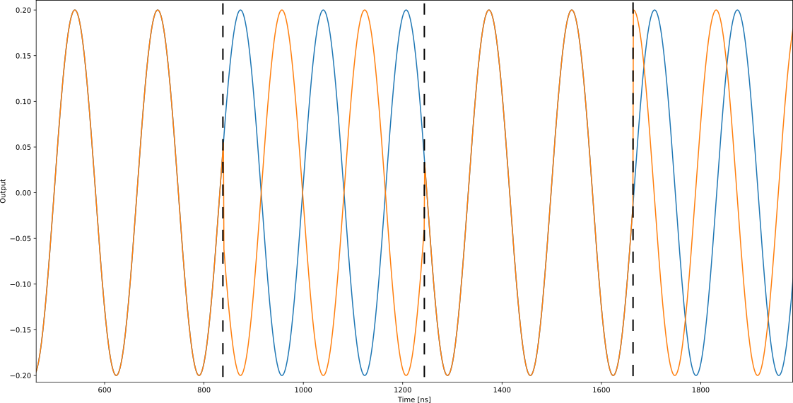

# Phase and Frame in QUA

This page will discuss the concepts of frame and phase, how they affect the OPX's output, and the APIs that
relates to them, namely, the {{f("qm.qua._dsl.reset_frame")}}, {{f("qm.qua._dsl.reset_if_phase")}}, and the {{f("qm.qua._dsl.reset_global_phase")}} commands.

Every time we use the {{f("qm.qua._dsl.play")}} command on a specific element, the output pulse will have a lab (total) phase calculated from several separate contributions:

$$\phi_L = \overbrace{\overbrace{\overbrace{\omega_{UC} \cdot t}^{\mbox{upconveter phase}} + \overbrace{\omega_{IF} \cdot t}^{\mbox{intermediate phase}}}^{\mbox{global phase}} + \overbrace{\phi_F}^{\mbox{frame}}}^{\mbox{lab phase}}$$

$$\phi_L = \phi_{UC} + \phi_{IF} + \phi_F = \phi_G + \phi_F$$

- The global phase associated with the rotating frame of the element, based on its frequency (upconveter frequency + intermediate frequency) and time passed from the beginning of the sequence $t$.
- The frame phase, $\phi_F$, which is the phase within the rotating frame.

!!! Note
    The phase from the upconverter can be zero if there is no upconverter being used. 
    It can come from an external LO source or from the MW-FEM [upconverters](opx1000_fems.md#upconverters-and-downconverters). 

Generally, the OPX ensures that the phase is coherent for all the elements within a program. 
This specifically implies that pulses from different elements with the same frequencies will be phase matched.
This is true even if the frequencies are updated during runtime, for example, using {{f("qm.qua._dsl.update_frequency")}}.

## Global Phase

There are a few ways in which the global phase associated with an element can be changed. Using the command
{{f("qm.qua._dsl.reset_if_phase")}} we effectively define a constant phase $\tilde{\phi} = \tilde{\omega_{IF}} \cdot \tilde{t}$,
where $\tilde{\omega_{IF}}$ and $\tilde{t}$ are the intermediate frequency of the element and the time
in which the command {{f("qm.qua._dsl.reset_if_phase")}} was applied. From that point forward the phase $\tilde{\phi}$
is subtracted from the global phase of the element.

!!! Note
    This means that the intermediate phase after the {{f("qm.qua._dsl.reset_if_phase")}} command will be $\phi_{IF} = \omega_{IF} \cdot t - \tilde{\omega_{IF}} \cdot \tilde{t}$,
    where $\tilde{\omega_{IF}}$ and $\tilde{t}$ are defined according to the last {{f("qm.qua._dsl.reset_if_phase")}} command used in the sequence.
    The same $\tilde{\phi}$ will be subtracted even if the intermediate frequency is later changed. 
    It is not possible to set $\tilde{t}$ back to zero after the {{f("qm.qua._dsl.reset_if_phase")}} command is used.

{{ requirement("QOP", "3") }} {{ requirement("MW") }}
Using {{f("qm.qua._dsl.reset_global_phase")}} would also subtract the phase associated with the MW-FEM upconverter, in addition to the intermediate phase.
For any element which is not using the MW-FEM, {{f("qm.qua._dsl.reset_global_phase")}} is equivalent to {{f("qm.qua._dsl.reset_if_phase")}}

Another command that will change the global phase is {{f("qm.qua._dsl.update_frequency")}}. When using the flag
`keep_phase=True`, the phase of the pulse will be continuous through the frequency change, as can be seen in figure 1 indicated by the first dashed black line. 
The phase continuity results in a change to the global phase, $\phi_G$. 
This change, however, is not tracked similarly to the phase change caused by {{f("qm.qua._dsl.reset_if_phase")}}, so if we update to the frequency with the flag `keep_phase=False` afterward, 
the global phase will be reevaluated from the beginning of the sequence (or the last phase reset), as can be seen in figure 1 indicated by the second dashed black line.

!!! Note
    **Phase behavior of update_frequency**

    By default `keep_phase=False`, in this case the phase of the signal $\omega_{IF}t$ after the frequency has
    been updated will change according to the rule:

    $$
    \omega_1 t_0 \rightarrow \omega_2 (t_0+\Delta t)
    $$

    where $\omega_1$, $\omega_2$ are the frequencies before and after the transition, $\Delta t$
    is the sampling rate and $\rightarrow$ signifies a transition from the sample $t_0$ to the next.

    To maintain a continuous phase through the transition, use `keep_phase=True`. This will update the phase according to the rule:

    $$
    \omega_1 t_0 \rightarrow \omega_1 t_0 + \omega_2 \Delta t.
    $$

<figure markdown>
  
  <figcaption>Fig. 1: The phase behavior when using update_frequency(), with the flag keep_phase = True and keep_phase = False. The black dashed line indicates when update_frequency() was used. The blue signal is the reference signal, and all operations are performed on the orange signal.</figcaption>
</figure>

## Frame Phase

The frame phase is constant in relation to the element's global phase, i.e., the phase in the rotating frame.
At the beginning of a sequence, the frame phase is defined as $\phi_F=0$, and using the commands {{f("qm.qua._dsl.frame_rotation")}}
and {{f("qm.qua._dsl.frame_rotation_2pi")}}, we can control $\phi_F$. The frame phase is separate from the global phase and is
not affected by the element's frequency. Using the command {{f("qm.qua._dsl.reset_frame")}} we set the frame phase back to zero, $\phi_F=0$.

!!! Note
    Resetting the global phase will not reset the frame phase. So if we want to reset the lab phase of an element
    to zero, we need to use both {{f("qm.qua._dsl.reset_global_phase")}} and {{f("qm.qua._dsl.reset_frame")}}.

<figure markdown>
  
  <figcaption>Fig. 2: Simulation of the OPX output showing, a frame_rotation_2pi(0.5, element) - first dashed line, a reset_frame(element) - second dashed line, and reset_if_phase(element) - third dashed line. The blue signal is the reference signal, and all operations are performed on the orange signal.</figcaption>
</figure>

## Further Examples

QUA code examples illustrating these concepts can be found in our [GitHub Repository](https://github.com/qua-platform/qua-libs/tree/main/Tutorials/frame-and-phase-intro)
