# QOP Clock

Here we discuss the different ways to connect, distribute and configure clock to a QOP cluster as well as its characteristics and limitations.
When we want to synchronize two or more OPX modules to one clock or use a clock other than the internal one, we may use an external clock source.
 

## QOP Clocking Scheme

=== "OPX1000"

    During cluster creation, the user designates one of the OPX1000s in it to be the main OPX1000. This OPX1000
    is the one that will distribute the clock and synchronize all other devices in the cluster.
    The main OPX1000 can either use its own internal clock, or it can receieve an external clock.
    Setting the clock to be internal or external is done through the QM-APP exclusively on the cluster level.

    A single OPX1000 can distribute the clock to up to four other systems. For clusters larger than five systems, the OPX1000 chassis must be connected in a tree topology — see the [Connectivity Scheme](../Hardware/OPX1000_installation.md#connectivity-scheme) in the OPX1000 installation guide for the connection details and diagrams.
    
    If octaves are present in the cluster, connect their clock inputs to any OPX1000's clock outputs. If all OPX1000es' clock outputs have been used, and there are still unconnected Octaves, 
    then connect the Octave's clock input to other Octave's clock outputs.

=== "OPX+"

    Starting with QOP 2.4, there are three allowed clock schemes for the QOP. In all of them choosing between internal and external clock is done exclusively via the QM-APP:
    
    1. Setting cluster clock when an OPT is present
    
       2. Setting cluster clock for one Octave & one OPX+ cluster without an OPT
    
       3. Setting the clock for one OPX+ without an OPT
    
    In each of the scenarios a different component is the main clock according to the following drawings, where the top most component is the main clock:
    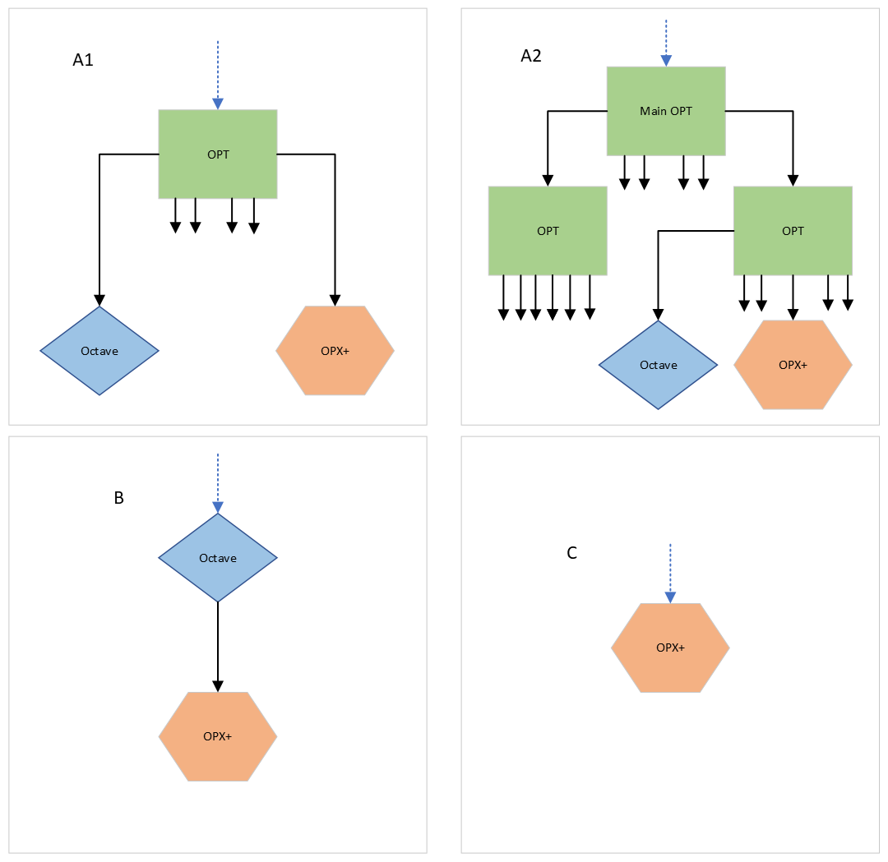
    
    Let's consider each of the scenarios and how to connect the clocks of the QOP
    
    === "Options A1 & A2"
    
        In this case, an OPT is connected to the main OPX+ via a USB cable. All the devices' clocks in the cluster are connected to the OPT.
        When only one OPT is present in a cluster, it can synchronize up to six devices.
        Connect the OPT outputs to the clock in ports on all devices in the cluster.
        In order to synchronize more than six devices, connect another OPT via USB to one of the other OPX+s in the cluster and connect a clock cable from the main OPT output to the external clock input port on the new OPT.
        Then connect the clocks to the cluster devices through the lowest level OPTs outputs.
        If an external clock source is needed, it needs to be connected to the main OPT according to [external clock connection guide](#connecting-external-clock).
        Once the external clock is connected, set the cluster's clock to external through the QM-APP interface according to [Clock setting through the QM-APP guide](#clock-configuration).
    
    === "Option B"
    
        In this case, the QOP cluster consists of one OPX+ and one Octave where the octave supplies the clock to the OPX.
        Connect the clock output from the Octave to the clock input port of the OPX+.
        If an external clock source is needed, it needs to be connected to the Octave according to [external clock connection guide](#connecting-external-clock). 
        Once the external clock is connected, set the cluster's clock to external through the QM-APP interface according to [Clock setting through the QM-APP guide](#clock-configuration).
    
    === "Option C"
    
        In this case, the QOP cluster consists of one OPX+.
        If an external clock source is needed, it is connected to the OPX+ directly according to [external clock connection guide](#connecting-external-clock).
        Once the external clock is connected, set the cluster's clock to external through the QM-APP interface according to [Clock setting through the QM-APP guide](#clock-configuration).

## Connecting External Clock

=== "OPX1000"

    Connect your clock output to the 'Clock in1' or 'Clock in2' ports on the back panel of the main OPX1000
    
    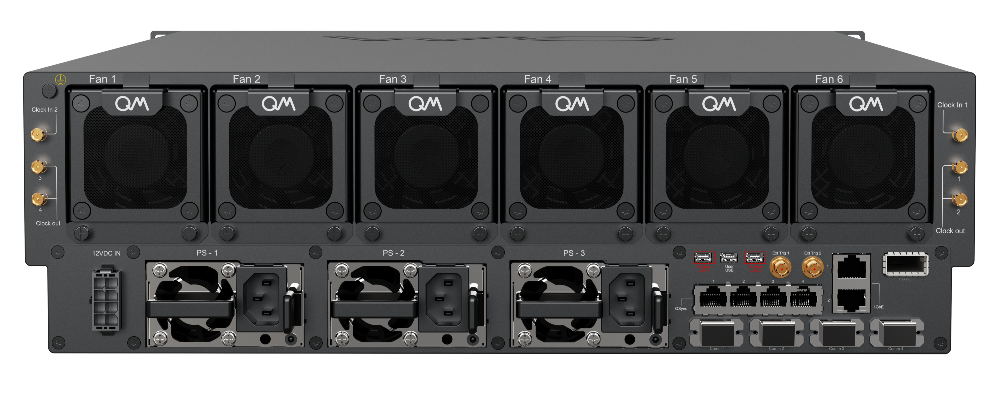
    
    This clock is then distributed to all other systems in the cluster.

    !!! Warning "Clock Input Termination (Chassis Revision E and later)"
        The OPX1000 has two external clock input ports (`Clock in1` and `Clock in2`).
        Only one clock input should be connected to a clock source that is currently transmitting at a time.

        On chassis revision E and later (shipped with 50 Ω SMA terminators on the clock inputs),
        a clock input that is not providing a clock signal **must not be left floating**.
        The inactive input must be either:

        - Terminated with a 50 Ω SMA terminator, or
        - Connected to a clock source that is not currently transmitting, provided that the source still presents an appropriate 50 Ω termination and does not leave the input high-impedance or floating while inactive.

        Failure to do so would cause an increased noise on the outputs.
        This requirement does not apply to earlier chassis revisions (B and C).

=== "OPX+"

    {{ requirement("QOP", "2.0") }}
    
    !!! Note
        This is for a single OPX+, for multiple OPX+es, please see the OPT tab on how to connect your external clock.
    
    Connect your clock output to the 'Clock in' port on the back panel of the OPX+:
    
    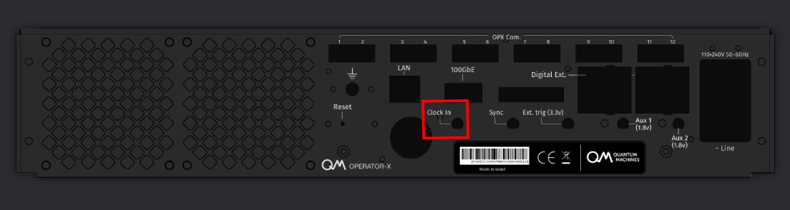

=== "OPX+ & Octave"

    {{ requirement("QOP", "2.0") }}
    
    !!! Note
        This is for a single OPX+ with an Octave and without an OPT.
    
    Connect your clock output to the 'Clock in' port on the back panel of the Octave.
    
    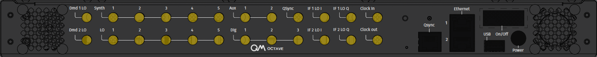

=== "OPT"

    {{ requirement("QOP", "1.0") }} {{ requirement("QOP", "2.0") }} {{ requirement("OPT") }}
    
    Connect your clock output to the 'Clk In' port on the back panel of the OPT.
    
    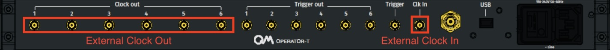

=== "OPX"

    {{ requirement("QOP", "1.0") }}
    
    !!! Note
        This is for a single OPX, for multiple OPXes, please see the OPT tab on how to connect your external clock.
    
    Connect your clock output to the 'External Clock' port on the back panel of the OPX:
    
    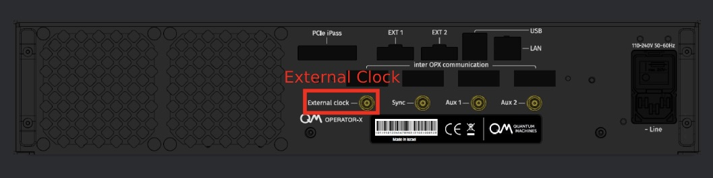
    
    Some OPX back panels are slightly different, the connectivity then is as follows:
    
    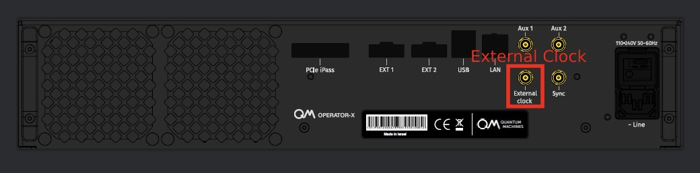
    
    !!! Note
        Some early back panels might have different labels. However, the correct labels are the ones shown on this page.

## External Clock Input Characteristics

=== "OPX1000"

    The OPX1000 accepts an external clock at 10 MHz or 2 GHz. The input is AC coupled; input impedance must be 50 Ω.

    | Frequency | Min    | Recommended Min | Max   |
    |-----------|--------|-----------------|-------|
    | 10 MHz    | −5 dBm | 4 dBm           | 5 dBm |
    | 2 GHz     | −3 dBm | 0 dBm           | 5 dBm |

=== "OPX / OPX+"

    {{ requirement("QOP", "1.X") }} {{ requirement("QOP", "2.X") }}

    The OPX and OPX+ accept an external clock at 10 MHz, 100 MHz, or 1 GHz. The input is AC coupled; input impedance must be 50 Ω.

    | Frequency | Min    | Recommended Min | Max   |
    |-----------|--------|-----------------|-------|
    | 10 MHz    | -5 dBm | 4 dBm           | 6 dBm |
    | 100 MHz   | -5 dBm | 4 dBm           | 6 dBm |
    | 1 GHz     | -3 dBm | 0 dBm           | 6 dBm |

    !!! Note "Octave's External Clock in QOP 2.2.2 and below"
        For the Octave's external clock in QOP 2.2.2 and below please see the [Octave guide](octave.md#setting-the-octaves-clock)

=== "OPT"

    {{ requirement("OPT") }}

    **OPT Clock Input**

    The OPT accepts an external clock at 10 MHz, 100 MHz, or 1 GHz via the 'Clk In' port. The input is AC coupled; input impedance must be 50 Ω.

    | Frequency | Min    | Recommended Min | Max   |
    |-----------|--------|-----------------|-------|
    | 10 MHz    | -5 dBm | 4 dBm           | 6 dBm |
    | 100 MHz   | -5 dBm | 4 dBm           | 6 dBm |
    | 1 GHz     | -3 dBm | 0 dBm           | 6 dBm |

    **OPT Clock Output**

    The OPT distributes clocks across up to six systems. In addition, multiple OPTs can be chained to distribute clocks to more systems.
    It distributes a 1 GHz clock across devices. In the {{ requirement("QOP","1") }}, it also synchronizes the connected systems.

    Let's define what they are and what are the optimal ranges of the for the OPT:

    - Jitter is the timing variations of a set of signal edges from their ideal values. Jitters in clock signals are typically caused by noise or other disturbances in the system. Contributing factors include thermal noise, power supply variations, loading conditions, device noise, and interference from nearby circuits. The OPT output jitter is less than 100fs.
      - Skew is a phenomenon in digital circuits where the same clock signal arrives at different components at different times due to gate or wire signal propagation delay. The instantaneous difference between the readings of any two clocks is called their skew. Skew can be caused by many different things, such as wire-interconnect length, temperature variations, variation in intermediate devices, capacitive coupling, material imperfections, and differences in input capacitance on the clock inputs of devices using the clock. As the clock rate of a circuit increases, timing becomes more critical, and less variation can be tolerated for the circuit to function correctly. The OPT skew between clocks is smaller than 20 ps.

    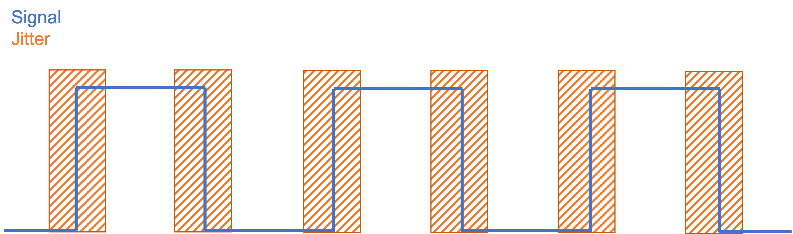

    {{ read_csv('docs/Guides/assets/ExternalClkCharOPTout.csv') | add_indentation(spaces=4) }}

!!! Note
    **Min** is the minimum input level. **Recommended Min** is the threshold for best phase noise performance — operating between Min and Recommended Min is functional but might result in degraded phase noise. **Max** is the absolute maximum rating.

## Clock Configuration

=== "OPX1000"

    === "QOPA 2.x"

        Select the cluster from the sidebar. Navigate to the **Settings** page. Find the **Adjust Clock Preferences** section and click on it. In the expanded menu, choose the desired clock preferences and press **Apply**.

        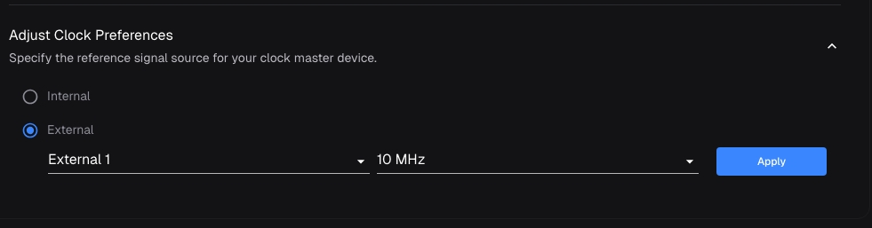

        !!! Note
            Changing the clock frequency will result in a system reboot.

    === "QOPA 1.x"

        Access your OPX1000 Admin Panel through the browser. On the settings page, you can see radio buttons to choose between internal and external clock.

        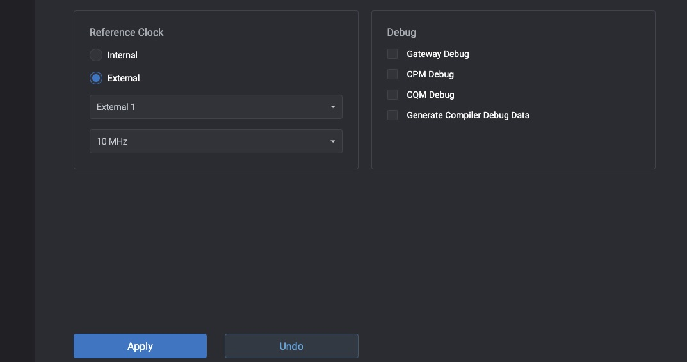

        Choose the clock input where the external clock is connected to and its frequency

        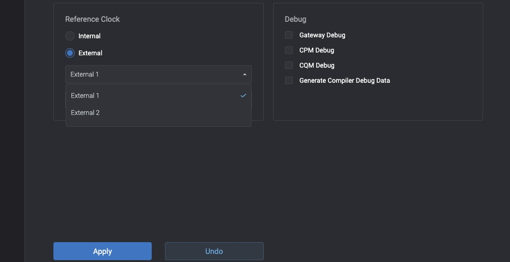

        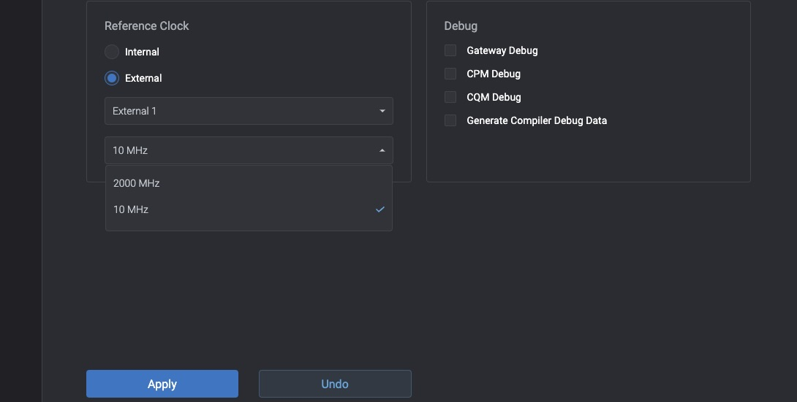

        After the frequency was chosen, click apply and wait for the system to restart with the new clock.

        !!! Note
            Changing the clock frequency will result in a system reboot.

=== "OPX+"

    {{ requirement("QOP", "2.0") }}

    === "QOPA 2.x"

        Select the cluster from the sidebar. Navigate to the **Settings** page. Find the **Adjust Clock Preferences** section and click on it. In the expanded menu, choose the desired clock preferences and press **Apply**.

        

        !!! Note
            Changing the clock frequency will result in a system reboot

    === "QOPA 1.x"

        Access your OPX Admin Panel through the browser. On the settings page, you can see radio buttons to choose between internal and external clock.

        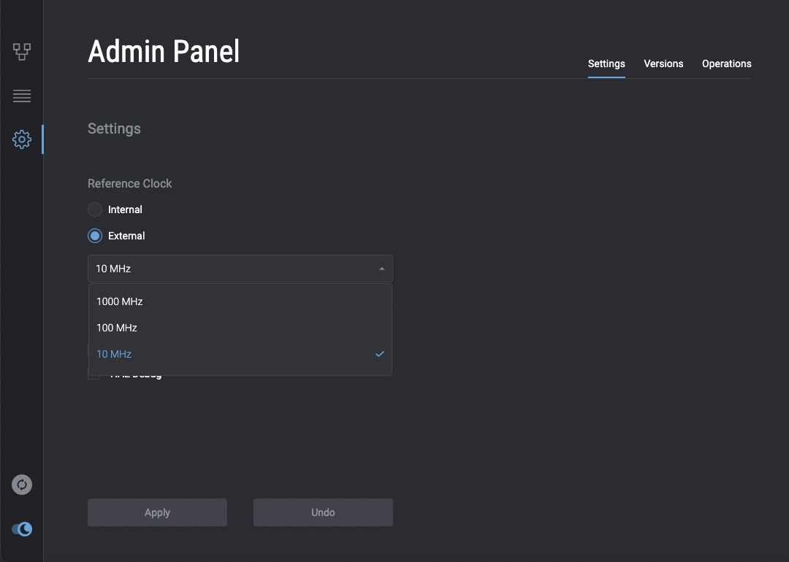

        After the frequency was chosen, click apply and wait for the system to restart with the new clock.

        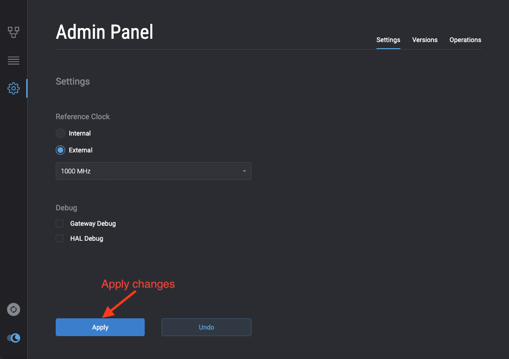

        !!! Note
            Changing the clock frequency will result in a system reboot

=== "OPX"

    {{ requirement("QOP", "1.0") }}

    Log in to your OPX through the QMApp. On the main window you will see all the OPXes in that cluster.
    Press on the settings icon to go into the clock settings.

    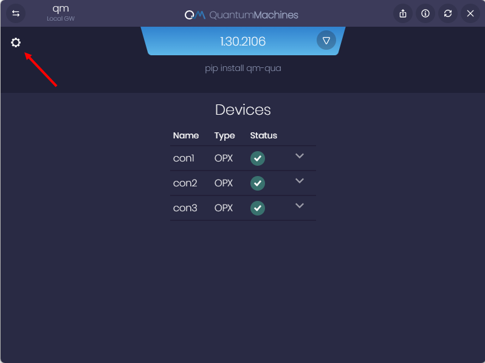

    Pick a clock frequency and press apply. Now you can either restart the OPX for the change to occur immediately or restart later and continue working with the current clock configuration.

    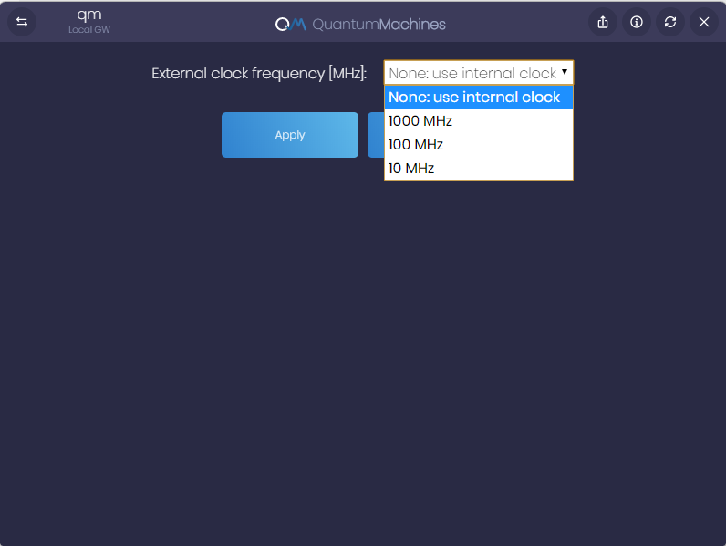

    !!! Note
        Changing clock frequency will result in a system reboot

## Switch between external clock sources on OPX1000

This guide describes the recommended procedure for changing your OPX1000 cluster from one external clock source to another (for example, from a 2 GHz external clock to a 10 MHz external clock). When switching, make sure the physical cable is connected to the same clock input port specified in the admin panel.

### Option 1 — Safer
This method uses the internal clock as an intermediate step and involves two restarts.

1. In the admin panel, change the clock configuration to Internal and click Apply.
(The cluster will automatically restart)

2. Once the boot following the restart is complete, swap the external clock cables to the new clock source.

3. In the admin panel, select the new External clock configuration and click Apply.
(The cluster will restart again and boot with the new external clock settings.)

### Option 2 — Faster (Time-sensitive)
This method completes the switch in a single restart cycle but requires you to act within a defined time window.

1. In the admin panel, select the new external clock configuration and click Apply.

2. Wait 10 seconds.

2. Within 2 minutes of clicking Apply (you have approximately 1 minute 50 seconds after the initial 10-second wait), connect or swap the external clock cables to the correct clock input port on the OPX1000.

3. The cluster will detect the new clock signal and complete the boot with the updated settings.

4. If the timing window is missed: The cluster may fail to boot. Perform a software restart from the admin panel to recover the cluster to a healthy state.