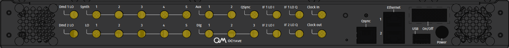

# QOP Clock

Here we discuss the different ways to connect, distribute and configure clock to a QOP cluster as well as its characteristics and limitations.
When we want to synchronize two or more OPX modules to one clock or use a clock other than the internal one, we may use an external clock source.
 

=== "QOP 3.x"

    ## QOP Clocking Scheme

    During cluster creation, the user designates one of the OPX1000s in it to be the main OPX1000. This OPX1000
    is the one that will distribute the clock and synchronize all other devices in the cluster.
    The main OPX1000 can either use its own internal clock, or it can receieve an external clock.
    Setting the clock to be internal or external is done through the QM-APP exclusively on the cluster level.

    All OPX1000s, either the main or the others in the cluster, can clock up to 4 other systems. 
    Hence, for clusters larger than 5 systems, one should connect the OPX1000 chassis in a "tree" diagram as shown below.
    
    
    
    If octaves are present in the cluster, connect their clock inputs to any OPX1000's clock outputs. If all OPX1000es' clock outputs have been used, and there are still unconnected Octaves, 
    then connect the Octave's clock input to other Octave's clock outputs.
    
    ## Connecting External Clock

    Connect your clock output to the 'Clock in1' or 'Clock in2' ports on the back panel of the main OPX1000
    
    
    
    This clock is then distributed to all other systems in the cluster.
    
    !!! Note
        The OPX1000 can receive an external clock at two frequencies: 10 MHz, and 2000 MHz (2 GHz).
    
        The 10 MHz clock must have its peak-to-peak voltage be between 0.35 to 2.3 V (-5 to 11 dBm).
    
        The 2000 MHz clock must have its peak-to-peak voltage be between 0.45 to 1.25 V (-3 to 6 dBm).
        
        The external clock input is AC coupled and the clock input impedance must be 50Ω.

    ## Clock Configuration

    Access your OPX1000 admin panel through the browser. On the settings page, you can see radio buttons to choose between internal and external clock.
    
    
    
    Choose the clock input where the external clock is connected to and its frequency
    
    
    
    

    After the frequency was chosen, click apply and wait for the system to restart with the new clock.
    
    !!! Note
        Changing the clock frequency will result in a system reboot.
    
=== "QOP 2.x"

    ## QOP Clocking Scheme
    
    Starting with QOP 2.4, there are three allowed clock schemes for the QOP. In all of them choosing between internal and external clock is done exclusively via the QM-APP:
    
    1. Setting cluster clock when an OPT is present
    
       2. Setting cluster clock for one Octave & one OPX+ cluster without an OPT
    
       3. Setting the clock for one OPX+ without an OPT
    
    In each of the scenarios a different component is the main clock according to the following drawings, where the top most component is the main clock:
    
    
    Let's consider each of the scenarios and how to connect the clocks of the QOP
    
    === "Options A1 & A2"
    
        In this case, an OPT is connected to the main OPX+ via a USB cable. All the devices' clocks in the cluster are connected to the OPT.
        When only one OPT is present in a cluster, it can synchronize up to six devices.
        Connect the OPT outputs to the clock in ports on all devices in the cluster.
        In order to synchronize more than six devices, connect another OPT via USB to one of the other OPX+s in the cluster and connect a clock cable from the main OPT output to the external clock input port on the new OPT.
        Then connect the clocks to the cluster devices through the lowest level OPTs outputs.
        If an external clock source is needed, it needs to be connected to the main OPT according to [external clock connection guide](#connecting-external-clock).
        Once the external clock is connected, set the cluster's clock to external through the QM-APP interface according to [Clock setting through the QM-APP guide](#clock-configuration).
    
    === "Option B"
    
        In this case, the QOP cluster consists of one OPX+ and one Octave where the octave supplies the clock to the OPX.
        Connect the clock output from the Octave to the clock input port of the OPX+.
        If an external clock source is needed, it needs to be connected to the Octave according to [external clock connection guide](#connecting-external-clock). 
        Once the external clock is connected, set the cluster's clock to external through the QM-APP interface according to [Clock setting through the QM-APP guide](#clock-configuration).
    
    === "Option C"
    
        In this case, the QOP cluster consists of one OPX+.
        If an external clock source is needed, it is connected to the OPX+ directly according to [external clock connection guide](#connecting-external-clock).
        Once the external clock is connected, set the cluster's clock to external through the QM-APP interface according to [Clock setting through the QM-APP guide](#clock-configuration).
    
    ## Connecting External Clock
    
    === "OPX"
    
        {{ requirement("QOP", "1.0") }}
        
        !!! Note
            This is for a single OPX, for multiple OPXes, please see the OPT tab on how to connect your external clock.
    
        
        Connect your clock output to the 'External Clock' port on the back panel of the OPX:
        
        
        
        Some OPX back panels are slightly different, the connectivity then is as follows:
        
        
        
        !!! Note
            Some early back panels might have different labels. However, the correct labels are the ones shown on this page.
    
    
    === "OPX+"
        
        {{ requirement("QOP", "2.0") }}
        
        !!! Note
            This is for a single OPX+, for multiple OPX+es, please see the OPT tab on how to connect your external clock.
        
        Connect your clock output to the 'Clock in' port on the back panel of the OPX+:
        
        

    === "OPX+ & Octave"
        
        {{ requirement("QOP", "2.0") }}
        
        !!! Note
            This is for a single OPX+ with an Octave and without an OPT.
        
        Connect your clock output to the 'Clock in' port on the back panel of the Octave.
        
        
    
    === "OPT"
        
        {{ requirement("QOP", "1.0") }} {{ requirement("QOP", "2.0") }} {{ requirement("OPT") }}
        
        Connect your clock output to the 'Clk In' port on the back panel of the OPT.
        
        
    
    
    ## QOP External Clock Input Characteristics
    
    {{ requirement("QOP", "1.X") }} {{ requirement("QOP", "2.X") }} 
    
    The QOP can receive an external clock at three frequencies: 10, 100, and 1000MHz (1GHz).
    The clock input impedance must be 50Ω.
    The 10 or 100 MHz clock must have its peak-to-peak voltage be between 0.35 to 2.3 V (-5 to 11 dBm).
    The 1000 MHz clock must have its peak-to-peak voltage be between 0.45 to 1.25 V (-3 to 6 dBm).
    
    !!! Note
        The external clock input is AC coupled
    
    !!! Note "Octave's External Clock in QOP 2.2.2 and below"
        For the Octave's external clock in QOP 2.2.2 and below please see the [Octave guide](octave.md#setting-the-octaves-clock)
    
    
    ## OPT External Clock Characteristics
    
    {{ requirement("OPT") }} 
    
    The OPT distributes clocks across up to six systems. In addition, multiple OPTs can be chained to distribute clocks to more systems.
    It distributes a 1 GHz clock across devices. In the {{ requirement("QOP","1") }}, it also synchronizes the connected systems.
    
    Let's define what they are and what are the optimal ranges of the for the OPT:
    
    - Jitter is the timing variations of a set of signal edges from their ideal values. Jitters in clock signals are typically caused by noise or other disturbances in the system. Contributing factors include thermal noise, power supply variations, loading conditions, device noise, and interference from nearby circuits. The OPT output jitter is less than 100fs.
      - Skew is a phenomenon in digital circuits where the same clock signal arrives at different components at different times due to gate or wire signal propagation delay. The instantaneous difference between the readings of any two clocks is called their skew. Skew can be caused by many different things, such as wire-interconnect length, temperature variations, variation in intermediate devices, capacitive coupling, material imperfections, and differences in input capacitance on the clock inputs of devices using the clock. As the clock rate of a circuit increases, timing becomes more critical, and less variation can be tolerated for the circuit to function correctly. The OPT skew between clocks is smaller than 20 ps.
    
    
    
    OPT Clock Output
    
    {{ read_csv('docs/Guides/assets/ExternalClkCharOPTout.csv') | add_indentation(spaces=4) }}
    
    ## Clock Configuration
    
    === "OPX+"
        
        {{ requirement("QOP", "2.0") }}
        
        Access your OPX admin panel through the browser. On the settings page, you can see radio buttons to choose between internal and external clock.
        
        
        
        After the frequency was chosen, click apply and wait for the system to restart with the new clock.
        
        
        
        !!! Note
            Changing the clock frequency will result in a system reboot
    
    === "OPX"
    
        {{ requirement("QOP", "1.0") }}
        
        Log in to your OPX through the QMApp. On the main window you will see all the OPXes in that cluster.
        Press on the settings icon to go into the clock settings.
        
        
        
        Pick a clock frequency and press apply. Now you can either restart the OPX for the change to occur immediately or restart later and continue working with the current clock configuration.
        
        
        
        !!! Note
            Changing clock frequency will result in a system reboot