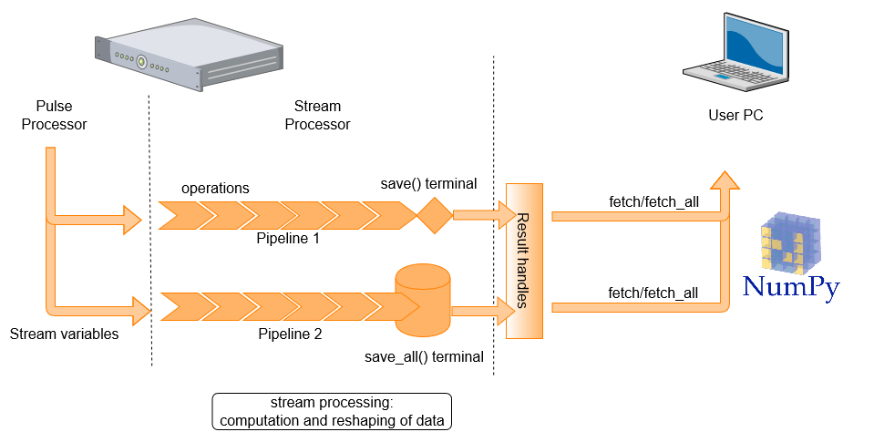
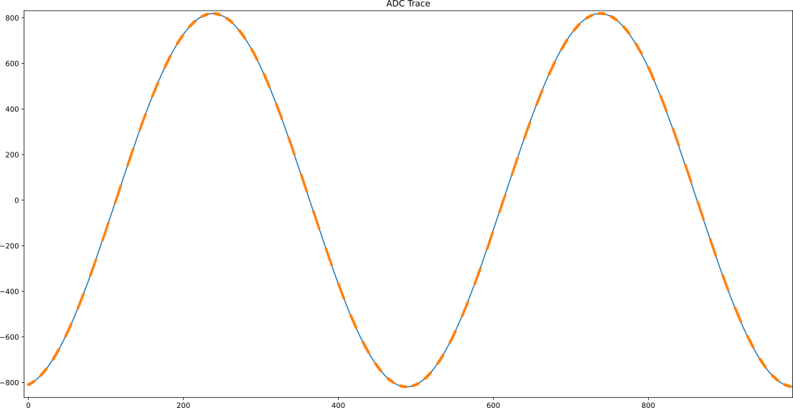
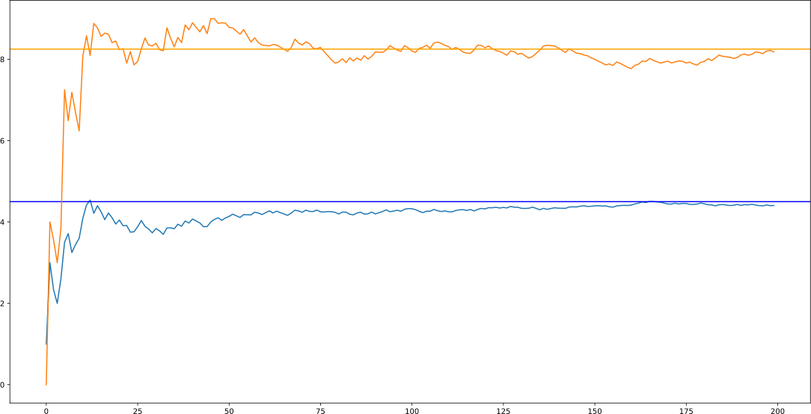
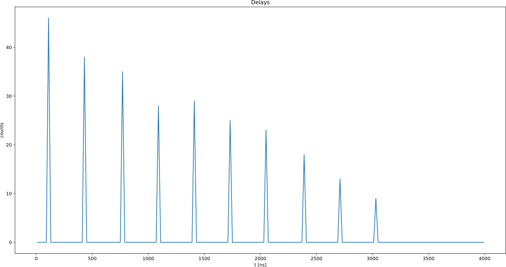

---
search:
  boost: 4
---

# Stream Processing


## Overview

When saving data from a QUA program, it is first saved on the OPX on-board memory.
From there, it's transferred to the server and eventually to the user PC.
Stream processing provides the capability to process data as it is being transferred to the QM server.
This both reduces the amount of data that has to be saved on the user PC, as well as the post-processing computation time.



Consider, as a simple example, a case where we would like to characterize the success rate of preparing a qubit in the $|1 \rangle$ state.
We want to play the pulse, read-out the qubit's state and decide whether it is a $|1\rangle$
or a $|0\rangle$. We then repeat this a large number of times, say $1 \times 10^5$.
Collecting the results of all $10^5$ experiments is not so interesting.
Instead, we can  only collect the final average of the set of experiments or how this average develops as data is accumulated.

A running average is a straightforward example, but many other manipulations are possible.
The "stream processing" allows for arithmetic operations and data reshaping to occur on server,
in parallel to OPX experimental runs.

## Basic Syntax and Examples

To use the server processing feature, a *stream* must be defined. A stream consists of a *stream variable*, a *pipeline*
and a *terminal*. The processed stream items can be accessed on the client PC, where they are referred to as *results*,
by creating *result handles* on the client PC.
In what follows, we introduce each of these components and explain how they are used.

To initiate a stream, we use {{f("qm.qua._dsl.declare_stream")}} to declare a stream variable, using the following syntax inside a QUA program:

```python
my_stream = declare_stream()
```

To pass a variable to a stream, we use the {{f("qm.qua._dsl.save")}} statement or the {{f("qm.qua._dsl.measure")}} statement.
This creates a data transfer path through which *stream items* are processed and then saved to either
a permanent or overriding storage (see [Glossary](#glossary) for more details).

To illustrate how pipelines and terminals are created and used, we show below a full QUA program which saves data to a stream,
manipulates it and stores the results to terminals. In addition, you can take a look at a few examples in our [GitHub library](https://github.com/qua-platform/qua-libs/tree/main/Tutorials/intro-to-streams)

```python
with program() as prog:
    my_stream1 = declare_stream(adc_trace=True)
    my_stream2 = declare_stream()
    a = declare(fixed)
    assign(a, 0.3)
    save(a, my_stream2)
    measure('my_pulse', 'qe', my_stream1)
    with stream_processing():
        my_stream1.input1().with_timestamps().save('adc_results')
        my_stream2.save_all('a_results')
```

Here two streams are created. The first, `my_stream1`, is used to stream raw ADC samples.
The second, `my_stream2`, is used to stream the value of the QUA variable `a`.

The pipelines and terminals are defined under the `with stream_processing()` context. Pipelines initiate with a
stream variable and terminate with a {{f("qm.qua._dsl._ResultStream.save")}} or {{f("qm.qua._dsl._ResultStream.save_all")}}
function, which acts as a *terminal*. In this example the pipelines are
simple: The first selects only the data from analog input1 and adds timestamps to it. The second is immediately terminated.

The terminal used for the pipeline initiated with `my_stream1` is a *save terminal*.
This is a memory-less terminal that holds only the last value transferred - this can result in data loss if data
is not fetched quickly enough from the client PC. The terminal is given the tag `'adc_results'`, which can later
referenced using a result handle.
The terminal for `my_stream2` is a `save_all` terminal which does store all the results (up to a memory
limitation, see [Server PC storage and data limitations](#server-pc-storage-and-data-limitations)). The tag for this terminal is `'a_results'`.

To access the results on the client PC side, we create a *Result handle*. This allows us to retrieve ("fetch") the
stream items on the client PC side, or to perform other query or storage operations on it. To continue our example:

```python
job = qm.execute(prog)
res = job.result_handles
my_stream_res = res.adc_results.fetch_all()['value']
```

This example collects all results which were contained in the stream using the
{{f("qm.results.base_streaming_result_fetcher.BaseStreamingResultFetcher.fetch_all")}} method.
Alternatively, we can only get the most recent result by calling the {{f("qm.results.multiple_streaming_result_fetcher.MultipleStreamingResultFetcher.fetch")}} method.
Note that both these methods are called on a result handle. This structure and its usage are described below.

!!! Note
    It is still possible to use the syntax from previous versions for creating a stream that is only terminated
    using `save_all()` ([legacy save](#legacy-save)). The following examples are equivalent:

    ```python
    with program() as prog:
        my_stream = declare_stream()
        a = declare(fixed)
        assign(a, 0.3)
        save(a, my_stream)
        with stream_processing():
            my_stream.save_all('a_results')
    ```
    
    ```python
    with program() as prog:
        a = declare(fixed)
        assign(a, 0.3)
        save(a, 'a_results')
    ```

!!! warning
    Saving values to the same stream from different OPXs is not supported.

### Streaming Raw ADC Results

The following is a simple example of a program that acquires a single raw ADC trace:

```python
with program() as prog:
    adc_stream = declare_stream(adc_trace=True)
    measure('my_pulse', 'qe', adc_stream)

    with stream_processing():
        adc_stream.input1().save('raw_adc')
```

By setting `adc_trace=True` we specify that data should be grouped into individual ADC
traces and not passed on a sample-by-sample manner, such that each trace will be of size `(1, measurement_duration)`.
Next, to populate the stream with results, we specify the relevant stream in the `measure` statement. Finally, in the
`stream_processing` context, the pipeline specifies that we acquire data from analog input 1, and save it with the tag `raw_adc`
which we can later refer to in the client PC.

!!! Note
    Setting `adc_trace=True` is equivalent to writing `stream.buffer(pulse_len + 2*smearing)`.
    See details on buffer below and [here](demod.md#timing-of-the-measurement-operation) on smearing

    To record a raw ADC stream, it is required to play a [digital marker](../Introduction/qua_overview.md#digital-markers-and-quantum-element-readout) that is associated with the measurement element. Only samples that arrive while the digital trigger is on will be recorded in the stream pipeline. This means it is possible to "gate" the raw ADC stream by using different
    sequences of digital waveforms in the readout operation used for the {{f("qm.qua._dsl.measure")}} command.

<figure markdown>
  
  <figcaption>Fig. 1: The raw ADC stream. The blue line is the raw ADC stream when the digital trigger is on for the entire measurement.
The orange dots are the raw ADC samples when the digital trigger is switched on/off every eight samples.</figcaption>
</figure>

!!! important
    The digital waveform only affects the raw ADC streams. It does not change the data used when processing the measurement
    using integration, demodulation etc.

!!!Note "Streaming Raw ADC Results in MW-FEM"
    
    {{ requirement("QOP", "3.0") }} {{ requirement("QUA", "1.2") }}

    In the MW-FEM of the OPX1000, ADC stream is returned as a complex float representing the I and Q quadratures. 
    In addition, you can take the real or imaginary part of the adc stream of an MW-FEM input. 

    For example, the following records the adc in MW-FEM input 1 and saves the complex vector, and the real and imaginary components. 

    ```python
    with stream_processing():
        adc_st.input1().save("adc_complex")
        adc_st.input1().real().save("adc_I")
        adc_st.input1().image().save("adc_Q")
    ```

## Results Handles

The stream items stored in the save/save all terminals on the server PC can be fetched to the client PC using the
`results_handles` property of the {{f("qm.jobs.running_qm_job.RunningQmJob")}} object.
The fields of the `result_handles` property contain references to the stream terminals, and their names are the
same as the tags given to the terminals.
A handle to a specific terminal with tag `"my_result"`, for example, is accessed with
`#!python my_result = job.results_handles.get("my_result")`.
A shorthand notation for this is `my_result = job.results_handles.my_result`.

We can query both the state of a single result handle or that of the collection of all results handles.
For example, one can query the processing state using the {{f("qm.results.streaming_result_fetcher.StreamingResultFetcher.is_processing")}} method,
or the {{f("qm.results.streaming_result_fetcher.StreamingResultFetcher.wait_for_all_values")}} method to suspend python execution until either a timeout has occurred or
saving has completed.
In case the handle references results from a save terminal, we can also wait for a specific number of results
to arrive using the {{f("qm.results.base_streaming_result_fetcher.BaseStreamingResultFetcher.wait_for_values")}} method.
The number of stream items referenced by a specific result handle can be obtained by calling {{f("qm.results.base_streaming_result_fetcher.BaseStreamingResultFetcher.count_so_far")}}
on that handle, or equivalently by calling `len(my_result)`.

Saving results in numpy format to a local variable is done using the `fetch` and `fetch_all`
methods as specified below.


### fetch and fetch_all

To transfer the results from the server PC to the client PC, {{f("qm.results.base_streaming_result_fetcher.BaseStreamingResultFetcher.fetch")}} and {{f("qm.results.base_streaming_result_fetcher.BaseStreamingResultFetcher.fetch_all")}} commands are called on a result
handle, for example:

```python
my_stream_res=res.my_stream.fetch_all()
```

where `my_stream` is the tag result tag given to the save/save_all terminal.

`fetch` collects the most recent result in the stream and `fetch_all` collects all saved data.
In the case a save terminal is used, fetch all is equivalent to fetch.

It is also possible to collect only a portion of the collected data by passing `fetch` a slice object.
For example, say your result stream contains \[0,1,2,3,4,5,6,7,8,9\].
`fetch(0)` returns 0, `fetch(4)` returns 4 and `fetch(slice(2,5)` returns \[2,3,4,5\]. Any valid python [slice object](https://docs.python.org/3/library/functions.html#slice) can be used.


!!! warning
    When fetching the data while using {{f("qm.qua._dsl.pause")}} - {{f("qm.jobs.running_qm_job.RunningQmJob.resume")}} with a {{f("qm.qua._dsl.save")}} command there is no guarantee that the data you fetch at a given moment is the data point from the current iteration. There can be some delay from the moment the data is acquired until it is available for fetching.
    Moreover, the streams are a-synchronous. For example, the availability of the result I\[j\] might be a few moments before Q\[j\]. If you fetch the data before the data is available at the Q stream, you will end up with a mixed data point I\[j\],Q\[j-1\].
    That means that it is better to use the {{f("qm.qua._dsl._ResultStream.save_all")}} command and fetch the desired data.

## Using Stream Operators

### Data Restructuring with buffer()

The buffer method allows reshaping of the incoming stream items using the {{f("qm.qua._dsl._ResultStream.buffer")}} operator. 
For example:

```python
my_stream.buffer(2).save_all('output_name')
```

Will result in a stream of number pairs. And

```python
my_stream.buffer(2,2).save('output_name')
```

Will result in a stream of 2 by 2 matrices. This is useful inside a doubly nested for loop as we can
loop over a pair of independent variables and save the resulting dependent variable with the correct structure.
We can then perform additional processing. For example, we can perform a running average over the resulting matrix
in the following way:

```python
my_stream.buffer(2,2).average().save()
```

This allows us to collect the resulting matrix and observe how the average evolved with the subsequent runs in real-time.

#### Buffer limitations

It is not possible to process more than 100e6 buffered variables at the same time. This is true for total number of variable
streamed at the same time.

For example in the following snippet of code, the first line can be processed by itself, adding the second line will drive the
system behind its limitations:

```python
my_stream1.buffer(int(100e6)).save()
my_stream2.buffer(int(3e5)).save()
```

!!! Note
    streaming a buffered variable with time stamps is akin to streaming double the amount of variable. When using
    {{f("qm.qua._dsl._ResultSource.with_timestamps")}}, each variable should be calculated as two variables when considering this limitation.

### Combining streams using the `zip` operator

Streams can be zipped together into tuples of results using the {{f("qm.qua._dsl._ResultStream.zip")}} stream operator. 
This is similar to creating a buffer but combines data from two separate streams rather than reshaping a single one. 
In this case, the zipped resulting stream will have a shape dictated by the number of zipped tuples. 
Each element of this tuple is a named field `value_i` where `i` is the named field number (the index of the zipped stream).

```python
A_stream.zip(B_stream).save_all("zipped_tuple")
...
zipped = job.result_handles.zipped_tuple.fetch_all()
```

`zipped` has a shaped based on the number of items `n`. It has two named fields: `value_0` and `value_1`.

<!-- % Automatic reshape of streams and the metadata structure

% -------------------------------------------------------

%

% I = declare(fixed)

% J = declare(fixed)

% stream = declare_stream()

%

% with for_(I, 0.0, I < 1.0, I + 0.1):

% assign(J, I * 2)

% save(J, stream)

%

% with stream_processing():

% stream.save_all("data")

%

% After running this program, the `data` stream can be accessed via the `result_handles` object. It has a `stream_metadata` field which contains information about the detected loops. For the code shown above, the following metadata is available:

%

% .. code-block:: python

%

% job.result_handles.wait_for_all_values()

% data = job.result_handles.data.fetch_all()

% iteration_values = job.result_handles.data.stream_metadata.iteration_values

% iteration_values[0].iteration_values #[0.0, 0.1, 0.2, ... ]

% iteration_values[0].iteration_variable_name #'I'

%

% This will work equally well for nested loops:

%

% .. code-block:: python

%

% I = declare(fixed)

% J = declare(fixed)

% stream = declare_stream()

%

% with for_(I, 0.0, I < 1.0, I + 0.2):

% with if_(I < 0.5):

% assign(J, I * 2)

% save(J, stream)

%

% with stream_processing():

% stream.save_all("data")

%

% `stream_metadata` will now contain both the `I` and `J` variables and their values.

%

% .. warning::

%

% There is no support for conditional run of the nested for loop. All values must be present in the saved grid. If this is not the case, the creation of metadata will fail.

%

% .. warning::

%

% The variable names in nested loops must be distinct. Two loops with the same variable name are not supported.

%

%

%

% You can use the size of the streams detected and stored in the metadata structure to reshape your results manually. This can also be done automatically using the `auto_reshape()` operator.

%

% auto_reshape

% ^^^^^^^^^^^^

%

% with program() as prog:

% I = declare(fixed)

% J = declare(fixed)

% stream = declare_stream()

% K = declare(fixed)

%

% with for_(I, 0.0, I < 0.001 * 3, I + 0.001):

% with for_each_(K, [0.000, 0.001, 0.002, 0.003]):

% assign(J, I * 2 + K)

% save(J, stream)

%

% with stream_processing():

% stream.auto_reshape().save_all('data')

%

% The shape of `data` will automatically be converted to 3X4, the size of these two nested loops.

% -->

## Mapping operations over streams with the `map` function

The `map` function allows you to perform an operation on each element in a stream. It becomes especially useful when combined with the `buffer` function because then operations can be
performed on each filled buffer. For example, one can generate a buffer of size 3, and average over the samples in each triplet of numbers in the buffer. This is done as follows:

```python
A_stream.buffer(3).map(FUNCTIONS.average()).save_all('averaged_stream')
```

There are multiple FUNCTIONS that can be used in this way. For example, `FUNCTIONS.dot_product()`, `FUNCTIONS.multiply_by(scalar_or_vector)`. Both these have
shortcut operators, so you can simply use `.multiply_by` as an operator in a stream pipeline.  However, not all function have a shortcut, and it's useful to learn what the options are.
Some of these functions are: `demod`, `boolean_to_int`,\`fft\`,\`tuple_convolution\`, `convolution`,\`tuple_multiply\` but there are others. You can use Python's introspection to see what is available.

### Average on axis

When working with two-dimensional buffers, one can specify over which axis to average. For example, in the following three-dimensional buffer,
averaging is done on the first (zero-eth) axis with the following syntax:

```python
A_stream.buffer(axis2_size).buffer(axis1_size).buffer(axis0_size).map(FUNCTIONS.average(0)).save_all(f"avg_axis0")
```

A list of axis can also be passed, in which case averaging is done on all passed axes. This matches behavior in numpy for example.

```python
A_stream[i].buffer(axis2_size).buffer(axis1_size).buffer(axis0_size).map(FUNCTIONS.average([0, 1, 2])).save_all(f"avg_axis012")
```

## Flat data structure option

The data structure returned by calling `fetch_all` is a numpy [structured array](https://numpy.org/doc/stable/user/basics.rec.html). In simple cases, where buffering is not used, the shape of this array is exactly given by the number of saved items. If time stamps are also included, there is a single column of values and a second column with timestamps.
If, however the data is buffered or manipulated in some way, the number of items in the output array will be the number of filled (or partially filled) buffers. For example, consider the following buffered stream

```python
stream.buffer(10).buffer(5).save_all()
```

If we had 300 items entering the steam, the shape of the output stream numpy array is: 6 (10\*5\*6  = 300). Each numpy array item has shape 10 X 6, but because the inner dimensions are "hidden" this is not indexable in the way you might expect.

To modify this behavior, an option to "flatten" the result array has been added. This is called by passing the following parameter to `fetch_all`:

```python
job.result_handles.samples.fetch_all(flat_struct=True)
```

In this case, the result shape will have the shape (6,5,10) and indexing can be performed as is usual in numpy array.

If the `flat_struct` flag is used on zipped streams, each named field will have a shape as described for a single stream.

## Stream Processing Arithmetics

It is possible to use the server to perform arithmetic operations on a single stream or between different streams.
A complete list of the possible operations can be found in {{f("qm.qua._dsl._ResultStream")}}. In general, an operation
can be performed between a stream to itself, two different streams or a stream and a scalar. The operation is done
element-wise, so both streams need to be buffered identically. In the case of an operation between a stream and a scalar,
the operations must be done before buffering the stream.

!!! Note
    It is possible to do multiplication between a buffered stream and a vector using the `multiply_by()` function.
    The vector length must be identical to the stream buffer.

Some simple syntax examples:

```python
(stream + 1).save("example")  # Adding 1 to each element in the stream
(stream_1 + stream_2).buffer(5).save("example")  # Adding element-wise stream1 to stream2 and buffering the result
(stream_1.buffer(5) + stream_2.buffer(5)).save("example")  # First buffering the streams and then adding them to each other
((stream1+1)*3+(stream2+1)/2).buffer(5).average().save_all("example")  # A combination of stream and scalar arithmetics
```

Notice that lines two and three in the above examples will results in identical outputs.

!!! warning
    An operation between two streams that have different total length will only occur a number of times equal to the shortest stream
    in their order within the pipeline, regardless of the location of the `save()` command in the QUA program.
    For example if `stream1` has n items, and `stream2` has m items, where m < n. The result
    of `(stream1+stream2).save_all()` would be an array of length m, with the values of the first m elements in `stream1` added
    element-wise to `stream2`.

### Examples

A simple example that shows the utility of stream arithmetic is the ability to calculate the variance of a measured
variable during the measurement. In the figure below, we see the results of generating a random integer between 0 and
9 repeatedly, and streaming two streams as written below:

```python
stream.average().save_all("average")
((stream*stream).average()-(stream.average()*stream.average())).save_all("variance")
```

where the first line stream the running average (in blue in the figure), and the second line calculate the variance and
stream the results (in orange in the figure).



Fig. 2: Running average stream (blue) and the variance stream(orange) of a randomly generated number on the OPX+. The
horizontal lines mark the theoretical average (blue) and variance (orange).

In the following example, we see the use of the histogram. By using the [Time Tagging](features.md#time-tagging), we get an array of
time stamps indicating at which point in the measurement we counted a pulse (simulating a photon). By repeating the time tagging measurement,
we can stream the results in a histogram telling us how many pulses we counted in each time bin.

```python
times_st.histogram([[i, i + (resolution - 1)] for i in range(0, meas_len, resolution)]).save("times_hist")
```

The above code line shows how to use the histogram in the stream processing where `meas_len` is the measurement length,
and `resolution` is the required histogram bin size.



Fig. 3: A histogram of the number of counts as a function of measurement time. The time bin resolution is 20 ns.

## Legacy Save

Prior to saving into explicitly declared streams, QUA's save mechanism was directly to a tag : `save(var,'tag')` where `'tag'` is a string identifier.
When using this legacy saving mechanism the output can be retrieved without change, as below:

```python
fetch_all_data = job.result_handles.get("A").fetch_all()
```

This retrieves both values and timestamps. Alternatively, if only values (or only timestamps) are needed, we have introduced the following notation:

```python
fetch_only_values= job.result_handles.get("A").fetch_all(flat_struct=True)
fetch_only_timestamps= job.result_handles.get("A_timestamps").fetch_all(flat_struct=True)
```

This provides only values (or only timestamps) and is slightly more performant than the previous option. In future versions `flat_struct=True` the default option.

## Server PC storage and data limitations

A `save_all` terminal will store in the all of the stream items created during the execution
of a QUA program as results in the permanent memory of the server PC.
The permanent memory of the server PC is large but not unlimited, and therefore it is possible in some cases
to create more results than can be stored at the server PC.
The server PC permanent memory can store up to 100GB of result data without danger of data-loss.

!!! warning
    If more than 100GB are stored in the permanent memory, the data may be erased after a short time to ensure
    the permanent storage is not overfilled. To ensure that job results are not erased, always make sure that no more
    than 100GB of data are generated by the QUA program without being fetched.

The results will not be immediately erased from the server once they are fetched.
To clear the permanent storage and ensure that all of the 100GB are available, use the
{{f("qm.quantum_machines_manager.QuantumMachinesManager.clear_all_job_results")}} method.

## Data loss notification

When collecting results from a stream, the system can usually estimate how much data is expected to be received.
For example, if the `measure` command plays a pulse with a duration of 1000 samples, we expect to collect
an output of that length. In cases where the expected amount of data does not match the received amount,
an error message will appear when the `res.my_stream.fetch_all()` or `.fetch()` commands are called.
It can also be manually checked by calling

```python
res.my_stream.has_data_loss()
```

## Video Tutorials


### Stream processing - introduction
<!-- (https://www.loom.com/share/fbe949bf290042609e9cc65ac089e7be?sharedAppSource=personal_library) -->

<div style="position: relative; padding-bottom: 56.25%; height: 0;"><iframe src="https://www.loom.com/embed/fbe949bf290042609e9cc65ac089e7be" frameborder="0" webkitallowfullscreen mozallowfullscreen allowfullscreen style="position: absolute; top: 0; left: 0; width: 100%; height: 100%;"></iframe></div>

### Stream processing - save and save_all
<!-- ](https://www.loom.com/share/c9bb081a5643463286b21d305cdd3d25?sharedAppSource=personal_library) -->

<div style="position: relative; padding-bottom: 56.25%; height: 0;"><iframe src="https://www.loom.com/embed/c9bb081a5643463286b21d305cdd3d25" frameborder="0" webkitallowfullscreen mozallowfullscreen allowfullscreen style="position: absolute; top: 0; left: 0; width: 100%; height: 100%;"></iframe></div>

### Stream processing - buffer
<!-- ](https://www.loom.com/share/07271d78366f47239ca22e8f089c89bf?sharedAppSource=personal_library) -->

<div style="position: relative; padding-bottom: 56.25%; height: 0;"><iframe src="https://www.loom.com/embed/07271d78366f47239ca22e8f089c89bf" frameborder="0" webkitallowfullscreen mozallowfullscreen allowfullscreen style="position: absolute; top: 0; left: 0; width: 100%; height: 100%;"></iframe></div>

### Stream processing - averaging
<!-- ](https://www.loom.com/share/297223832daa450d9a1707ec5e50099c?sharedAppSource=personal_library) -->

<div style="position: relative; padding-bottom: 56.25%; height: 0;"><iframe src="https://www.loom.com/embed/297223832daa450d9a1707ec5e50099c" frameborder="0" webkitallowfullscreen mozallowfullscreen allowfullscreen style="position: absolute; top: 0; left: 0; width: 100%; height: 100%;"></iframe></div>

### Stream processing - average within a buffer
<!-- ](https://www.loom.com/share/4afb71590cb14945b02763bfd9ebfeeb?sharedAppSource=personal_library) -->

<div style="position: relative; padding-bottom: 56.25%; height: 0;"><iframe src="https://www.loom.com/embed/4afb71590cb14945b02763bfd9ebfeeb" frameborder="0" webkitallowfullscreen mozallowfullscreen allowfullscreen style="position: absolute; top: 0; left: 0; width: 100%; height: 100%;"></iframe></div>

### Stream processing - buffer.average.buffer
<!-- ](https://www.loom.com/share/b1b0185c99ae434f91a6f5087f2795a9?sharedAppSource=personal_library) -->

<div style="position: relative; padding-bottom: 56.25%; height: 0;"><iframe src="https://www.loom.com/embed/b1b0185c99ae434f91a6f5087f2795a9" frameborder="0" webkitallowfullscreen mozallowfullscreen allowfullscreen style="position: absolute; top: 0; left: 0; width: 100%; height: 100%;"></iframe></div>

### Stream_processing - advance example (part 1)
<!-- - (https://www.loom.com/share/333227ffbba6445a873567c6b184b2e5?sharedAppSource=personal_library) -->

<div style="position: relative; padding-bottom: 56.25%; height: 0;"><iframe src="https://www.loom.com/embed/333227ffbba6445a873567c6b184b2e5" frameborder="0" webkitallowfullscreen mozallowfullscreen allowfullscreen style="position: absolute; top: 0; left: 0; width: 100%; height: 100%;"></iframe></div>

### Stream_processing - advanced example (part 2)
<!-- ](https://www.loom.com/share/5a8c5035a2a9401694c4fb9de97fce22?sharedAppSource=personal_library) -->

<div style="position: relative; padding-bottom: 56.25%; height: 0;"><iframe src="https://www.loom.com/embed/5a8c5035a2a9401694c4fb9de97fce22" frameborder="0" webkitallowfullscreen mozallowfullscreen allowfullscreen style="position: absolute; top: 0; left: 0; width: 100%; height: 100%;"></iframe></div>

## Glossary

### Stream Variable

:   A source (or start point) of a pipeline, receives values of QUA variables or raw input samples as input.

### Save Terminal

:   An overriding named sink or (end point) of a pipeline that creates a result.
    Each new stream item received at this terminal, will override the previous.
    The result is a single item, the last one received in a stream

!!! warning
    Using a save terminal can result in data loss. It is to be used only
    in cases where data loss is acceptable, such as streaming plots.

### Save All Terminal

: A named sink or end point of a pipeline that creates a result, which stores
  all the stream items in the pipeline.
  All stream items are appended to the result, complete history of the stream
  is preserved

### Pipeline

: An ordered collection of operations that is performed on an input stream to return
  a processed version of the stream (output stream)
  In the context of stream processing, it is the collection of operations that
  can be performed starting from a stream variable and terminating in a "save terminal" or
  "save all terminal" node

### Stream

: An ordered set of values that are being sent from a QUA program into a pipeline.
  A stream is set up when a QUA program is started and is torn down when it is
  finished.

### Stream item

: A single discrete unit of data of a stream.
:  Can be one of the following:

:  - ICP result
:  - Single input sample from the controller
:  - An input trace vector (single measure statement)

:  It is possible to augment the timestamp to each item using `with_timestamp()`

### Stream timestamp

: A timestamp associated with a `Stream item`.

:  - It is possible to augment the timestamp to each `Stream item` using `with_timestamp()`.
:  - It is possible to replace the `Stream item` with its timestamp using `timestamp()`.

### Result

: The last or accumulated stream items that are created by save or save_all terminals, respectively

### Result Handle

: An object through which results can be fetched

