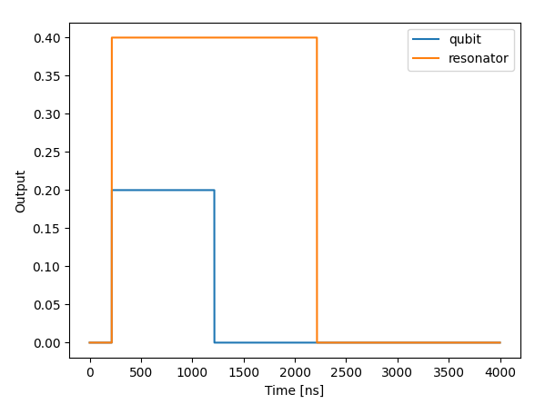
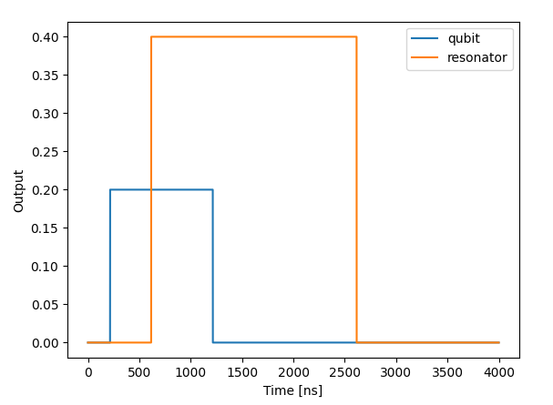
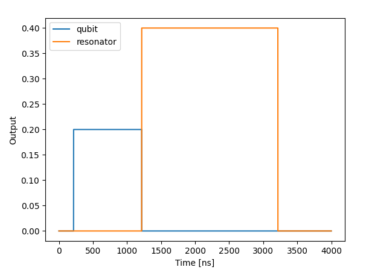
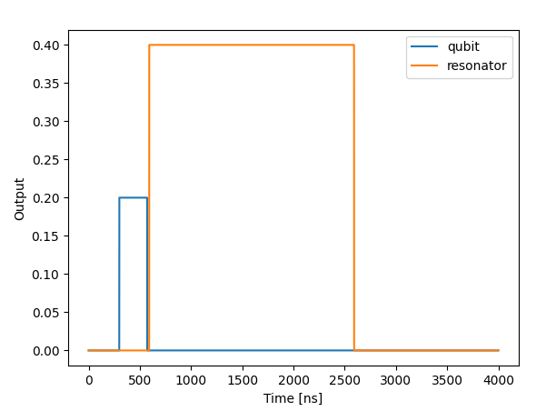
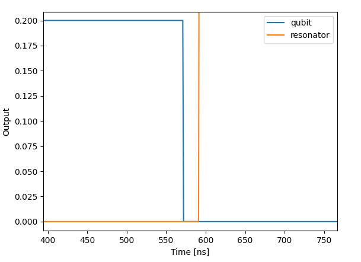
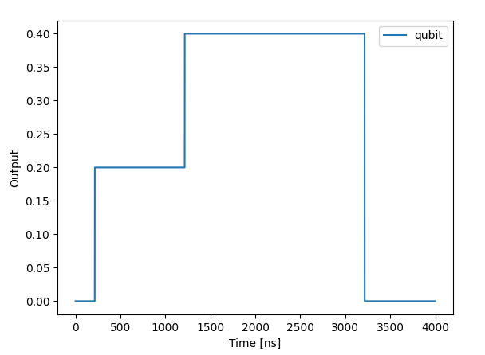

---
search:
  boost: 3
---

# Timing in QUA

A QUA program defines not only the pulses that are played, but also specifies when they should be played.

## Pulse Dependency

The QUA syntax defines an implicit pulse dependency, which determines the order of pulses execution.
The dependency can be summarized as follows:

1. Each pulse is played immediately, unless specified otherwise or a calculation has to be done.
2. We can delay the pulse play by using a {{f("qm.qua._dsl.wait")}} command. Dependency-wise, this is equivalent to a play with zero amplitude.
3. Pulses applied to the same element are dependent on each other according to the order in which they appear in the program.
4. We can create a dependency between different elements via the {{f("qm.qua._dsl.align")}} command. Whenever elements are 'aligned', the execution of operations that come **after** the alignment is dependent on the operations that come before.

!!! Note
    Each element has its own [thread](features.md#threads), unless defined otherwise. If elements do share threads, they are dependent on each other as in case 3 above.

## The Align Command

To further illustrate point number 4 above, consider the following pseudo-code examples:

```python
with program() as prog:
    ## operations on element_1
    align(element_1, element_2)
    ## operations on element_2
```

In this example, the operations on `element_2` will only begin execution after the last operation on `element_1` took place (before the alignment).

Let's consider a slightly more complex example:

```python
with program() as prog:
    ## operations on element_1
    ## operations on element_2
    ## operations on element_3

    align(element_1, element_2)

    ## operations on element_1
    ## operations on element_2
    ## operations on element_3
```

In the first part of the program above, before the alignment, the operations on the different elements will occur simultaneously,
according to the dependency rules above. In the second half, after the alignment, the operations on `element_1` & `element_2` will only begin after the operations from the first half, **on both elements**, has finished.
Operations on `element_3` are independent of the other elements and will ignore the align command.

### The Implicit Align

There is an implicit align whenever several elements participate in a flow control branch.
That means that when elements appear together in a for loop, while loop, if / else / elif block or a switch case, they are aligned in the beginning of the flow control branch.

For example, the following example:

```python
with program() as prog:
    ## operations on element_1

    with while_(some_condition):
        ## operations on element_1
        ## operations on element_2
```

To the compiler, it is actually:

```python
with program() as prog:
    ## operations on element_1

    align(element_1, element_2)
    with while_(some_condition):
        align(element_1, element_2)
        ## operations on element_1
        ## operations on element_2
```

In the program, the while loop will only start after the pre-loop operations on `element_1` has finished.
In addition, every iteration will begin only after the operations on both element have ended.
Therefore, the loops duration will be determined by the longest of the two operation sequences.

It is possible to add the flag `skip-add-implicit-align` to the execution to remove the automatic addition of these aligns.
For more information on how to use flags, see [compilation options](features.md#compilation-options).

## Gaps in QUA

The QUA syntax of pulses and operations only defines their order of execution, it does not guarantee that they would be played without introducing gaps.
This means that two consecutive `play` commands on the same element may have a short gap between them.
The compiler tries to minimize these gaps, but it is not always possible to completely eliminate them. For tips on how to reduce these gaps, see [QUA Best Practice Guide](../Guides/best_practices.md).
It is also possible to indicate to the compiler sections in which it is critical to have no gaps, this can be done with the {{f("qm.qua._dsl.strict_timing_")}} block.

### Strict Timing

!!! Note
    {{ requirement("QOP", "2") }} The strict timing feature only exists in the OPX+

Any command written inside a {{f("qm.qua._dsl.strict_timing_")}} block will be required to be played without gaps.
In cases where this is not possible, an error will be raised indicating the gaps.
It is possible to add the flag `not-strict-timing` to the execution to raise warnings instead of errors.
For more information on how to use flags, see [compilation options](features.md#compilation-options).

In the following example, the two pulses will happen with no gaps in between:

```python
with strict_timing_():
    play('x180', 'qubit')
    play('y90', 'qubit')
```

In the next example, the {{f("qm.qua._dsl.for_")}} loop is also inside the strict timing, which also requires that there will be no gaps between different iterations of the loop.
i.e., this means that the following code will produce a chain of 200 pulses alternating between `x180` and `y90` with no gaps at all.

```python
with strict_timing_():
    with for_(n, 0, n<100, n+1):
        play('x180', 'qubit')
        play('y90', 'qubit')
```

### Deterministic Vs. non-Deterministic Align

Generally, an align command requires the passage of information from one thread to the other. When a thread reaches its last instruction before an alignment,
it sends a signal to all the other threads that participate in the alignment, also known as a "hardware sync".
This passage of information takes several clock cycles and introduces gaps to the pulse sequence.
In cases where the duration of the operation on all the elements is known during compilation (Deterministic case),
the compiler optimizes the sequence and replaces the hardware sync with precalculated wait commands for each element.
This optimization ensures that there are no gaps formed in a deterministic case. However, if the run-time of one of the elements is not known during compilation
(non-Deterministic case), gaps will be formed. See examples 3 and 4 below for more details.

## Examples for Timing scenarios in QUA

We will present five examples in order to demonstrate the timing in qua:

1. Two pulses from different elements.
2. Two pulses from different elements with wait command.
3. Two pulses from different elements with align command (deterministic case).
4. Two pulses from different elements with align command (non-deterministic case).
5. Two pulses from the same element.

!!! Note
    For the executable examples look at [timing tutorial](https://github.com/qua-platform/qua-libs/tree/main/Tutorials/intro-to-timing/readme/).

### Example #1

Two pulses from different elements.

```python
with program() as prog:
    play('cw1', 'qubit')
    play('cw2', 'resonator')
```
<figure markdown>
  
  <figcaption>example 1</figcaption>
</figure>

The two pulses start at the same time since they relate to different elements.

### Example #2

Two pulses from different elements with wait command.

```python
with program() as prog:
    play('cw1', 'qubit')
    wait(100)
    play('cw2', 'resonator')
```

<figure markdown>
  
  <figcaption>example 2</figcaption>
</figure>

The play on the resonator is delayed by a 400 ns (100 cycles).

### Example #3

Two pulses from different elements with align command (deterministic case)

```python
with program() as prog:
    play('cw1','qubit')
    align('qubit', 'resonator')
    play('cw2', 'resonator')
```

<figure markdown>
  
  <figcaption>example 3</figcaption>
</figure>

The play on the resonator starts right after the qubit's play ends. This is due to the align command (in the deterministic case).

!!! Note
    In the deterministic case above, the align command is translated to the wait command with the specific known wait time.

### Example #4

Two pulses from different elements with align command (non-deterministic case)

```python
with program() as prog:
    # some calculation of t in real time
    play('cw1','qubit', duration=t)
    align('qubit', 'resonator')
    play('cw2', 'resonator')
```

While `t` is calculated in real-time.

<figure markdown>
  
  <figcaption>example 4a</figcaption>
</figure>

If we zoom in to the area where one element ends and the other starts, we can see a gap between them.

<figure markdown>
  
  <figcaption>example 4b</figcaption>
</figure>

!!! Note
    When playing two elements with align command in the non-deterministic case, there is a few cycles delay between the pulses.
    Since in the non-deterministic case it takes few cycles to pass the information from one thread to the other.

### Example #5

Two pulses from the same element.

```python
with program() as prog:
    play('cw1','qubit')
    play('cw2', 'qubit')
```

<figure markdown>
  
  <figcaption>example 5</figcaption>
</figure>

The two play commands are played one after the other since they are played from the same element.

[github/qua-libs]: https://github.com/qua-platform/qua-libs/tree/main/Tutorials/intro-to-timing
