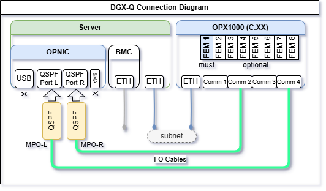
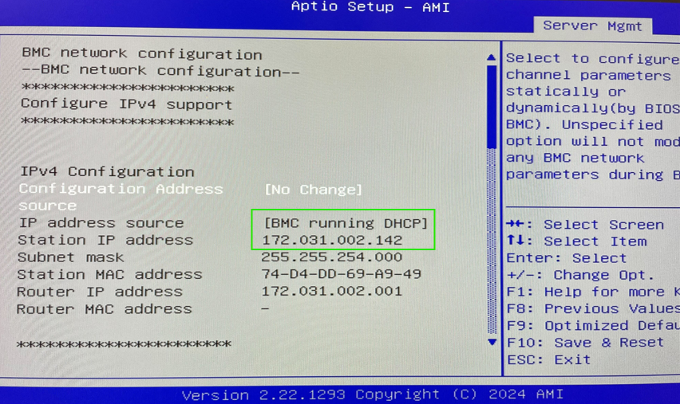

# DGX Quantum Installation Guide
The following page describes the installation procedure of a DGX Quantum (DGX-Q) server, including connectivity to OPX1000, configuration, and initialization.

## Components
### DGX Quantum Physical Components
- **GH200**: The Grace Hopper Supercharged High Performance Computer driving the classical computation. Also referred to as the "**DGX-Q server**"
- **OPX1000**: Ultra low latency Quantum control and readout controller
- **OPNIC**: OP Network Interface Card, installed in the GH200 PCIe port

### DGX Quantum Software & Firmware Components
The DGX-Q software on the server consists of three open-source software components that are required to be installed on the server:

1. OPNIC Driver: A kernel driver for the OPNIC PCIe card
2. OPNIC SDK: A shared library that is used by user’s application on the server
3. OPNIC CLI tool: A CLI interface for managing the OPNIC (for example, a one-time sync with QOP, updating card FW, etc.)

## OPNIC Installation in the DGX-Q Server

Step 4 can be used to update the OPNIC firmware.
If the system was previously configured, you can skip directly to step 4.

??? "Step 1: OPNIC Mechanical Assembly"

    * Follow the mechanical assembly manual [OPNIC Assembly Guide](assets/opnic_installation_in_a_server.pdf)

??? "Step 2: DGX-Q Connection Schema"
    The DGX-Q system requires an Ethernet connection between the OPX1000 chassis and the server and an optical connection between the OPNIC and the OPX1000 chassis. Please follow these guidelines:
    * Make sure slot 1 is populated by an FEM or contact Quantum Machines support for an alternative connectivity configuration.
    * Connect the 2 QSFP-MPO adapters to the relevant ports in the OPNIC.
    * Connect the MPO optical cables from the OPNIC to the OPX1000 according to the diagram:

        - **Make sure to connect Comm 2 to the right OPNIC port (orientation according to the sketch).**

        - **Make sure both MPO optical cables are identical and of the same length.**

        

        !!! Note
            The sketch illustrates the connection to a Rev. C chassis.

            If the OPNIC is connected to a Rev. B chassis, use the provided [adapter kit](assets/OPX1000%20Chassis%20B%20to%20C%20adapter%20kit.pdf), or use a patched MPO optical cables, which are sometimes pink.

    * Network Communication - Ethernet connections should be based on the specific site/IT connectivity guidelines.

        **Make sure you can ping the OPX1000 from the server. The easiest way is to ensure they are on the same subnet. Alternatively, routing can be defined, please contact your IT department for support.**

??? "Step 3: Software Configuration"

    1. Copy the OPNIC software package provided by Quantum Machines into the server
    2. Add execute permissions:

        ```bash
        cd opnic-driver/scripts
        chmod +x install.sh
        chmod +x uninstall.sh
        cd ../..
        ```

    3. Install Driver:

        ```bash
        cd opnic-driver
        make
        sudo make install
        cd ..
        ```

    4. Install SDK:

        ```bash
        sudo apt install libssl-dev
        cd opnic-sdk
        cmake . -B build -G Ninja
        sudo cmake --build build --target install
        cd ..
        ```

    5. Verify installation of opnic libraries:

        ```bash
        ll /usr/local/lib
        ```
        And verify that the following files are present: `libopnic.so`, `libopnic-cuda.so`.

    6. Install CLI:

        ```bash
        cd opnic-cli
        cmake . -B build -G Ninja
        sudo cmake --build build --target install
        cd ..
        ```

??? "Step 4: OPNIC Firmware Update"

    The OPNIC firmware consists of two separate images which can be updated using the OPNIC CLI tool:

    **FPGA Image**: The bitfile that is loaded into the OPNIC FPGA. This image is responsible for the PCIe interface and the communication with the OPX.

    **PLL configuration**: The OPNIC clock configuration, will rarely update.

    1. Check the version by running:

        ```
        opnic version
        ```

    2. Validate that the output indeed shows the latest FPGA and PLL images:
        
        ```
        Image version: 05.00.52
        PLL Version: 0xac
        ```

    3. If any of the versions is wrong, Flash the latest image:
    
        ```
        opnic flash --image <path_to_image>
        opnic flash --pll <path_to_pll_file>
        ```

    4. Once the flash has ended, reset the card by doing:
    
        ```
        opnic reset-card
        ```

    5. Restart the server:
    
        ```
        sudo reboot
        ```

    6. Repeat Validation - see point 2 above.

## Appendix 1: Server Installation
DGX-Q server minimal configuration:

* UBUNTU Ver. 22.04.5
* GCC13
* CMake ≥ 3.25.5
* make
* NVidia driver linux-nvidia-64k-hwe-22.04
* Cuda toolkit 12-8

### Recommended Installation Steps
Note that these steps are for a specific GH200 server by QCT, exact details may vary based on the server model and configuration.
??? "1. Preparations"

    * Connect the GH200 with two power cables.
    * Connect an ethernet cable to the Baseboard Management Controller (BMC) panel. This is next to the front power button.
    * Connect an ethernet cable to a free ethernet port, this should be in the same subnet as the OPX.
    * Connect a screen and keyboard to find the BMC IP through the BIOS - 

??? "2. Firmware updates"

    Update the server's firmware, full steps (for a specific update) can be found in this [guide](assets/GH_S74G-2U_FW%20update_revE_v4.pdf)

??? "3. Linux installation"

    Download and install Ubuntu 22.04.5 ARM64 Server: [link](https://cdimage.ubuntu.com/releases/22.04.5/release/):
    - Load it onto a disk-on-key as bootable
        - In MacOS (replace below # with the disk number, find it with `diskutil list`):
        ```diskutil unmountDisk /dev/disk#```
        ```sudo dd if=~/Downloads/ubuntu-22.04.5-live-server-arm64.iso of=/dev/rdisk# bs=4m```
    - Insert disk-on-key in the BMC panel usb port, and power on the GH200
    - The installation will start automatically, follow the instructions on the screen.

??? "4. Install gcc13"

    Run the following commands:
    ```bash
    sudo apt install software-properties-common -y
    sudo add-apt-repository ppa:ubuntu-toolchain-r/test -y
    sudo apt update
    sudo apt install gcc-13 g++-13 -y
    # make gcc13 the default version
    sudo update-alternatives --install /usr/bin/gcc gcc /usr/bin/gcc-13 100
    sudo update-alternatives --install /usr/bin/g++ g++ /usr/bin/g++-13 100
    # verify
    gcc --version
    sudo ln -s /usr/bin/gcc /usr/bin/cc
    ```

    Edit the `/.bashrc` file and add the next string at the end:
    ```bash
    export CC=gcc
    ```

    Run `bashrc` and run configuration:
    ```bash
    source ~/.bashrc
    ```

??? "5. Install cmake"

    Run the following commands:
    ``` bash
    # download cmake installer
    wget https://github.com/Kitware/CMake/releases/download/v3.31.6/cmake-3.31.6-linux-aarch64.sh

    # grant execution permission
    sudo chmod +x cmake-3.31.6-linux-aarch64.sh

    # run it. agree to the license and type 'Y' when it asks if you want to install it in the default folder
    ./cmake-3.31.6-linux-aarch64.sh

    # move it to /opt
    sudo mv cmake-3.31.6-linux-aarch64/ /opt/cmake-3.31.6

    # add symbolic links in /usr/local/bin to point to the cmake you just installed
    sudo ln -s /opt/cmake-3.31.6/bin/ccmake /usr/local/bin/ccmake
    sudo ln -s /opt/cmake-3.31.6/bin/cmake /usr/local/bin/cmake
    sudo ln -s /opt/cmake-3.31.6/bin/cmake-gui /usr/local/bin/cmake-gui
    sudo ln -s /opt/cmake-3.31.6/bin/cpack /usr/local/bin/cpack
    sudo ln -s /opt/cmake-3.31.6/bin/ctest /usr/local/bin/ctest

    # test
    cmake --version
    # install Ninja
    sudo apt install ninja-build -y
    ```

??? "6.Install make"

    Run the following commands:
    ```bash
    sudo apt install make
    ```

??? "7. Install and update Nvidia driver"

    Run the following commands to update the system and install the NVIDIA optimized Ubuntu kernel variant and reboot:
    ```bash
    sudo DEBIAN_FRONTEND=noninteractive apt purge linux-image-$(uname -r) linux-headers-$(uname -r) linux-modules-$(uname -r) -y
    sudo apt update
    sudo apt install linux-nvidia-64k-hwe-22.04 -y
    sudo reboot now
    ```

    Updating Nvidia driver:
    ```bash
    sudo apt-get install linux-headers-$(uname -r)
    wget https://developer.download.nvidia.com/compute/cuda/repos/ubuntu2204/sbsa/cuda-keyring_1.1-1_all.deb
    sudo dpkg -i cuda-keyring*.deb
    sudo apt-get update
    sudo apt-get install cuda-toolkit-12-8 -y
    sudo apt-get install nvidia-kernel-open-535 cuda-drivers-535 -y
    sudo reboot
    ```

    Check installation with:
    ```bash
    nvidia-smi
    ```

    To check and determine whether the CPU and GPU memory subsystems are up and functional, run the following commands
    ```bash
    lsmem
    ```

    map nvcc:
    ```bash
    grep -q 'export PATH=/usr/local/cuda-12.8/bin:$PATH' ~/.bashrc || echo 'export PATH=/usr/local/cuda-12.8/bin:$PATH' >> ~/.bashrc && source ~/.bashrc
    ```

??? "8. Validate correct gcc version"

    This step ensures the correct GCC version is used, as certain installations may inadvertently trigger a rollback to an earlier version
    ```bash
    # make gcc13 the default version
    sudo update-alternatives --install /usr/bin/gcc gcc /usr/bin/gcc-13 100
    sudo update-alternatives --install /usr/bin/g++ g++ /usr/bin/g++-13 100
    # verify
    gcc --version
    ```


<!-- ## Appendix 2: OPNIC Recovery via USB
??? "Detailed Guide"
    Connect a computer via the USB cable to the OPNIC port and run the next steps through Vivado:
    - Load the bitfile, and then reboot the server (to have PCIe access). After the reboot, you should see it in 'lspci', and the driver should load.
    - After this, use the opnic tool to flash the bitfile.
    Now, we will have two flash partitions: primary and secondary.
    - The secondary partition is a "fail-safe" partition. We flash it with latest validated bitfile.
    - After you flash the secondary partition, we flash the primary one with the same bitfile as the secondary.
    - After you flash them, run 'opnic reset-card', it will reset the card with the bitfile from the flash.
    - After this reset, reboot the server to reenumerate the PCIe.
    - Flash latest bitfile version: `opnic flash --image <path_to_image>`
    - Power cycle the GH200.
    - After reboot, verify using `opnic --version` that the pll version correct. -->
