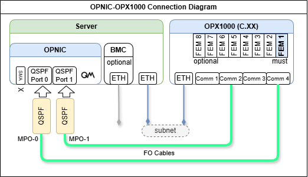
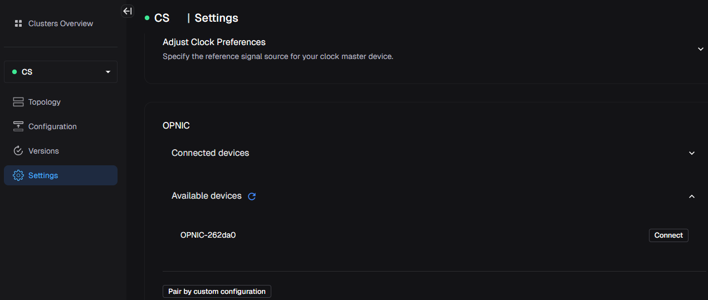
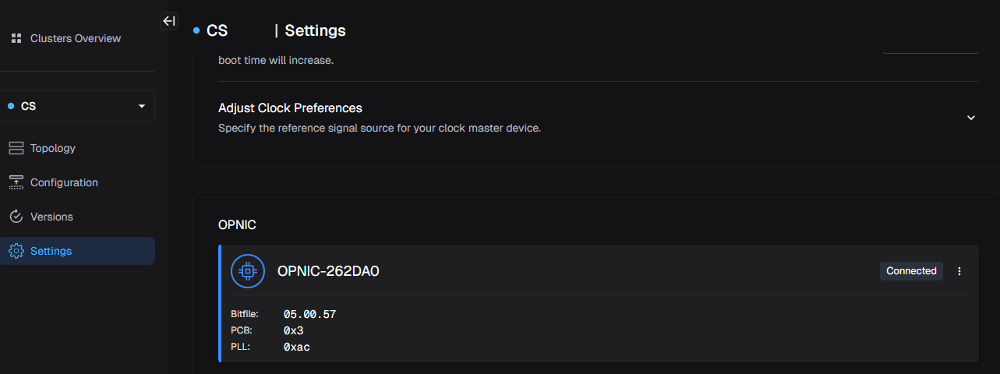
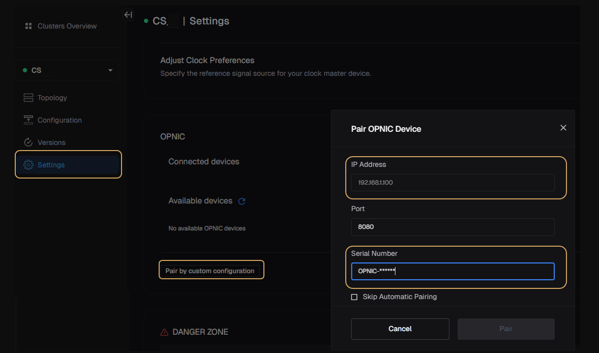

# OPNIC Installation Guide
The following page describes the installation procedure of an OPNIC - including connectivity to the OPX1000, configuration, and initialization as part of the QM Open Acceleration Stack.

## Components
### OPNIC Hybrid Link - Physical Components
- **OPNIC**: OP Network Interface Card, installed in the host server's PCIe port
- **Server**: Server / Computer driving the classical computation. Also referred to as the "**OPNIC host server**"
- **OPX1000**: Ultra low latency Quantum control and readout controller

### Server Installation
**Important**: Before proceeding with OPNIC installation, you must first complete the server setup. Follow the detailed instructions [here](#appendix-1-server-installation) to install all required dependencies.

### OPNIC Hybrid Link Software & Firmware Components
Software on the server consists of three open-source software components that are required to be installed on the server:

1. OPNIC Driver: A kernel driver for the OPNIC PCIe card
2. OPNIC SDK: A shared library that is used by user’s application on the server
3. OPNIC CLI tool: A CLI interface for managing the OPNIC (for example, a one-time sync with QOP, updating card FW, etc.)

!!! Warning
    Avoid running `sudo apt upgrade` on the server, as it may trigger unintended driver updates that are incompatible with the provided OPNIC drivers.

## OPNIC Installation in the host server

Step 4 can be used to update the OPNIC firmware.
If the system was previously configured, you can skip directly to step 4.

??? "Step 1: OPNIC Mechanical Assembly"

    1. Power down the server completely and disconnect it from all power sources, then install the OPNIC in the server's designated PCIe slot
        * Mechanical assembly manual example for tray-based riser server [OPNIC Assembly Guide](assets/opnic_installation_in_a_server.pdf)
        * Server types and PCIe mounts may differ; always follow the manufacturer’s instructions for your model.

    2. Power on the server and update the PCI device database:

        * Connect the server to the internet.
        * Run the following command: `sudo update-pciids`
        * Verify the OPNIC is properly recognized by running `lspci` and confirm you see the device listed as: **Serial controller: Quantum Machines OPNIC**

??? "Step 2: OPNIC Connection Schema"

    OPNIC communication requires an Ethernet connection between the OPX1000 chassis and the server and an optical connection between the OPNIC and the OPX1000 chassis. Please follow these guidelines:

    * Make sure slot 1 is populated by an FEM or contact Quantum Machines support for an alternative connectivity configuration.
    * Connect the 2 QSFP-MPO adapters to the relevant ports in the OPNIC.
    * Connect the MPO optical cables from the OPNIC to the OPX1000 according to the diagram:

        - **Make sure to connect Comm 4 to the OPNIC port 0 (closer to SMA, notice orientation according to the sketch).**

        - **Make sure both MPO optical cables are identical and of the same length.**

        

        !!! Note
            The sketch illustrates the connection to a Rev. C chassis.

            If the OPNIC is connected to a Rev. B chassis, use the provided [adapter kit](assets/OPX1000%20Chassis%20B%20to%20C%20adapter%20kit.pdf), or use a patched MPO optical cables, which are sometimes pink.

    * Network Communication - Ethernet connections should be based on the specific site/IT connectivity guidelines.

        **Make sure you can ping the OPX1000 from the server. The easiest way is to ensure they are on the same subnet. Alternatively, routing can be defined, please contact your IT department for support.**

??? "Step 3: OPNIC Drivers Installation and Update"

    === "QOP >= 3.7.0"
        Starting from QOP 3.7.1 OPNIC is supported through QOPA2 and an automated service, enabling communication, synchronization and setup.

        1. Download the OPNIC software package [here](https://qmpublic.s3.amazonaws.com/OPNIC/opnic_releases_0.9.zip). Copy the directory into the server and unzip it.

        2. Add execute permissions:

            ```bash
            cd opnic-driver/scripts
            chmod +x install.sh
            chmod +x uninstall.sh
            cd ../..
            ```

        3. Install Driver:

            ```bash
            cd opnic-driver
            make
            sudo make install
            cd ..
            ```

        4. Install SDK:

            ```bash
            sudo apt install libssl-dev
            cd opnic-sdk
            cmake --preset cuda
            sudo cmake --build build -- install
            cd ..
            ```

        5. Verify installation of opnic libraries:

            ```bash
            ls -la /usr/local/lib
            ```
            And verify that the following files are present: `libopnic.so`, `libopnic-cuda.so`.

        6. Install cli service:

            ```bash
            cd opnic-service
            pip install --break-system-packages ./opnic_cli-0.1.1-py3-none-any.whl
            ```

            Continue according to system architecture:

            * ARM servers:

            ```bash
            cp ./opnic-service_0.1.0_arm64.deb /tmp/
            cp ./opnic-service-systemd_0.1.0_arm64.deb /tmp/
            sudo apt install /tmp/opnic-service_0.1.0_arm64.deb /tmp/opnic-service-systemd_0.1.0_arm64.deb
            cd ..
            ```

            * x64 servers:

            ```bash
            cp ./opnic-service_0.1.0_amd64.deb /tmp/
            cp ./opnic-service-systemd_0.1.0_amd64.deb /tmp/
            sudo apt install /tmp/opnic-service_0.1.0_amd64.deb /tmp/opnic-service-systemd_0.1.0_amd64.deb
            cd ..
            ```

        7. Install Avahi service and reboot your system:

            ```bash
            cd avahi-publisher
            chmod +x install.sh
            sudo ./install.sh
            cd ..
            sudo reboot now
            ```

        8. Check service is running and versions are up to date:

            ```bash
            systemctl status opnic
            ```

            response should look like this:

            ```bash
            ● opnic.service - Opnic service
                Loaded: loaded (/usr/lib/systemd/system/opnic.service; enabled; preset: enabled)
                Active: active (running) since Tue 2026-06-09 13:35:18 UTC; 11min ago
            ```

        9. Find your OPNIC S/N:

            ```bash
            opnic -vv version
            ```

            FPGA and PLL versions should show the S/N:

            ```bash
            Cli Version: x.x.x.x
            SDK Version: x.x.x.x
            Service version: x.x.x.x
            Driver version: x.x.x.x
            FPGA version [OPNIC-262xyz]: x.x.x.x
            PLL version [OPNIC-262xyz]: x.x.x.x
            ```

        10. Validate the server is accessible: Run the following command from another machine in the same subnet. Fill in your server's IP address.

            ```bash
            curl -v http://<server-ip>:8080
            ```

            Response should resemble the following:

            ```bash
            *   Trying <server-ip>:8080...
            * Connected to <server-ip> (<server-ip>) port 8080
            > GET / HTTP/1.1
            > Host: <server-ip>:8080
            > User-Agent: curl/8.5.0
            > Accept: */*
            >
            < HTTP/1.1 404 Not Found
            < Content-Length: 15
            < Server: Crow/master
            < Connection: Keep-Alive
            <
            404 Not Found
            * Connection #0 to host <server-ip> left intact
            ```

        11. Pair the OPNIC via the Admin Panel - select the correct OPNIC from "Available devices" according to it's S/N found in step 9, and click "Connect":
            
        12. Following system restart - the opnic pairing and sync will automate:
            

        For manual pairing mode (in case AVAHI installation skipped):

        13. Select 'pair by manual configuration' in QOPA and apply the S/N and IP address:
            
        14. Following system restart - the opnic pairing and sync will automate


    === "QOP < 3.7.0"

        1. Copy the OPNIC software package provided by Quantum Machines into the server
        2. Add execute permissions:

            ```bash
            cd opnic-driver/scripts
            chmod +x install.sh
            chmod +x uninstall.sh
            cd ../..
            ```

        3. Install Driver:

            ```bash
            cd opnic-driver
            make
            sudo make install
            cd ..
            ```

        4. Install SDK:

            ```bash
            sudo apt install libssl-dev
            cd opnic-sdk
            cmake --preset cuda
            sudo cmake --build build -- install
            cd ..
            ```

        5. Verify installation of opnic libraries:

            ```bash
            ls -la /usr/local/lib
            ```
            And verify that the following files are present: `libopnic.so`, `libopnic-cuda.so`.

        6. Install CLI:

            ```bash
            cd opnic-cli
            cmake . -B build -G Ninja
            sudo cmake --build build --target install
            cd ..
            ```

??? "Step 4: OPNIC Firmware Update"

    The OPNIC firmware consists of two separate images which can be updated using the OPNIC CLI tool:

    **FPGA Image**: The bitfile that is loaded into the OPNIC FPGA. This image is responsible for the PCIe interface and the communication with the OPX.

    **PLL configuration**: The OPNIC clock configuration, will rarely update.

    1. Check the version by running:

        ```
        opnic -vv version
        ```

    2. Validate that the output indeed shows the latest FPGA and PLL images:

        ```
        Image version: 05.00.57
        PLL Version: 0xac
        ```

    3. Update by flashing the latest image when versions are outdated:

        ```
        opnic flash --image <path_to_image>
        opnic flash --pll <path_to_pll_file>
        ```

        !!! Note
            Applicable when installing a new system or updating from a version earlier than *5.00.57*

            while connected to the internet run:
            ```
            sudo update-pciids
            ```

    4. Once the flash has ended, reset the card by running:

        ```
        opnic reset-card
        ```

    5. Restart the server:

        ```
        sudo reboot
        ```

    6. Firmware update is supported by new drivers.

        * Follow the driver installation steps described in Step 3.
        * Repeat Firmware validation upon completion.


## Appendix 1: Server Installation
OPNIC host server minimal configuration:

* OS:

    * Ubuntu Ver. 24.04
    * Fedora CoreOS 42.2x with GNU compiler 15.2.1

* GCC13
* CMake ≥ 3.25.5
* make
* NVIDIA Open kernel drivers compatible with GPU installed
* CUDA toolkit 12-8

### Recommended Installation Steps
!!! Warning
    * Server‑specific installation procedures may vary by vendor and hardware configuration. When in doubt, consult the system vendor.
    * The following installation notes apply to Ubuntu on Aarch64 or x64 systems. Make sure to install the NVIDIA drivers that match your configuration. Applying the wrong configuration may stall your system.

=== "Ubuntu 24.04 **ARM64**"
    ??? "1. Linux installation"
        - Download and install Ubuntu 24.04 ARM64 Server from: [link](https://cdimage.ubuntu.com/releases/24.04.4/release/)
        - Create a bootable USB drive (disk‑on‑key) and install the OS using a preferred USB imaging tool (e.g., Rufus or Ventoy).

    ??? "2. Install GCC13"

        Run the following commands:
        ```bash
        sudo apt install software-properties-common -y
        sudo add-apt-repository ppa:ubuntu-toolchain-r/test -y
        sudo apt update
        sudo apt install gcc-13 g++-13 -y
        # make gcc13 the default version
        sudo update-alternatives --install /usr/bin/gcc gcc /usr/bin/gcc-13 100
        sudo update-alternatives --install /usr/bin/g++ g++ /usr/bin/g++-13 100
        # verify
        gcc --version
        cc --version
        ```

        Update and run bashrc:
        ```bash
        grep -qxF 'export CC=gcc' ~/.bashrc || echo 'export CC=gcc' >> ~/.bashrc
        source ~/.bashrc
        ```

    ??? "3. Install cmake"

        Run the following commands:
        ```bash
        # download cmake installer
        wget https://github.com/Kitware/CMake/releases/download/v3.31.6/cmake-3.31.6-linux-aarch64.sh

        # grant execution permission
        sudo chmod +x cmake-3.31.6-linux-aarch64.sh

        # run it. agree to the license and type 'Y' when it asks if you want to install it in the default folder
        ./cmake-3.31.6-linux-aarch64.sh

        # move it to /opt
        sudo mv cmake-3.31.6-linux-aarch64/ /opt/cmake-3.31.6

        # add symbolic links in /usr/local/bin to point to the cmake you just installed
        sudo ln -sf /opt/cmake-3.31.6/bin/ccmake /usr/local/bin/ccmake
        sudo ln -sf /opt/cmake-3.31.6/bin/cmake /usr/local/bin/cmake
        sudo ln -sf /opt/cmake-3.31.6/bin/cmake-gui /usr/local/bin/cmake-gui
        sudo ln -sf /opt/cmake-3.31.6/bin/cpack /usr/local/bin/cpack
        sudo ln -sf /opt/cmake-3.31.6/bin/ctest /usr/local/bin/ctest

        # test
        cmake --version
        ```

    ??? "4. Install Ninja and make"

        Run the following command:
        ```bash
        sudo apt install ninja-build -y
        sudo apt install make
        ```

    ??? "5. Install and update NVIDIA driver"
        !!! Warning
            Make sure to install the NVIDIA drivers that match your configuration. Applying the wrong configuration may stall your system.
        Run the following commands to update the system and install the NVIDIA optimized Ubuntu kernel variant and reboot:
        ```bash
        sudo DEBIAN_FRONTEND=noninteractive apt purge linux-image-$(uname -r) linux-headers-$(uname -r) linux-modules-$(uname -r) -y
        sudo apt update
        sudo apt install linux-nvidia-64k-hwe-24.04 -y
        sudo reboot now
        ```

        !!! Note
            Running GH200 may require GPU memory onlining (required for unified memory architecture) - consult vendor:
            ```bash
            sudo sed -i 's/GRUB_CMDLINE_LINUX_DEFAULT="\(.*\)"/GRUB_CMDLINE_LINUX_DEFAULT="\1 memhp_default_state=online_movable"/' /etc/default/grub
            sudo update-grub
            sudo reboot now
            ```

        Updating NVIDIA driver:
        ```bash
        sudo apt-get install linux-headers-$(uname -r)
        wget https://developer.download.nvidia.com/compute/cuda/repos/ubuntu2404/sbsa/cuda-keyring_1.1-1_all.deb
        sudo dpkg -i cuda-keyring*.deb
        sudo apt-get update
        sudo apt-get install cuda-toolkit-12-8 -y
        sudo apt install nvidia-driver-590-server-open -y
        sudo reboot
        ```

        Check installation with:
        ```bash
        nvidia-smi
        ```

        To check and determine whether the CPU and GPU memory subsystems are up and functional, run the following commands
        ```bash
        lsmem
        ```

        map nvcc:
        ```bash
        grep -q 'export PATH=/usr/local/cuda-12.8/bin:$PATH' ~/.bashrc || echo 'export PATH=/usr/local/cuda-12.8/bin:$PATH' >> ~/.bashrc && source ~/.bashrc
        ```

    ??? "6. Validate correct gcc version"

        This step ensures the correct GCC version is used, as certain installations may inadvertently trigger a rollback to an earlier version
        ```bash
        # make gcc13 the default version
        sudo update-alternatives --install /usr/bin/gcc gcc /usr/bin/gcc-13 100
        sudo update-alternatives --install /usr/bin/g++ g++ /usr/bin/g++-13 100
        # verify
        gcc --version
        ```

=== "Ubuntu 24.04 **X86_64**"

    ??? "1. Linux installation"
        - Download and install Ubuntu 24.04.4 AMD64 Server from: [link](https://releases.ubuntu.com/noble/)
        - Create a bootable USB drive (disk‑on‑key) and install the OS using a preferred USB imaging tool (e.g., Rufus or Ventoy).

    ??? "2. Install GCC13"

        Run the following commands:
        ```bash
        sudo apt install software-properties-common -y
        sudo add-apt-repository ppa:ubuntu-toolchain-r/test -y
        sudo apt update
        sudo apt install gcc-13 g++-13 -y
        # make gcc13 the default version
        sudo update-alternatives --install /usr/bin/gcc gcc /usr/bin/gcc-13 100
        sudo update-alternatives --install /usr/bin/g++ g++ /usr/bin/g++-13 100
        # verify
        gcc --version
        cc --version
        ```

        Update and run bashrc:
        ```bash
        grep -qxF 'export CC=gcc' ~/.bashrc || echo 'export CC=gcc' >> ~/.bashrc
        source ~/.bashrc
        ```

    ??? "3. Install cmake"

        Run the following commands:
        ```bash
        # CMake 3.31.6 Installation
        wget https://github.com/Kitware/CMake/releases/download/v3.31.6/cmake-3.31.6-linux-x86_64.tar.gz
        tar -xzf cmake-3.31.6-linux-x86_64.tar.gz

        # move it to /opt
        sudo mv cmake-3.31.6-linux-x86_64 /opt/cmake-3.31.6

        # Create System-wide CMake Symlinks
        sudo ln -sf /opt/cmake-3.31.6/bin/cmake /usr/local/bin/cmake
        sudo ln -sf /opt/cmake-3.31.6/bin/cpack /usr/local/bin/cpack
        sudo ln -sf /opt/cmake-3.31.6/bin/ctest /usr/local/bin/ctest
        sudo ln -sf /opt/cmake-3.31.6/bin/ccmake /usr/local/bin/ccmake
        sudo ln -sf /opt/cmake-3.31.6/bin/cmake-gui /usr/local/bin/cmake-gui

        # test
        cmake --version
        ```

    ??? "4. Install Ninja and make"

        Run the following commands:
        ```bash
        sudo apt install ninja-build -y
        sudo apt install make
        ```

    ??? "5. Install and update NVIDIA driver"
        !!! Warning
            Make sure to install the NVIDIA drivers that match your configuration. Applying the wrong configuration may stall your system.
        NVIDIA CUDA Repository Setup
        ```bash
        wget https://developer.download.nvidia.com/compute/cuda/repos/ubuntu2404/x86_64/cuda-keyring_1.1-1_all.deb
        sudo dpkg -i cuda-keyring_1.1-1_all.deb
        sudo apt update
        ```

        NVIDIA Drivers 575 Installation
        ```bash
        sudo apt-get install nvidia-kernel-open-575 cuda-drivers-575 -y
        # CUDA Toolkit 12.8 Installation
        sudo apt install cuda-toolkit-12-8 -y
        ```

        CUDA Environment Setup
        ```bash
        grep -qxF 'export PATH=/usr/local/cuda-12.8/bin:$PATH' ~/.bashrc || echo 'export PATH=/usr/local/cuda-12.8/bin:$PATH' >> ~/.bashrc
        grep -qxF 'export LD_LIBRARY_PATH=/usr/local/cuda-12.8/lib64:$LD_LIBRARY_PATH' ~/.bashrc || echo 'export LD_LIBRARY_PATH=/usr/local/cuda-12.8/lib64:$LD_LIBRARY_PATH' >> ~/.bashrc
        source ~/.bashrc
        ```

        Check installation with:
        ```bash
        nvidia-smi
        ```

        To check and determine whether the CPU and GPU memory subsystems are up and functional, run the following commands
        ```bash
        lsmem
        ```

    ??? "6. Validate correct gcc version"

        This step ensures the correct GCC version is used, as certain installations may inadvertently trigger a rollback to an earlier version
        ```bash
        # make gcc13 the default version
        sudo update-alternatives --install /usr/bin/gcc gcc /usr/bin/gcc-13 100
        sudo update-alternatives --install /usr/bin/g++ g++ /usr/bin/g++-13 100
        # verify
        gcc --version
        ```

