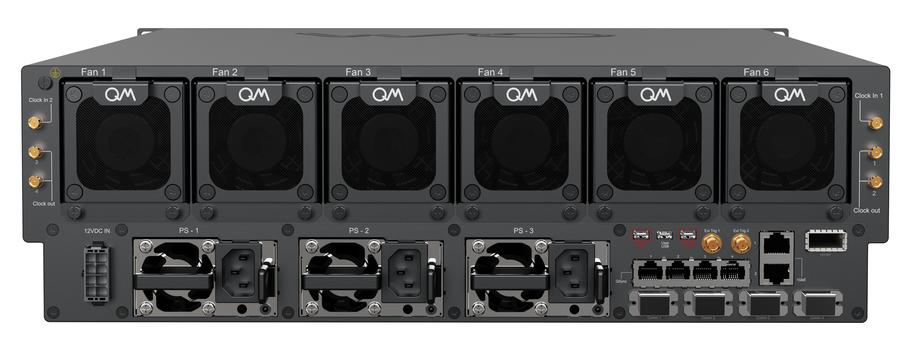

# OPX1000 Hardware Specifications

This page describes the hardware components of the OPX1000.

## General Specifications

The table below groups the main general characteristics of the OPX1000.

{{ read_csv("docs/Hardware/assets/opx1000_hw_general_spec.csv") }}

## Port Specifications

The tables below groups the main characteristics of the LF-FEM & MW-FEM ports.

{{ read_csv("docs/Hardware/assets/lffem_port_spec.csv") }}

{{ read_csv("docs/Hardware/assets/mwfem_port_spec.csv") }}

## Pulse Processor Block Diagram

The simplified block diagram model for the Pulse Processor can be seen below.

## Setting the Input Gain

The voltage gain can be set by adding a `"gain_db"` field to the `"analog_inputs"` field
of the controller in the config.
The values it can take, in 1 dB granularity, are:

* LF-FEM: -3 to 29 dB
* MW-FEM: 0 to 32 dB

!!! warning
    When the gain on the LF-FEM input is set to max attenuation, -3 dB, the maximal power that can be input to the ADC without significant distortion is 7 dBm.

    **Please avoid exceeding 4 dBm (0.5 V) on LF-FEM input & -10 dBm on MW-FEM input without attenuation. This may damage the controller.**

!!! Note
    In the LF-FEM, when changing the gain, the input DC offset needs to be recalibrated.

## Back Panel Description

The back panel of the OPX1000 is the interface for control, power and connectivity to other devices.
The following section details the back panel of the OPX1000 chassis.

{{ read_csv("docs/Hardware/assets/opx1000_back_panel_descr.csv") }}

!!! Note
    If the external trigger requires a low impedance port, its is advised to add a 50 $\Omega$ terminator to the line.
    See [Guide on External Triggering](../Guides/external_trigger.md) for more details regarding the usage of external triggering in the OPX.

