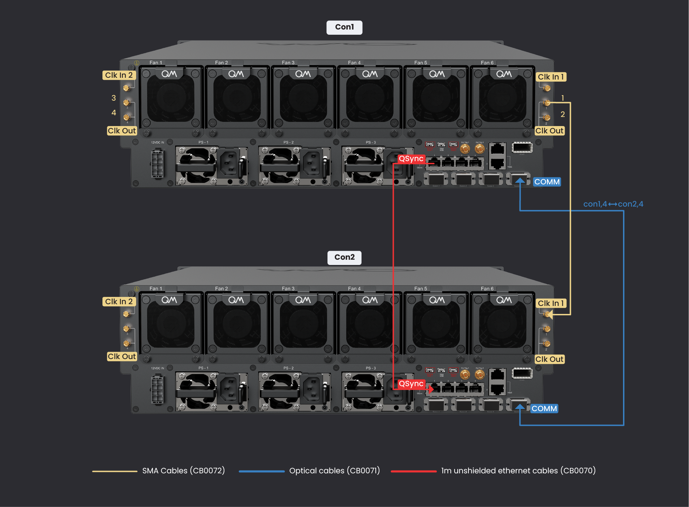
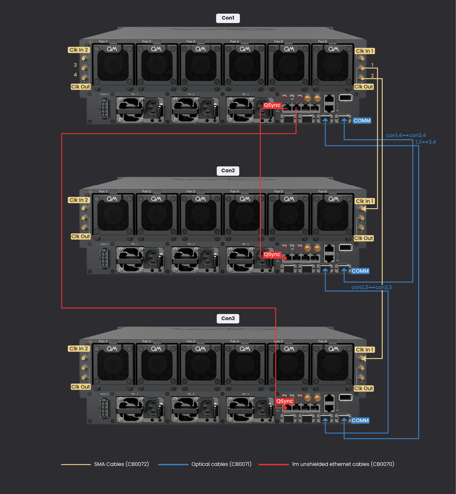
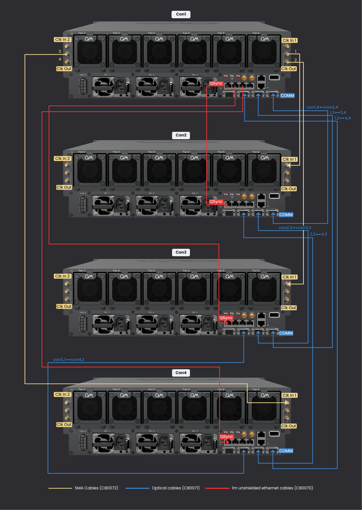
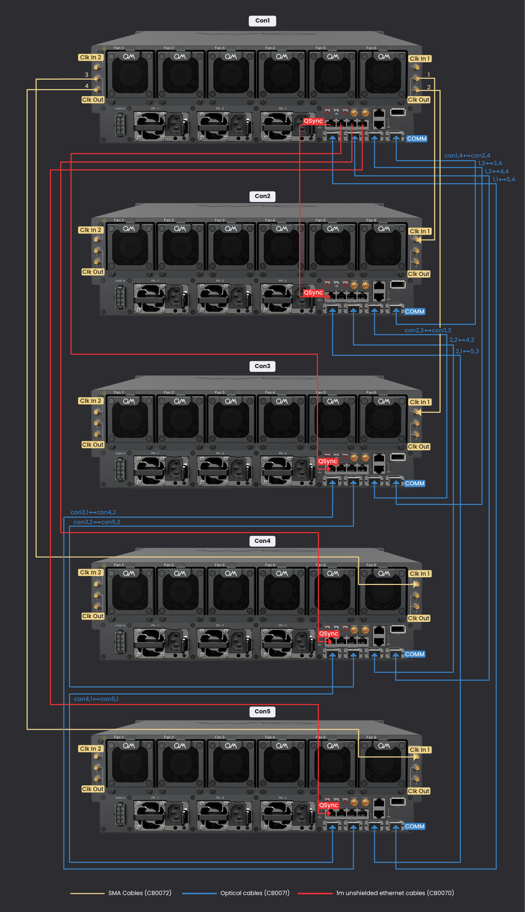
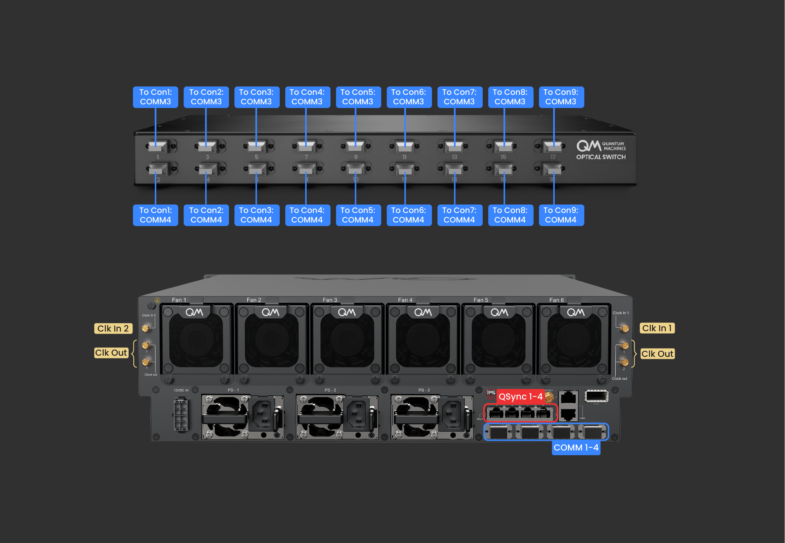
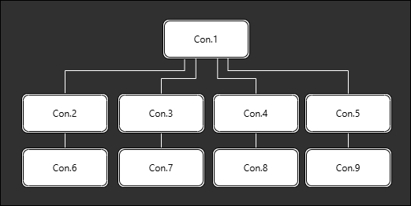

# OPX1000 Installation Guide

The following page describes the installation procedure of an OPX1000 system, and for systems with Octaves.
It covers network configuration, OPX1000 connectivity, rack scheme and more.

## Rack and Power Requirements

The rack and power requirements can be found [here](assets/OPX1000%20Rack%20and%20Power%20Requirements.pdf).

### Rack Mounting and Grounding Installation Guide

Instructions for rack mounting and grounding the OPX1000 can be found [here](assets/OPX1000%20Rack%20Mounting%20and%20Installation%20Guide.pdf).

!!! Note
    OPX1000 chassis shipped before May 2024 use an older rail revision that is not mechanically compatible with newer chassis.
    If you are rearranging the rack and have older chassis, please keep each rail pair with its original chassis.
    Do not leave rails installed in the rack and mount a different chassis generation on them.

## Cluster

A **cluster** is a synced, fully connected system of OPX1000 Chassis, Octaves, and other QM devices.
A cluster can comprise one or more OPX1000 and may or may not include Octaves.
All FEMs within a single OPX1000 chassis are automatically included in the cluster.

The cluster can be managed and configured via the Admin Panel. Through the Admin Panel, one can check the cluster's health status and topology,
restart the cluster, configure clock settings, access logs, and more. As detailed below, multiple clusters can exist in the same network and be managed by the Admin Panel.
The Admin Panel can be accessed by navigating to the OPX1000's IP address in your preferred web browser

## Installation Procedure

1. Verify you have all the [required components](#required-components-for-the-installation).
2. Mount the system in its designated place. Instructions for rack mounting the OPX1000 can be found [here](#rack-mounting-and-grounding-installation-guide).
3. Insert the FEMs into the chassis:
    1. Ensure the chassis is powered off before inserting or removing a FEM. Inserting or removing a FEM while the chassis is powered on can damage the FEM or the chassis.
    2. To prevent static discharge that can damage the FEM, please use the provided ESD gloves before touching or handling the FEMs.
    3. Slide FEM into an empty slot in the chassis.
    4. Ensure that the FEM is fully inserted and that the FEM panel is flush with the chassis panel. If it is not, check that the captive screws or ejectors are not obstructing the insertion.
    5. Secure the FEM in place using the captive screws.
    6. Repeat for all FEMs, also install the provided blank FEMs in any remaining empty slots.
        1. Turning on the system without all the FEM installed, or the blank FEMs, can cause the system to overheat, which will increase fan speed and can cause the system to shut down to protect itself from damage.

4. Determine your [network configuration](network_and_router.md#network-overview-and-configuration).
5. Connect the system:
    1. If there is more than one OPX1000:
        1. One OPX1000 is defined as the *main* OPX1000.
        2. Optional: Label each OPX1000 with its controller (con) number and IP address on both the front and back panels, to speed up connectivity and troubleshooting.
        3. QSync: Connect the others OPX1000's QSync port to the *main* OPX1000's QSync ports via the supplied QSync unshielded Ethernet cable. Please see the [connectivity scheme](#connectivity-scheme) for more details.
        4. Data: Connect the others OPX1000's Comm port to the *main* OPX1000's Comm ports via the supplied optical cables. Remove the connectors' protectors, if present, and press the optical cables firmly into the ports until a click is heard, ensuring a proper connection. Please see the [connectivity scheme](#connectivity-scheme) for more details.
        5. Clock: Connect the others OPX1000's clock input to the *main* OPX1000's clock outputs via the supplied SMA cables. Make sure to use the QM-provided cables, or alternatively make sure to use cables of the same type and length, to keep the distributed clock aligned across the chassis. Please see the [connectivity scheme](#connectivity-scheme) for more details.
    2. Octaves:
        1. If there are any Octaves, connect their clock inputs to any OPX1000's clock outputs.
        2. If all OPX1000es' clock outputs have been used, and there are still unconnected Octaves, then connect the Octave's clock input to other Octave's clock outputs.
    3. Optional: Connect any of the *main* OPX1000 clock inputs to an external reference clock.

        !!! Note
            When connecting an external reference clock, only one clock input can be active at a time.
            On chassis revision E and later, any unused clock input must be terminated with a 50 Ω SMA
            terminator or connected to a non-transmitting source — it must not be left floating.
            See [Connecting External Clock](../Guides/qop_clock.md#connecting-external-clock) for details.

    4. Connect the OPX1000 and Octaves Ethernet cables according to your preferred [network configuration](network_and_router.md#network-overview-and-configuration), selected in point 4.
    5. Connect the OPX1000 and Octaves to the power outlet. It is generally recommended to connect the OPX1000 power supplies to separate power outlets. See the [opx1000 power requirements section below](#opx1000-power-requirements) for more information.
    6. Connect the OPX1000 and Octaves grounding post to the grounding point. More information can be found [here](#rack-mounting-and-grounding-installation-guide).

6. Turn on all the devices.
7. Configure the cluster by following the [cluster configuration video](https://www.youtube.com/watch?v=ZVuvnJkSbDA), as described [below](#configuring-opx1000-and-octave). As part of clustering, the system installs an initial QOP version required to bring the cluster up. This step can take ~30 minutes.
8. Follow the [QOP installation guide](../Releases/qop_installation_guide.md) and install the latest QOP version.
9. Once the cluster is configured and the latest QOP version is installed, the system will start calibrations, and the boot sequence should take a few minutes.
10. Open a browser and type the system's IP in the address field to access the Admin Panel, where you can configure the system, check its status, and more. See the [network overview page](network_and_router.md#network-overview-and-configuration) for more details on how to access the cluster.
11. Install the latest Python package by typing `pip install --upgrade qm-qua` in the desired Python environment.
12. Open communication in Python using:
      ```python
      from qm import QuantumMachinesManager
      qmm = QuantumMachinesManager(host=qop_ip, cluster_name=cluster_name)
      ```
      You should see the message `qm - INFO - Health check passed` in the console.

      `cluster_name` is optional and only required for multiple clusters connected with a QM router (according to [network configuration](network_and_router.md#network-overview-and-configuration) A or C).

!!! Important
    When connecting SMA cables to the OPX1000 chassis or FEMs, always use a properly torqued wrench set to 0.3-0.6 Newton-meter (Nm). Applying excessive torque or over-tightening may damage the connectors.

!!! Note
    On the MW-FEM, the Analog Input ports protrude 0.75 mm more than the Analog Output ports. This difference is by design and does not affect functionality.


## Extra Topics

### OPX1000 power requirements

=== "Main electricity 100-127VAC (Mostly in the US, Canada, Japan)"

    The OPX1000 has two installed PSUs (power supply units) and room for a third, allowing for 2+1 PSU redundancy.

    If more than 4 FEMs are used, two PSUs must be used simultaneously to provide the system with sufficient power.
    They must be connected to separate wall outlets, as each PSU can carry up to 13A.
    A 3rd power supply can be added to achieve PSU redundancy.

=== "Main electricity 200-240VAC (Europe and most of the world)"

    The OPX1000 has two installed PSUs (power supply units) and room for a third, allowing for 1+2 PSU redundancy and 1+2 power grid redundancy.

    If multiple PSUs are used, they must be connected to separate wall outlets, as each PSU can carry up to 10A.
    It is also possible to achieve power-source redundancy by connecting the PSUs to different power grids.

!!! Important Safety Information
    The electrical connection must be made in accordance with the National Electrical Code (NEC) and/or the Standard for Electrical Connections (SEC), as applicable.
    Failure to follow these guidelines may result in equipment damage, safety hazards, or warranty voiding.

!!! Important Safety Information
    The system has a dedicated ground post that should be tightened to the infrastructure ground post.
    An unconnected ground cable may cause permanent system damage.

!!! Important Safety Information
    CAUTION! Shock hazard. The system has multiple AC power sources; disconnect all power sources before servicing the system!


### Required components for the installation

??? Information "List of Components"

    To ensure a smooth installation, please make sure you have the following components:

    {{ read_csv("docs/Hardware/assets/OPX1000_installation_components.csv") | add_indentation(spaces=4) }}


### Adding FEMs to an Existing System

To add one or more FEMs to an already-configured chassis:

1. Shut down the system.
2. Remove the blank FEMs from the target slots, then install the new FEMs following the physical installation steps in the [installation procedure](#installation-procedure), including the ESD-handling precautions.
3. Verify that all remaining unused slots still have blank FEMs installed, then turn on the system.

If the system is running QOP 3.6 or later and the new FEMs carry an older QOPF firmware version, the system does not complete its normal boot process. The topology screen in the Admin Panel displays a prompt to reinstall QOPF. Follow the on-screen instructions to update QOPF as described in the [QOP installation guide](../Releases/qop_installation_guide.md).

This procedure applies equally to all FEMs types.

### Connectivity Scheme

A multi-OPX1000 system has three required inter-OPX1000 connectivity groups: <span style="color: #b8860b;">Clock</span>, <span style="color: #8b0000;">QSync</span>, and <span style="color: #1e3a8a;">Communication</span>.
They are color-coded for clarity in the following tables and schematics.

Below is an explanation of each group, followed by a schematic for connecting the OPX1000es, and then followed by detailed tables showing the required connectivity.

<strong style="color: #b8860b;">Clock</strong>

The clock signal is distributed by the *main* OPX1000 with an SMA cable to each additional OPX1000.
The *main* OPX1000 can be connected to an external reference clock.
A single OPX1000 can distribute the clock for up to four additional OPX1000 and/or Octaves.

If more than five OPX1000 are used, a tree-like connectivity is needed: The *main* OPX1000 distributes the clock to OPX1000 2-5.
OPX1000 2-5 distributes the clock to additional OPX1000 units, etc. 
See the tables below for more details.

Please make sure to connect the OPX1000 to the clock output ports in order, starting from clock output port 1.
Always use clock input port 1.

If Octaves are used, please first connect the OPX1000 according to the table below, and then connect the Octaves to the remaining OPX1000 clock output ports, in order.

<strong style="color: #8b0000;">QSync</strong>

The QSync signal is passed between the OPX1000 via the supplied unshielded Cat6 RJ45 (Ethernet) cables.
A single OPX1000 can sync with up to four additional OPX1000s.
If more than five OPX1000 are used, a tree-like connectivity is needed: The *main* OPX1000 syncs OPX1000 2-5.
OPX1000 2-5 syncs the next OPX1000, etc.
See the tables below for more details.

Please make sure to connect the OPX1000 to the QSync Ports in order, starting from port 1.

<strong style="color: #1e3a8a;">Communication</strong>

Data transfer and communication between OPX1000s are performed via optical cables in an `all-to-all` connectivity model.
Each OPX1000 has 4 optical ports, and the minimal required connectivity differs with the number of OPX1000s,
as shown below.

Make sure to press the optical cables firmly into the ports until a click is heard, ensuring a proper connection.

!!! Note

    Chassis with revision starting with `C` (or newer), such as `C00` are not compatible with revision `B`, such as `B05`.
    To create a cluster with different chassis revisions, special adapters must be installed on all `B` chassis.
    The adapter kit installation guide can be found [here](assets/OPX1000%20Chassis%20B%20to%20C%20adapter%20kit.pdf).
    Please contact QM support for more information.
    The chassis revision can be found on the sticker on the back of the chassis, on the bottom left.

!!! Note

    There is a minimal number of FEMs needed per Chassis, depending on the number of OPX1000 in the system:

    - For 2-3 OPX1000, each one needs to have at least one FEM installed in slot 1.
    - For 4-5 OPX1000, each one needs to have at least two FEMs installed in slots 1 and 5.
    - For 6-32 OPX1000, each one needs to have at least four FEMs, installed in slots 1-4.

!!! Note

    The optical cables are not interchangeable and must be connected to the correct port as listed below.

#### Detailed Connectivity Diagrams

=== "2 OPX1000"

    Both OPX1000 need to have at least one FEM installed in slot 1.

    

    <strong style="color: #b8860b;">Clock</strong>

    | OPX1000 | Clock Out Port | OPX1000 | Clock In Port |
    |---------|----------------|---------|---------------|
    | 1       | 1              | 2       | 1             |

    <strong style="color: #8b0000;">QSync</strong>

    | OPX1000 | QSync Port | OPX1000 | QSync Port |
    |---------|------------|---------|------------|
    | 1       | 1          | 2       | 1          |

    <strong style="color: #1e3a8a;">Communication</strong>

    | OPX1000 | Comm Port | OPX1000 | Comm Port |
    |---------|-----------|---------|-----------|
    | 1       | 4         | 2       | 4         |


=== "3 OPX1000"

    All OPX1000s need to have at least one FEM installed in slot 1.

    

    <strong style="color: #b8860b;">Clock</strong>

    | OPX1000 | Clock Out Port | OPX1000 | Clock In Port |
    |---------|----------------|---------|---------------|
    | 1       | 1              | 2       | 1             |
    | 1       | 2              | 3       | 1             |

    <strong style="color: #8b0000;">QSync</strong>

    | OPX1000 | QSync Port | OPX1000 | QSync Port |
    |---------|------------|---------|------------|
    | 1       | 1          | 2       | 1          |
    | 1       | 2          | 3       | 1          |

    <strong style="color: #1e3a8a;">Communication</strong>

    | OPX1000 | Comm Port | OPX1000 | Comm Port |
    |---------|-----------|---------|-----------|
    | 1       | 4         | 2       | 4         |
    | 1       | 3         | 3       | 4         |
    | 2       | 3         | 3       | 3         |

=== "4 OPX1000"

    All OPX1000s need to have at least two FEMs installed in slots 1 and 5.

    

    <strong style="color: #b8860b;">Clock</strong>

    | OPX1000 | Clock Out Port | OPX1000 | Clock In Port |
    |---------|----------------|---------|---------------|
    | 1       | 1              | 2       | 1             |
    | 1       | 2              | 3       | 1             |
    | 1       | 3              | 4       | 1             |

    <strong style="color: #8b0000;">QSync</strong>

    | OPX1000 | QSync Port | OPX1000 | QSync Port |
    |---------|------------|---------|------------|
    | 1       | 1          | 2       | 1          |
    | 1       | 2          | 3       | 1          |
    | 1       | 3          | 4       | 1          |

    <strong style="color: #1e3a8a;">Communication</strong>

    | OPX1000 | Comm Port | OPX1000 | Comm Port |
    |---------|-----------|---------|-----------|
    | 1       | 4         | 2       | 4         |
    | 1       | 3         | 3       | 4         |
    | 1       | 2         | 4       | 4         |
    | 2       | 3         | 3       | 3         |
    | 2       | 2         | 4       | 3         |
    | 3       | 2         | 4       | 2         |

=== "5 OPX1000"

    All OPX1000s need to have at least two FEMs installed in slots 1 and 5.

    

    <strong style="color: #b8860b;">Clock</strong>

    | OPX1000 | Clock Out Port | OPX1000 | Clock In Port |
    |---------|----------------|---------|---------------|
    | 1       | 1              | 2       | 1             |
    | 1       | 2              | 3       | 1             |
    | 1       | 3              | 4       | 1             |
    | 1       | 4              | 5       | 1             |

    <strong style="color: #8b0000;">QSync</strong>

    | OPX1000 | QSync Port | OPX1000 | QSync Port |
    |---------|------------|---------|------------|
    | 1       | 1          | 2       | 1          |
    | 1       | 2          | 3       | 1          |
    | 1       | 3          | 4       | 1          |
    | 1       | 4          | 5       | 1          |

    <strong style="color: #1e3a8a;">Communication</strong>

    | OPX1000 | Comm Port | OPX1000 | Comm Port |
    |---------|-----------|---------|-----------|
    | 1       | 4         | 2       | 4         |
    | 1       | 3         | 3       | 4         |
    | 1       | 2         | 4       | 4         |
    | 1       | 1         | 5       | 4         |
    | 2       | 3         | 3       | 3         |
    | 2       | 2         | 4       | 3         |
    | 2       | 1         | 5       | 3         |
    | 3       | 2         | 4       | 2         |
    | 3       | 1         | 5       | 2         |
    | 4       | 1         | 5       | 1         |

=== "6-9 OPX1000"

    All OPX1000s need to have at least four FEMs installed in slots 1-4.

    An Optical Switch is needed for the communication connections.

    If using less than 9 OPX1000, simply omit the cables that are not needed.

    Note that the illustration below does not show all 9 controllers.

    

    QSync and Clock Connectivity Schema:
    

    <strong style="color: #b8860b;">Clock</strong>

    | OPX1000 | Clock Out Port | OPX1000 | Clock In Port |
    |---------|----------------|---------|---------------|
    | 1       | 1              | 2       | 1             |
    | 1       | 2              | 3       | 1             |
    | 1       | 3              | 4       | 1             |
    | 1       | 4              | 5       | 1             |
    | 2       | 1              | 6       | 1             |
    | 2       | 2              | 7       | 1             |
    | 2       | 3              | 8       | 1             |
    | 2       | 4              | 9       | 1             |

    <strong style="color: #8b0000;">QSync</strong>

    | OPX1000 | QSync Port | OPX1000 | QSync Port |
    |---------|------------|---------|------------|
    | 1       | 1          | 2       | 1          |
    | 1       | 2          | 3       | 1          |
    | 1       | 3          | 4       | 1          |
    | 1       | 4          | 5       | 1          |
    | 2       | 2          | 6       | 1          |
    | 2       | 3          | 7       | 1          |
    | 2       | 4          | 8       | 1          |
    | 3       | 2          | 9       | 1          |

    <strong style="color: #1e3a8a;">Communication</strong>

    | OPX1000 | Comm Port | Optical Switch Port |
    |---------|-----------|---------------------|
    | 1       | 3         |          1          |
    | 1       | 4         |          2          |
    | 2       | 3         |          3          |
    | 2       | 4         |          4          |
    | 3       | 3         |          5          |
    | 3       | 4         |          6          |
    | 4       | 3         |          7          |
    | 4       | 4         |          8          |
    | 5       | 3         |          9          |
    | 5       | 4         |         10          |
    | 6       | 3         |         11          |
    | 6       | 4         |         12          |
    | 7       | 3         |         13          |
    | 7       | 4         |         14          |
    | 8       | 3         |         15          |
    | 8       | 4         |         16          |
    | 9       | 3         |         17          |
    | 9       | 4         |         18          |


=== "10-32 OPX1000"

    All OPX1000s need to have at least four FEMs installed in slots 1-4.

    An Optical Switch is needed for the communication connections.

    If using less than 32 OPX1000, simply omit the cables that are not needed.

    <strong style="color: #b8860b;">Clock</strong>

    | OPX1000 | Clock Out Port | OPX1000 | Clock In Port |
    |---------|----------------|---------|---------------|
    | 1       | 1              | 2       | 1             |
    | 1       | 2              | 3       | 1             |
    | 1       | 3              | 4       | 1             |
    | 1       | 4              | 5       | 1             |
    | 2       | 1              | 6       | 1             |
    | 2       | 2              | 7       | 1             |
    | 2       | 3              | 8       | 1             |
    | 2       | 4              | 9       | 1             |
    | 3       | 1              | 10      | 1             |
    | ...     | ...            | ...     | ...           |

    <strong style="color: #8b0000;">QSync</strong>

    | OPX1000 | QSync Port | OPX1000 | QSync Port |
    |---------|------------|---------|------------|
    | 1       | 1          | 2       | 1          |
    | 1       | 2          | 3       | 1          |
    | 1       | 3          | 4       | 1          |
    | 1       | 4          | 5       | 1          |
    | 2       | 2          | 6       | 1          |
    | 2       | 3          | 7       | 1          |
    | 2       | 4          | 8       | 1          |
    | 3       | 2          | 9       | 1          |
    | ...     | ...        | ...     | ...        |

    <strong style="color: #1e3a8a;">Communication</strong>

    These configurations will be shipped with an Optical Switch that includes connection instructions.


### Configuring OPX1000 and Octave

??? Information "Check Devices IP"

    1. Connect the devices and a computer to the local network of the QM router (ports 2-10)
    2. In CMD run:
    ```
    ssh -o "UserKnownHostsFile=/dev/null" -o "StrictHostKeyChecking=no" -m hmac-sha1,hmac-md5 admin@192.168.88.1 ip arp print
    ```
    3. Identify the IP of the device using its MAC addresses. The MAC address is printed on a sticker on the device.

??? Information "Configuring the Device's IP"

    It is possible to change the IP addresses of the devices. If it is needed, please contact QM for assistance.

??? Information "Recovering access if the IP is unreachable"

    If a device becomes unreachable — because DHCP failed, or (from QOPA 2.1.0) because a static IP was misconfigured — the OPX1000 can still be reached over a link-local address. See [Recovering Access via a Link-Local Address](network_and_router.md#recovering-access-via-a-link-local-address).

??? Information "Cluster Devices"

    Follow the steps in [this video](https://www.youtube.com/watch?v=ZVuvnJkSbDA)

### Configuring the QM router

See [this page](network_and_router.md#configuring-the-qm-router).
