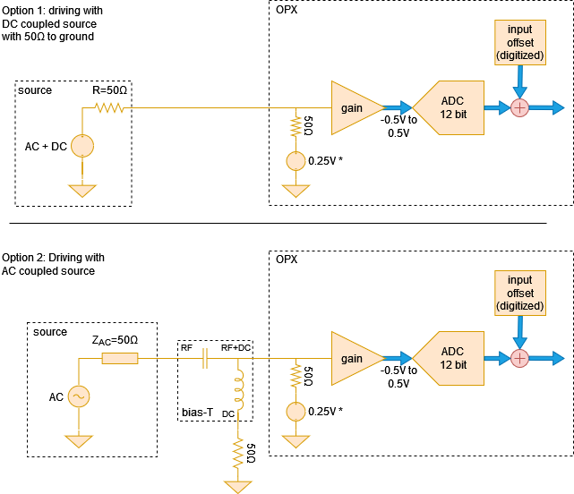
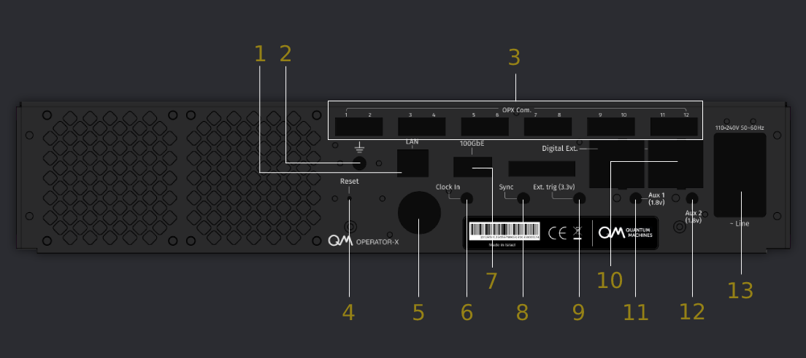
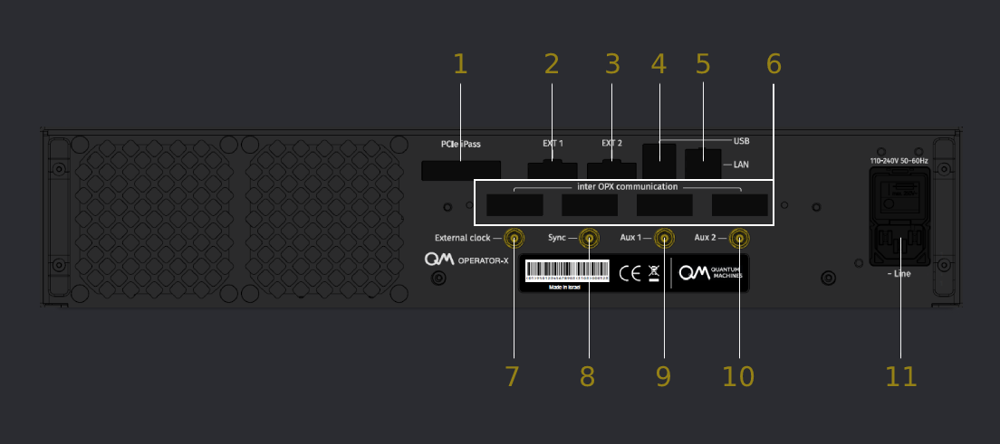
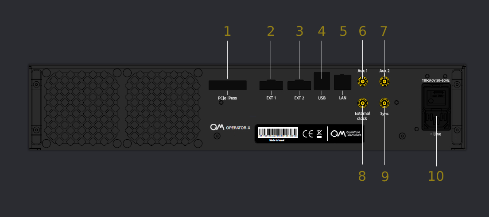

# OPX & OPX+ Hardware Specifications

This page describes the hardware components of the OPX & OPX+.


## Technical specifications

The table below groups the main characteristics of the OPX & OPX+ .

{{ read_csv("docs/Hardware/assets/technical_connectivity.csv") }}

## Port specifications

The table below groups the main characteristics of the OPX & OPX+ ports.

{{ read_csv("docs/Hardware/assets/port_connectivity.csv") }}

!!! Note
    If the external trigger requires a low impedance port, its is advised to add a 50 $\Omega$ terminator to the line.
    See [Guide on External Triggering](../Guides/external_trigger.md) for more details regarding the usage of external triggering in the OPX.

## OPX+ Block Diagram

The simplified block diagram model for the OPX+ can be seen below.


## Analog Input Stage

The signals acquired by the OPX using the analog input channels are first passed through an analog
input stage and then digitized. Here we discuss the voltage limits, gain and offset calibrations
that can be applied to the signal to be digitized.

### Acquiring analog signals with the OPX & OPX+



The signal source can be either AC or DC coupled:

=== "DC coupled signal source"

    If the signal source is DC coupled and has 50 ohm DC resistance to ground,
    it can be directly connected to the analog input. This can be seen in Option 1
    of Fig. 1

=== "AC coupled signal source"

    If the signal source is AC coupled and does not have a 50 ohm resistance to
    ground, a bias T is needed in order to bias the input amplifier. The
    required setup can be seen in option 2 of Fig. 1. In this case, the source
    will still need to have a 50 ohm AC impedance throughout its bandwidth for
    proper operation.

!!! important
    The OPX & OPX+ input has a common-mode voltage of 0.25 V when measured with 50 ohm.

### Setting the voltage gain

The voltage gain can be set by adding a `"gain_db"` field to the `"analog_inputs"` field
of the controller in the config.
It can take integer values between -12 dB to 20 dB.
Here we show an example with the relevant fields:

```python
config = {
    'version': 1,
    'controllers': {
        'con1': {
            'analog_inputs': {
                1: {'offset': 0.0, 'gain_db': -1},
                2: {'offset': 0.0, 'gain_db': 1},
            }
        }
    },
}
```

!!! warning
    When the gain is set to max attenuation, -12 dB, the maximal power that can be input to the ADC without significant distortion is 16 dBm or 4 Vpp.

    **Please avoid exceeding 4 dBm (1 Vpp) without attenuation. This may damage the controller.**

!!! Note
    When changing the gain, the input DC offset needs to be recalibrated.

## Back Panel Description

The back panel of the OPX is the interface for control, power and connectivity to other devices.
The following section details the back panel of the OPX and the OPX+ controllers. Click on the relavnt

=== "OPX+"

    !!! Important
        Some early back panels might have different labels. These which might appear different are marked with an astrix.
        The correct labels are the ones shown on this page.

    

    **Back Panel Description**

    {{ read_csv("docs/Hardware/assets/backpanelOPXp.csv") | add_indentation(spaces=4) }}


=== "OPX"

    The OPX has several back panel versions. Click on the toggle keys to view them.
    
    === "Multi-OPX connectivity version"
    
        
    
        **Back Panel Description**
    
        {{ read_csv("docs/Hardware/assets/backpanelOPX.csv") | add_indentation(spaces=8) }}
    
    
    === "Single OPX version"
    
        !!! Important
            Some early back panels might have different labels. However, the correct labels are the ones shown on this page.
    
        
    
        **Back Panel Description** 
    
        {{ read_csv("docs/Hardware/assets/backpanelOPX_no_gt.csv") | add_indentation(spaces=8) }}
    
