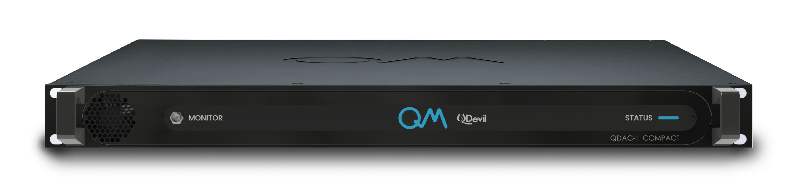
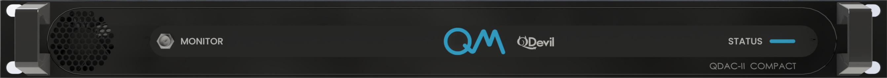
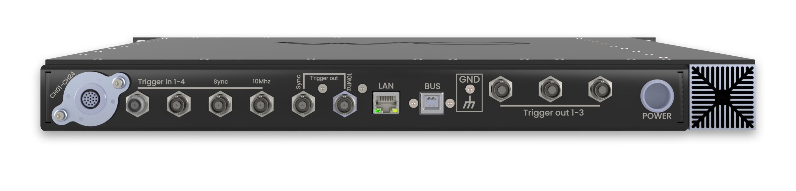

# QDAC

The QDAC is an extremely stable 24-channel voltage source, specifically designed to output low noise (<10 nV/$\sqrt{Hz}$), high resolution (25 bit) and ultra-stable ($\pm$2 $\mu$V in 2 weeks) voltages.
Each of the channels has five voltage generators working in parallel at a sample rate of 1MS/sec: A DC, sine, triangle, square, and arbitrary waveform generator.
Additionally, each channel is equipped with a DC current sensor with a resolution down to a few
tens of pA, and three switchable low pass filters (10 Hz, 10 kHz, 300 kHz).

## Manuals and firmware

Below you can find the links to the manuals and firmware updates for the QDAC-II (which includes the QDAC-II Compact) and the QDAC-I.

=== "QDAC-II (Compact)"

    - PDF version of the latest QDAC-II User Manual: [QDAC-II manual](https://qm.quantum-machines.co/hubfs/QDAC%20II%20-%20User%20manual%20v2.2%20(2024-01-17).pdf)
    - Firmware update version 13-1.57:
        - [Firmware updater windows*](https://qdevil-public.s3.eu-west-1.amazonaws.com/qdac2/qdac2-fw-update_13-1.57.exe)
        - [Firmware updater MacOS*](https://qdevil-public.s3.eu-west-1.amazonaws.com/qdac2/qdac2-fw-update-macos_13-1.57)
        - [Firmware updater Linux*](https://qdevil-public.s3.eu-west-1.amazonaws.com/qdac2/qdac2-fw-update-linux_13-1.57)
    - [Firmware release notes](https://6821620.hubspotpreview-na1.com/hubfs/QDAC-II%20Firmware%20release%20notes.pdf)
    
    !!! Important
        $*$ Please follow the instructions in the user manual on how to perform a firmware update.
        You must instruct Windows and MacOS that it is safe to run the executables.
        For MacOS you must go to Preferences -> Security&Privacy / General and allow execution of the updater.

=== "QDAC-I"

    - PDF version of the latest QDAC-I User Manual: [QDAC-I manual](https://6821620.hubspotpreview-na1.com/hubfs/All%20QDAC%20manuals.pdf)
    - [Firmware update version 1.07](https://qmmachines.sharepoint.com/:u:/r/sites/QE-Public/Shared%20Documents/SW%20distribution/QDAC%20Firmware%201.07.zip?csf=1&web=1&e=sKFMkL)
    - [Python 1.22 for firmware version 1.07](https://qmmachines.sharepoint.com/:u:/r/sites/QE-Public/Shared%20Documents/SW%20distribution/QDAC%20Python%201.22%20for%20firmware%201.07.zip?csf=1&web=1&e=S2OvEI)

=== "Previous firmware versions (QDAC-II)"

    - 13-1.54
        - [Firmware 13-1.54 updater Windows](https://qdevil-public.s3.eu-west-1.amazonaws.com/qdac2/qdac2-fw-update_13-1.54.exe) 
        - [Firmware 13-1.54 updater MacOS](https://qdevil-public.s3.eu-west-1.amazonaws.com/qdac2/qdac2-fw-update-macos_13-1.54)
        - [Firmware 13-1.54 updater Linux](https://qdevil-public.s3.eu-west-1.amazonaws.com/qdac2/qdac2-fw-update-linux_13-1.54)
    - 11-1.21
        - [Firmware 11-1.21 updater Windows](https://qdevil-public.s3.eu-west-1.amazonaws.com/qdac2/qdac2-fw-update_11-1.21.exe)
        - [Firmware 11-1.21 updater MacOS](https://qdevil-public.s3.eu-west-1.amazonaws.com/qdac2/qdac2-fw-update-macos_11-1.21)
        - [Firmware 11-1.21 updater Linux](https://qdevil-public.s3.eu-west-1.amazonaws.com/qdac2/qdac2-fw-update-linux_11-1.21)
    - 7-0.17.5
        - [Firmware 7-0.17.5 updater Windows](https://qdevil-public.s3.eu-west-1.amazonaws.com/qdac2/qdac2-fw-update_7-0.17.5.exe)
        - [Firmware 7-0.17.5 updater MacOS](https://qdevil-public.s3.eu-west-1.amazonaws.com/qdac2/qdac2-fw-update-macos_7-0.17.5)
        - [Firmware 7-0.17.5 updater Linux](https://qdevil-public.s3.eu-west-1.amazonaws.com/qdac2/qdac2-fw-update-linux_7-0.17.5)

## Drivers and code examples

=== "QDAC-II (Compact)"
    
    - The [QDAC-II QCoDeS driver](https://github.com/QCoDeS/Qcodes_contrib_drivers/tree/main/src/qcodes_contrib_drivers/drivers/QDevil) is located in the _QCoDeS_contrib_drivers_ repository.
    - QCoDeS coding examples can be found [here](https://qcodes.github.io/Qcodes_contrib_drivers/examples/QDevil/index.html).
    - Other miscellaneous Python applications and snippets can be found [here](https://github.com/QDevil/qdac2-tools).
    - [Labber driver v0.6](https://github.com/QDevil/qdac2-tools) (limited functionality).

=== "QDAC-I"

    - The [QDAC-I QCoDeS driver](https://github.com/QCoDeS/Qcodes_contrib_drivers/tree/main/src/qcodes_contrib_drivers/drivers/QDevil) is located in the _QCoDeS_contrib_drivers_ repository.
    - QCoDeS coding examples can be found [here](https://qcodes.github.io/Qcodes_contrib_drivers/examples/QDevil/index.html).
    - [Labber driver v1.01](https://qmmachines.sharepoint.com/:u:/r/sites/QE-Public/Shared%20Documents/SW%20distribution/QDAC%20Labber%20driver%20v1.01.zip?csf=1&web=1&e=VXMAhq).

## Front Panel

=== "QDAC-II Compact"

    

    The front panel features a indicator status LED as well as a monitor port that can be connected in parallel to any of the 24 output channels to monitor the applied output.

=== "QDAC-II"

    

    The front panel has 24 BNC connectors as the voltage outputs.
    Their shields are connected to the common chassis ground and the output series resistance is 50 ohms.
    In addition, three trigger outputs (no. 1-3) are in the right most column.
    Their shields and signals are galvanically isolated from the rest of the QDAC, to avoid ground loops.

## Back Panel

=== "QDAC-II Compact"

    

    On the left side of the back panel is the 24 channel Fischer connector carrying the QDAC-II Compact voltage outputs. The shields of all channels are connected to the common chassis ground and the output series resistance is 50 ohms for each channel.
    Furthermore, you can find the power, the USB, and LAN connectors on the back panel.
    The power is supplied by the Quantum Machines QPSU, which is a linear power supply with galvanic isolation to mains ground.
    Both the LAN and USB connectors feature galvanic isolation for both ground and signals, to avoid ground loops.
    
    There are four trigger inputs (no. 1-4) on the back panel, all galvanically isolated.
    No. 3 and 4 are also used as inputs for clock and synchronization to connect multiple QDAC-II Compact units.
    Furthermore there are five trigger outputs (no. 1-5) on the back panel, of which 3 are galvanically isolated and 2 are not galvanically isolated.
    These last two trigger outputs (no. 4-5) can also be used to synchronize multiple QDAC-II units.

=== "QDAC-II"

    

    Most important on the back panel are the power, the USB, and LAN connectors.
    The power is supplied by the Quantum Machines QPSU, which is a linear power supply with galvanic isolation to mains ground.
    Both the LAN and USB connectors feature galvanic isolation for both ground and signals, to avoid ground loops.
    
    There are four trigger inputs (no. 1-4) on the back panel, all galvanically isolated.
    No. 3 and 4 are also used as inputs for clock and synchronization to connect multiple QDAC-II units.
    Furthermore there are two trigger outputs (no. 4-5) on the back panel, which are **not** galvanically isolated.
    These trigger outputs can also be used to synchronize multiple QDAC-II units.
    
!!! important
    - If you are using the device rack-mounted, please ensure that it is galvanically isolated from the rack to avoid ground loops.
    - Preferably place the QPSU power supply as far away from the QDAC instrument as the cable permits, and preferably not on the same vertical axis, to minimize 50/60 Hz noise.
