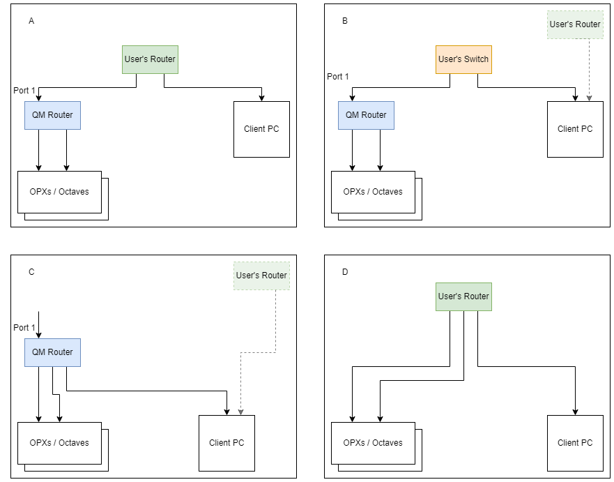
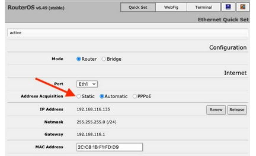
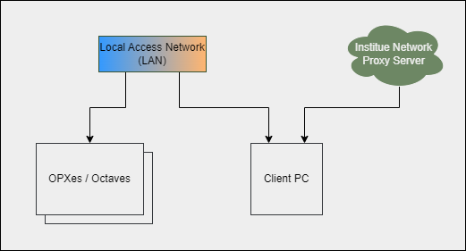
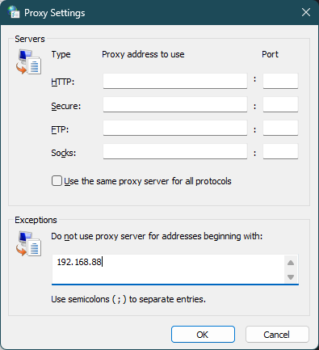
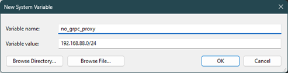

# Network Overview and Configuration

## Possible Network Configurations

We ship the OPXes & Octaves with an external router for network management (hereafter, the QM router). Using this router is optional.
There are a few possible network configurations, and each modifies how we access the cluster. 
We list below four possible configurations and details on accessing the cluster. Please choose your relevant configuration by clicking on the tabs under the figure. 



!!! Note
    If you plan to connect the system to your local network, please check if it requires whitelisting the MAC address.
    Depending on the configuration below, you might need to whitelist the supplied router MAC address or the individual devices' MAC addresses.
    All QM devices have their MAC address printed on them. To find the QM router MAC address, follow the [guide](#configuring-the-qm-router) below or contact your QM representative.

## Accessing the Cluster

=== "Option A"

    In this scenario, both the QM router and the client PC are connected to the institute's network, with the QM router listed as a device on the network. 
    All QM devices are in a local area network (LAN) behind the QM router.
   
    **Network Setup:** 
   
     1. If necessary, ensure the QM router is whitelisted with the institution's IT department.
   
     2. Connect the QM router to the network through port 1. By default, it will be assigned an IP through DHCP (Automatic).
    If a static IP is required, the IT department at the institution needs to provide it.
    More information on configuring the QM router can be found [here](#configuring-the-qm-router).  

    Accessing the web admin and connecting to the cluster using Python can be done in the following way:  

    === "QOP >= 2.2.x"
    
        There is one web admin panel for all devices and clusters that is accessible by typing the IP address of the QM router in a web browser. 
        If you are unsure what is the QM router's IP address is, see [here](#configuring-the-qm-router).
        Moreover, all clusters behind the router must have the same version for the admin panel to control them.
        
        To open a communication with the cluster in Python, use the following with the name of the cluster, as defined in the admin panel.

        ``` python
        qmm = QuantumMachinesManager(host='QM_Router_IP', cluster_name='My_cluster_name')
        ```

    === "QOP <= 2.1.x:"
    
        There is one cluster per router, and the web admin panel is available by typing in the IP address of the QM router in a web browser.
        If you are unsure what is the QM router's IP address is, see [here](#configuring-the-qm-router).
        
        To open a communication with the cluster in Python, use the following:

        ``` python
        qmm = QuantumMachinesManager(host='QM_Router_IP')  
        ```

=== "Option B"

      In this scenario the QM router and the client PC are connected to a local unmanaged switch.
      All QM devices are in a local area network (LAN) behind the QM router.

      **Network Setup:**

     1. Connect the QM router to the switch through **port one** .

     2. Set the QM router's IP to a static one, as required by the switch's LAN. Instructions can be found [here](#configuring-the-qm-router). 

    Accessing the web admin and connecting to the cluster using Python can be done in the following way:  

    === "QOP >= 2.2.x"
    
        There is one web admin panel for all devices and clusters that is accessible by typing the IP address of the QM router in a web browser. 
        If you are unsure what is the QM router's IP address is, see [here](#configuring-the-qm-router).
        Moreover, all clusters behind the router must have the same version for the admin panel to control them.
        
        To open a communication with the cluster in Python, use the following with the name of the cluster, as defined in the admin panel.

        ``` python
        qmm = QuantumMachinesManager(host='QM_Router_IP', cluster_name='My_cluster_name')
        ```

    === "QOP <= 2.1.x:"
    
        There is one cluster per router, and the web admin panel is available by typing in the IP address of the QM router in a web browser. 
        If you are unsure what is the QM router's IP address is, see [here](#configuring-the-qm-router).
        
        To open a communication with the cluster in Python, use the following:

        ``` python
        qmm = QuantumMachinesManager(host='QM_Router_IP')  
        ```

=== "Option C"

    In this scenario, the client PC is directly connected to the QM router.  
    The QM devices and the PC are in a local area network (LAN) behind the QM router.

    **Network Setup:**  

      1. Ensure that **port 1 is unused** on the QM router.

      2. Connect the other ports to the PC and QM devices.  
    
    !!! Note
        If your PC is connected to another network (e.g., for internet) with a proxy server, this may result in conflicts and may require excluding the QM router network (192.168.88.xxx) from the proxy. 
        To accomplish this, you can follow [this guide](network_and_router.md#proxy-settings) and ask for assistance from the institution's IT personnel.
        It is recommended to set all QM devices (e.g., OPXes and Octaves) to static IP addresses.  

    Accessing the web admin and connecting to the cluster using Python can be done in the following way:  

    ===  "QOP >= 2.2.x"  
    
        To access the web admin panel, type any device's IP in a web browser to access all clusters using the same QOP version.
        To find the IP of the devices connected, follow the steps [below](#configuring-the-qm-router)
        
        To open a communication with the cluster in Python, use the following:

        ``` python
        qmm = QuantumMachinesManager(host='MAIN_QM_OPX_IP') # If you have multiple clusters in the network, use the main OPX of each cluster 
        qmm = QuantumMachinesManager(host='ANY_QM_OPX_IP', cluster_name='My_cluster_name')
        ```
    ===  "QOP <= 2.1.x:"

        To access the web admin panel, type the IP of the main OPX of the cluster in a web browser.

        To open a communication with the cluster in Python, use the following:

        ``` python
        qmm = QuantumMachinesManager(host='Main_OPX_IP')
        ```

=== "Option D" 
    
    !!! warning
        This option is only officially supported from {{ requirement("QOP", "2.2") }}

    In this scenario, the QM router is unused, and all QM devices will be directly connected to your own network (typically a router).  
    
    !!! Note
        All QM devices shipped after June 2023 are configured to DHCP. Devices shipped before were configured with a static IP - 192.168.88.XXX.

    **Network Setup:**  
   
    1. Determine the IP requirements of your network, and set the devices' IPs accordingly. Contact QM support for assistance with changing IP addresses.
       If a static IP is required, it must be provided by the institution's IT department.
       Note that this frequently requires whitelisting the MAC addresses of all QM devices in advance.
   
    Accessing the web admin and connecting to the cluster using Python can be done in the following way:  

    ===  "QOP >= 2.2.x"  
    
        To access the web admin panel, type any device's IP in a web browser to access all clusters using the same QOP version.
        To find the IP of the devices connected, follow the steps [below](#configuring-the-qm-router)
        
        To open a communication with the cluster in Python, use the following:

        ``` python
        qmm = QuantumMachinesManager(host='MAIN_QM_OPX_IP') # If you have multiple clusters in the network, use the main OPX of each cluster 
        qmm = QuantumMachinesManager(host='ANY_QM_OPX_IP', cluster_name='My_cluster_name')
        ```

## Configuring the QM router

??? Router password
    
    The default username for the router is `admin` and he default password for the router, when received from QM, is blank.
    Some routers, when factory reset, will return to a default password which can be found on a sticker on the router.
    In order for the OPX to be able to configure the router, the password must be blank. 
    This can be changed via the GUI, or by using the command line interface (CLI) of the router:
        
    ```shell
    ssh -o "UserKnownHostsFile=/dev/null" -o "StrictHostKeyChecking=no" -m hmac-sha1,hmac-md5 admin@192.168.88.1
    # enter current password when prompted
    user set admin password=""
    ```

??? Information "Configuring the router to static IP"

    If static IP is needed for your system, follow these steps:

    === "QOP >= 2.2.x"

        1. Connect a computer to the router (to any port 2-10).
        2. Connect to the router web interface by typing in the browser `http://192.168.88.1:81`
        3. Click cancel in the change password dialog.
        4. Click **"Quick Set"** at the top banner.
        5. Set up the Static IP:
   
        
   
        6. Click **"apply configuration"** to save changes.
        7. Disconnect the computer from the router.
   
        !!! Note
            The router's IP and MAC addresses can also be seen on this page.

    === "QOP <= 2.1.x"

        1. Connect a computer to the router (to any port 2-10).
        2. Connect to the router web interface by typing in the browser `http://192.168.88.1`
        3. Click cancel in the change password dialog.
        4. Click **"Quick Set"** at the top banner.
        5. Set up the Static IP:
   
        
   
        6. Click **"apply configuration"** to save changes.
        7. Disconnect the computer from the router.
   
        !!! Note
            The router's IP and MAC addresses can also be seen on this page.


??? Information "View the router's IP and MAC addresses"

    Use the touch screen on the router's front panel to view information and optional configuration. At any stage you
    can click back and return to the previous screen.

    1. Click on **"Interfaces"** once

    2. Click on **"ether1"**

    3. To view the IP address press **"Addresses"** and to view the MAC address press **"Info"**


??? Information "Check Devices IP"
    
    1. Connect the devices and a computer to the local network of the QM router (ports 2-10)
    2. In CMD run: 
    ```
    ssh -o "UserKnownHostsFile=/dev/null" -o "StrictHostKeyChecking=no" -m hmac-sha1,hmac-md5 admin@192.168.88.1 ip arp print
    ```
    3. Identify the IP of the device using its MAC addresses. The MAC address is printed on a sticker on the device.

## Proxy Settings

### Introduction

This guide is tailored for environments where network access and proxy configurations may interfere with normal operations.
And in which the computer connected to the OPXes via a LAN (as shown in [configurations B & C above](#possible-network-configurations)) and is also connected to another network with a proxy server.
These are common in academic institutions, corporate environments, and other organizations with strict network policies.

[](assets/Network_configuration_proxy.png)

This guide provides instructions for configuring the proxy settings on the PC, by adding an exception for the LAN. 
These settings ensure uninterrupted communication with the OPX for both HTTP (Web admin panel) and gRPC protocols (Python job execution).

!!! Note

    All of the values that are written below (e.g. `192.168.88`, `192.168.88.0/24`) are for the default MikroTik network, as appears in [Option C](#possible-network-configurations).
    Please adjust these values according to your network configuration.

---

=== "Windows"
    
    ### Browser Access to the Admin Panel
    
    Follow these steps to configure proxy settings for browser access:
    
    1. Open **Control Panel > Network and Internet > Internet Options**.
    2. Go to the **Connections** tab and click **LAN settings**.
    3. In the **Proxy server** section, click on **Advanced**:
        - Add `192.168.88` under **Exceptions**. (Replace `192.168.88` with your LAN prefix, if it is different)
        - Click **OK**.
        - [](assets/proxy_http_windows.png)
    
    ### Job Execution Through Python
    
    1. Open the Start menu, search for **Environment Variables**, and click **Edit the system environment variables**.
    2. Click on  **Environment Variables**:
    3. Under **System variables**, click **New** and add the following:
        - Variable name: `no_proxy`
        - Variable value: `192.168.88.0/24` (Replace `192.168.88.0/24` with your LAN subnet, if it is different)
        - [](assets/proxy_grpc_windows.png)
    
    ### Command Line Tools (Advanced Usage)
    
    For connecting with a terminal (e.g., PowerShell, CMD), set environment variables temporarily for the session:
    
    ```powershell
    $env:NO_PROXY = "192.168.88.0/24"
    ```
     (Replace `192.168.88.0/24` with your LAN subnet, if it is different)

=== "macOS"

    ### Browser Access to the Admin Panel
    
    1. Open **System Preferences > Network**.
    2. Select the active network interface (e.g., Wi-Fi or Ethernet) and click **Advanced**.
    3. Go to the **Proxies** tab.
    4. If a proxy is enabled:
        - Uncheck the **Use Passive FTP Mode (PASV)** box.
        - Add your system’s LAN addresses to the **Bypass proxy settings for these Hosts & Domains** field (e.g., `192.168.88.*` or `192.168.88.0/24`).
    
    ### Job Execution Through Python
    
    1. Open the Terminal and edit the shell configuration file (e.g., `.zshrc` or `.bash_profile`).
    2. Add the following lines:
    
        ```bash
        export no_proxy="192.168.88.0/24"
        ```
         (Replace `192.168.88.0/24` with your LAN subnet, if it is different)
    3. Save the file and run `source ~/.zshrc` or `source ~/.bash_profile`.

=== "Linux"

    ### Browser Access to the Admin Panel
    
    1. Open the network configuration tool for your desktop environment:
        - **GNOME**: Open **Settings > Network > Network Proxy**.
        - **KDE**: Open **System Settings > Network Settings > Proxy**.
    2. Set the **Proxy Method** to **Manual** if a proxy is enabled.
    3. Add your system’s LAN addresses to the **Ignore Hosts** or **No Proxy for** field (e.g., `192.168.88.*` or `192.168.88.0/24`).

    ### Job Execution Through Python
    
    1. Open a terminal and edit the shell configuration file (e.g., `~/.bashrc`, `~/.bash_profile`, or `/etc/environment` for system-wide settings).
    2. Add the following lines:

        ```bash
        export no_proxy="192.168.88.0/24"
        ```
         (Replace `192.168.88.0/24` with your LAN subnet, if it is different)
    3. Save the file and run `source ~/.bashrc` or `source ~/.bash_profile`.

!!! Note

    It is also possible to force the python client to ignore the proxy set by the environment variables by setting the `async_trust_env` parameter of the `QuantumMachinesManager` to `False`.