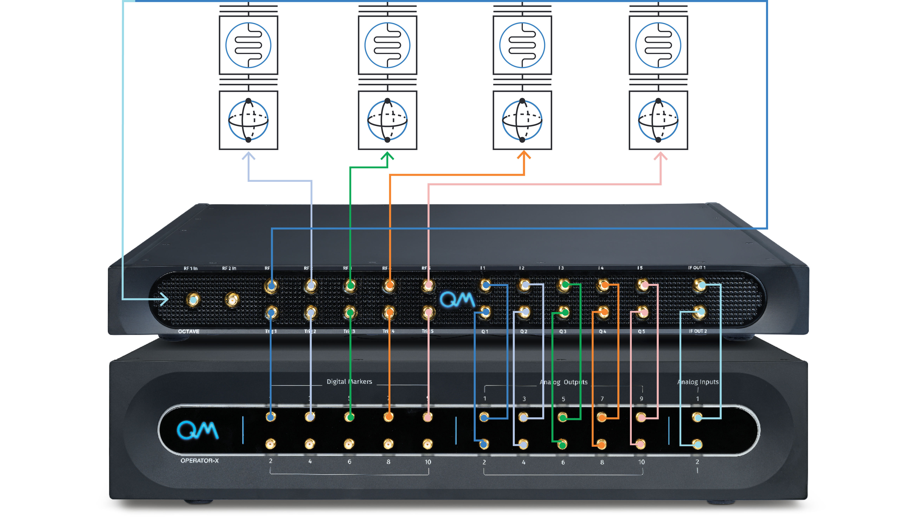
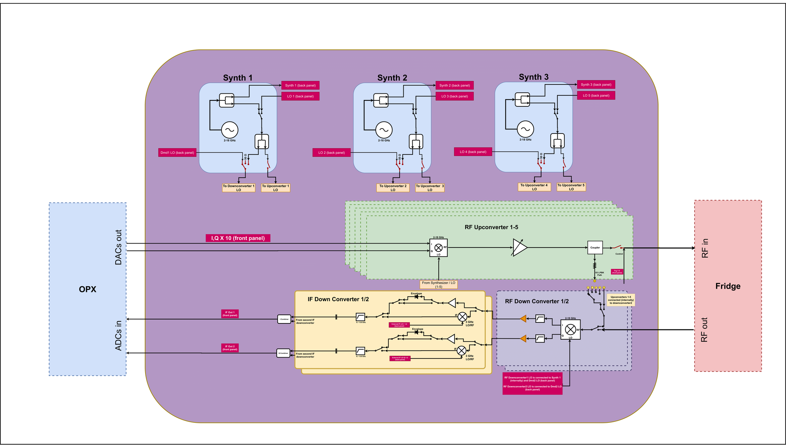
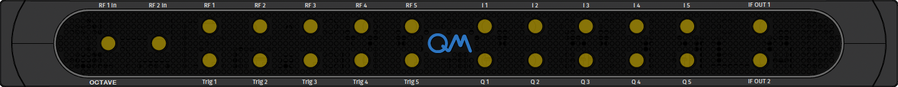
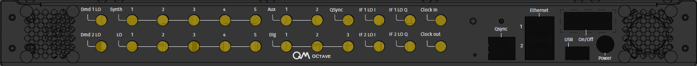

# Octave

The Octave is a complementary solution for enhancing the OPX capabilities by up- and down-converting its analog outputs,
creating a seamless RF front-end OPX. With the Octave, one can have up to five RF outputs and two combined RF inputs operating in a frequency band of 2GHz to 18GHz. The following page describes Octave's block diagram and port specifications. For a detailed user manual, see the [Octave guide](../Guides/octave.md)

## Octave Block Diagram

In the diagram, one can see all the internal and external connections of the octave.
It shows the three synthesizers and their connections to the five upconverters and two downconverters.
The diagram also shows all the internal routing one can configure to perform specific experiments
Using the following diagram one can plan the connections to and from an octave to best match one's experiment.

??? note "Requirements if using external LO"

    The synth to up-converters internal connectivity entails the following requirements:

    - If both up-converters 2 and 3 are being utilized, with one using an internal LO and the other using an external LO, the configuration must be set up as follows: up-converter 2 will utilize the external LO, and up-converter 3 will use the internal LO.
    - If both up-converters 4 and 5 are being utilized, with one using an internal LO and the other using an external LO, the configuration must be set up as follows: up-converter 4 will utilize the external LO, and up-converter 5 will use the internal LO.
    - If both up-converter 1 and down-converter 1 are being utilized, with one using an internal LO and the other using an external LO, the configuration must be set up as follows: down-converter 1 will utilize the external LO, and up-converter 1 will use the internal LO.

## Octave Front Panel

{{ read_csv("docs/Hardware/assets/octave_front.csv") }}

## Octave Back Panel

{{ read_csv("docs/Hardware/assets/octave_back.csv") }}

!!! important
    - Ports `synth 1/2/3` should always be kept terminated to 50Ω when not in use
    - For best performance, one should maintain a space of 1/3U at least above each octave
    - Network should only be connected to `Ethernet 2`
    - Use only the supplied power supplier
