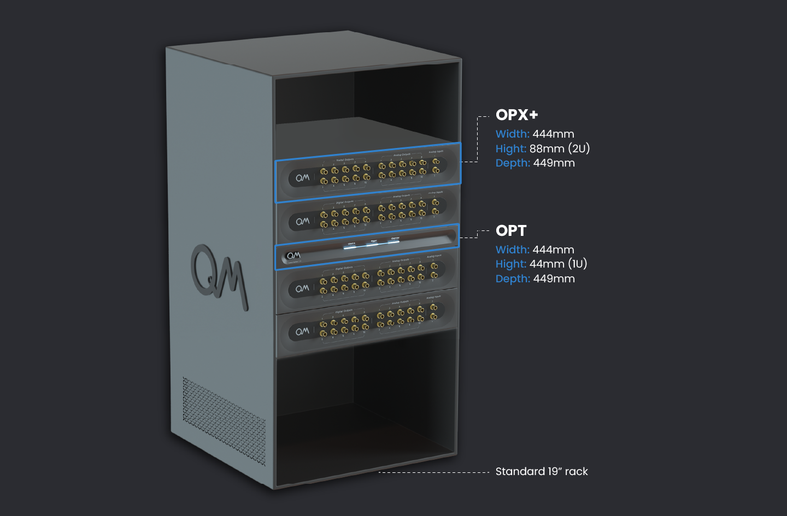
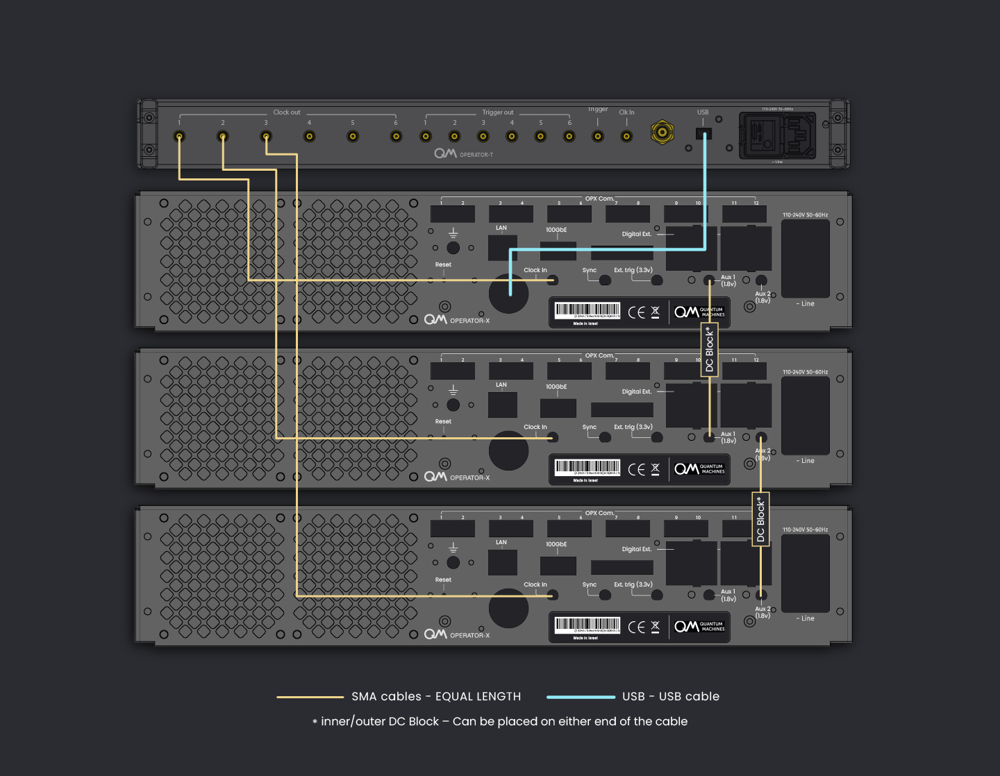
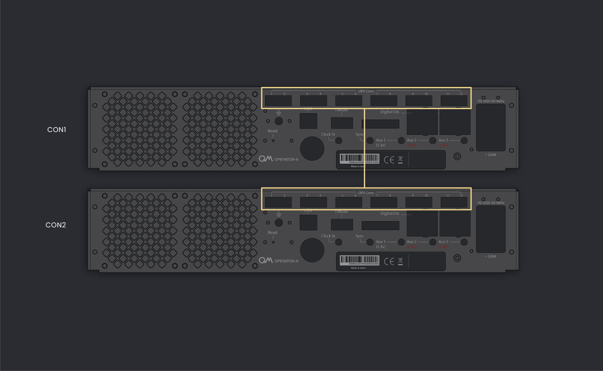
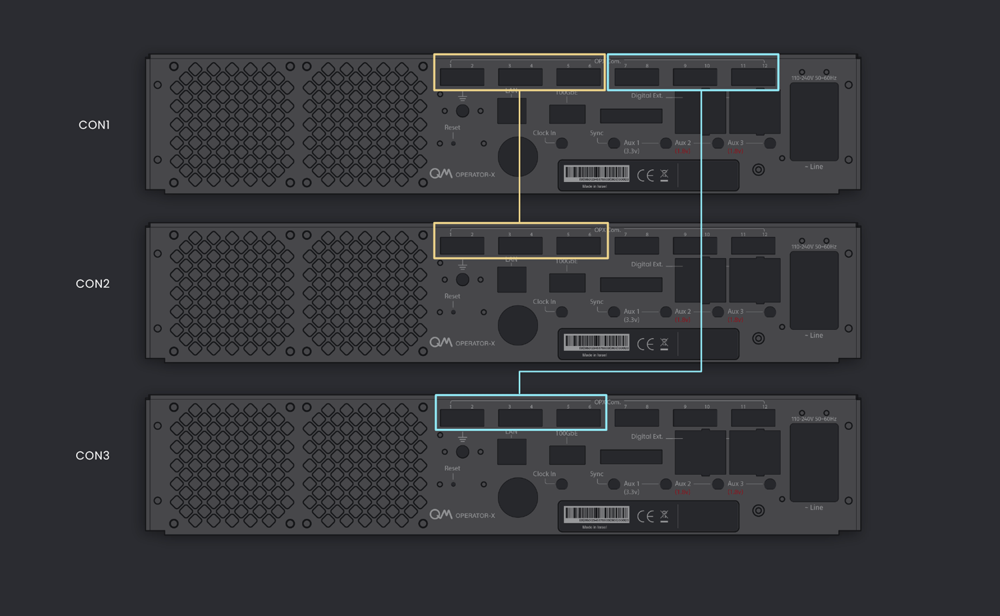
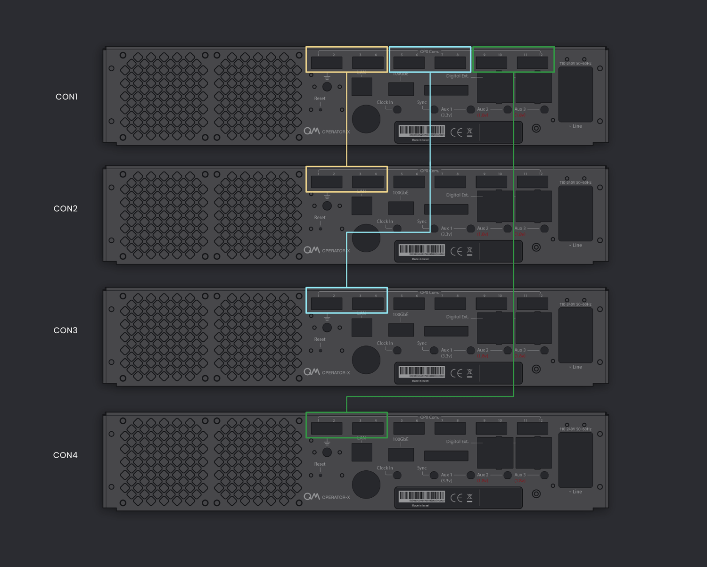
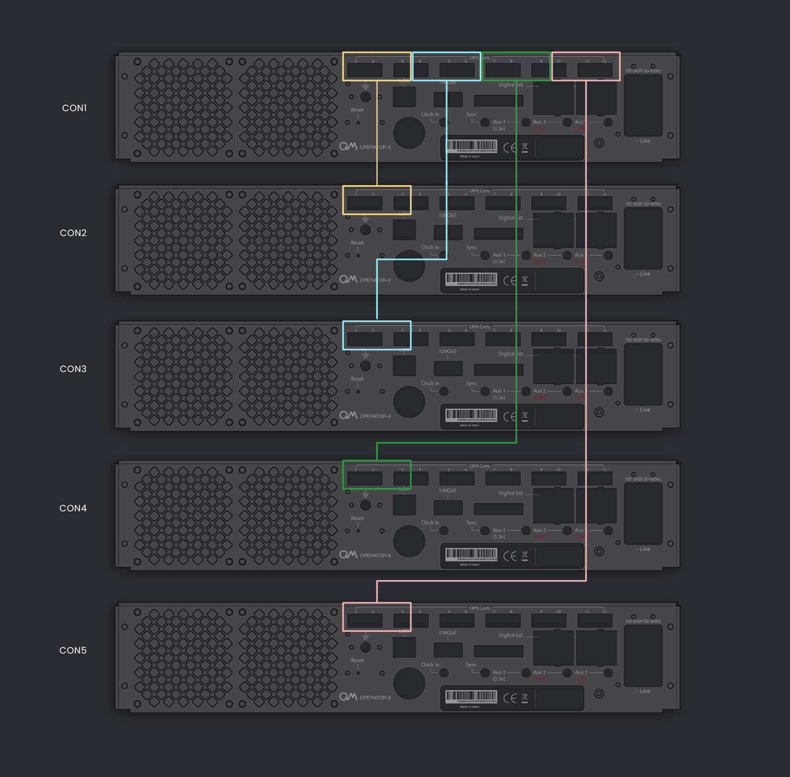
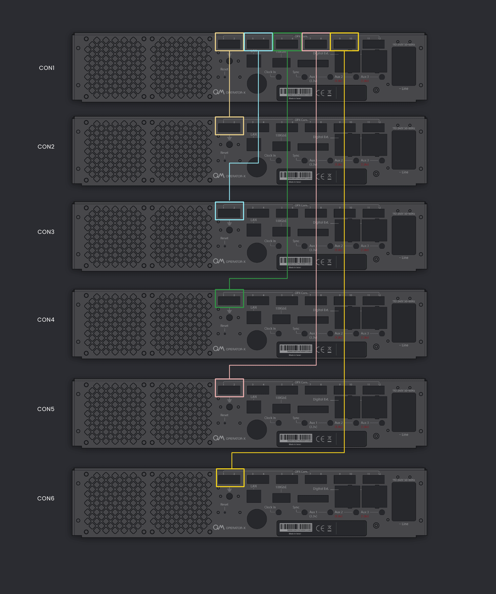

# OPX+ Installation Guide

The following page describes the installation procedure of a single OPX+, a multi-OPX+ in an OPT topology, and for systems with Octaves.
It covers network configuration, OPX+ connectivity, rack scheme and more.

## Cluster

A **cluster** is a synced and fully-connected system of OPX+ controllers, Octaves, OPTs, and other QM devices. 
A cluster can be comprised of a single OPX+, it can have multiple OPX+ (and for that, OPTs), and it may or may not include Octaves. 
For each cluster, there is a main OPX+ and, in the case of a multi-OPX system, secondary OPXs.

The cluster can be managed and configured via a web admin panel. Through the admin panel, one can check the cluster's health status and topology,
restart the cluster, configure clock settings, access logs, and more. As detailed below, multiple clusters can exist in the same network and be managed by the web admin panel.

## Hardware Installation Procedure

1. Verify you have all the [required components](#required-components).

2. Mount the system:

    === "Single-OPX+ System"
        
        Mount the OPX+ and the router in a rack or on a shelf.

    === "Multi-OPX+ System"
        
        Place the OPX+ controllers and the OPT in the rack according to the [rack scheme](#rack-scheme).

3. Determine your [network configuration](network_and_router.md#network-overview-and-configuration)

4. Connect the system:

    === "Single-OPX+"

        1. Connect the OPX+ to the power.
        2. Optional: Connect the OPX to an external reference clock.
        3. Connect the OPX+ to port 2 of the QM router, or to the user's router.

    === "Single-OPX+ with Octave"

        4. Connect the OPX+ clock input to the Octave clock output via an SMA cable.
        5. Optional: Connect the Octave to an external reference clock.
        6. Connect the OPX+ and octave to the power.
        7. Connect the OPX+ and octave to ports 2 & 3 of the QM router, or to the user's router.

    === "Multi-OPX+ (<= 6 devices)"

        Up to 6 devices - OPX+es and Octaves.

        Connect the cables according to the [connectivity scheme](#connectivity-scheme), in the following order:
        
        8. Connect the OPX+ and Octaves to the clock distributed from the OPT via an SMA cable.
        9. Connect the USB from the OPT to any USB port of the *main* OPX+.
        10. Optional: Connect the OPT to an external reference clock.
        11. Connect the OPX+ controllers via a SMA cable **with a DC block** to form a chain, as specified in the `clock & sync` section of the [connectivity scheme](#connectivity-scheme).
        12. Connect the optical cables used for data sharing between controllers. Remove the connectors' protectors if present.
        13. Connect the OPX+ and Octaves to the QM router via the ethernet cables, starting from port 2 onwards, or to the user's router.
        14. Connect the OPX+, Octaves and the OPT to the power outlet.

    === "Multi-OPX+ (>6 devices)"

        More than 6 devices - OPX+es and Octaves

        15. Use one OPT as a main OPT, connecting all other OPTs' *Clk In* to the main OPT clock outputs.
        16. Connect the USB from the *main* OPT to any USB port of the *main* OPX+.
        17. Connect the USB from the other OPTs to any USB port of other OPX+es.
        18. Optional: Connect the *main* OPT to an external reference clock.
        19. Connect the OPX+ and Octaves to the clock distributed from the OPTs via an SMA cable.
        20. Connect the OPX+ controllers via an SMA cable **with a DC block** to form a chain, connecting AUX i from one controller to another controller's AUX i (for i=1,2), as depicted in the Qsync connectivity below.
        21. Connect the optical cables used for data sharing between controllers. Remove the connectors' protectors if present.
        22. Connect the OPX+ and Octaves to the QM router via the ethernet cables, starting from port 2 onwards, or to the user's router.
        23. Connect the OPX+, Octaves and the OPTes to the power outlet.

5. Turn on all the devices.
6. When using new devices, configure the cluster, as shown [below](#configuring-opx-and-octave). This step can take ~30 minutes. 
7. Once clustered, the system will start calibrations, and the boot sequence should take a few minutes.
8. Open a browser and type the system's IP in the address field to access the admin panel where you can configure the system, check its status and more. See the [network overview section below](network_and_router.md#network-overview-and-configuration) for more details on how to access the cluster.
9. Install the latest Python package by typing `pip install --upgrade qm-qua` in the desired Python environment.
10. Open communication in Python using:
      ```python
      from qm import QuantumMachinesManager
      QuantumMachinesManager(*args)  
      ```
      This requires passing the correct arguments to the QuantumMachinesManager object. See "accessing the cluster" options [below](network_and_router.md#network-overview-and-configuration). 
      You should see the message `qm - INFO - Health check passed` in the console.


## Extra Topics

### Required components

??? Information "List of Components"


    To ensure a smooth installation, please make sure you have the following components:

    {{ read_csv("docs/Hardware/assets/OPX+_installation_components.csv") | add_indentation(spaces=4) }}

### Rack Scheme

??? Information "Rack scheme"

    The system fits a standard 19" rack. The sizes of the controllers are shown in the image below.
    The controllers can be mounted to the rack with the supplied adaptors or stacked on a shelf. The router can be
    rack-mounted at the back of the rack or simply stacked.
    For a system of more than 2 OPX+ controllers, it is recommended to place the OPT in the center of the stack, such
    that equal-length cables will reach all controllers.

    The image below demonstrates the preferable OPX+ controllers and OPT placement for a system of 4 controllers.

    

### Connectivity Scheme

The multi OPX+ system has four required connectivity groups. Clock & sync, Inter-controller communication, Network, and Power

??? Information "Clock & sync"

    The clock signal is distributed by the OPT with an SMA cable per controller.
    In addition, the **main** OPX+ of the cluster connects to the OPT via USB, to any of the 2 USB ports of the OPX+.

    A sync signal is passed between the controllers via SMA cables between the AUX ports. The connectivity should alternate
    between AUX1 (1.8 V) to AUX1 (1.8 V), and AUX2 (1.8 V) to AUX2 (1.8 V), as seen in the picture.
    An inner/outer DC block (supplied) is required to avoid potential damage to the devices and to reduce ground loops.

    !!! Note
        In some back panels, the labels are different. AUX1 is AUX2, and AUX2 is AUX3. The location of the port is the same as in the picture above.

    

??? Information "Inter-controller Optical Connectivity Scheme"

    Data transfer and communication between controllers are operated via optical cables in an `all-to-all` connectivity.
    Each OPX+ has 12 optical ports and the preferred connectivity configuration differs with the number of
    controllers, as shown in the animations below.

    Click on each configuration to see the **preferred** connectivity scheme.

    !!! Note
        The following is only a recommendation. Every configuration that establishes all-to-all connectivity is valid.
      

    === "2 OPX+"

        

    === "3 OPX+"

        

    === "4 OPX+"

        

    === "5 OPX+"

        

    === "6 OPX+"

        


### Configuring OPX+ and Octave

??? Information "Check Devices IP"
    
    1. Connect the devices and a computer to the local network of the QM router (ports 2-10)
    2. In CMD run: 
    ```
    ssh -o "UserKnownHostsFile=/dev/null" -o "StrictHostKeyChecking=no" -m hmac-sha1,hmac-md5 admin@192.168.88.1 ip arp print
    ```
    3. Identify the IP of the device using its MAC addresses. The MAC address is printed on a sticker on the device.

??? Information "Configuring the Device's IP"
    
    {{ requirement("QOP", "2.2") }} 
    It is possible to change the IP of the devices. If it is needed, please contact QM for assistance.

??? Information "Cluster Devices"

    {{ requirement("QOP", "2.2") }}
    Follow the steps in [this video](https://www.youtube.com/watch?v=ZVuvnJkSbDA)

### Configuring the QM router

See [this page](network_and_router.md#configuring-the-qm-router).
