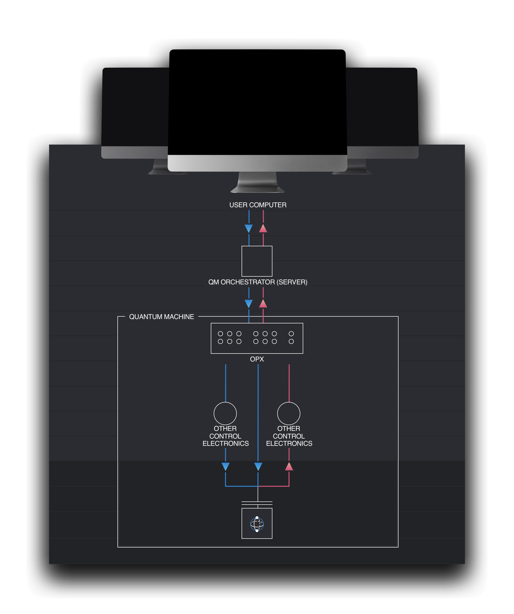
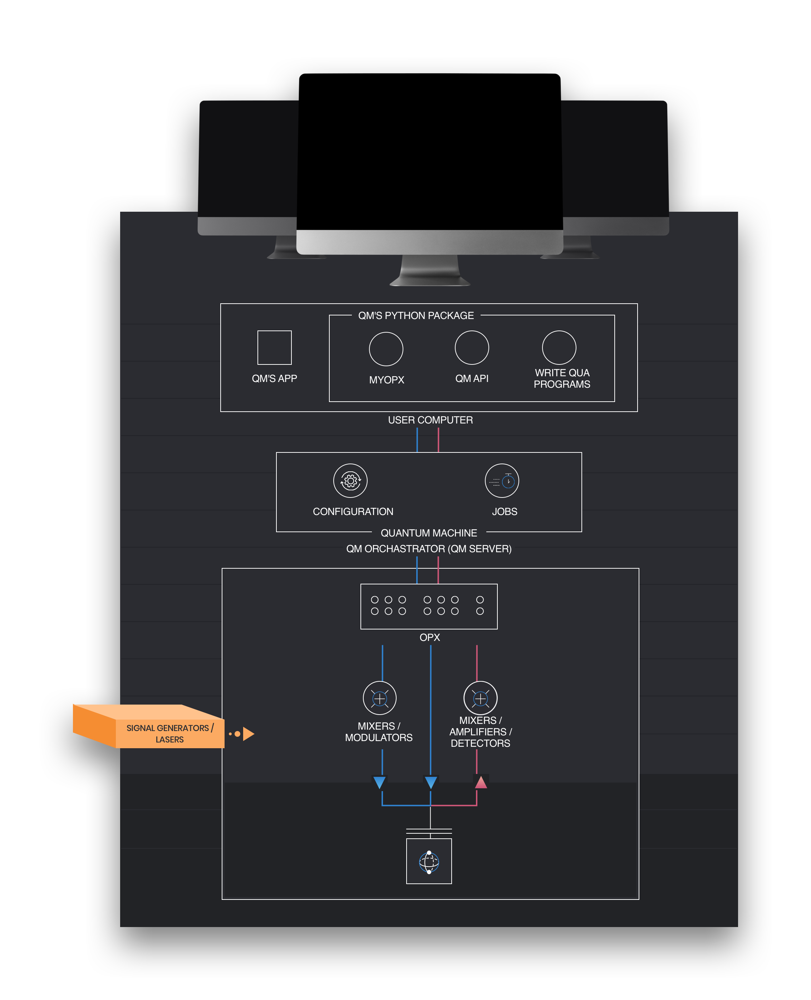
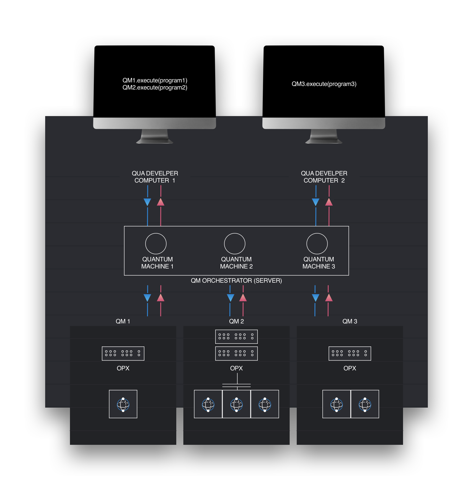
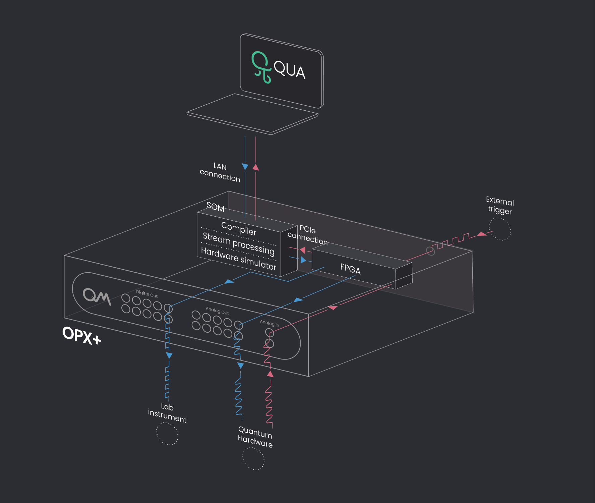

# QOP Conceptual Overview

This section describes the main concepts constituting the Quantum Orchestration Platform (QOP).

## Quantum Orchestration Platform

QM's Quantum Orchestration Platform (QOP) is a hardware and software platform for designing quantum control protocols, executing them on a wide range of quantum hardware platforms and optimizing performance.
QOP is designed to meet the extremely demanding requirements of quantum control, including synchronized multi-channel pulse sequences, pulse parametrization, real-time classical calculations, complex flow control with real-time decision making, and ultra-low latency feedback.

## Quantum Machine

It is important to understand the QOP concept of a **Quantum Machine**.
As shown in the figure below, QOP's control hardware, the Operator-X (OPX), is integrated with your quantum system.

The combination of your quantum system and the OPX are referred to as a **Quantum Machine**. The Quantum Machine is configured using a python dictionary, containing the relevant parameters of the experimental setup and defining the possible operations.

Our programing language **QUA** allows programming complex protocols that run in **real-time** on the Quantum Machine.
Real-time execution of **QUA Programs** is made possible thanks to the QOP's unique compiler and FPGA-based Pulse Processor, thus saving huge amounts of time and resources, improving performance, and opening new possibilities in quantum experiments.

The **QM Orchestrator** is the system's core software component. The quantum developer communicates with QM Orchestrator using a Python package. See the figure below.

<figure markdown>
  
  <figcaption>Conceptual presentation of a quantum machine</figcaption>
</figure>

## QUA Development Environment

On the client's computer, the quantum developer communicates with the QOP using a Python package.

Via the desktop app, the user finds the orchestrator on the network, initialize communication with it, and manages QM's software versions and updates.

The Python package is used by the quantum developer to:

- Instantiate quantum machines and communicate with them (via the quantum machine API).
- Write QUA programs and execute them on quantum machines.
- Execute and simulate Qua programs.

Read more about the Python package features in the [QUA Langauge Features guide](../Guides/features.md).

<figure markdown>
  
  <figcaption>Quantum Machine and QUA Environment</figcaption>
</figure>

## Multi Quantum Machine Orchestration

As shown in the figure below, QOP can support many Quantum Machines in the same platform in a seamless way:

The orchestrator creates an abstraction of the quantum machines, which allows QUA developers to send programs from any client computer to be executed on any of the quantum machines.
Multiple QUA developers can work in parallel from one or more client interfaces.

<figure markdown>
  
  <figcaption>Scaled-up: multiple quantum machines, OPXs per machine, developers</figcaption>
</figure>

## Scalable Architecture

Multiple OPXs can be connected to a single quantum system, to allow working with a large number of qubits, while the software interface and in particular programing QUA programs, remains the same.

## Stack Overview

The execution of a program involves a seamless flow, starting from its definition on your lab PC, through the compilation in the OPX and ending in pulse transmission to the quantum hardware.
This flow can be seen in the figure below.

<figure markdown>
  
  <figcaption>Overview of QOP stack for a single OPX+</figcaption>
</figure>

### PC to QPU Flow 

The first step in executing a program is writing a configuration file and a QUA program in your lab pc.
When executing it, the program is sent to the SOM inside the OPX+. The compiler, inside the SOM, is responsible for converting the QUA into low-level instructions
and sending them to the FPGA. Inside the FPGA are 18 pulse processors designed to generate pulses which are then modulated by the internal oscillators.
The pulses are converted to analog signals using DACs and output through the front panel's analog ports.

### QPU to PC Flow

In addition to pulse transmission, the system can measure and analyze incoming pulses from the quantum hardware.
These pulses enter the analog input ports on the front panel and digitized by the ADCs. Then, a mathematical computation is performed on the signals and the relevant data, e.g., the demodulation results, is saved to the on-board memory.
Furthermore, the measurement results can be sent to the stream processing module, on the SOM, for further data manipulation and in turn are sent to the client PC.

### Additional Features

- It is possible to input an external trigger into the OPX+ through the back panel. This signal enters directly into the FPGA and influence the logical sequence.
- A notable feature of the OPX is its simulator. By transmitting a program from the lab PC to the hardware simulator within the SOM, users can anticipate the OPX's output for a given QUA program.

