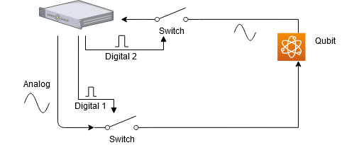

---
search:
  boost: 2.0
---

# Overview of QUA

A QUA program defines the sequence of:

1. Pulses sent to the quantum device.
2. Measurements of pulses returning from the quantum device.
3. Real-time classical calculations done on the measured data.
4. Real-time classical calculations done on general classical variables.
5. Real-time decision making that affects the flow of the program.

In addition to the specification of which pulses are played, it also specifies when they should be played through both
explicit and implicit statements and dependency constructs. Thus, a QUA program also defines exactly the timing in
which pulses are played, down to the single sample level.

The pulses syntax defines an implicit pulse dependency, which determines the order of pulse execution.
The dependency can be summarized as follows:

1. Each pulse is played immediately, unless dependent on a previous pulse, transformation or calculation.
2. Pulses applied to the same quantum element are dependent on each other according to the order in which they are
   written in the program

We first describe in detail the pulses and measurement statements and their relation to the configuration and then list
and specify the language statements and data types.


QUA is a pulse-level-control programming language for quantum devices. This means that it allows programmers to control
the shapes and timing of the pulses that are sent to the quantum elements in the quantum device.
This enables programmers to perform operations on them, as well as set the timing and parameters of the measurement
sequences applied to the signals returning from the quantum elements.
Thus, the most basic statements in QUA are the {{f("qm.qua._dsl.play")}} and {{f("qm.qua._dsl.measure")}} statements.

## Play Statement

The most basic statement in QUA is the {{f("qm.qua._dsl.play")}} statement:

```python
play(pulse, element)
```

This statement instructs the OPX to send the indicated pulse to the indicated element. Importantly, the OPX will modify
or manipulate the pulse according to the element's properties defined in the configuration.

## Analog Waveform Manipulations

### Single Input Element

If the considered element has a single input, the pulse sent to it must be defined with a single waveform. For example, the configuration file would look like:

```python
'elements': {
    'qubit': {
        'singleInput': {
            'port': ('con1', 1),
            },
            'intermediate_frequency': 70e6,
            'operations': {
                'pulse1': 'pulse1'
            },
        },
    },
'pulses': {
    'pulse1': {
        'operation': 'control',
        'length': 16,
        'waveforms': {
            'single': 'wf1',
        },
    }
},
'waveforms': {
    'wf1': {
        'type': 'arbitrary',
        'samples': [0.49, 0.47, 0.44, ...]
    },
}
```

Let us denote the samples of the waveform by $s_i$. The {{f("qm.qua._dsl.play")}} statement instructs the OPX to modulate the waveform
samples with the `intermediate_frequency` of the element:

$$
\tilde{s_i} = A s_i \cos(\omega_{IF} t + \phi_F),
$$

Where $A$ is the [amplitude transformation](#amplitude-transformations), $\omega_{IF}$ is the intermediate frequency defined in the configuration of the element and $\phi_F$
is the frame phase, initially set to zero (see the {{f("qm.qua._dsl.frame_rotation_2pi")}} function specifications for more
information).
The OPX plays $\tilde{s_i}$ to the analog output port defined in the configuration of the element
(port 1 in the above example).

### Mixed Inputs Element

If the element has two inputs (i.e. two output ports of the OPX are connected to the element via an IQ mixer), a `mixer`
and `lo_frequency` are also defined in the configuration. For example:

```python
'elements': {
    'qubit': {
        'mixInputs': {
            'I': ('con1', 1),
            'Q': ('con1', 2),
            'mixer': 'mixer1',
            'lo_frequency': 5.1e9,
        },
        'intermediate_frequency': 70e6,
        'operations': {
            'pulse1': 'pulse1'
        },
    },
},
```

A pulse that is sent to such element must be defined with two waveforms. For example:

```python
'pulses': {
    'pulse1': {
        'operation': 'control',
        'length': 12,
        'waveforms': {
            'I': 'wf_I',
            'Q': 'wf_Q',
        },
    },
},
'waveforms': {
    'wf_I': {
        'type': 'arbitrary',
        'samples': [0.49, 0.47, 0.44, ...]
    },
    'wf_Q': {
        'type': 'arbitrary',
        'samples': [-0.02, -0.03, -0.03, ...]
    },
}
```

In addition, a mixer must be defined with a mixer correction matrix that corresponds to the `intermediate_frequency`
and the `lo_frequency`. For example:

```python
'mixers': {
    'mixer1': [
        {'intermediate_frequency': 70e6, 'lo_frequency': 5.1e9, 'correction': [0.9, 0.003, 0.0, 1.05]}
    ],
}
```

Denoting the samples of the waveforms by $I_i$ and $Q_i$, the {{f("qm.qua._dsl.play")}} statement instructs the OPX to modulate
the waveforms with the intermediate frequency of the element and to apply the mixer correction matrix in the
following way:

$$
\begin{pmatrix} \tilde{I_i} \\ \tilde{Q_i} \end{pmatrix} = \begin{pmatrix} C_{00} & C_{01}\\ C_{10} & C_{11} \end{pmatrix} \begin{pmatrix} \cos(\omega_{IF}t+\phi_F) & -\sin(\omega_{IF}t+\phi_F)\\ \sin(\omega_{IF}t+\phi_F) & \cos(\omega_{IF}t+\phi_F) \end{pmatrix} \begin{pmatrix} A_{00} & A_{01}\\ A_{10} & A_{11} \end{pmatrix} \begin{pmatrix} I_i \\ Q_i \end{pmatrix} \label{pulse_output_chain}
$$

Where $\omega_{IF}$ is the intermediate frequency defined in the configuration of the element and $\phi_F$
is the frame phase, initially set to zero (see the {{f("qm.qua._dsl.frame_rotation_2pi")}} function specifications for more
information).
$A_{ij}$'s are the matrix element defining the [amplitude transformations](#amplitude-transformations).
$C_{ij}$'s are the matrix elements of the correction matrix defined in the mixer configuration for the relevant
`intermediate_frequency` and `lo_frequency`, see [The C Matrix](#the-c-matrix) for more information.
The OPX then plays $\tilde{I_i}$ and $\tilde{Q_i}$ to the analog output ports defined in the configuration
of the element (in the above example, port 1 and port 2, respectively).

#### The C Matrix

Just before a pulse leaves the pulse processor, it is multiplied by the C (correction) matrix to compensates the mixer gain and phase imbalances.
It is an arbitrary 2x2 transformation matrix multiplying the $(I,Q)$ vector supplied by the user:

$$
C = \begin{pmatrix} C_{00} & C_{01}\\ C_{10} & C_{11} \end{pmatrix}
$$

!!! Note
    The elements of C are limited to the range of $-2$ to $2 - 2^{-16}$ with a $2^{-16}$ accuracy.

The matrix values are specified for each element from the `correction` parameter in the `mixers` construct in the
configuration:

```python
'mixers': {
    'mixer1': [
        {'intermediate_frequency': 70e6, 'lo_frequency': 5.1e9, 'correction': [0.9, 0.003, 0.0, 1.05]}
    ],
}
```

The matrix can also be updated when a program is running by either:

- Using the Job API: {{f("qm.jobs.running_qm_job.RunningQmJob.set_element_correction")}}.
- Using the {{f("qm.qua._dsl.update_correction")}} function in QUA.

```python
# updating the C matrix associated with qubit
update_correction('qubit', C_00, C_01, C_10, C_11)
```

The dynamic correction parameters can of course be calculated in real time, based on, for example, the outcome of
measurements.

#### Amplitude transformations

The pulses amplitude can be changed via the `amp()` parameter inside the {{f("qm.qua._dsl.play")}} command:

```python
play(pulse*amp(A), element)
```

Where `A` can either be a matrix (In case that the element is a [Mixed Inputs Element](#mixed-inputs-element) or a Scalar (for both
kind of elements). If a scalar `A` is supplied to a [Mixed Inputs Element](#mixed-inputs-element), then it is multiplied by the identity
matrix)

!!! Note
    A is limited to the range of $-2$ to $2 - 2^{-16}$ with a $2^{-16}$ accuracy.

!!! Note
    This transformation requires real-time computation that can introduce gaps. It should only be used when the pulse amplitude needs to be updated during the program, either dynamically in QUA or manually.

For usage examples, see {{f("qm.qua._dsl.play")}}.

## Digital Waveform Manipulations

To understand how digital signals are treated, we will consider the following example: We output an analog signal
to a `qubit`, and then perform a readout of the same pulse as it returns from the `qubit`. Both the input and output are
gated by switches. This is shown in the figure below:



The signal going from the OPX has some propagation delay as it travels down the wire and towards the switch. The
returning signal will be further delayed by all of the elements until it reaches the second switch.
We therefore want to delay the digital signal such that the switch is open at the correct timing.
Additionally, there may be some dispersion broadening the analog pulse and we may want to take this effect into account.
Because they are associated with the physical configuration of the connections to the device (wire lengths, resonator
ring up times, etc). Setting up these parameters in QUA is done by setting the values as part of the quantum element
configuration.

!!! important
    The maximal number of digital routes is 12. That is, the total number of digital inputs that can be defined for all
    elements in a program. In addition, recording an ADC trace also uses a digital route.
    Attempting to declare more routes, will result in a failure to allocate resources.

!!! Note
    There is an intrinsic delay of the analog channel with respect to the digital channel of 136 ns.

### Configuring a digital pulse

To define a digital input of a quantum element the configuration must have the following three properties: `port`,
`delay`, and `buffer`. `delay` represents the signal propagation time and `buffer` defines the broadening of the
signal.
It is a symmetrical window before and after the analog pulse. Both parameters are in units of ns. Configuration is done
as follows:

```python
'elements': {
    'qubit': {
        'mixedInputs': {
            'I': ('con1', 1),
            'Q': ('con1', 2),
            'mixer': 'mixer1',
            'lo_frequency': 5.1e9,
        },
        'intermediate_frequency': 70e6,
        'digitalInputs': {
            'output_switch': {
                'port': ('con1', 1),
                'delay': 99,
                'buffer': 7,
            },
            'input_switch': {
                'port': ('con1', 2),
                'delay': 144,
                'buffer': 20,
            }
        },
        'operations': {
            'pulse1': 'pulse1'
        },
        'outputs': {
            'output1': ('con1', 1)
        },
        'time_of_flight': 184,
        'smearing': 0
    },
}
```

### Defining digital pulses

A pulse that is played to a quantum element with a digital input, can include a single digital marker which points to a
single digital waveform. For example:

```python
'pulses': {
    'pulse1': {
        'operation': 'control',
        'length': 40,
        'waveforms': {
            'I': 'wf_I',
            'Q': 'wf_Q',
        },
       'digital_marker': 'digital_waveform_high'
    },
},
'digital_waveforms': {
    'digital_waveform_high': {
        'samples': [(1, 0)]
    },
}
```

The encoding of the digital waveform is a list of the form: `[(value, length), (value, length), …, (value, length)]`,
where each value is either 0 or 1, indicating the digital value to be played (digital high or low).
Each length is an integer indicating for how many nanoseconds the value should be played.
A length 0 indicates that the corresponding value is to be played for the remaining duration of the pulse.
In the example above, the digital waveform is a digital high for the entire duration of the pulse.

!!! Note
    If the digital waveform is longer than the pulse length, then it will be truncated.

!!! Note
    Changing the pulse duration inside a {{f("qm.qua._dsl.play")}} command will not change the sequences of the digital waveform but will pad the
    digital waveform to fit the new pulse duration. For example, a digital waveform defined as `[(1,10), (0,10), (1,0)]`
    associated with some pulse of length 100, will have the same initial sequence `(1,10), (0,10)` and will be padded
    with 1's to fit the new pulse length upon using `play('pulse', 'qubit', duration=200)`

When such pulse is played to the element, via the {{f("qm.qua._dsl.play")}} or the measurement command, the digital waveform is sent to all
the digital inputs of the element. For each digital input the OPX performs the following:

- Delays the digital waveform by the `delay` that is defined in the configuration of the digital input (given in ns).
- For a simple waveform which is high for the entire duration, it expands the digital waveform by twice the `buffer`
  parameter, once from each side (given in ns) - See note below for the full behavior.
- Plays the digital waveform to the digital output of the OPX as defined in the associated quantum element.

!!! Note
    The digital waveform is actually convolved with a digital pattern that is high for $1 + 2b$, where `b` is the
    `buffer`.

In the example above a `play('pulse1', 'qubit')` command would play:

- A digital waveform to digital output 1, which starts 44 ns before the analog waveform ($136 - 99 + 7 = 44$),
  and is high for 54 ns (the length of the pulse plus 2\*7 ns).
- A digital waveform to digital output 2, which starts 12 ns before the analog waveform ($136 - 144 + 20 = 12$),
  and is high for 80 ns (the length of the pulse plus 2\*20 ns).

Where 136 ns is the intrinsic delay discussed above.

### Digital markers and quantum element readout

The output of a quantum element can be read by the OPX. Returning to the example we considered above, the same effects
of delay and dispersion can affect the readout. For this reason we configure the time-of-flight and smearing parameters,
which are identical to the delay and buffer we defined above, but are for the readout of the element's output.
This is discussed in detail in the [Demodulations and measurement](../Guides/demod.md) section.
The digital waveform used to define this behavior is called a digital marker and is a part of the way the OPX performs
a raw ADC stream readout. When a digital marker is not defined, a raw ADC stream will be measured as a list of zeros.
This is a common pitfall when taking raw analog data. We emphasize this point:

!!! warning
    Even if a measurement is performed without the need of a digital channel, a digital marker MUST be defined if an ADC
    stream is required.

## Frequency and phase transformations

In this section we describe how to control the frequency/phase matrix in Eq. $\eqref{pulse_output_chain}$.
A more detailed discussion on phase and frame can be found in [Phase and Frame in QUA](../Guides/phase_and_frame.md).

### Updating the frequency

The frequency associated with an element can be updated using the {{f("qm.qua._dsl.update_frequency")}} function in the
following way:

```python
# update frequency of element_1 to 10 MHz
update_frequency('element_1', 10e6)
# update frequency of element_1 with the value stored in the variable `frequency`
update_frequency('element_1', frequency)
# update the frequency with a continuous phase transition
update_frequency('element_1', frequency, keep_phase=True)
```

### Sub-Hz resolution

In the configuration, the element's frequency is defined in units of Hz. Sub-Hz resolution can be achieved by setting the `Units` parameter to the desired resolution. For example:

```python
# update frequency of element_1 with mHz accuracy
update_frequency('element_1', 100755, units='mHz')  # will set the frequency to 100.755 Hz
```

### Resetting the phase

One can reset the intermediate phase $\omega_{IF}t$ associated with a frequency using {{f("qm.qua._dsl.reset_if_phase")}}:

```python
# resetting the phase of element_1
reset_if_phase('element_1')
```

When using the MW-FEM, one can also reset the global phase using {{f("qm.qua._dsl.reset_global_phase")}}:


```python
# resetting the global phase
reset_global_phase()
```

### Updating the frame phase

Adding a fixed phase $\phi_F$ is possible using the {{f("qm.qua._dsl.frame_rotation_2pi")}} function:

```python
# setting the phase of element_1 to pi using the 2pi function
frame_rotation_2pi(0.5, 'element_1')

# setting the phase of element_1 to the value stored in variable phi
phi = declare(fixed)
assign(phi, 0.5)
frame_rotation_2pi(phi, 'element_1')
```

!!! Note
    The phase is accumulated with a resolution of 16 bit.
    Therefore, *N* changes to the phase can result in a phase inaccuracy of about $N \cdot 2^{-16}$.
    To null out this accumulated error, it is recommended to use {{f("qm.qua._dsl.reset_frame")}} from time to time.

### Resetting the frame phase

To reset the frame phase $\phi_F$ back to zero, the {{f("qm.qua._dsl.reset_frame")}} command can be used:

```python
# setting F to be the identity matrix (phi=0)
reset_frame('element_1')
```

## Measure statement

The measurement statement, {{f("qm.qua._dsl.measure")}}, is one of the most complex statements in QUA, and looks like this:

```python
measure(pulse, element, stream_name, demod.full(integration_weights, variable), demod.full(integration_weights, variable))
```

It can only be done for an element that has outputs defined in the configuration. For example:

```python
'elements': {
    'resonator': {
        'mixedInputs': {
            'I': ('con1', 3),
            'Q': ('con1', 4),
            'mixer': 'mixer1',
            'lo_frequency': 7.3e9,
        },
        'operations':{'pulse1':'pulse1'},
        'intermediate_frequency': 50e6,
        'outputs': {
            'out1': ('con1', 1),
        },
        'time_of_flight': 196,
        'smearing': 20,
    },
}
```

As seen in this example, when a quantum element has outputs, two additional properties must be defined:
`time_of_flight` and `smearing`.
The pulse used in a measurement statement must also be defined as a measurement pulse. If integration or demodulation
is to be used (as in the example have) then it must also have `integration_weights` defined. For example:

```python
'pulses': {
    'pulse1': {
        'operation': 'measurement',
        'length': 400,
        'waveforms': {
            'I': 'meas_wf_I',
            'Q': 'meas_wf_Q',
        },
        'integration_weights': {
            'integ1': 'integW1',
            'integ2': 'integW2',
        },
    },
},
'integration_weights': {
    'integW1': {
        'cosine': [0.0, 0.5, 1.0, 1.0, ..., 1.0, 0.5, 0.0]
        'sine': [0.0, 0.0, ..., 0.0]
    },
    'integW2': {
        'cosine': [0.0, 0.0, ..., 0.0]
        'sine': [0.0, 0.5, 1.0, 1.0, ..., 1.0, 0.5, 0.0]
    },
}
```

A measurement statement, such as the one shown above, instructs the OPX to:

1. Send the indicated pulse to the indicated element, manipulating the waveforms in the same manner that is described
   in the {{f("qm.qua._dsl.play")}} statement section above.
2. After a time period `time_of_flight` (given in ns), samples the returning pulse at the OPX input port/s that are
   connected to the output/s of the element. It saves the sampled data under `stream_name`
   (unless `stream_name` = `None`, in which case the sampled data will not be saved).
   The sampling time window will be of a duration that is the duration of the pulse plus twice the smearing
   (given in ns). This accounts for the returning pulse that is longer than the sent pulse due to the response of the
   quantum device, as well as for the cables and other elements in the pulse's path.
3. Demodulate the sampled data with a frequency `intermediate_frequency`, defined in the configuration of the element,
   perform weighted integration on the demodulated data with the `integration_weights` that are defined in the
   configuration, and put the result in the indicated variable. The OPX can perform multiple demodulations and
   integrations at any given point in time, which may or may not be a part of the same measurement statement.
   The precise mathematical operation on the sampled data is:

$$
\mathrm{variable} = \sum_i \tilde{s_i} \left[ w_c^i \cos(\omega_{IF} t_i + \phi_F) + w_s^i\sin(\omega_{IF} t_i + \phi_F)\right]
$$

where $\omega_{IF}$ corresponds to `intermediate_frequency`, $\phi_F$ is the frame phase discussed above, and $w_c^i$ and $w_s^i$ are the cosine and sine `integration_weights`, respectively.

For a more detailed description of the measurement operation, see [Measure Statement Features](../Guides/features.md#measure-statement-features).

The OPX also supports the demodulation of two outputs simultaneously, utilizing the following formula:

\begin{eqnarray}
\mathrm{variable} &= \sum_i \tilde{s}_{1i} \left[ w_{c1}^i \cos(\omega_{IF} t_i + \phi_F) + w_{s1}^i\sin(\omega_{IF} t_i + \phi_F)\right] \nonumber \\
              &+ \tilde{s}_{2i} \left[ w_{c2}^i \cos(\omega_{IF} t_i + \phi_F) + w_{s2}^i\sin(\omega_{IF} t_i + \phi_F)\right]
\end{eqnarray}

This feature, called dual demodulation, allows us to perform a demodulation process on two ADC signals simultaneously.
Further explanation can be found in the [dual demodulation section](../Guides/demod.md#dual-demodulation) section.

!!! Note
    The `integration_weights` are defined with a time resolution of 4 ns, while the sampling is done with a time resolution of 1 ns (1GSa/sec sampling rate):

    $$
    w_{c/s}^{4i} = w_{c/s}^{4i} + w_{c/s}^{4i+1} + w_{c/s}^{4i+2} + w_{c/s}^{4i+3}
    $$

## Multiple OPX timing and latencies

When operating with multiple controllers, an additional latency due to communication overhead might occur. This happens
in two cases:

1. When aligning two quantum elements which are on separate controllers, and it is impossible for the compiler
   to determine how long each of the elements will need to wait for the other (for example, due to a branching
   in the code)
2. When performing a measurement on a quantum element in one controller and using the result of that measurement
   to affect the playing of a quantum element in a different controller.

When transferring arrays, the latency will also increase with the length of the array.
