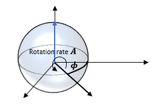

# Example Use Case

The quickest way to understand the QOP's unique approach and to start performing quantum computing experiments with it is through use case examples.

This section describes a typical use case example, end-to-end. The use case begins by discussing the theoretical background
of the experiment and its goals and showing a typical setup on which it is implemented. We then show, step by step,
how to program the QOP to perform this experiment, how to execute it, and how to retrieve the results.

## Goal of the Experiment

In this experiment, we want to measure Rabi oscillations that are oscillations of the qubit state when driven by a control signal.

Assuming that the qubit is initially in the ground state (state $\left|0\right>$), a drive pulse is applied to rotate it on the Bloch sphere around a rotation axis in the x-y plane. The qubit state is then measured by calculating the effect of the readout resonator (that is coupled to the qubit) on a measurement pulse.
Since the rotation angle, and consequently the probability to find the qubit in the excited state ($\left|1\right>$), depends on the amplitude of the drive pulse, this protocol is repeated with varying amplitudes ($a$). For averaging purposes, this sequence is itself repeated many times.
The extracted transition probability is then plotted as a function of the drive amplitude, exhibiting the so-called power Rabi oscillations. Note that the rotation angle induced by the drive can be calculated from the transition probability.

This experiment provides an important tool for calibrating quantum gates. For example, the amplitude at which the qubit reaches a rotation of 180 degrees gives us the required amplitude for performing an X-gate (the quantum NOT gate). Similarly, we can run this program to identify the amplitude required to perform a π/2-rotation.

## System Setup

An example of the quantum machine setup is shown in the figure below. The quantum device is a superconducting circuit composed of a single, fixed frequency qubit and a readout resonator, governed by the following Hamiltonian:

$$
H_0 = \frac{\hbar}{2}\omega_Q \sigma_z + \hbar \omega_R a^\dagger a + \hbar g (a^\dagger \sigma^- + a \sigma^+).
$$

Since the interaction between the qubit and resonator is dispersive ($|\omega_R - \omega_Q| \gg g$), we can make an approximation that leads to the following form of the Hamiltonian:

$$
H_0 = \frac{\hbar}{2}\left( \omega_Q + \frac{g^2}{\Delta}\right)\sigma_z + \hbar \left( \omega_R + \frac{g^2}{\Delta}\sigma_z\right)a^\dagger a,
$$

where $\Delta = \omega_Q - \omega_R$. Finally, we can explicitly include the qubit and resonator driving terms, leading to the total Hamiltonian:

$$
H = H_0 + \hbar s(t)\sigma_x + \frac{m(t)}{2}(a^\dagger e^{-i\omega t} + a e^{i\omega t}),
$$

where $s(t)$ and $m(t)$ are the qubit and resonator driving terms.

We assume that the frequencies of both the qubit and the resonator were calibrated in advance.

<figure markdown>
  
  <figcaption>Setup of the Quantum Orchestration System</figcaption>
</figure>

## Methodology

A signal, at the resonance frequency of the qubit, of the form

$$
s(t) = A\cos(\omega_Q t + \phi)
$$

rotates the Bloch vector of the qubit at a rate $A$ around the axis which is on the x-y plane and rotated by an angle $\phi$ from the x-axis:

<figure markdown>
  
  <figcaption>Qubit rotation</figcaption>
</figure>

If the parameters $A(t)$ and $\phi(t)$ are varied slowly compared to $\omega_Q$, then this still holds at each point in time. Thus, if a pulse is sent (i.e. a signal that is finite in time) to the qubit of the form

$$
s(t) = A(t) \cos(\omega_Q t + \phi)
$$

the Bloch vector will be rotated around the above axis by a total angle which is given by the integral of $A(t)$:

$$
\theta = \int_{t_0}^{t_0 + \tau} A(t) dt
$$

Here $t_0$ is the time at which the pulse starts and $\tau$ is the duration of the pulse.

In a typical Power Rabi Oscillations experiment, the shape and duration of the pulse $A(t)$ are fixed (e.g. a 20-nanosecond gaussian pulse) and only its amplitude is varied in order to get different rotation angles θ.
The experiment is performed by repeating the following basic sequence:

1. Initialize the qubit to the ground state $\left|0\right>$.
2. Apply a pulse with amplitude $a$ (e.g. $A(t)$ is a gaussian shaped pulse with peak amplitude $a$), which rotates the qubit by $\theta_a$ so that the qubit is in the state

$$
\cos(\theta_a)\left| 0\right> + \sin(\theta_a)e^{i\phi}\left| 1\right>
$$

3. Apply a resonant pulse to the readout resonator, and from the phase of the reflected pulse, deduce the state of the qubit.

This basic sequence is repeated in the program for a varying of amplitudes $a$, where for each amplitude, it is repeated N times (i.e. N identical basic sequences with the same a).
N identical measurements are required because of quantum mechanical state collapsing.
The outcome of each measurement is either 0 (qubit state $\left|0\right>$) or 1 (qubit state $\left|1\right>$), even if before the measurement the qubit was in a superposition of states.
However, it can be shown that the averaged (over N identical sequences) transition probability $P_{\left|1\right>}(a)$ is equal to $\sin^2(\theta_a)$.

The results of the whole experiment can be summarized by plotting $P_{\left|1\right>}(a)$ as a function of a:

<figure markdown>
  
  <figcaption>Power Rabi oscillations</figcaption>
</figure>

We can use this to calibrate any single qubit rotation gate that rotates the qubit by an angle θ, around a rotation axis that is on the x-y plane and is rotated with an angle ϕ from the x-axis.
Such a gate is denoted by $R_{\phi}(\theta)$. In fact, one of the typical goals of the Power Rabi Oscillations experiment is to calibrate the amplitude of a given pulse so that it performs a π-rotation (X-gate) or a π/2-rotation. However, ϕ cannot be determined from the Rabi oscillations and more complicated protocols have to be implemented (e.g. tomography).

## Implementation

We now describe the implementation of the experiment from the software side, after having set up and characterized the system.

As explained earlier, the programming is done in Python using QM's package.
However, it is crucial to keep in mind that in our case, Python is used as a "host" programming language in which we embed the QOP programming constructs.
This is explained in more details below.

### Steps

The experiment is implemented on the QOP as follows:

1. Defining a quantum machine configuration
2. Opening an interface to the quantum machine
3. Writing the program
4. Running the program
5. Saving the results

### Configuring the Quantum Machine

The configuration is a description of the physical elements present in our experimental setup and their properties, as well as the connectivity between the elements and the OPXs.

The physical elements that are connected to the OPXs are denoted in the configuration as elements, which are discrete entities such as qubits, readout resonators, flux lines, gate electrodes, etc. Each of these has inputs and in some cases outputs, connected to the OPXs. The properties of the elements and their connectivity to the OPXs are used by the QOP to interpret and execute QUA programs correctly (e.g. a pulse played to a certain qubit is modulated by the OPX with the intermediate frequency defined for this element).

The pulses applied to the elements are also specified in the configuration, where each pulse is defined as a collection of temporal waveforms. For example, a pulse to an element with two analog inputs and one digital input will specify the two waveforms applied to the analog inputs of the element and the digital pulse applied to its digital input.

Also in the configuration, are specified the properties of auxiliary components that affect the actual output of the controller, such as IQ mixers and local oscillators.
The configuration is defined as a set of nested Python dictionaries.

Read more about the configuration in the [configuration section](./config.md).

### Configuration for the Quantum Machine

??? Example "Configuration"
    ```python
     config = {
         'version': 1,

         'controllers': {
             'con1': {
                 'type': 'opx1',
                 'analog_outputs': {
                     1: {'offset': +0.0},
                     2: {'offset': +0.0},
                     3: {'offset': +0.0},
                     4: {'offset': +0.0},
                 },
                 'digital_outputs': {
                     1: {},
                 },
                 'analog_inputs': {
                     1: {'offset': +0.0},
                     2: {'offset': +0.0},
                 }
             }
         },

         'elements': {
             'qubit': {
                 'mixInputs': {
                     'I': ('con1', 1),
                     'Q': ('con1', 2),
                     'lo_frequency': 5.10e9,
                     'mixer': 'mixer_qubit'
                 },
                 'intermediate_frequency': 5.15e6,
                 'operations': {
                     'gauss_pulse': 'gauss_pulse_in'
                 },
             },
             'resonator': {
                 'mixInputs': {
                     'I': ('con1', 3),
                     'Q': ('con1', 4),
                     'lo_frequency': 6.00e9,
                     'mixer': 'mixer_res'
                 },
                 'intermediate_frequency': 6.12e6,
                 'operations': {
                     'readout': 'meas_pulse_in',
                 },
                 'time_of_flight': 180,
                 'smearing': 0,
                 'outputs': {
                     'out1': ('con1', 1)
                     'out2': ('con1', 2)
                 }

             },
         },

         'pulses': {
             'meas_pulse_in': {
                 'operation': 'measurement',
                 'length': 20,
                 'waveforms': {
                     'I': 'exc_wf',
                     'Q': 'zero_wf'
                 },
                 'integration_weights': {
                     'cos': 'cos',
                     'sin': 'sin',
                     'minus_sin': 'minus_sin',
                 },
                 'digital_marker': 'marker1'
             },
             'gauss_pulse_in': {
                 'operation': 'control',
                 'length': 20,
                 'waveforms': {
                     'I': 'gauss_wf',
                     'Q': 'zero_wf'
                 },
             }
         },

         'waveforms': {
             'exc_wf': {
                     'type': 'constant',
                     'sample': 0.479
             },
             'zero_wf': {
                 'type': 'constant',
                 'sample': 0.0
             },
             'gauss_wf': {
                 'type': 'arbitrary',
                 'samples': [0.005, 0.013,
                             0.02935, 0.05899883936462147,
                             0.10732436763802927, 0.1767030571463228,
                             0.2633180579359862, 0.35514694106994277,
                             0.43353720001453067, 0.479, 0.479,
                             0.4335372000145308, 0.3551469410699429,
                             0.26331805793598645, 0.17670305714632292,
                             0.10732436763802936, 0.05899883936462152,
                             0.029354822126316085, 0.01321923408389493,
                             0.005387955348880817]
             }
         },

         'digital_waveforms': {
             'marker1': {
                 'samples': [(1, 4), (0, 2), (1, 1), (1, 0)]
             }
         },

         'integration_weights': {
             'cos': {
                 'cosine': [(4.0,20)],
                 'sine': [(0.0,20)]
             },
             'sin': {
                 'cosine': [(0.0,20)],
                 'sine': [(4.0,20)]
             },
             'minus_sin': {
                 'cosine': [(0.0,20)],
                 'sine': [(-4.0,20)]
             },
         },

         'mixers': {
             'mixer_res': [
                 {'intermediate_frequency': 6.12e6, 'lo_freq': 6.00e9, 'correction': [1.0, 0.0, 0.0, 1.0]}
             ],
             'mixer_qubit': [
                 {'intermediate_frequency': 5.15e6, 'lo_freq': 5.10e9, 'correction': [1.0, 0.0, 0.0, 1.0]}
             ],
         }
     }
    ```

Because the programing interface is embedded in Python, we can use Python variables and functions when creating the configuration (as well as when writing QUA programs and when using the QM API).
We could, for example define the shape of the `gaus_wf` waveform before the configuration and then use it to define the samples of the waveform in the configuration:

```python
gaus_pulse_len = 20 # nsec
gaus_arg = np.linspace(-3, 3, gaus_pulse_len)
gaus_wf = np.exp(-gaus_arg**2/2)
gaus_wf = Amp * gaus_wf / np.max(gaus_wf)

config = {
    'version': 1,
    'controllers': {
        'con1': {
            'type': 'opx1',
            'analog': {
.
.
.

    'waveforms': {
        'exc_wf': {
            'type': 'constant',
            'sample': 0.479
        },
        'zero_wf': {
            'type': 'constant',
            'sample': 0.0
        },
        'gauss_wf': {
            'type': 'arbitrary',
            'samples': gaus_wf.tolist()
        }
    }
}
```

This approach can be used for all configuration elements.

### Importing Libraries

As every Python script, we start by importing the necessary modules. In our case we require:

```python
from qm.qua import *
from qm import QuantumMachinesManager
```

The first line imports all the functions and classes required for writing QUA programs. The second imports the manager
class which is used to control and manage quantum machines.

### Opening the Quantum Machine

After defining the configuration, we can open an interface to a new quantum machine with the following commands:

```python
qmm = QuantumMachinesManager()  # creates a manager instance
qm = qmm.open_qm(config)  # opens a quantum machine with the specified configuration
```

### Writing the Program

After having defined the configuration, write the QUA program. Here we show the power Rabi program, which is intuitive, while in the next section we describe in great detail the language, and list its commands:

```python
with program() as powerRabiProg :

    I = declare(fixed)
    Q = declare(fixed)
    a = declare(fixed)
    Nrep = declare(int)

    with for_(Nrep, 0, Nrep < 100, Nrep + 1):
        with for_(a, 0.00, a < 1.0 + 0.01/2, a + 0.01):
            play('gauss_pulse'*amp(a), 'qubit')
            align("qubit", "resonator")
            measure("readout", "resonator", None,
                    dual_demod.full("cos", "out1", "sin", "out2", I),
                    dual_demod.full("minus_sin", "out1", "cos", "out2", Q))
            save(I, 'I')
            save(Q, 'Q')
            save(a, 'a')
```

This program:

- Defines the variables $a$ (amplitude) and $Nrep$ (number of repetitions), as well as the variables I and Q that will store the demodulation result.

- Performs 100 repetitions (the loop over $Nrep$), where in each scan it:

    - loops over 100 values of $a$, from 0 to 1 in increments of 0.01 and for each value of $a$ performs the Rabi sequence:
      - Playing a pulse with amplitude $a$ to the qubit
      - Aligning the resonator and the qubit. Since operations on different elements are run in parallel, this {{f("qm.qua._dsl.align")}} function forces here the system to wait until the qubit operation is done before operating the resonator.
      - Measuring the resonator response and extracting from it the state of the qubit. This is done by sending a measurement pulse to the resonator and demodulating and integrating the returning pulse using the indicated integration weights.
      - Saving the demodulation and integration results, I and Q, as well as the corresponding amplitude.

This Python code block creates an object named `powerRabiProg`, which is a QUA program that can be executed on an open quantum machine. It is important to note that this program, while embedded in Python, is not a Python program: it is a QUA program that will be compiled and run on the OPX controller in real-time with repeatable timing down to the single sample level.

!!! Note
    For simplicity, the code showed above uses the legacy save option. We recommend using the [stream processing](../Guides/stream_proc.md) for data streaming and saving

### Running the Program

Run the program on the previously opened quantum machine:

```python
my_job = qm.execute(powerRabiProg)
```

This command executes the powerRabiProg program and saves the results in the job object my_job.

### Pulling the Results

After the program is executed, the results can be pulled:

```python
res_handle = my_job.result_handles
res_handle.wait_for_all_values()
I = res_handles.get('I').fetch_all()
Q = res_handles.get('Q').fetch_all()
```

We first create a results handle object `res_handles` and then {{f("qm.results.base_streaming_result_fetcher.BaseStreamingResultFetcher.wait_for_all_values")}} waits
until all values are obtained. We can then pull the results from `res_handles` using the fetch method.
Read more on results fetching in the [stream processing guide](../Guides/stream_proc.md#results-handles).

!!! Note
    Results can also be fetched while the program is being executed. For example:

    ```python
    job.result_handles.get('I').wait_for_values(1)  # wait until the first value arrives to I
    I = res_handles.get('I').fetch_all()  # will hold the results so far for I
    ```

## Further examples

You can find many more hands-on examples and tutorials in our [github library](https://github.com/qua-platform/qua-libs).
