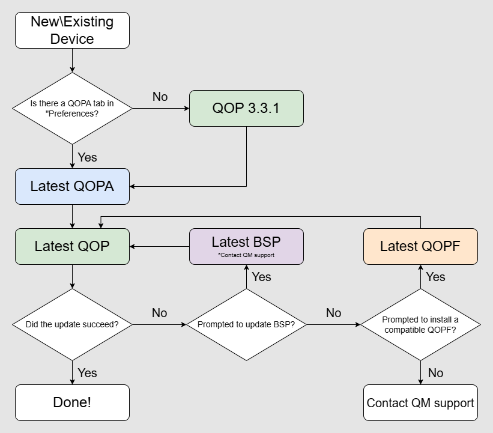
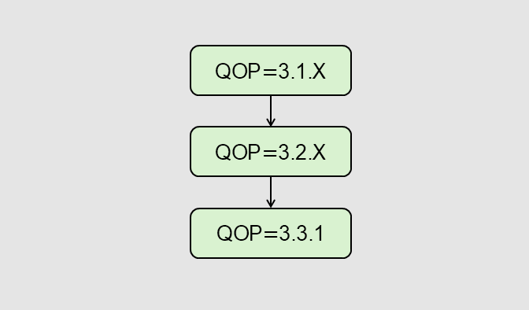

# QOP Installation Guide 
This guide outlines the steps for installing a QOP package on either an OPX+ or OPX1000 device.

If you are looking for the hardware installation guides, please follow the following links: 

- [OPX+](../Hardware/opx+installation.md)
- [OPX1000](../Hardware/OPX1000_installation.md)

## Installation Procedure
1. Open a web browser on a computer that has network access to the device you wish to update.
1. In the address bar, enter the IP address typically used to connect to your device.
This should open the Admin Panel. You can find your current QOP version displayed in the top right corner of the screen.
1. Based on your OPX, refer to the flowcharts below and install each intermediate version until 
you reach the desired release. 

!!! Warning
    Please allow the booting process to finish after each step, and only move on to the next step once the device is "Operational".

=== "OPX1000"

    === "QOP>=3.3.X"
        Before installing the desired QOP package, ensure that you have a compatible version of QOPF installed. You can check the
        requirements for each version on the [OPX1000 releases page](qop3_releases.md)
        
        

        === "QOPA"
            1. In the Admin Panel, navigate to `Preferences > QOPA`.
            1. Click the blue `Upload` button and follow the on-screen instructions to upload the desired QOPA package. Please make sure you have installed the QOPA version that is compatible with the QOP version. 
            1. Once the version is uploaded, select the target cluster (if applicable) from the drop-down menu.
            1. Hover over the newly uploaded version and click `Install`.
        
        === "QOPF"
            1. In the Admin Panel, navigate to `Preferences > QOPF`.
            1. Click the blue `Upload` button and follow the on-screen instructions to upload the desired QOPF package. Please make sure you have installed the QOPF version that is compatible with the QOP version. 
            1. Once the version is uploaded, select the target cluster (if applicable) from the drop-down menu.
            1. Select the desired device(s) according to their hostnames.
            1. Hover over the newly uploaded version and click `Install`.
            1. Carefully read the instructions in the pop-up window. Once ready, follow the on screen instructions to start the installation.
        
        === "QOP"
            1. In the Admin Panel, navigate to `Preferences > QOP`.
            1. Click the blue `Upload` button and follow the on-screen instructions to upload the desired QOP package. Please make sure you have installed the QOPA version that is compatible with the QOP version. 
            1. Once the version is uploaded, select the target cluster (if applicable) from the drop-down menu.
            1. Hover over the newly uploaded version and click `Install`.

    === "QOP<=3.2.X"
            
        Please follow the steps listed until you reach QOP version 3.3.1, and then move on to the `QOP>=3.3.X` tab.
            
        
            
        1. In the Admin Panel, navigate to `Preferences > Versions`.
        1. Click the blue `Upload` button and follow the on-screen instructions to upload the desired QOP package.
        1. Once the version is uploaded, select the target cluster (if applicable) from the drop-down menu.
        1. Hover over the newly uploaded version and click `Install`.
    

=== "OPX+"
    
    === "QOP>=2.5.0"
        
        
        1. In the Admin Panel, navigate to `Preferences > QOPA`
        1. Click the blue `Upload` button and follow the on-screen instructions to upload the desired QOPA package.
        1. Once the version is uploaded, select the target cluster from the drop-down menu.
        1. Hover over the newly uploaded version and click `Install`.
        1. Once the QOPA update is finished, navigate to `Preferences > QOP`
        1. Click the blue `Upload` button and follow the on-screen instructions to upload the desired QOP package.
        1. Once the version is uploaded, select the target cluster from the drop-down menu.
        1. Hover over the newly uploaded version and click `Install`.

            !!! Note "Important note"
                For the best performance, please make sure to update the QOPA version to the latest one.
    
    === "QOP<=2.4.4"
                
        
    
        1. In the Admin Panel, navigate to `Preferences > Versions`.
        1. Click the blue `Upload` button and follow the on-screen instructions to upload the desired QOP package.
        1. Once the version is uploaded, select the target cluster from the drop-down menu.
        1. Hover over the newly uploaded version and click `Install`.

!!! Note "Important notes"
    - The exact steps may vary slightly depending on your QOP Admin (QOPA) version.
    - Some versions may not display a progress bar during installation.
    - After installation is complete, press `Ctrl + F5` to refresh the page and clear the cache.
    - If any step fails, try repeating it a few times. If the issue persists, please contact QM support for assistance.
